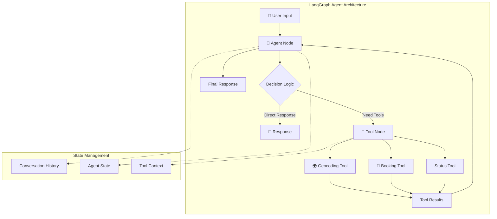

# 🤖 LangGraph Agents - Implementation

A collection of **LangGraph agents** implemented in both **JavaScript/Node.js** and **Python**, demonstrating intelligent agent workflows for real-world applications including taxi booking and bike rental systems.

[](https://langchain-ai.github.io/langgraph/)
[](https://nodejs.org/)
[](https://python.org/)
[](LICENSE)

## What is LangGraph?

**LangGraph** is a framework for building **stateful, multi-agent applications** with Large Language Models (LLMs). It extends LangChain with the ability to create complex, cyclical flows that are essential for agent-like behaviors.

### Key Concepts:
- **StateGraph**: Define agent workflows as directed graphs
- **🔧 Tools**: Connect LLMs to external APIs and functions  
- **🔄 Cycles**: Enable iterative reasoning and planning
- **Memory**: Maintain conversation context across interactions
- **Multi-Agent**: Coordinate between multiple specialized agents

### Why LangGraph?
- **Agent Infrastructure**: Purpose-built for agent applications
- **Stateful Workflows**: Handle complex, multi-turn conversations
- **🛠️ Tool Integration**: Seamlessly connect LLMs with external systems
- **Scalability**: From prototypes to production-ready systems

## 📁 Project Structure

```
LangGraph/
├── 📄 README.md                    # This overview file
├── 📁 src/                         # Source code implementations
│   ├── 📁 JavaScript/              # Node.js LangGraph implementation
│   │   ├── 🚗 Taxi Booking Agents  # Real-world taxi booking system
│   │   ├── 🤖 OpenAI & Ollama      # Dual LLM support (cloud + local)
│   │   ├── 🛠️ LangGraph Tools      # Custom tool implementations
│   │   └── ⚡ StateGraph Workflows  # Agent conversation flows
│   └── 📁 Python/                  # Python LangGraph implementation
│       ├── 🚲 Bike Rental Agents   # AI-powered bike rental system
│       ├── 🦙 Ollama Integration   # Local LLM with Ollama
│       ├── 🌍 Multi-City Support   # European cities integration
│       └── 🔧 Tools                # Location, weather, and rental tools
└── 📚 Documentation/               # Guides and references
```

**Are you ready to build agents by LangGraph?**

*Start with the [JavaScript taxi agents](src/JavaScript/) for cloud/local LLM flexibility, or explore [Python bike agents](src/Python/) for API integration.*

*Built with using LangGraph, LangChain, and modern AI technologies.*

## 🚗 JavaScript Implementation

**Location**: `src/JavaScript/`
**Focus**: Taxi booking agents with dual LLM support

### Features:
- **LangGraph StateGraph** workflows for taxi booking
- **OpenAI GPT** integration (cloud-based)
- **Ollama Local LLMs** (privacy-focused, cost-free)
- **Multi-city support** (London, Berlin, Paris, Madrid, Rome)
- **Tools** (geocoding, booking, status checking)
- **Real-time validation** and error handling

### Components:
```javascript
// StateGraph Agent Implementation
import { StateGraph, START, END } from "@langchain/langgraph";
import { ToolNode } from "@langchain/langgraph/prebuilt";

// Dual LLM Support
import { ChatOpenAI } from "@langchain/openai";      // Cloud
import { ChatOllama } from "@langchain/ollama";      // Local

// Custom Tools
import { taxiBookingTool, geocodingTool, statusTool } from "./tools/";
```

### Supported LLM Models:
- **🌐 OpenAI Models**: GPT-3.5-turbo, GPT-4
- **🏠 Local Models**: Llama-3.1:8b, CodeLlama:7b, Mistral:7b
- **🤖 Agent Models**: ArceeAgents:7b, Functionary:7b-v2
- **⚡ Quantized**: Llama-3.1:8b-q4_0 (memory optimized)

## 🚲 Python Implementation  

**Location**: `src/Python/`  
**Focus**: Bike rental agents with European city integration

### Features:
- **LangGraph Python** implementation for bike rentals
- **Ollama LLM** integration (llama-3.1, mistral models)
- **APIs** (CityBikes, GBFS, Weather services)
- **Cities** (Amsterdam, Paris, Berlin, Copenhagen)
- **Tools** (route planning, cost calculation, weather)
- **FastAPI backend** with REST endpoints

### Components:
```python
# LangGraph Agent Implementation  
from langgraph.graph import StateGraph, START, END
from langgraph.prebuilt import ToolNode

# Local LLM Integration
from langchain_ollama import ChatOllama

# Custom Tools
from agents.tools import (
    find_bike_stations,
    calculate_rental_cost,
    get_weather,
    plan_route
)
```

### Supported Services:
- **🚲 Bike APIs**: CityBikes Network, GBFS feeds
- **🌤️ Weather**: OpenWeatherMap, MeteoAPI
- **🗺️ Location**: Geocoding, distance calculation
- **🦙 LLM**: Ollama with Llama-3.1, Mistral, CodeLlama

## 🛠️ Creating Agents with LangGraph

### 1. **Define Agent State**
```javascript
const AgentState = {
  messages: {
    value: (x, y) => x.concat(y),
    default: () => [],
  },
  // Custom state properties
  bookingData: {
    default: () => ({}),
  }
};
```

### 2. **Create Tools**
```javascript
import { tool } from "@langchain/core/tools";
import { z } from "zod";

const geocodingTool = tool(
  async ({ city }) => {
    // Tool implementation
    return `Coordinates for ${city}: 51.5074, -0.1278`;
  },
  {
    name: "geocoding",
    description: "Get coordinates for a city",
    schema: z.object({
      city: z.string().describe("City name"),
    }),
  }
);
```

### 3. **Build StateGraph Workflow**
```javascript
import { StateGraph } from "@langchain/langgraph";

const workflow = new StateGraph(AgentState);

// Add nodes
workflow.addNode("agent", callModel);
workflow.addNode("tools", new ToolNode(tools));

// Define edges
workflow.addEdge(START, "agent");
workflow.addConditionalEdges("agent", shouldCallTool);
workflow.addEdge("tools", "agent");

// Compile the graph
const app = workflow.compile();
```

### 4. **Tool Integration Patterns**
```javascript
// Bind tools to LLM
const modelWithTools = model.bindTools([
  geocodingTool,
  bookingTool,
  statusTool
]);

// Conditional tool execution
function shouldCallTool(state) {
  const lastMessage = state.messages[state.messages.length - 1];
  if (lastMessage.tool_calls?.length > 0) {
    return "tools";
  }
  return END;
}
```

## LLM Models & Agents

### **🤖 Agent Models**

| Model | Size | Best For | Tool Calling | Memory |
|-------|------|----------|--------------|--------|
| **ArceeAgents:7b** | 7B | Agent tasks | ⭐⭐⭐⭐⭐ | 8GB |
| **Functionary:7b-v2** | 7B | Function calling | ⭐⭐⭐⭐⭐ | 8GB |
| **Llama-3.1:8b** | 8B | General purpose | ⭐⭐⭐⭐ | 12GB |
| **CodeLlama:7b** | 7B | Code & tools | ⭐⭐⭐⭐⭐ | 8GB |
| **Mistral:7b** | 7B | Reasoning | ⭐⭐⭐⭐ | 8GB |

### **Model Selection**

```bash
# For Taxi Booking (JavaScript)
OLLAMA_MODEL=llama3.1:8b          # Best overall
OLLAMA_MODEL=codellama:7b          # Tool calling optimized
OLLAMA_MODEL=arcee-agent:7b        # Agent specialized

# For Bike Rental (Python)
OLLAMA_MODEL=mistral:7b-instruct   # Reasoning tasks
OLLAMA_MODEL=llama3.1:8b          # Balanced performance
OLLAMA_MODEL=functionary:7b-v2     # Function calling
```

## Quick Start

### JavaScript Taxi Agents
```bash
cd src/JavaScript
npm install
npm run demo                # No API key needed
npm run ollama-demo         # Local LLM demo
npm start                   # Full OpenAI agent
```

### Python Bike Agents
```bash
cd src/Python
python -m venv venv
source venv/bin/activate
pip install -r requirements.txt
python demo.py              # Interactive demo
python main.py              # Full API server
```

## LangGraph Workflow Visualization



## 🔧 Advanced Features

### **Multi-Agent Coordination**
```javascript
// Supervisor agent coordinating specialist agents
const supervisorWorkflow = new StateGraph({
  messages: { value: (x, y) => x.concat(y), default: () => [] },
  next: { value: null }
});

supervisorWorkflow.addNode("supervisor", supervisorAgent);
supervisorWorkflow.addNode("taxi_agent", taxiBookingAgent);
supervisorWorkflow.addNode("weather_agent", weatherAgent);
```

### **Custom Tool**
```python
from langchain_core.tools import tool
from typing import Optional

@tool
def calculate_rental_cost(
    duration_minutes: int,
    bike_type: str = "standard"
) -> str:
    """Calculate bike rental cost based on duration and type."""
    rates = {"standard": 0.15, "electric": 0.25, "premium": 0.35}
    cost = duration_minutes * rates.get(bike_type, 0.15)
    return f"Rental cost: €{cost:.2f} for {duration_minutes} minutes"
```

### **OpenAI API Integration**
```javascript
// Using OpenAI models with LangGraph
import { ChatOpenAI } from "@langchain/openai";

const llm = new ChatOpenAI({
  model: "gpt-3.5-turbo",
  temperature: 0.1,
  openAIApiKey: process.env.OPENAI_API_KEY
});

// Bind tools for function calling
const modelWithTools = llm.bindTools(tools);
```

## Documentation

### **Official LangGraph Resources**
- **📖 Why LangGraph?** - [Understanding Agent Infrastructure](https://langchain-ai.github.io/langgraph/concepts/why-langgraph/)
- **JavaScript Quickstart** - [LangGraphJS Tutorial](https://langchain-ai.github.io/langgraphjs/tutorials/quickstart/)
- **Agent Infrastructure** - [Building Production Agents](https://blog.langchain.com/why-agent-infrastructure/)
- **LangGraph Documentation** - [Complete Guide](https://langchain-ai.github.io/langgraph/)
- **🔧 Tool Calling Guide** - [Function Calling Patterns](https://js.langchain.com/docs/concepts/tool_calling/)

### **Model Resources**
- **🦙 Ollama Models** - [Available Models](https://ollama.com/library)
- **🤖 ArceeAgents** - [Specialized Agent Models](https://huggingface.co/arcee-ai)
- **⚡ Model Optimization** - [Quantization Guide](https://ollama.com/blog/quantization)

### **Community & Examples**
- **LangGraph Cookbook** - [Code Examples](https://github.com/langchain-ai/langgraph/tree/main/examples)
- **State Management** - [Advanced Patterns](https://langchain-ai.github.io/langgraph/concepts/low_level/)
- **🛠️ Tool Integration** - [Custom Tools Guide](https://python.langchain.com/docs/modules/agents/tools/)

## 🎯 Use Cases & Applications

### **Enterprise Applications**
- **Customer Service**: Multi-turn support conversations
- **Data Analysis**: Interactive report generation
- **Workflow Automation**: Complex business process automation
- **🛠️ DevOps**: Infrastructure management and monitoring

### **Consumer Applications**  
- **🚗 Transportation**: Ride booking and route planning
- **Smart Home**: Device control and automation
- **Personal Assistant**: Task management and scheduling
- **Education**: Personalized learning and tutoring

## **Development Setup**
```bash
# JavaScript development
cd src/JavaScript
npm run validate        # Check project health
npm test               # Run test suite

# Python development  
cd src/Python
python test_components.py    # Run component tests
./test_api.sh               # Test API endpoints
```

## 📄 License

This project is licensed under the MIT License - see the [LICENSE](LICENSE) file for details.

---