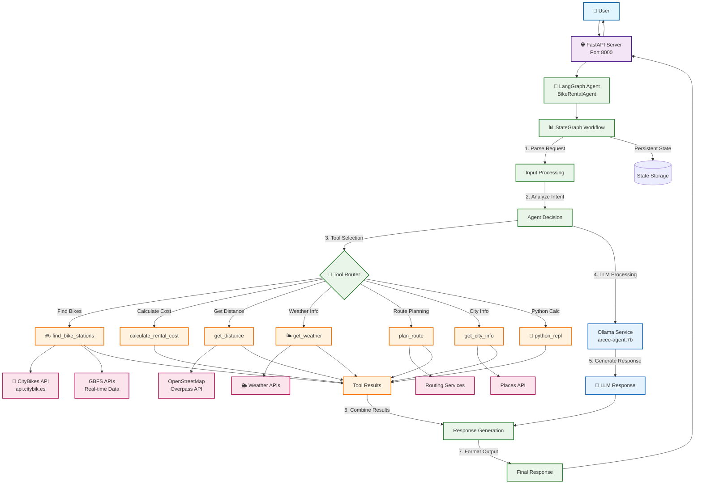
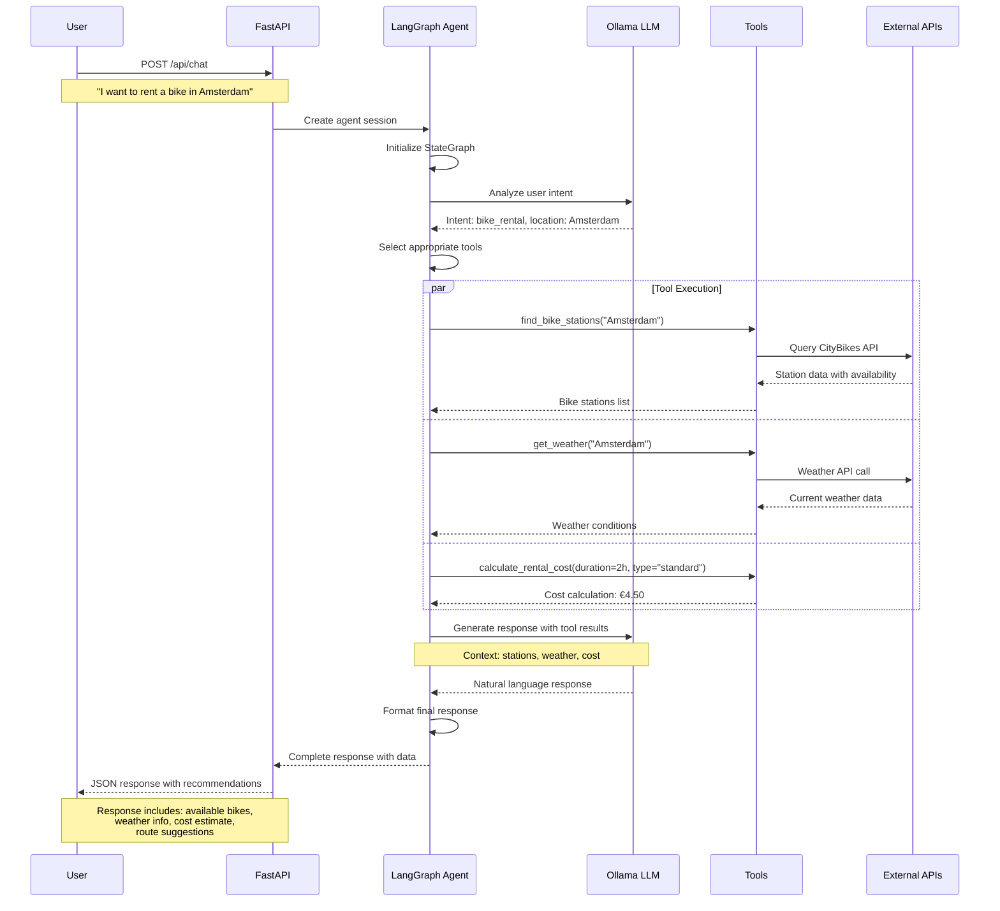
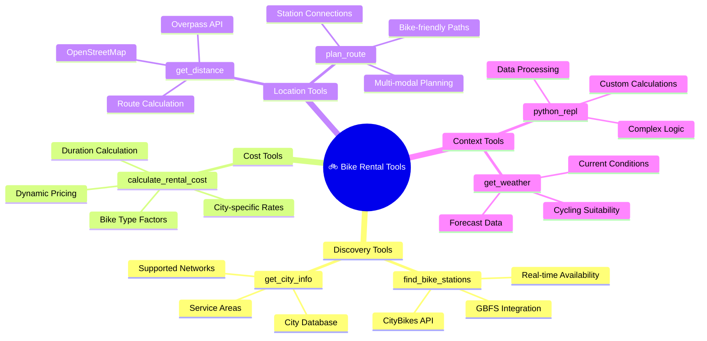

# Bike Rental Agent with LangGraph and Ollama

An AI-powered bike rental application that uses LangGraph agents to help users rent bicycles in European cities like Amsterdam, Paris, and Berlin. The system leverages Ollama for local LLM inference and integrates with various bike sharing APIs.

## � System Architecture & Workflow



### Data Flow Details



### 🛠️ Tool Architecture



## � Table of Contents

- [Features](#features)
- [Models](#supported-models)
- [Prerequisites](#prerequisites)
- [DevOps Installation Guide](#devops-installation-guide)
- [Docker Deployment](#docker-deployment)
- [Ollama Setup & Verification](#ollama-setup--verification)
- [Demo Applications](#demo-applications)
- [Usage Examples](#usage-examples)
- [API Documentation](#api-documentation)
- [Troubleshooting](#troubleshooting)

## Features

- **AI-Powered Agent**: Uses LangGraph with tool calling capabilities
- **Local LLM Support**: Integrates with Ollama for privacy-focused AI inference
- **European Cities**: Supports bike rental in Amsterdam, Paris, Berlin, and other European cities
- **Multiple APIs**: Integrates with CityBikes API and GBFS-compliant bike sharing systems
- **RESTful API**: FastAPI-based backend with OpenAPI documentation
- **Tool Calling**: Advanced function calling with Python REPL integration

## Models

- **Meta Llama-3.x** (quantized versions)
- **Arcee-Agent** (7B parameter model optimized for function calling)
- Any Ollama-compatible model with tool calling support

## Prerequisites

- Python 3.9 or higher
- Ollama installed and running
- Internet connection for bike sharing APIs
- Docker (optional, for containerized deployment)
- Git for cloning the repository

## DevOps Installation Guide

This section provides step-by-step instructions for DevOps teams to set up the system manually.

### Step 1: System Requirements Check

```bash
# Check Python version (requires 3.9+)
python3 --version

# Check available disk space (recommend 8GB+ free)
df -h

# Check memory (recommend 4GB+ RAM for LLM)
free -h

# Install required system packages
sudo apt update
sudo apt install -y curl git python3-pip python3-venv
```

### Step 2: Clone Repository

```bash
git clone <repository-url>
cd InternetOfThings/Artificial\ Intelligence/AGENTS/LangGraph/src/Python
```

### Step 3: Ollama Setup & Verification

#### Install Ollama on Linux

```bash
# Method 1: Official installer (Recommended)
curl -fsSL https://ollama.com/install.sh | sh

# Method 2: Using Docker (Alternative)
# See Docker Deployment section below
```

#### Start Ollama Service

```bash
# Start Ollama as a service
ollama serve &

# Or start as systemd service (if installed via package manager)
sudo systemctl start ollama
sudo systemctl enable ollama

# Verify service is running
ps aux | grep ollama
# Expected output: ollama process running on port 11434
```

#### Verify Ollama Installation

```bash
# Check if Ollama is responding
curl -f http://localhost:11434/api/tags

# Expected response: {"models":[...]}
# If connection refused, check if service is running
```

#### Download Required Models

```bash
# Check available models
ollama list

# Pull Arcee-Agent (recommended for tool calling)
ollama pull arcee-agent:7b

# Alternative: Pull Llama-3.1 8B
ollama pull llama3.1:8b

# Verify model is downloaded
ollama list
# Should show arcee-agent:7b in the list
```

#### Test Model Functionality

```bash
# Test basic model response
ollama run arcee-agent:7b "Hello, can you help me rent a bike?"

# Test API response
curl -X POST http://localhost:11434/api/chat \
  -H "Content-Type: application/json" \
  -d '{
    "model": "arcee-agent:7b",
    "messages": [{"role": "user", "content": "Hello"}],
    "stream": false
  }'
```

### Step 4: Python Environment Setup

```bash
# Create virtual environment
python3 -m venv venv

# Activate virtual environment
source venv/bin/activate

# Verify activation
which python
# Should show: /path/to/project/venv/bin/python

# Upgrade pip
pip install --upgrade pip

# Install dependencies
pip install -r requirements.txt

# Verify key packages
python -c "import langchain, langgraph, fastapi, ollama; print('All packages installed successfully')"
```

### Step 5: Configuration Setup

```bash
# Copy environment template
cp .env .env.local  # for local modifications

# Verify configuration
cat .env
```

Expected `.env` content:
```bash
# Ollama Configuration
OLLAMA_BASE_URL=http://localhost:11434
OLLAMA_MODEL=arcee-agent:latest

# API Configuration
CITYBIKES_API_URL=https://api.citybik.es/v2
GBFS_BASE_URL=https://gbfs.org

# Application Settings
DEBUG=True
HOST=0.0.0.0
PORT=8000
```

### Step 6: System Validation

```bash
# Run component tests
python test_components.py

# Expected output:
#  Ollama connection successful
#  CityBikes API accessible
#  Configuration loaded
#  Tools are functional
```

## Docker Deployment

Docker deployment is **recommended for production** as it provides:
- Consistent environment across different systems
- Easy scaling and orchestration
- Isolation from host system dependencies
- Simplified deployment and rollbacks

### Option 1: Docker Compose (Recommended)

Create `docker-compose.yml`:

```yaml
version: '3.8'

services:
  ollama:
    image: ollama/ollama:latest
    container_name: bike-rental-ollama
    ports:
      - "11434:11434"
    volumes:
      - ollama_data:/root/.ollama
    environment:
      - OLLAMA_ORIGINS=*
    healthcheck:
      test: ["CMD", "curl", "-f", "http://localhost:11434/api/tags"]
      interval: 30s
      timeout: 10s
      retries: 3
    restart: unless-stopped

  bike-rental-agent:
    build: .
    container_name: bike-rental-api
    ports:
      - "8000:8000"
    depends_on:
      - ollama
    environment:
      - OLLAMA_BASE_URL=http://ollama:11434
      - OLLAMA_MODEL=arcee-agent:7b
    volumes:
      - ./logs:/app/logs
    restart: unless-stopped

volumes:
  ollama_data:
```

Create `Dockerfile`:

```dockerfile
FROM python:3.11-slim

WORKDIR /app

# Install system dependencies
RUN apt-get update && apt-get install -y \
    curl \
    && rm -rf /var/lib/apt/lists/*

# Copy requirements and install Python dependencies
COPY requirements.txt .
RUN pip install --no-cache-dir -r requirements.txt

# Copy application code
COPY . .

# Create non-root user
RUN useradd -m -u 1000 appuser && chown -R appuser:appuser /app
USER appuser

# Health check
HEALTHCHECK --interval=30s --timeout=10s --start-period=5s --retries=3 \
  CMD curl -f http://localhost:8000/health || exit 1

EXPOSE 8000

CMD ["python", "main.py"]
```

Deploy with Docker Compose:

```bash
# Build and start services
docker-compose up --build -d

# Check service status
docker-compose ps

# View logs
docker-compose logs -f

# Pull models inside Ollama container
docker-compose exec ollama ollama pull arcee-agent:7b

# Test the API
curl http://localhost:8000/health
```

### Option 2: Kubernetes Deployment

Create Kubernetes manifests for production deployment:

```yaml
# ollama-deployment.yaml
apiVersion: apps/v1
kind: Deployment
metadata:
  name: ollama
spec:
  replicas: 1
  selector:
    matchLabels:
      app: ollama
  template:
    metadata:
      labels:
        app: ollama
    spec:
      containers:
      - name: ollama
        image: ollama/ollama:latest
        ports:
        - containerPort: 11434
        volumeMounts:
        - name: ollama-data
          mountPath: /root/.ollama
        resources:
          requests:
            memory: "2Gi"
            cpu: "500m"
          limits:
            memory: "8Gi"
            cpu: "2000m"
      volumes:
      - name: ollama-data
        persistentVolumeClaim:
          claimName: ollama-pvc

---
apiVersion: v1
kind: Service
metadata:
  name: ollama-service
spec:
  selector:
    app: ollama
  ports:
  - port: 11434
    targetPort: 11434
```

## Ollama Setup & Verification

### Comprehensive Ollama Verification

```bash
#!/bin/bash
# ollama-verify.sh - Comprehensive Ollama verification script

echo "🔍 Ollama Verification Script"
echo "================================"

# Check if Ollama is installed
if ! command -v ollama &> /dev/null; then
    echo "❌ Ollama is not installed"
    echo "📥 Installing Ollama..."
    curl -fsSL https://ollama.com/install.sh | sh
    echo "Ollama installed"
else
    echo "Ollama is installed"
    ollama --version
fi

# Check if Ollama service is running
echo "🔍 Checking Ollama service..."
if curl -f http://localhost:11434/api/tags &> /dev/null; then
    echo "Ollama service is running"
else
    echo "⚠️  Starting Ollama service..."
    ollama serve &
    sleep 5
    
    if curl -f http://localhost:11434/api/tags &> /dev/null; then
        echo "Ollama service started successfully"
    else
        echo "❌ Failed to start Ollama service"
        exit 1
    fi
fi

# Check available models
echo "🔍 Checking available models..."
MODELS=$(ollama list | tail -n +2)
if [[ -z "$MODELS" ]]; then
    echo "⚠️  No models found"
else
    echo "Available models:"
    ollama list
fi

# Check for Arcee-Agent model
if ollama list | grep -q "arcee-agent"; then
    echo "Arcee-Agent model is available"
else
    echo "📥 Downloading Arcee-Agent model..."
    ollama pull arcee-agent:7b
    if [ $? -eq 0 ]; then
        echo "Arcee-Agent model downloaded successfully"
    else
        echo "❌ Failed to download Arcee-Agent model"
        echo "🔄 Trying alternative model..."
        ollama pull llama3.1:8b
    fi
fi

# Test model functionality
echo "Testing model functionality..."
RESPONSE=$(ollama run arcee-agent:7b "Hello" --verbose=false 2>/dev/null | head -1)
if [[ -n "$RESPONSE" ]]; then
    echo "Model is responding correctly"
    echo "Sample response: $RESPONSE"
else
    echo "❌ Model test failed"
fi

echo "================================"
echo "Ollama verification complete."
```

Make it executable and run:

```bash
chmod +x ollama-verify.sh
./ollama-verify.sh
```

### Ollama Troubleshooting

Common issues and solutions:

```bash
# Issue: Ollama service not starting
# Solution: Check port availability
sudo netstat -tulpn | grep :11434

# Issue: Model download fails
# Solution: Check disk space and internet
df -h
ping -c 3 ollama.com

# Issue: Out of memory errors
# Solution: Check available RAM
free -h
# Recommend 4GB+ for 7B models

# Issue: Permission errors
# Solution: Fix permissions
sudo chown -R $USER:$USER ~/.ollama
```

# Alternative: smaller quantized version
ollama pull llama3.1:8b-instruct-q4_K_M
```

### 3. Set Up Python Environment

```bash
# Create virtual environment
python3 -m venv venv

# Activate virtual environment
source venv/bin/activate  # Linux/macOS
# or
venv\Scripts\activate     # Windows

# Install dependencies
pip install -r requirements.txt
```

### 4. Environment Configuration

Create a `.env` file in the project root:

```bash
# Ollama Configuration
OLLAMA_BASE_URL=http://localhost:11434
OLLAMA_MODEL=llama3.1:8b

# API Configuration
CITYBIKES_API_URL=https://api.citybik.es/v2
GBFS_BASE_URL=https://gbfs.org

# Application Settings
DEBUG=True
HOST=0.0.0.0
PORT=8000
```

## Usage

### 1. Start Ollama Service

```bash
ollama serve
```

### 2. Run the Application

```bash
# Start the FastAPI server
python main.py

# Or use uvicorn directly
uvicorn main:app --host 0.0.0.0 --port 8000 --reload
```

### 3. API Documentation

Access the interactive API documentation at:
- Swagger UI: http://localhost:8000/docs
- ReDoc: http://localhost:8000/redoc

### 4. Example API Calls

#### Find Available Bikes
```bash
curl -X POST "http://localhost:8000/api/find-bikes" \
  -H "Content-Type: application/json" \
  -d '{
    "city": "Amsterdam",
    "location": "Central Station",
    "bike_type": "electric"
  }'
```

#### Rent a Bike
```bash
curl -X POST "http://localhost:8000/api/rent-bike" \
  -H "Content-Type: application/json" \
  -d '{
    "station_id": "station_123",
    "user_id": "user_456",
    "duration_hours": 2
  }'
```

#### Chat with Agent
```bash
curl -X POST "http://localhost:8000/api/chat" \
  -H "Content-Type: application/json" \
  -d '{
    "message": "I want to rent an electric bike in Paris near the Eiffel Tower"
  }'
```

## Supported Cities

The application supports bike rental in the following European cities:

- **Amsterdam**: Santander Cycles, GVB bikes
- **Paris**: Vélib' Métropole
- **Berlin**: Nextbike, Call a Bike
- **London**: Santander Cycles
- **Barcelona**: Bicing
- **Madrid**: BiciMAD
- **Copenhagen**: Bycyklen
- **Vienna**: Citybike Wien

## Architecture

```
├── main.py              # FastAPI application entry point
├── agents/
│   ├── bike_agent.py    # Main LangGraph agent
│   └── tools/
│       ├── bike_tools.py      # Bike-related tools
│       ├── location_tools.py  # Location and mapping tools
│       └── python_repl.py     # Python REPL integration
├── models/
│   ├── requests.py      # Pydantic request models
│   └── responses.py     # Pydantic response models
├── services/
│   ├── ollama_service.py     # Ollama integration
│   ├── citybikes_service.py  # CityBikes API client
│   └── gbfs_service.py       # GBFS API client
└── utils/
    ├── config.py        # Configuration management
    └── logger.py        # Logging utilities
```

## Tool Calling Features

The agent supports the following tools:

1. **Bike Availability**: Check available bikes at stations
2. **Station Locator**: Find nearby bike stations
3. **Route Planning**: Calculate routes between locations
4. **Weather Check**: Get weather conditions for cycling
5. **Price Calculator**: Calculate rental costs
6. **Python REPL**: Execute custom calculations and data processing

## API Integrations

- **CityBikes API**: Global bike sharing network data
- **GBFS**: General Bikeshare Feed Specification compliant APIs
- **OpenStreetMap**: Location and routing data
- **Weather APIs**: Real-time weather information

## Demo Applications

The project includes three demo applications for different use cases:

### 1. `demo.py` - Component Testing and Verification

**Purpose**: Comprehensive system verification and component testing

**What it does**:
- Tests Ollama connection and model availability
- Verifies CityBikes API connectivity
- Tests individual tools and functions
- Validates configuration settings
- Provides system health overview

**When to use**:
- After installation to verify setup
- Debugging system issues
- Before deploying to production
- During development and testing

**How to run**:
```bash
# Activate virtual environment
source venv/bin/activate

# Run comprehensive demo
python demo.py
```

**Expected output**:
```
🌍 European Bike Rental Agent - Component Demo
==================================================

⚙️  Configuration
========================================
Ollama URL: http://localhost:11434
Ollama Model: arcee-agent:7b
CityBikes API: https://api.citybik.es/v2
Supported cities: 6
  • Amsterdam: Netherlands
  • Paris: France
  • Berlin: Germany

🤖 Testing Ollama Connection
========================================
Ollama is running on http://localhost:11434
Available models: ['arcee-agent:7b', 'codellama:latest']
Target model 'arcee-agent:7b' is available

🚲 Testing Bike Sharing APIs
========================================
CityBikes API: Found 500+ bike sharing networks
Amsterdam network found: OV-fiets
Amsterdam has 50+ bike stations
Sample station: Central Station
   Available bikes: 12
   Location: 52.3789, 4.9001

🔧 Testing Bike Rental Tools
========================================
Cost calculation tool working:
   City: Amsterdam
   Duration: 3 hours
   Bike type: electric
   Total cost: 8.25 EUR

==================================================
Demo completed and components are working.
🚴‍♂️ Ready for bike rental adventures in Europe.
```

**User Request Format**: N/A (automated testing)

### 2. `simple_demo.py` - Basic API Server

**Purpose**: Lightweight FastAPI server with mock data for quick testing

**What it does**:
- Provides basic API endpoints
- Uses mock data for responses
- No AI/LLM integration required
- Fast startup and testing

**When to use**:
- Quick API testing
- Frontend development
- Network/connectivity testing
- When Ollama is not available

**How to run**:
```bash
# Activate virtual environment
source venv/bin/activate

# Start simple demo server
python simple_demo.py

# Server will start on http://localhost:8000
```

**User Request Examples**:

**Chat Request**:
```bash
curl -X POST "http://localhost:8000/api/chat" \
  -H "Content-Type: application/json" \
  -d '{
    "message": "I want to rent a bike in Amsterdam",
    "session_id": "demo-session-123"
  }'
```

**Find Bikes Request**:
```bash
curl -X POST "http://localhost:8000/api/find-bikes" \
  -H "Content-Type: application/json" \
  -d '{
    "city": "Paris",
    "location": "Eiffel Tower",
    "max_distance_km": 2.0
  }'
```

**Cost Calculation Request**:
```bash
curl -X POST "http://localhost:8000/api/calculate-cost" \
  -H "Content-Type: application/json" \
  -d '{
    "hours": 4,
    "bike_type": "electric",
    "city": "Berlin"
  }'
```

### 3. `main.py` - Full AI-Powered Application

**Purpose**: Complete LangGraph agent with Ollama integration

**What it does**:
- Full AI agent with tool calling
- Real CityBikes API integration
- Natural language processing
- Advanced bike rental assistance

**When to use**:
- Production deployment
- Full AI capabilities needed
- Advanced user interactions
- Real-world bike rental scenarios

**Prerequisites**:
- Ollama service running
- Model downloaded (arcee-agent:7b)
- All dependencies installed

**How to run**:
```bash
# Ensure Ollama is running
ollama serve &

# Activate virtual environment
source venv/bin/activate

# Start full AI application
python main.py

# Server will start on http://localhost:8000
```

**User Request Examples**:

**Natural Language Chat**:
```bash
curl -X POST "http://localhost:8000/api/chat" \
  -H "Content-Type: application/json" \
  -d '{
    "message": "I need an electric bike near Amsterdam Central Station for 2 hours. What will it cost?",
    "session_id": "user-456"
  }'
```

**Complex Query**:
```bash
curl -X POST "http://localhost:8000/api/chat" \
  -H "Content-Type: application/json" \
  -d '{
    "message": "Find the cheapest bike rental option in Paris near the Louvre for a 4-hour sightseeing tour",
    "context": {
      "user_preferences": ["electric", "comfortable"],
      "budget_max": 25.00
    }
  }'
```

**Multi-step Planning**:
```bash
curl -X POST "http://localhost:8000/api/chat" \
  -H "Content-Type: application/json" \
  -d '{
    "message": "Plan a bike route from Berlin Brandenburg Gate to Alexanderplatz, find stations along the way, and calculate total rental cost for 3 hours"
  }'
```

### Demo Comparison Matrix

| Feature | demo.py | simple_demo.py | main.py |
|---------|---------|---------------|---------|
| **Purpose** | System Testing | Quick API | Full AI Agent |
| **AI Integration** | ❌ | ❌ | ✅ |
| **Real APIs** | ✅ | ❌ | ✅ |
| **Startup Time** | Fast | Very Fast | Slow |
| **Dependencies** | Medium | Low | High |
| **Use Case** | Development | Frontend Dev | Production |

### Usage Workflow

1. **First Time Setup**:
   ```bash
   python demo.py          # Verify installation
   python simple_demo.py   # Test basic API
   python main.py          # Run full system
   ```

2. **Development**:
   ```bash
   python simple_demo.py   # Quick API testing
   python demo.py          # Debug issues
   ```

3. **Production**:
   ```bash
   python main.py          # Full AI capabilities
   ```

## Troubleshooting

### Ollama Connection Issues

1. Ensure Ollama service is running: `ollama serve`
2. Check if the model is available: `ollama list`
3. Verify the base URL in `.env` file

### API Rate Limits

- CityBikes API has no rate limits but use responsibly
- Some GBFS feeds may have rate limiting

### Model Performance

- For better performance, use quantized models (q4_K_M, q5_K_M)
- Ensure sufficient RAM for larger models (8GB+ recommended for 8B models)

## Contributing

1. Fork the repository
2. Create a feature branch
3. Make your changes
4. Add tests
5. Submit a pull request

## License

MIT License - see LICENSE file for details

## References

- [LangGraph Documentation](https://langchain-ai.github.io/langgraph/)
- [Ollama](https://ollama.com/)
- [CityBikes API](https://api.citybik.es/v2/)
- [GBFS Specification](https://github.com/MobilityData/gbfs)
- [Arcee-Agent Model](https://huggingface.co/arcee-ai/Arcee-Agent)
