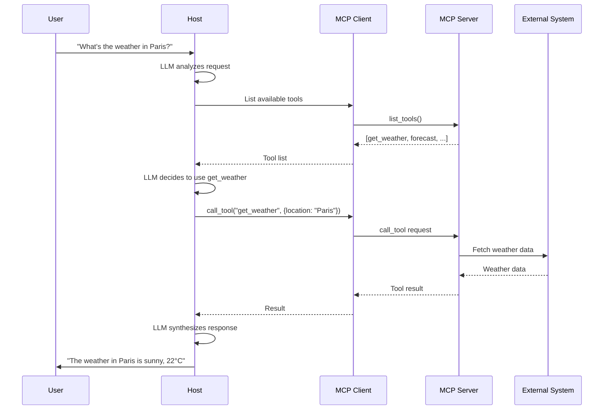

# Model Context Protocol (MCP)

## Table of Contents

- [What is the Model Context Protocol?](#what-is-the-model-context-protocol)
  - [Why to utilize MCP?](#why-to-utilize-mcp)
  - [How MCP Changes Data Retrieval for AI Agents](#how-mcp-changes-data-retrieval-for-ai-agents)
- [MCP Interactions with Data Sources](#mcp-interactions-with-data-sources)
  - [Resources](#resources)
  - [Tools](#tools)
  - [Prompts](#prompts)
- [How Agents Use Tools via MCP?](#how-agents-use-tools-via-mcp)
  - [The Tool Discovery and Execution Flow](#the-tool-discovery-and-execution-flow)
  - [Example: Weather Query](#example-weather-query)
  - [Key Benefits](#key-benefits)
- [MCP Architecture](#mcp-architecture)
  - [1. The Host](#1-the-host)
  - [2. The MCP Client](#2-the-mcp-client)
  - [3. The MCP Server](#3-the-mcp-server)
  - [Client vs. Agent: What's the Difference?](#client-vs-agent-whats-the-difference)
  - [Architecture Diagram](#architecture-diagram)
  - [Data Flow with MCP](#data-flow-with-mcp)
  - [Communication Transports](#communication-transports)
- [Project Structure](#project-structure)
- [Setting Up MCP: Step-by-Step Tutorial](#setting-up-mcp-step-by-step-tutorial)
  - [Prerequisites](#prerequisites)
  - [Step 1: Set Up Virtual Environment](#step-1-set-up-virtual-environment)
  - [Step 2: Install MCP SDK](#step-2-install-mcp-sdk)
  - [Step 3: Create Your First MCP Server](#step-3-create-your-first-mcp-server)
  - [Step 4: Create an MCP Client/Agent](#step-4-create-an-mcp-clientagent)
  - [Step 5: Building Agents for Production](#step-5-building-agents-for-production)
  - [Step 6: Project Structure Best Practices](#step-6-project-structure-best-practices)
- [Testing MCP Agents](#testing-mcp-agents)
  - [Key Testing Approaches](#key-testing-approaches)
  - [Testing External MCP Implementations](#testing-external-mcp-implementations)
  - [Testing Best Practices](#testing-best-practices)
- [References](#references)
- [Quick Start Commands](#quick-start-commands)
- [License](#license)

---

## What is the Model Context Protocol?

**Model Context Protocol (MCP)** is an open-source protocol that standardizes how AI applications connect to external data sources and tools. It provides a universal, open standard for connecting AI assistants to the systems where data lives, replacing fragmented integrations with a single protocol.

MCP defines a common **client-server architecture** for connecting AI assistants to external resources. Instead of building custom integrations for each data source, developers can implement MCP once and connect to any MCP-compatible server.

### Why to utilize MCP?

Before MCP, integrating a Large Language Model (LLM) with each new data source or API required writing custom connectors or prompt logic for each specific case. Developers commonly used **Retrieval-Augmented Generation (RAG)** pipelines to inject external information into an LLM's prompt—for example, vector-searching a document database and inserting relevant snippets into the context.

**MCP changes this paradigm** by:
- **Standardizing connections**: One protocol for all external integrations
- **Enabling dynamic discovery**: Agents can discover available tools and resources at runtime
- **Supporting agentic behavior**: LLMs can perform actions in the outside world, not just retrieve data
- **Reducing development overhead**: Write once, connect anywhere

### How MCP Changes Data Retrieval for AI Agents

Traditional LLM agents typically use static RAG pipelines:
1. Data is pre-indexed into vector databases
2. At query time, relevant chunks are retrieved
3. Context is injected into the prompt
4. The LLM responds based on static context

**With MCP, agents become dynamic and interactive:**
1. Agents discover what tools and resources are available from MCP servers
2. Agents can query live data sources in real-time
3. Agents can execute functions and perform actions
4. Agents can combine multiple tools flexibly based on the task

This transforms agents from passive consumers of pre-fetched data into **active participants** that can explore, query, and manipulate external systems dynamically.

## MCP Interactions with Data Sources

MCP breaks down interactions into three standardized components: **Resources**, **Tools**, and **Prompts**. These primitives enable agents to access data and perform actions in a structured, discoverable way.

### Resources

**Resources** are read-only data sources that the agent can access. They represent information that the MCP server exposes to the client.

**Examples:**
- Database records
- File contents
- API responses
- Documentation
- Configuration data

**How Agents Use Resources via MCP:**
1. The agent queries the server for available resources
2. Each resource has a URI (e.g., `file:///docs/guide.md`, `db://users/123`)
3. The agent requests specific resources by URI
4. The server returns the data in a structured format
5. The agent incorporates this data into its reasoning

**Key Advantage:** Resources provide dynamic, real-time data access instead of relying on pre-indexed static snapshots. An agent can fetch the latest database records, read current file contents, or pull fresh API data as needed.

### Tools

**Tools** are actions or functions the LLM can invoke to perform operations. Unlike resources (which are read-only), tools enable the agent to **take action** in the external world.

**Examples:**
- Running a computation (e.g., mathematical calculation)
- Calling an external API (e.g., sending an email, posting to Slack)
- Executing a database query
- Modifying files
- Triggering workflows

**How Agents Use Tools via MCP:**
1. The agent discovers available tools from the MCP server
2. Each tool includes:
   - **Name**: Identifier for the tool
   - **Description**: What the tool does
   - **Input schema**: Expected parameters (JSON Schema format)
3. The LLM decides which tool to call based on the user's request
4. The agent sends a tool invocation request to the MCP server
5. The server executes the tool and returns results
6. The agent uses these results to formulate a response

**Key Advantage:** Tools enable **agentic behavior**—the LLM can act on behalf of the user, not just answer questions. This transforms passive assistants into active agents that can accomplish tasks.

### Prompts

**Prompts** are reusable prompt templates or instructions that can be invoked as needed. They provide pre-defined workflows or interaction patterns.

**Examples:**
- Code review templates
- Data analysis workflows
- Summarization patterns
- Question-answering frameworks

**How It Works:**
- Servers can expose prompt templates
- Agents can invoke these templates with specific parameters
- This ensures consistent, high-quality interactions for common tasks

---

## How Agents Use Tools via MCP?

In the Model Context Protocol, **tools are the primary primitives** that enable AI agents to perform actions and computations beyond their inherent capabilities. By integrating tools, agents can interact with external systems, execute functions, and retrieve real-time data.

### The Tool Discovery and Execution Flow

```
┌──────────────────────────────────────────────────────────────┐
│                      1. DISCOVERY PHASE                      │
├──────────────────────────────────────────────────────────────┤
│  Agent: "What tools are available?"                          │
│  MCP Server: Returns list of tools with:                     │
│    - Tool name                                               │
│    - Description                                             │
│    - Input schema (parameters required)                      │
└──────────────────────────────────────────────────────────────┘
                            ↓
┌──────────────────────────────────────────────────────────────┐
│                     2. REASONING PHASE                       │
├──────────────────────────────────────────────────────────────┤
│  LLM analyzes user request and available tools               │
│  Decides which tool(s) to use and with what parameters       │
└──────────────────────────────────────────────────────────────┘
                            ↓
┌──────────────────────────────────────────────────────────────┐
│                     3. EXECUTION PHASE                       │
├──────────────────────────────────────────────────────────────┤
│  Agent: Calls tool via MCP with parameters                   │
│  MCP Server: Executes the tool                               │
│  MCP Server: Returns results to agent                        │
└──────────────────────────────────────────────────────────────┘
                            ↓
┌──────────────────────────────────────────────────────────────┐
│                     4. SYNTHESIS PHASE                       │
├──────────────────────────────────────────────────────────────┤
│  Agent receives tool results                                 │
│  LLM formulates final response based on results              │
│  User receives answer or confirmation                        │
└──────────────────────────────────────────────────────────────┘
```

### Example: Weather Query

**User Request:** "What's the weather in Tokyo?"

1. **Discovery**: Agent queries MCP server, finds `get_weather` tool
2. **Reasoning**: LLM determines it needs to call `get_weather` with `location="Tokyo"`
3. **Execution**: Agent calls `get_weather("Tokyo")` via MCP
4. **Synthesis**: MCP server returns weather data, agent formats response for user

### Key Benefits

 **Dynamic Capability Extension**: Agents aren't limited to pre-trained knowledge
 **Real-Time Data Access**: Tools can fetch live data from APIs, databases, etc.
 **Action Execution**: Agents can perform tasks, not just answer questions
 **Flexible Composition**: Agents can chain multiple tools to accomplish complex tasks
 **Standardized Interface**: Same pattern works across all MCP-compatible tools

---

## MCP Architecture

At a high level, **MCP follows a client-server architecture** within an agent application. The architecture consists of three main components:

### 1. The Host

**The Host** is the main application that brings everything together. This is typically:
- An AI assistant application
- A chatbot interface
- An agent framework
- An IDE or development tool

The host manages the overall user interaction and coordinates between the user interface and MCP clients.

### 2. The MCP Client

**The MCP Client** is a component (often a library) running within the host application that manages connections to MCP servers.

**Key Responsibilities:**
- Establish and maintain connections to MCP servers
- Send requests from the host to the server
- Deliver responses back to the host
- Handle protocol-level communication

**Important:** Each client manages a single connection to **one MCP server**. If you need to connect to multiple servers, you instantiate multiple clients.

### 3. The MCP Server

**The MCP Server** is an external (or local) program that wraps a specific data source or functionality behind the MCP standard.

**Key Responsibilities:**
- Expose Tools, Resources, and Prompts according to the MCP spec
- Execute tool invocations
- Provide resource access
- Handle requests from clients

**Examples of MCP Servers:**
- A database wrapper that exposes query tools
- A weather API wrapper
- A file system server for document access
- A calculation engine
- An email sending service

### Client vs. Agent: What's the Difference?

It's important to understand the distinction between **MCP Client** and **Agent** as they serve different roles in the architecture:

#### MCP Client

The **MCP Client is a technical component** that handles protocol communication:

- **Role**: Protocol handler and connection manager
- **Responsibility**: Speaks the MCP protocol, manages connections to servers
- **Nature**: Usually a library or SDK (e.g., `mcp` Python package)
- **Function**: Low-level communication (serialize/deserialize messages, handle transport)
- **Intelligence**: No AI or decision-making capability
- **Example**: The `ClientSession` class that connects to an MCP server via STDIO/SSE

**Think of it as**: The "translator" or "messenger" that knows how to talk to MCP servers.

#### Agent

The **Agent is an AI-powered application** that uses MCP clients to accomplish tasks:

- **Role**: Intelligent assistant that makes decisions
- **Responsibility**: Understands user requests, decides which tools to use, synthesizes results
- **Nature**: Application code that contains AI/LLM logic
- **Function**: High-level reasoning (interpret user intent, choose tools, format responses)
- **Intelligence**: Contains LLM integration (GPT-4, Claude, etc.)
- **Example**: The `MCPAgent` class in `src/agent/simple_agent.py`

**Think of it as**: The "brain" that reasons about what to do and uses the client as a tool.

#### How They Work Together

```
User Request
     ↓
┌──────────────────────────────────────┐
│          AGENT                       │  ← AI logic, decision making
│  (Decides WHAT to do)                │
│                                      │
│  Contains:                           │
│  - LLM (GPT-4, Claude, etc.)         │
│  - User interaction logic            │
│  - Task planning                     │
│  - Response synthesis                │
│                                      │
│  ┌────────────────────────────────┐  │
│  │     MCP CLIENT                 │  │  ← Protocol handler
│  │  (Handles HOW to communicate)  │  │
│  │                                │  │
│  │  - Protocol serialization      │  │
│  │  - Connection management       │  │
│  │  - Request/response handling   │  │
│  └─────────────┬──────────────────┘  │
└────────────────┼─────────────────────┘
                 ↓
         MCP Protocol (STDIO/SSE)
                 ↓
         ┌──────────────┐
         │  MCP SERVER  │  ← External tool/service provider
         └──────────────┘
```

#### Real-World Example

- **Agent** = A person who knows what they want to accomplish
- **MCP Client** = The phone/internet connection they use to communicate
- **MCP Server** = The service provider they're calling (bank, weather service, etc.)

The person (agent) decides to check the weather. They use their phone (client) to call the weather service (server). The phone doesn't decide what to do—it just facilitates the communication.

#### In This Project

- **`src/client/mcp_client.py`**: Basic example showing how to use an MCP client to connect to a server and call tools. This is mostly demonstrating the client library's capabilities.

- **`src/agent/simple_agent.py`**: A true agent that wraps the MCP client and adds decision-making logic. It discovers available tools and executes tasks on behalf of the user.

- **`src/agent/openai_agent.py`**: An advanced agent that integrates OpenAI's GPT models for reasoning about which tools to use, then executes them via the MCP client.

**Key Takeaway**: The **agent uses the client**. The client is a building block; the agent is the complete application.

### Architecture Diagram

```
┌──────────────────────────────────────────────────────────────────┐
│                         HOST APPLICATION                         │
│                    (AI Assistant / Agent)                        │
│                                                                  │
│  ┌──────────────────────────────────────────────────────────┐    │
│  │                      LLM / AI Model                      │    │
│  │              (GPT-4, Claude, etc.)                       │    │
│  └───────────────────────┬──────────────────────────────────┘    │
│                          │                                       │
│                          ↓                                       │
│  ┌────────────────────────────────────────────────────────────┐  │
│  │                  MCP Client Manager                        │  │
│  │                                                            │  │
│  │  ┌─────────────┐  ┌─────────────┐  ┌─────────────┐         │  │
│  │  │ MCP Client 1│  │ MCP Client 2│  │ MCP Client 3│         │  │
│  │  └──────┬──────┘  └──────┬──────┘  └──────┬──────┘         │  │
│  └─────────┼────────────────┼────────────────┼────────────────┘  │
└────────────┼────────────────┼────────────────┼───────────────────┘
             │                │                │
             │ MCP Protocol   │ MCP Protocol   │ MCP Protocol
             │ (STDIO/SSE)    │ (STDIO/SSE)    │ (STDIO/SSE)
             │                │                │
             ↓                ↓                ↓
┌─────────────────┐ ┌─────────────────┐ ┌─────────────────┐
│  MCP Server 1   │ │  MCP Server 2   │ │  MCP Server 3   │
│                 │ │                 │ │                 │
│  Weather API    │ │  Database       │ │  File System    │
│                 │ │  Connector      │ │  Access         │
│                 │ │                 │ │                 │
│  Tools:         │ │  Tools:         │ │  Resources:     │
│  - get_weather  │ │  - query_db     │ │  - file://docs  │
│  - forecast     │ │  - insert_data  │ │  - file://logs  │
└─────────────────┘ └─────────────────┘ └─────────────────┘
```

### Data Flow with MCP



### Communication Transports

MCP supports two primary transport mechanisms:

1. **STDIO (Standard Input/Output)**
   - Server runs as a subprocess
   - Communication via stdin/stdout
   - Simple, local connections
   - Good for single-machine deployments

2. **SSE (Server-Sent Events)**
   - Server runs as HTTP service
   - Communication via HTTP endpoints
   - Supports remote connections
   - Good for distributed deployments

---

## Project Structure

This project is organized to separate concerns between servers, clients, and agents, making it easy to understand the different components of an MCP-based system.

```
Model Context Protocol/
│
├── 📄 README.md                           # Complete documentation (this file)
├── 📄 GETTING-STARTED.md                  # Quick start guide for beginners
├── 📄 PROJECT.md                          # Project overview
├── 📄 requirements.txt                    # Python dependencies
├── 📄 setup.sh                            # Automated setup script
├── 📄 .gitignore                          # Git ignore patterns
├── 📄 .env.example                        # Environment variables template
│
├── 📁 src/                                # Source code directory
│   │
│   ├── 📁 server/                         # MCP Server implementations
│   │   ├── 🐍 mcp_server_stdio.py        # STDIO transport server
│   │   │                                  # - Weather tool example
│   │   │                                  # - Uses standard input/output
│   │   │                                  # - Good for local connections
│   │   │
│   │   ├── 🐍 mcp_server_sse.py          # SSE (Server-Sent Events) transport
│   │   │                                  # - HTTP-based server
│   │   │                                  # - Calculation tool example
│   │   │                                  # - Runs on port 8000
│   │   │                                  # - Good for remote connections
│   │   │
│   │   └── 🐍 fastmcp_server.py          # FastMCP rapid development server
│   │                                      # - Simplified API
│   │                                      # - System info and text analysis tools
│   │                                      # - Quick prototyping
│   │
│   ├── 📁 client/                         # MCP Client implementations
│   │   └── 🐍 mcp_client.py              # Basic MCP client example
│   │                                      # - Connects to STDIO server
│   │                                      # - Demonstrates tool discovery
│   │                                      # - Shows tool execution
│   │
│   └── 📁 agent/                          # AI Agent implementations
│       ├── 🐍 simple_agent.py            # Basic MCP-powered agent
│       │                                  # - Rule-based decision making
│       │                                  # - Wraps MCP client
│       │                                  # - Tool discovery and execution
│       │
│       └── 🐍 openai_agent.py            # OpenAI integration agent
│                                          # - GPT-4 reasoning
│                                          # - Function calling
│                                          # - Production-ready pattern
│
├── 📁 tests/                              # Test suite
│   └──  test_mcp.py                       # Test suite
│                                          # - Unit tests
│                                          # - Integration tests
│                                          # - E2E tests
│                                          # - Mock examples
│
└── 📁 venv/                               # Virtual environment (not in Git)
    └── ...                                # Python packages installed here
```

### File Descriptions

#### Server Files (`src/server/`)

| File                  | Purpose             | Transport | Use Case                                    |
|-----------------------|---------------------|-----------|---------------------------------------------|
| `mcp_server_stdio.py` | Weather API server  | STDIO     | Local development, subprocess communication |
| `mcp_server_sse.py`   | Calculator server   | SSE/HTTP  | Remote access, distributed systems          |
| `fastmcp_server.py`   | System info server  | STDIO     | Quick prototyping, simple tools             |

#### Client File (`src/client/`)

| File            | Purpose          | Description                                                          |
|-----------------|------------------|----------------------------------------------------------------------|
| `mcp_client.py` | Basic MCP client | Demonstrates connecting to a server, listing tools, and calling them |

#### Agent Files (`src/agent/`)

| File              | Purpose          |               AI Integration |
|-------------------|------------------|------------------------------|
| `simple_agent.py` | Basic agent      | Rule-based (no LLM required) |
| `openai_agent.py` | Production agent | OpenAI GPT-4 integration     |

#### Configuration Files

| File               |             Purpose                           |
|--------------------|-----------------------------------------------|
| `requirements.txt` | Lists all Python package dependencies         |
| `.gitignore`       | Excludes venv, __pycache__, .env from Git     |
| `.env.example`     | Template for environment variables (API keys) |
| `setup.sh`         | Automated setup script for quick installation |

#### Documentation Files

| File                 |         Purpose                         |
|----------------------|-----------------------------------------|
| `README.md`          | Complete documentation with tutorials   |
| `GETTING-STARTED.md` | Quick start guide for new users         |
| `PROJECT.md`         | High-level project overview             |

### How to Navigate This Project

1. **New to MCP?** → Start with [GETTING-STARTED.md](GETTING-STARTED.md)
2. **Want to run examples?** → See [Quick Start Commands](#quick-start-commands) below
3. **Building a server?** → Check `src/server/` examples
4. **Building an agent?** → Check `src/agent/` examples
5. **Need to understand architecture?** → See [MCP Architecture](#mcp-architecture) section
6. **Want to test?** → See [Testing MCP Agents](#testing-mcp-agents) section

---

## Setting Up MCP: Step-by-Step Tutorial

### Prerequisites

- Python 3.8 or higher
- pip package manager
- Virtual environment (recommended)

### Step 1: Set Up Virtual Environment

**It's crucial to always use a virtual environment for Python MCP projects** to avoid dependency conflicts.

```bash
# Create virtual environment
python3 -m venv venv

# Activate virtual environment
# On Linux/macOS:
source venv/bin/activate
# On Windows:
# venv\Scripts\activate

# Verify activation (should show path to venv)
which python
```

**Important:** Always ensure your virtual environment is active before running any Python commands or installing packages. You should see `(venv)` in your terminal prompt.

### Step 2: Install MCP SDK

With your virtual environment activated, install the required packages:

```bash
# Install MCP official SDK
pip install mcp

# Install FastMCP (simpler API)
pip install fastmcp

# Install additional dependencies
pip install httpx uvicorn starlette

# Install AI model SDKs (optional)
pip install anthropic openai
```

Or install from requirements.txt:

```bash
pip install -r requirements.txt
```

### Step 3: Create Your First MCP Server

#### Option 1: Using Official MCP SDK (STDIO)

Create a file `weather_server.py`:

```python
#!/usr/bin/env python3
from mcp.server import Server
from mcp.server.stdio import stdio_server
from mcp.types import Tool, TextContent
import asyncio
import json

app = Server("weather-server")

@app.list_tools()
async def list_tools() -> list[Tool]:
    return [
        Tool(
            name="get_weather",
            description="Get weather for a location",
            inputSchema={
                "type": "object",
                "properties": {
                    "location": {"type": "string"}
                },
                "required": ["location"]
            }
        )
    ]

@app.call_tool()
async def call_tool(name: str, arguments: dict):
    if name == "get_weather":
        return [TextContent(
            type="text",
            text=f"Weather in {arguments['location']}: Sunny, 22°C"
        )]

async def main():
    async with stdio_server() as (read, write):
        await app.run(read, write, app.create_initialization_options())

if __name__ == "__main__":
    asyncio.run(main())
```

Run the server:

```bash
# Make sure virtual environment is active!
python weather_server.py
```

#### Option 2: Using FastMCP

Create a file `simple_server.py`:

```python
from fastmcp import FastMCP

mcp = FastMCP("simple-server")

@mcp.tool()
def calculate(operation: str, a: float, b: float) -> float:
    """Perform calculations"""
    if operation == "add":
        return a + b
    elif operation == "multiply":
        return a * b
    return 0

if __name__ == "__main__":
    mcp.run()
```

Run the server:

```bash
python simple_server.py
```

#### Option 3: Using SSE Transport

Create a file `sse_server.py`:

```python
from mcp.server import Server
from mcp.server.sse import SseServerTransport
from mcp.types import Tool, TextContent
import uvicorn
from starlette.applications import Starlette
from starlette.routing import Route

mcp_server = Server("sse-server")

@mcp_server.list_tools()
async def list_tools():
    return [Tool(name="echo", description="Echo text", inputSchema={
        "type": "object",
        "properties": {"text": {"type": "string"}},
        "required": ["text"]
    })]

@mcp_server.call_tool()
async def call_tool(name: str, arguments: dict):
    return [TextContent(type="text", text=arguments["text"])]

sse = SseServerTransport("/messages")

async def handle_sse(request):
    async with sse.connect_sse(
        request.scope, request.receive, request._send
    ) as streams:
        await mcp_server.run(streams[0], streams[1], 
                            mcp_server.create_initialization_options())

app = Starlette(routes=[Route("/sse", endpoint=handle_sse)])

if __name__ == "__main__":
    uvicorn.run(app, host="0.0.0.0", port=8000)
```

Run the server:

```bash
python sse_server.py
```

### Step 4: Create an MCP Client/Agent

Create a file `agent.py`:

```python
#!/usr/bin/env python3
import asyncio
from mcp import ClientSession, StdioServerParameters
from mcp.client.stdio import stdio_client

async def main():
    # Configure server
    server_params = StdioServerParameters(
        command="python",
        args=["weather_server.py"]
    )
    
    # Connect to server
    async with stdio_client(server_params) as (read, write):
        async with ClientSession(read, write) as session:
            await session.initialize()
            
            # List tools
            tools = await session.list_tools()
            print(f"Available tools: {[t.name for t in tools.tools]}")
            
            # Call tool
            result = await session.call_tool(
                "get_weather",
                arguments={"location": "Tokyo"}
            )
            
            print(f"Result: {result.content[0].text}")

if __name__ == "__main__":
    asyncio.run(main())
```

Run the agent:

```bash
# Make sure virtual environment is active!
python agent.py
```

### Step 5: Building Agents for Production

#### Integrating with OpenAI

```python
from openai import AsyncOpenAI
from mcp import ClientSession, StdioServerParameters
from mcp.client.stdio import stdio_client
import json

client = AsyncOpenAI()

async def run_agent(user_message: str):
    # Connect to MCP server
    server_params = StdioServerParameters(
        command="python", args=["weather_server.py"]
    )
    
    async with stdio_client(server_params) as (read, write):
        async with ClientSession(read, write) as session:
            await session.initialize()
            
            # Get tools from MCP
            mcp_tools = await session.list_tools()
            
            # Convert to OpenAI format
            openai_tools = [{
                "type": "function",
                "function": {
                    "name": tool.name,
                    "description": tool.description,
                    "parameters": tool.inputSchema
                }
            } for tool in mcp_tools.tools]
            
            # Call OpenAI
            response = await client.chat.completions.create(
                model="gpt-4",
                messages=[{"role": "user", "content": user_message}],
                tools=openai_tools
            )
            
            # If OpenAI wants to call a tool
            if response.choices[0].message.tool_calls:
                for tool_call in response.choices[0].message.tool_calls:
                    # Execute via MCP
                    tool_name = tool_call.function.name
                    arguments = json.loads(tool_call.function.arguments)
                    result = await session.call_tool(tool_name, arguments)
                    print(f"Tool result: {result.content[0].text}")
```

#### Integrating with Anthropic Claude

```python
from anthropic import Anthropic

client = Anthropic()

# Similar pattern to OpenAI
# Anthropic supports tool use with Claude models
```

### Step 6: Project Structure Best Practices

```
your-project/
├── venv/                   # Virtual environment (in .gitignore)
├── src/
│   ├── server/
│   │   ├── __init__.py
│   │   ├── weather_server.py
│   │   └── database_server.py
│   ├── client/
│   │   ├── __init__.py
│   │   └── mcp_client.py
│   └── agent/
│       ├── __init__.py
│       ├── simple_agent.py
│       └── openai_agent.py
├── tests/
│   └── test_servers.py
├── requirements.txt
├── .gitignore
├── .env                    # API keys (in .gitignore)
└── README.md
```

---

## Testing MCP Agents

Testing agents that utilize the Model Context Protocol involves validating:
1. **Connection** to MCP servers
2. **Tool availability** and discovery
3. **Agent behavior** across various scenarios
4. **Sandbox data** usage for safety

### Key Testing Approaches

#### 1. MCP Inspector (Debugging Tool)

The official MCP Inspector lets you:
- Connect to your MCP server
- Verify tools are listed correctly
- Test tool invocation directly
- Debug issues interactively

**Installation:**

```bash
# Install via npm
npm install -g @modelcontextprotocol/inspector

# Or use npx
npx @modelcontextprotocol/inspector
```

**Usage:**

```bash
# Test STDIO server
mcp-inspector python weather_server.py

# Test SSE server
mcp-inspector http://localhost:8000/sse
```

The inspector provides a web UI where you can:
- View available tools and resources
- Manually invoke tools with custom parameters
- See raw request/response data
- Debug connection issues

#### 2. Mocking & Simulation

Create mock MCP responses to test agent behavior in isolation:

```python
import pytest
from unittest.mock import AsyncMock, patch

@pytest.mark.asyncio
async def test_agent_with_mock_mcp():
    # Mock MCP tool response
    mock_session = AsyncMock()
    mock_session.call_tool.return_value = MockResult(
        content=[TextContent(type="text", text="Mocked weather data")]
    )
    
    # Test agent logic
    agent = WeatherAgent(mock_session)
    result = await agent.get_weather("Paris")
    
    assert "Mocked weather data" in result
```

#### 3. End-to-End (E2E) Testing

Test the full stack with real MCP servers:

```python
import pytest
import asyncio
from mcp import ClientSession, StdioServerParameters
from mcp.client.stdio import stdio_client

@pytest.mark.asyncio
async def test_weather_server_integration():
    server_params = StdioServerParameters(
        command="python",
        args=["src/server/weather_server.py"]
    )
    
    async with stdio_client(server_params) as (read, write):
        async with ClientSession(read, write) as session:
            await session.initialize()
            
            # Test tool listing
            tools = await session.list_tools()
            assert len(tools.tools) > 0
            assert any(t.name == "get_weather" for t in tools.tools)
            
            # Test tool calling
            result = await session.call_tool(
                "get_weather",
                arguments={"location": "Test City"}
            )
            assert result.content[0].text is not None
```

#### 4. Sandbox Environments

**Always test with sandbox data:**

```python
import os

# Use environment variables for configuration
if os.getenv("ENVIRONMENT") == "test":
    DATABASE_URL = "sqlite:///test.db"
    API_KEY = "test_api_key"
else:
    DATABASE_URL = os.getenv("DATABASE_URL")
    API_KEY = os.getenv("API_KEY")
```

#### 5. Testing Framework Example

```python
# tests/test_mcp_agent.py
import pytest
from src.agent.simple_agent import MCPAgent

@pytest.fixture
async def agent():
    """Fixture providing a connected agent"""
    agent = MCPAgent(
        server_command="python",
        server_args=["src/server/weather_server.py"]
    )
    await agent.connect()
    yield agent
    await agent.disconnect()

@pytest.mark.asyncio
async def test_tool_discovery(agent):
    """Test that agent discovers tools correctly"""
    assert len(agent.available_tools) > 0
    tool_names = [t.name for t in agent.available_tools]
    assert "get_weather" in tool_names

@pytest.mark.asyncio
async def test_tool_execution(agent):
    """Test tool execution with valid parameters"""
    result = await agent.call_tool(
        "get_weather",
        {"location": "London"}
    )
    assert "London" in result
    assert "temperature" in result.lower() or "weather" in result.lower()

@pytest.mark.asyncio
async def test_invalid_tool(agent):
    """Test error handling for invalid tool"""
    with pytest.raises(ValueError):
        await agent.call_tool("nonexistent_tool", {})
```

Run tests:

```bash
# Activate virtual environment first!
source venv/bin/activate

# Install pytest
pip install pytest pytest-asyncio

# Run tests
pytest tests/
```

### Testing External MCP Implementations

This project includes a test suite ([test_mcp_quickstart.py](tests/test_mcp_quickstart.py)) for validating MCP clients and servers from the [MCP Quickstart Resources repository](https://github.com/modelcontextprotocol/quickstart-resources).

#### What's Tested for MCP?

The test suite validates MCP implementations from the community:

1. **Weather Server (Python)**: A simple MCP weather server
   - Repository: [weather-server-python](https://github.com/modelcontextprotocol/quickstart-resources/tree/main/weather-server-python)
   - Tools: `get_forecast`, `get_current_weather`

2. **MCP Client (Python)**: An LLM-powered chatbot MCP client
   - Repository: [mcp-client-python](https://github.com/modelcontextprotocol/quickstart-resources/tree/main/mcp-client-python)
   - Demonstrates client-side MCP integration patterns

#### Test Cases Covered

The test suite includes validation across three main categories:

**1. Tool Discovery Tests**
-   Verify `list_tools()` returns all expected tools
-   Validate tool schemas have required properties
-   Check input schema definitions are correct
-   Ensure all tools have proper descriptions

**2. Parameter Validation Tests**
-   Test missing required parameters (should raise errors)
-   Test invalid parameter values (out of range, wrong type)
-   Test valid parameters (should process successfully)
-   Test default parameter handling
-   Test unknown tool names (should raise errors)

**3. Resource/Prompt Handling Tests**
-   Verify `list_resources()` returns available resources
-   Test `read_resource()` with valid URIs
-   Test `read_resource()` with invalid URIs (should raise errors)
-   Validate resource metadata (URI, name, description)

**4. Integration Tests**
-   Full client-server flow: discovery → tool call → resource access
-   Virtual environment validation

#### Running the Tests

Make sure your virtual environment is active and dependencies are installed:

```bash
# Activate virtual environment
source venv/bin/activate  # Linux/macOS
# venv\Scripts\activate  # Windows

# Ensure pytest is installed
pip install pytest pytest-asyncio

# Run all tests
pytest tests/test_mcp_quickstart.py -v

# Run specific test categories
pytest tests/test_mcp_quickstart.py -v -k "tool_discovery"
pytest tests/test_mcp_quickstart.py -v -k "parameter_validation"
pytest tests/test_mcp_quickstart.py -v -k "resource"

# Run integration tests only
pytest tests/test_mcp_quickstart.py -v -m integration

# Run with detailed output
pytest tests/test_mcp_quickstart.py -v --tb=short
```

#### Example Test Code

Here's how the tests validate MCP server functionality using `fastmcp`:

```python
from fastmcp import Client
import pytest

@pytest.mark.asyncio
async def test_tool_discovery_lists_all_tools():
    """Verify that list_tools() returns all expected tools"""
    server = MockWeatherServer()
    tools = await server.app.list_tools()()
    
    # Verify we have exactly 2 tools
    assert len(tools) == 2
    tool_names = [tool.name for tool in tools]
    
    # Verify both expected tools are present
    assert "get_forecast" in tool_names
    assert "get_current_weather" in tool_names

@pytest.mark.asyncio
async def test_parameter_validation_missing_required():
    """Verify tools reject requests with missing required parameters"""
    server = MockWeatherServer()
    call_tool = await server.app.call_tool()
    
    # Should raise error for missing location
    with pytest.raises(ValueError, match="Location parameter is required"):
        await call_tool("get_forecast", {"days": 3})

@pytest.mark.asyncio
async def test_resource_reading_valid_uri():
    """Verify read_resource() returns content for valid URIs"""
    server = MockWeatherServer()
    read_resource = await server.app.read_resource()
    
    content = await read_resource("weather://docs/api-guide")
    assert content
    assert "Weather API Guide" in content
```

#### Why These Tests Matter

These tests ensure your MCP implementation:
- **Follows the MCP specification**: Tools, resources, and prompts work as expected
- **Handles errors gracefully**: Invalid inputs are caught and reported properly
- **Is production-ready**: All critical paths are validated
- **Maintains compatibility**: Works with different MCP clients and transport methods

#### Contributing Test Cases

To contribute test cases to the MCP community:

1. **Fork the quickstart-resources repository**: https://github.com/modelcontextprotocol/quickstart-resources
2. **Add your test cases** to the appropriate directory
3. **Ensure tests run in virtual environment**: Include venv activation checks
4. **Document expected behavior**: Add clear assertions and error messages
5. **Submit a pull request** with your improvements

### Testing Best Practices

 **Use MCP Inspector** during development for rapid debugging
 **Mock external dependencies** for unit tests
 **Run E2E tests** with real servers in CI/CD
 **Always use sandbox data** to prevent production data corruption
 **Test error cases** (network failures, invalid parameters, etc.)
 **Validate tool schemas** match expectations
 **Check agent behavior** with multiple tool combinations

---

## Quick Start Commands

```bash
# 1. Create and activate virtual environment
python3 -m venv venv
source venv/bin/activate  # On Linux/macOS
# venv\Scripts\activate    # On Windows

# 2. Install dependencies
pip install -r requirements.txt

# 3. Run example server (STDIO)
python src/server/mcp_server_stdio.py

# 4. In another terminal (with venv active), run client
python src/client/mcp_client.py

# 5. Run simple agent
python src/agent/simple_agent.py

# 6. Test with MCP Inspector
npx @modelcontextprotocol/inspector python src/server/mcp_server_stdio.py
```

---

## References

### Official MCP Documentation

- **Model Context Protocol**: https://modelcontextprotocol.io/
- **MCP Introduction**: https://modelcontextprotocol.io/docs/getting-started/intro
- **Building MCP Servers**: https://modelcontextprotocol.io/docs/develop/build-server
- **Anthropic MCP Docs**: https://docs.anthropic.com/en/docs/mcp
- **MCP Specification**: https://spec.modelcontextprotocol.io/

### Tools & SDKs

- **Python MCP SDK**: https://github.com/modelcontextprotocol/python-sdk
- **FastMCP Library**: https://github.com/jlowin/fastmcp
- **Testing your FastMCP Server**: https://gofastmcp.com/servers/testing
- **MCP Inspector (Testing Tool)**: https://modelcontextprotocol.io/docs/tools/inspector
- **Inspector GitHub**: https://github.com/modelcontextprotocol/inspector

### AI Model APIs

- **OpenAI API Reference**: https://developers.openai.com/api/reference/overview
- **Anthropic Claude API**: https://docs.anthropic.com/en/api/getting-started
- **OpenAI Responses API**: https://platform.openai.com/docs/api-reference/responses

### Example Implementations

- **MCP Quickstart Resources (All Examples)**: https://github.com/modelcontextprotocol/quickstart-resources
- **MCP Weather Server Quickstart (Python)**: https://github.com/modelcontextprotocol/quickstart-resources/tree/main/weather-server-python
- **MCP Client Quickstart (Python)**: https://github.com/modelcontextprotocol/quickstart-resources/tree/main/mcp-client-python
- **Xweather MCP Server**: https://www.xweather.com/blog/article/connect-ai-agents-to-weather-data-with-xweather-mcp
- **This Project's Examples**:
  - [STDIO Server](src/server/mcp_server_stdio.py)
  - [SSE Server](src/server/mcp_server_sse.py)
  - [FastMCP Server](src/server/fastmcp_server.py)
  - [MCP Client](src/client/mcp_client.py)
  - [Simple Agent](src/agent/simple_agent.py)
  - [OpenAI Agent](src/agent/openai_agent.py)

### Articles & Tutorials

- **Building Effective AI Agents with MCP**: https://developers.redhat.com/articles/2026/01/08/building-effective-ai-agents-mcp
- **Introducing the Model Context Protocol**: https://www.anthropic.com/news/model-context-protocol

### Additional Resources

- **MCP GitHub Organization**: https://github.com/modelcontextprotocol
- **Community Servers**: https://github.com/modelcontextprotocol/servers
- **MCP Tutorials**: https://modelcontextprotocol.io/tutorials

---

## License

This project is provided as an example for learning the Model Context Protocol.
