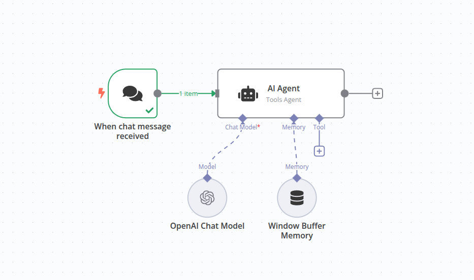

# Chat with Local LLMs using n8n and Ollama

This project explains how to build an AI-powered chat workflow using n8n and Ollama for local Large Language Model (LLM) interactions. The workflow provides a user-friendly chat interface for seamless interaction with self-hosted LLMs.



## Table of Contents

- [Overview](#overview)
- [Project Structure](#project-structure)
- [Prerequisites](#prerequisites)
- [Installation and Setup](#installation-and-setup)
  - [Virtual Environment Setup](#virtual-environment-setup)
  - [Installing n8n](#installing-n8n)
  - [Installing Ollama](#installing-ollama)
- [Running the Application](#running-the-application)
  - [Local Development](#local-development)
  - [Docker Deployment](#docker-deployment)
- [Workflow Components](#workflow-components)
  - [How It Works](#how-it-works)
  - [Node Configuration](#node-configuration)
- [AI Concepts in n8n](#ai-concepts-in-n8n)
  - [What is an AI Agent](#what-is-an-ai-agent)
  - [What is a Tool in AI](#what-is-a-tool-in-ai)
- [Testing the Application](#testing-the-application)
  - [Unit Testing](#unit-testing)
  - [Integration Testing](#integration-testing)
  - [Manual Testing](#manual-testing)
- [DevOps Setup Guide](#devops-setup-guide)
  - [Environment Configuration](#environment-configuration)
  - [Monitoring and Logs](#monitoring-and-logs)
  - [Security Considerations](#security-considerations)
- [Troubleshooting](#troubleshooting)
- [References](#references)

## Overview

This n8n workflow allows you to interact with your self-hosted Large Language Models (LLMs) through a user-friendly chat interface. By connecting to Ollama, a powerful tool for managing local LLMs, you can send prompts and receive AI-generated responses directly within n8n.

### Use Cases

- **Private AI Interactions**: Appropriate for scenarios where data privacy and confidentiality are important
- **Cost-Effective LLM Usage**: Avoid ongoing cloud API costs by running models on your own hardware
- **Experimentation & Learning**: A great way to explore and experiment with different LLMs in a local, controlled environment
- **Prototyping & Development**: Build and test AI-powered applications without relying on external services

## Project Structure

```
n8n/
├── 📁 workflows/
│   └── 📄 chat_with_local_llms_ollama.json
├── 📁 tests/
│   ├── 📄 test_workflow.py
│   └── 📄 test_integration.py
├── 📁 docs/
│   └── 📄 architecture.md
├── 📁 src/
│   └── 📄 helpers.py
├── 📄 .gitignore
├── 📄 README.md
├── 📄 requirements.txt
├── 📄 docker-compose.yml
├── 📄 Dockerfile
└── 📄 n8n.png
```

## Prerequisites

Before you begin, ensure you have the following installed:

### Required Software

- **Python 3.8 or higher**: For running test scripts and automation
- **Node.js 18 or higher**: Required for n8n installation
- **npm or pnpm**: Node package manager
- **Docker & Docker Compose** (optional but recommended): For containerized deployment
- **Ollama**: Local LLM runtime

### System Requirements

- **RAM**: Minimum 8GB (16GB recommended for larger models)
- **Storage**: At least 10GB free space for models
- **OS**: Linux (Ubuntu recommended), macOS, or Windows with WSL2

## Installation and Setup

### Virtual Environment Setup

It is recommended to use a Python virtual environment to isolate project dependencies.

#### On Linux/macOS:

```bash
# Navigate to project directory
cd "/path/to/n8n"

# Create virtual environment
python3 -m venv venv

# Activate virtual environment
source venv/bin/activate

# Verify activation (should show path to venv python)
which python
python --version
```

#### On Windows:

```powershell
# Create virtual environment
python -m venv venv

# Activate virtual environment
venv\Scripts\activate

# Verify activation
where python
python --version
```

#### Deactivating Virtual Environment

```bash
deactivate
```

### Installing n8n

#### Using npm (Recommended for Quick Start)

```bash
# Install n8n globally
npm install -g n8n

# Or run without installing
npx n8n
```

#### Using Docker

```bash
# Create volume for data persistence
docker volume create n8n_data

# Run n8n container
docker run -it --rm \
  --name n8n \
  -p 5678:5678 \
  -v n8n_data:/home/node/.n8n \
  docker.n8n.io/n8nio/n8n
```

### Installing Ollama

#### On Linux:

```bash
# Download and install Ollama
curl -fsSL https://ollama.com/install.sh | sh

# Start Ollama service
ollama serve
```

#### On macOS:

```bash
# Download from https://ollama.com/download
# Or use Homebrew
brew install ollama

# Start Ollama
ollama serve
```

#### Pull a Model

```bash
# Pull Llama2 model (default)
ollama pull llama2

# Or pull other models
ollama pull llama2:13b
ollama pull llama2:70b
ollama pull codellama
```

#### Verify Ollama Installation

```bash
# Check if Ollama is running
curl http://localhost:11434/api/version

# List installed models
ollama list
```

## Running the Application

### Local Development

1. **Ensure Virtual Environment is Active**:

```bash
source venv/bin/activate  # Linux/macOS
# or
venv\Scripts\activate  # Windows
```

2. **Start Ollama** (in a separate terminal):

```bash
ollama serve
```

3. **Start n8n**:

```bash
n8n
```

4. **Access n8n Editor**:

Open your browser and navigate to:
```
http://localhost:5678
```

5. **Import Workflow**:

- Click on "Workflows" in the left sidebar
- Click "Import from File" or "Import from URL"
- Select `workflows/chat_with_local_llms_ollama.json`
- Click "Import"

6. **Configure Credentials**:

- Open the "Ollama Chat Model" node
- Click on "Create New Credential"
- Set the Base URL: `http://localhost:11434`
- Save the credential

7. **Test the Workflow**:

- Click "Execute Workflow" or use the Chat interface
- Enter a message in the chat window
- Observe the AI response

### Docker Deployment

Docker deployment is recommended for production environments as it provides better isolation and reproducibility.

#### Using Docker Compose

Create a `docker-compose.yml` file:

```yaml
version: '3.8'

services:
  n8n:
    image: docker.n8n.io/n8nio/n8n
    container_name: n8n
    restart: unless-stopped
    ports:
      - "5678:5678"
    environment:
      - N8N_HOST=${N8N_HOST:-localhost}
      - N8N_PORT=5678
      - N8N_PROTOCOL=http
      - WEBHOOK_URL=http://${N8N_HOST:-localhost}:5678/
      - GENERIC_TIMEZONE=${GENERIC_TIMEZONE:-UTC}
    volumes:
      - n8n_data:/home/node/.n8n
      - ./workflows:/home/node/.n8n/workflows
    networks:
      - n8n-network
    # Enable access to host network for Ollama connection
    extra_hosts:
      - "host.docker.internal:host-gateway"

volumes:
  n8n_data:

networks:
  n8n-network:
    driver: bridge
```

#### Run with Docker Compose

```bash
# Start services
docker-compose up -d

# View logs
docker-compose logs -f n8n

# Stop services
docker-compose down

# Stop and remove volumes
docker-compose down -v
```

#### Docker Network Configuration for Ollama

If running n8n in Docker and Ollama on the host:

```bash
# Option 1: Use host network mode
docker run -it --rm \
  --name n8n \
  --net=host \
  -v n8n_data:/home/node/.n8n \
  docker.n8n.io/n8nio/n8n

# Option 2: Access Ollama via host.docker.internal
# In Ollama Chat Model node, use:
# Base URL: http://host.docker.internal:11434
```

## Workflow Components

### How It Works

The workflow consists of three main components that work together to create an interactive chat experience:

1. **When chat message received** (`chatTrigger`):
   - Captures user input from the chat interface
   - Triggers the workflow when a new message is received
   - Passes the message to the next node

2. **Chat LLM Chain** (`chainLlm`):
   - Orchestrates the conversation flow
   - Manages the connection between the trigger and the AI model
   - Handles message formatting and response streaming

3. **Ollama Chat Model** (`lmChatOllama`):
   - Connects to your local Ollama server
   - Sends the user's message to the LLM
   - Receives and returns the AI-generated response

**Data Flow**:
```
User Input → Chat Trigger → LLM Chain → Ollama Chat Model → AI Response → User
```

### Node Configuration

#### Chat Trigger Node

- **Type**: `@n8n/n8n-nodes-langchain.chatTrigger`
- **Version**: 1.1
- **Purpose**: Entry point for user messages
- **Configuration**: Default settings are sufficient

#### Chat LLM Chain Node

- **Type**: `@n8n/n8n-nodes-langchain.chainLlm`
- **Version**: 1.4
- **Purpose**: Manages conversation flow and context
- **Configuration**: Connect to Chat Trigger and Ollama Chat Model

#### Ollama Chat Model Node

- **Type**: `@n8n/n8n-nodes-langchain.lmChatOllama`
- **Version**: 1
- **Configuration**:
  - **Base URL**: `http://localhost:11434` (default)
  - **Model**: Select from available models (llama2, llama2:13b, llama2:70b, etc.)
  - **Temperature**: Control randomness (0.0 - 1.0)
  - **Top K**: Number of token choices (default: 40)
  - **Top P**: Probability threshold (default: 0.9)

## AI Concepts in n8n

### What is an AI Agent

An AI agent builds on Large Language Models (LLMs) to create goal-oriented functionality. While LLMs generate text based on input by predicting the next word, AI agents add the ability to:

- **Use Tools**: Access external APIs, databases, and services
- **Act on Decisions**: Execute actions based on LLM outputs
- **Complete Tasks**: Work towards specific goals autonomously
- **Solve Problems**: Break down complex tasks into manageable steps

#### LLM vs AI Agent Comparison

| Core Capability | LLM | AI Agent |
|----------------|-----|----------|
| Primary Function | Text generation | Goal-oriented task completion |
| Decision-Making | Simulates choices in text | Selects and executes actions |
| Uses Tools/APIs | No | Yes |
| Workflow Complexity | Single-step | Multi-step |
| Scope | Generates language | Performs complex, real-world tasks |
| Example | Generating a paragraph | Scheduling an appointment |

### What is a Tool in AI

In AI, 'tools' has a specific meaning. Tools act like add-ons that your AI can use to access extra context or resources. They are interfaces that an agent can use to interact with the world.

#### Available Tools in n8n

n8n provides several tool sub-nodes:

1. **Call n8n Workflow Tool**: Load any n8n workflow as a tool
2. **Custom Code Tool**: Write JavaScript/Python code for custom functionality
3. **HTTP Request Tool**: Make API calls to fetch data or interact with services
4. **Calculator Tool**: Perform mathematical calculations
5. **Wikipedia Tool**: Search and retrieve Wikipedia content
6. **SerpAPI Tool**: Perform Google searches programmatically

#### Tool Use Cases

- Access real-time data from APIs
- Query databases for business intelligence
- Perform calculations and data transformations
- Search the web for current information
- Execute custom business logic
- Integrate with third-party services

## Testing the Application

### Unit Testing

Create test files to validate individual components.

#### Example Test: `tests/test_workflow.py`

```python
import pytest
import requests
import json

def test_ollama_connection():
    """Test Ollama server connectivity"""
    response = requests.get('http://localhost:11434/api/version')
    assert response.status_code == 200
    data = response.json()
    assert 'version' in data

def test_ollama_model_available():
    """Test if required model is available"""
    response = requests.get('http://localhost:11434/api/tags')
    assert response.status_code == 200
    data = response.json()
    models = [model['name'] for model in data.get('models', [])]
    assert any('llama2' in model for model in models)

def test_n8n_health():
    """Test n8n server health"""
    response = requests.get('http://localhost:5678/healthz')
    assert response.status_code == 200
```

#### Run Unit Tests

```bash
# Ensure virtual environment is active
source venv/bin/activate

# Install pytest
pip install pytest requests

# Run tests
pytest tests/test_workflow.py -v

# Run with coverage
pytest tests/test_workflow.py --cov=src --cov-report=html
```

### Integration Testing

Test the complete workflow end-to-end.

#### Example Integration Test: `tests/test_integration.py`

```python
import pytest
import requests
import time

@pytest.fixture
def n8n_webhook_url():
    """Webhook URL for the chat workflow"""
    return "http://localhost:5678/webhook-test/chat"

def test_chat_workflow_response(n8n_webhook_url):
    """Test complete chat workflow"""
    # Send a test message
    payload = {
        "chatInput": "Hello, what is 2+2?"
    }
    
    response = requests.post(
        n8n_webhook_url,
        json=payload,
        headers={'Content-Type': 'application/json'}
    )
    
    assert response.status_code == 200
    data = response.json()
    assert 'output' in data
    assert len(data['output']) > 0

def test_chat_workflow_latency(n8n_webhook_url):
    """Test response time"""
    payload = {"chatInput": "Hi"}
    
    start_time = time.time()
    response = requests.post(n8n_webhook_url, json=payload)
    end_time = time.time()
    
    latency = end_time - start_time
    assert response.status_code == 200
    assert latency < 30  # Should respond within 30 seconds
```

### Manual Testing

#### Test Checklist

1. **Ollama Service**:
   ```bash
   # Check Ollama is running
   curl http://localhost:11434/api/version
   
   # List available models
   ollama list
   ```

2. **n8n Service**:
   ```bash
   # Check n8n is accessible
   curl http://localhost:5678/healthz
   ```

3. **Workflow Import**:
   - Import the workflow JSON file
   - Verify all nodes are connected properly
   - Check for any error indicators

4. **Chat Interface**:
   - Open the chat interface
   - Send a simple greeting: "Hello"
   - Verify response is received
   - Test with various prompts:
     - "What is Python?"
     - "Write a haiku about automation"
     - "Explain n8n in one sentence"

5. **Model Performance**:
   - Monitor response times
   - Check memory usage: `docker stats` or `htop`
   - Verify model quality with complex questions

## DevOps Setup Guide

### Environment Configuration

#### Environment Variables

Create a `.env` file for configuration:

```bash
# n8n Configuration
N8N_HOST=localhost
N8N_PORT=5678
N8N_PROTOCOL=http
WEBHOOK_URL=http://localhost:5678/

# Timezone
GENERIC_TIMEZONE=UTC

# Database (optional for production)
DB_TYPE=postgresdb
DB_POSTGRESDB_HOST=localhost
DB_POSTGRESDB_PORT=5432
DB_POSTGRESDB_DATABASE=n8n
DB_POSTGRESDB_USER=n8n_user
DB_POSTGRESDB_PASSWORD=your_secure_password

# Execution
EXECUTIONS_MODE=regular
EXECUTIONS_TIMEOUT=300
EXECUTIONS_TIMEOUT_MAX=600

# Security
N8N_BASIC_AUTH_ACTIVE=true
N8N_BASIC_AUTH_USER=admin
N8N_BASIC_AUTH_PASSWORD=your_secure_password
```

#### Load Environment in Virtual Environment

```bash
# Activate virtual environment
source venv/bin/activate

# Load environment variables
export $(cat .env | xargs)

# Or use python-dotenv
pip install python-dotenv
```

### Monitoring and Logs

#### n8n Logs

```bash
# View n8n logs (npm installation)
n8n --log-level=debug

# Docker logs
docker logs -f n8n

# Docker Compose logs
docker-compose logs -f
```

#### Ollama Logs

```bash
# View Ollama logs
journalctl -u ollama -f

# Docker logs (if running Ollama in Docker)
docker logs -f ollama
```

#### Health Checks

```bash
# n8n health endpoint
curl http://localhost:5678/healthz

# Ollama health check
curl http://localhost:11434/api/version

# Create monitoring script
cat > check_health.sh << 'EOF'
#!/bin/bash
echo "Checking n8n..."
curl -s http://localhost:5678/healthz

echo -e "\nChecking Ollama..."
curl -s http://localhost:11434/api/version
EOF

chmod +x check_health.sh
./check_health.sh
```

### Security Considerations

#### Authentication

1. **Enable Basic Auth** for n8n:
   ```bash
   export N8N_BASIC_AUTH_ACTIVE=true
   export N8N_BASIC_AUTH_USER=admin
   export N8N_BASIC_AUTH_PASSWORD=your_secure_password
   ```

2. **Use HTTPS** in production:
   ```bash
   export N8N_PROTOCOL=https
   export N8N_SSL_KEY=/path/to/ssl/key.pem
   export N8N_SSL_CERT=/path/to/ssl/cert.pem
   ```

#### Network Security

1. **Firewall Rules**:
   ```bash
   # Allow only necessary ports
   sudo ufw allow 5678/tcp  # n8n
   sudo ufw enable
   ```

2. **Docker Network Isolation**:
   - Use Docker networks to isolate services
   - Avoid exposing Ollama port externally
   - Use `--net=host` only when necessary

#### Data Security

1. **Encrypt Credentials**:
   - n8n encrypts credentials by default
   - Backup encryption key: `~/.n8n/config`

2. **Backup Strategy**:
   ```bash
   # Backup n8n data
   docker run --rm -v n8n_data:/data -v $(pwd):/backup \
     ubuntu tar czf /backup/n8n_backup_$(date +%Y%m%d).tar.gz /data
   
   # Restore n8n data
   docker run --rm -v n8n_data:/data -v $(pwd):/backup \
     ubuntu tar xzf /backup/n8n_backup_YYYYMMDD.tar.gz -C /
   ```

## Troubleshooting

### Common Issues

#### 1. Ollama Connection Failed

**Symptoms**: "Unable to connect to Ollama server"

**Solutions**:
```bash
# Check if Ollama is running
curl http://localhost:11434/api/version

# Start Ollama service
ollama serve

# Check port availability
netstat -tuln | grep 11434

# For Docker, use host.docker.internal
# In Ollama node: http://host.docker.internal:11434
```

#### 2. n8n Port Already in Use

**Symptoms**: "Port 5678 is already in use"

**Solutions**:
```bash
# Find process using the port
lsof -i :5678
# or
netstat -tuln | grep 5678

# Kill the process
kill -9 <PID>

# Or use a different port
export N8N_PORT=5679
n8n
```

#### 3. Virtual Environment Not Activating

**Symptoms**: Commands not found, wrong Python version

**Solutions**:
```bash
# Recreate virtual environment
rm -rf venv
python3 -m venv venv
source venv/bin/activate

# Verify activation
which python
echo $VIRTUAL_ENV
```

#### 4. Model Not Found

**Symptoms**: "Model 'llama2' not found"

**Solutions**:
```bash
# List available models
ollama list

# Pull the required model
ollama pull llama2

# Check disk space
df -h
```

#### 5. Slow Response Times

**Symptoms**: Chat takes too long to respond

**Solutions**:
- Use smaller models (llama2:7b instead of llama2:70b)
- Increase available RAM
- Check CPU/GPU utilization
- Reduce context window size
- Optimize Ollama settings

#### 6. Workflow Import Fails

**Symptoms**: Error importing workflow JSON

**Solutions**:
```bash
# Validate JSON syntax
cat workflows/chat_with_local_llms_ollama.json | jq .

# Check file permissions
chmod 644 workflows/chat_with_local_llms_ollama.json

# Re-download workflow file
# Ensure no corruption during transfer
```

## References

### Official Documentation

- [n8n Documentation](https://docs.n8n.io/) - The n8n platform documentation
- [n8n GitHub Repository](https://github.com/n8n-io/n8n) - Source code and contribution guidelines
- [n8n Workflow Templates](https://n8n.io/workflows) - 900+ ready-to-use workflow templates
- [Ollama Documentation](https://ollama.com/library) - Ollama models library and documentation
- [Ollama GitHub](https://github.com/ollama/ollama) - Ollama source code

### AI and Workflow Resources

- [AI Concepts in n8n](https://docs.n8n.io/advanced-ai/intro-tutorial/) - Tutorial for building AI workflows
- [What's a Tool in AI?](https://docs.n8n.io/advanced-ai/examples/understand-tools/) - Understanding AI tools
- [Ollama Chat Model Node](https://docs.n8n.io/integrations/builtin/cluster-nodes/sub-nodes/n8n-nodes-langchain.lmchatollama/) - Node-specific documentation
- [Chat with Local LLMs Workflow](https://n8n.io/workflows/2384-chat-with-local-llms-using-n8n-and-ollama/) - Original workflow template
- [n8n AI Agent Examples](https://docs.n8n.io/advanced-ai/examples/introduction/) - AI workflow examples and concepts
- [LangChain in n8n](https://docs.n8n.io/advanced-ai/langchain/overview/) - LangChain integration overview

### Installation and Setup Guides

- [n8n Installation Guide](https://docs.n8n.io/hosting/installation/) - Various installation methods
- [Docker Setup for n8n](https://docs.n8n.io/hosting/installation/docker/) - Containerized deployment
- [n8n with Docker Compose](https://docs.n8n.io/hosting/installation/server-setups/docker-compose/) - Multi-container setup
- [Self-hosting n8n](https://docs.n8n.io/hosting/) - Complete self-hosting guide

### Testing and DevOps

- [Python pytest Documentation](https://docs.pytest.org/) - Testing framework
- [Docker Documentation](https://docs.docker.com/) - Container platform
- [Docker Compose Documentation](https://docs.docker.com/compose/) - Multi-container applications

### Community and Support

- [n8n Community Forum](https://community.n8n.io/) - Ask questions and share knowledge
- [n8n Discord Server](https://discord.gg/n8n) - Real-time community chat
- [n8n YouTube Channel](https://www.youtube.com/c/n8n-io) - Video tutorials and demos

### Related Projects and Tools

- [LangChain](https://langchain.com/) - Framework for developing LLM applications
- [Llama 2](https://ai.meta.com/llama/) - Meta's open-source LLM
- [Node.js](https://nodejs.org/) - JavaScript runtime
- [Python](https://www.python.org/) - Programming language for testing and automation

---

**License**: This project follows n8n's license model. See [n8n License](https://github.com/n8n-io/n8n/blob/master/LICENSE.md) for details.