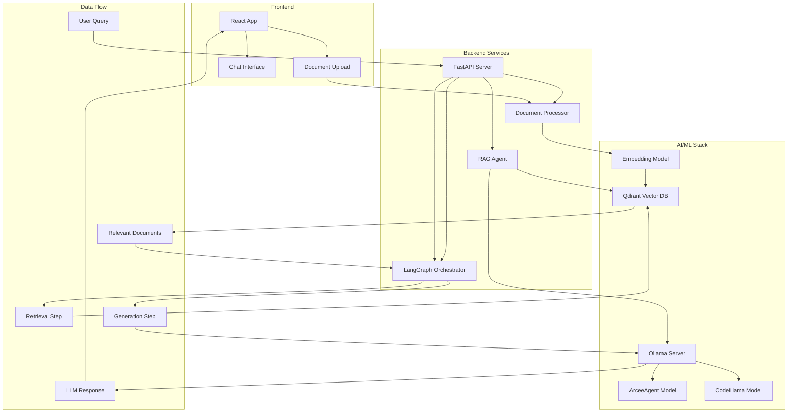
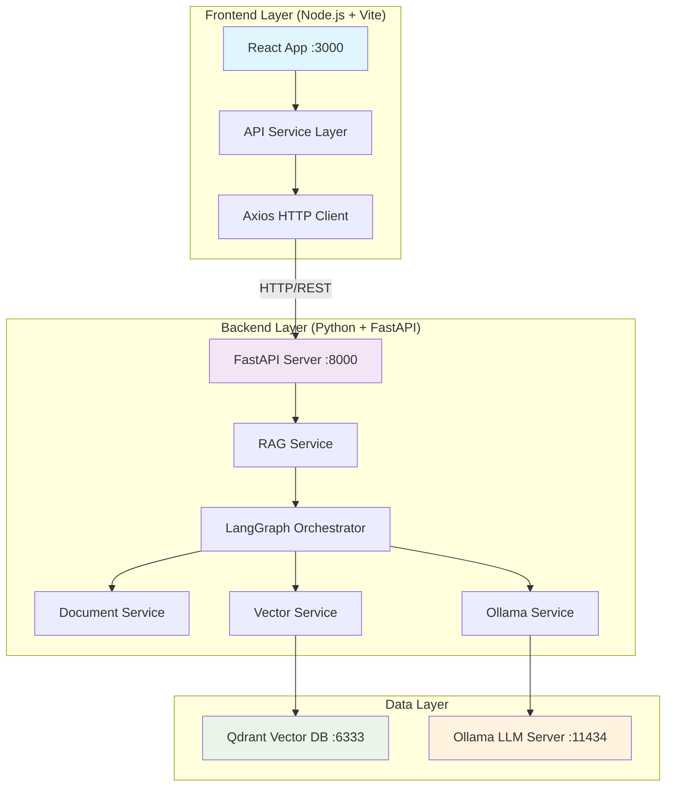

# Retrieval Augmented Generation (RAG) with LangGraph, Ollama, FastAPI and React

Retrieval Augmented Generation (RAG) system uses LangGraph, Ollama, FastAPI, React, Node.js + Vite, and Qdrant vector database for intelligent document search and question answering.

## Table of Contents

1. [Architecture](#architecture)
2. [Components](#components)
3. [Project Structure](#project-structure)
4. [Prerequisites](#prerequisites)
5. [Installation & Setup](#installation--setup)
6. [Vector Database Setup (Qdrant)](#vector-database-setup-qdrant)
7. [LLM Inference with RAG](#llm-inference-with-rag)
8. [Configuration](#configuration)
9. [Running the Frontend Server](#running-the-frontend-server)
10. [API Endpoints](#api-endpoints)
11. [Testing with cURL](#testing-with-curl)
12. [Prompt Engineering](#prompt-engineering)
13. [LangGraph RAG Workflow](#langgraph-rag-workflow)
14. [Docker Setup](#docker-setup)
15. [Tokenizers and Transformers](#tokenizers-and-transformers)
16. [References](#references)

## Architecture



## Components

- **Frontend**: React application for document upload and chat interface
- **Backend**: FastAPI server with RESTful APIs
- **Vector Database**: Qdrant for storing and retrieving document embeddings
- **LLM Server**: Ollama running ArceeAgent and CodeLlama models
- **Orchestration**: LangGraph for complex RAG workflows
- **Document Processing**: Text extraction and chunking pipeline

## Project Structure

```
langgraph-rag-system/
├── frontend/                   # React frontend application
│   ├── src/
│   │   ├── components/
│   │   │   ├── ChatInterface.jsx
│   │   │   ├── DocumentUpload.jsx
│   │   │   └── PromptConfig.jsx
│   │   ├── services/
│   │   │   └── api.js
│   │   ├── App.jsx
│   │   └── main.jsx
│   ├── package.json
│   ├── vite.config.js
│   └── Dockerfile
├── backend/                    # FastAPI backend
│   ├── app/
│   │   ├── core/
│   │   │   ├── config.py
│   │   │   └── prompts.py
│   │   ├── services/
│   │   │   ├── document_service.py
│   │   │   ├── rag_service.py
│   │   │   ├── vector_service.py
│   │   │   └── ollama_service.py
│   │   ├── models/
│   │   │   └── schemas.py
│   │   ├── routers/
│   │   │   ├── documents.py
│   │   │   └── chat.py
│   │   └── main.py
│   ├── requirements.txt
│   └── Dockerfile
├── docker-compose.yml
├── .gitignore
├── .dockerignore
├── tests/
│   ├── test_api.py
│   └── curl_tests.sh
└── README.md
```

## Prerequisites

- Docker and Docker Compose
- Node.js 18+ (for local frontend development)
- Python 3.11+ (for local backend development)
- Minimum 8GB RAM (recommended 16GB for LLM models)
- GPU support (optional but recommended for better performance)

## Quick Start

### Setup Command
```bash
# Start the complete system with Docker Compose
docker-compose up --build -d

# Run integration tests
./integration_test.sh
```

**Access your applications:**
- **Frontend:** http://localhost:3000
- **API Documentation:** http://localhost:8000/docs
- **Qdrant Dashboard:** http://localhost:6333/dashboard

### Vector Database Setup (Qdrant)
```bash
# Start Qdrant vector database
./scripts/manage_vectordb.sh start

# Initialize collections
./scripts/manage_vectordb.sh init

# Check status
./scripts/manage_vectordb.sh status
```

## Installation & Setup

### 1. Clone and Setup Environment

```bash
git clone <your-repo-url>
cd langgraph-rag-system
```

### 2. Install Ollama and Models

```bash
# Install Ollama
curl -fsSL https://ollama.ai/install.sh | sh

# Pull required models
ollama pull arcee-ai/arcee-agent
ollama pull codellama:7b

# Verify installation
ollama list
```

### 3. Environment Configuration

Create `.env` file in the root directory:

```env
# Ollama Configuration
OLLAMA_HOST=localhost
OLLAMA_PORT=11434
OLLAMA_BASE_URL=http://localhost:11434

# Qdrant Configuration
QDRANT_HOST=localhost
QDRANT_PORT=6333
QDRANT_URL=http://localhost:6333

# FastAPI Configuration
FASTAPI_HOST=0.0.0.0
FASTAPI_PORT=8000

# React Configuration
VITE_API_BASE_URL=http://localhost:8000

# Model Configuration
PRIMARY_MODEL=arcee-ai/arcee-agent
SECONDARY_MODEL=codellama:7b
EMBEDDING_MODEL=sentence-transformers/all-MiniLM-L6-v2

# Vector Database
COLLECTION_NAME=documents
VECTOR_SIZE=384
```

## Running the Frontend Server

### Frontend Development Server (Node.js + Vite)

The frontend uses **Vite** as the development server, which is built on Node.js.
- Hot Module Replacement (HMR) for instant code updates
- Optimized bundling and serving of React components
- Development proxy for API calls to the backend

#### Vite

Vite is a build tool that provides a development server for web projects.

Vite consists of two parts.

- A development server that provides for example fast Hot Module Replacement (HMR).

- A build command that bundles your code with Rollup, pre-configured to output optimized static assets for production.

#### Starting the Frontend Server (Node.js + Vite)

```bash
# Navigate to frontend directory
cd frontend

# Install Node.js dependencies
npm install

# Start development server (Node.js + Vite)
npm run dev

# Alternative: Start in specific host/port
npm run dev -- --host 0.0.0.0 --port 3000
```

**Frontend Server Details:**
- **Technology**: Node.js + Vite + React
- **Default Port**: 3000
- **Hot Reload**: ✅ Automatic refresh on code changes
- **Build Tool**: Vite (fast ES modules bundler)
- **Package Manager**: npm

#### Production Frontend Build

```bash
# Create production build
npm run build

# Preview production build locally
npm run preview

# Serve static files (production)
npx serve dist -s -l 3000
```

### System Architecture: Frontend ↔ Backend Communication



### Communication Protocol: Frontend ↔ Backend

#### 1. API Service Layer (Frontend)

Located in `frontend/src/services/api.js`:

```javascript
// Base API configuration
const API_BASE_URL = import.meta.env.VITE_API_BASE_URL || 'http://localhost:8000';

class APIService {
  constructor() {
    this.client = axios.create({
      baseURL: API_BASE_URL,
      timeout: 30000,
      headers: {
        'Content-Type': 'application/json',
      },
    });
  }

  // Chat endpoints
  async query(message, model, useRAG, options = {}) {
    const response = await this.client.post('/chat/query', {
      query: message,
      model: model,
      use_rag: useRAG,
      ...options
    });
    return response.data;
  }

  // Document upload
  async uploadDocument(file, metadata) {
    const formData = new FormData();
    formData.append('file', file);
    formData.append('metadata', JSON.stringify(metadata));
    
    const response = await this.client.post('/documents/upload', formData, {
      headers: { 'Content-Type': 'multipart/form-data' }
    });
    return response.data;
  }
}
```

#### 2. Request Flow Architecture

**Question & Answer with RAG - Complete Flow:**

```
Frontend (React) → Backend (FastAPI) → LangGraph → Qdrant + Ollama → Response

Step-by-step breakdown:
┌─────────────────┐    HTTP POST     ┌─────────────────┐
│  User Question  │ ───────────────► │   FastAPI       │
│  (React Form)   │  /chat/rag       │   Router        │
└─────────────────┘                  └─────────────────┘
                                              │
                                              ▼
                                    ┌─────────────────┐
                                    │  RAG Service    │
                                    │  (LangGraph)    │
                                    └─────────────────┘
                                              │
                                    ┌─────────┴─────────┐
                                    ▼                   ▼
                          ┌─────────────────┐  ┌─────────────────┐
                          │ Vector Service  │  │ Ollama Service  │
                          │    (Qdrant)     │  │     (LLM)       │
                          └─────────────────┘  └─────────────────┘
                                    │                   │
                                    ▼                   ▼
                          ┌─────────────────┐  ┌─────────────────┐
                          │   Retrieved     │  │   Generated     │
                          │   Documents     │  │   Response      │
                          └─────────────────┘  └─────────────────┘
                                    │                   │
                                    └─────────┬─────────┘
                                              ▼
                                    ┌─────────────────┐
                                    │ Final Response  │
                                    │ (with sources)  │
                                    └─────────────────┘
                                              │
                                              ▼
┌─────────────────┐    JSON Response  ┌─────────────────┐
│  React Update   │ ◄───────────────  │   Frontend      │
│  (Display)      │                   │   (Axios)       │
└─────────────────┘                   └─────────────────┘
```

### Option 1: Docker Compose (Recommended)

**Complete Multi-Server Setup:**

```bash
# Start all services (Frontend + Backend + Databases)
docker-compose up -d

# Check status of all containers
docker-compose ps

# View logs from all services
docker-compose logs -f

# View specific service logs
docker-compose logs -f frontend   # Node.js/Vite server
docker-compose logs -f backend    # FastAPI server
docker-compose logs -f qdrant     # Vector database
docker-compose logs -f ollama     # LLM server

# Stop all services
docker-compose down

# Stop and remove volumes (reset data)
docker-compose down -v
```

**Docker Compose Services:**
```yaml
services:
  frontend:      # Node.js + Vite development server
    build: ./frontend
    ports: ["3000:3000"]
    environment:
      - VITE_API_BASE_URL=http://localhost:8000
    
  backend:       # Python FastAPI server
    build: ./backend  
    ports: ["8000:8000"]
    depends_on: [qdrant, ollama]
    
  qdrant:        # Vector database
    image: qdrant/qdrant
    ports: ["6333:6333"]
    
  ollama:        # LLM inference server
    image: ollama/ollama
    ports: ["11434:11434"]
```

### Option 2: Local Development (Multi-Server)

#### Step 1: Start Vector Database
```bash
# Terminal 1: Qdrant Vector Database
./scripts/manage_vectordb.sh start
# Runs on: http://localhost:6333
```

#### Step 2: Start LLM Server
```bash
# Terminal 2: Ollama LLM Server
ollama serve
# Runs on: http://localhost:11434

# Pull required models (one-time setup)
ollama pull arcee-ai/arcee-agent
ollama pull codellama:7b
```

#### Step 3: Start Backend Server
```bash
# Terminal 3: Python FastAPI Backend
cd backend
python -m venv venv
source venv/bin/activate  # Windows: venv\Scripts\activate
pip install -r requirements.txt

# Start backend server
uvicorn app.main:app --reload --host 0.0.0.0 --port 8000
# Runs on: http://localhost:8000
```

#### Step 4: Start Frontend Server
```bash
# Terminal 4: Node.js Frontend (Vite + React)
cd frontend
npm install

# Start development server with hot reload
npm run dev
# Runs on: http://localhost:3000

# Or specify custom host/port
npm run dev -- --host 0.0.0.0 --port 3001

# Alternative: Use the startup script
./start_frontend.sh              # Default settings
./start_frontend.sh --port 3001  # Custom port
./start_frontend.sh --build      # Production build
./start_frontend.sh --preview    # Preview build
```

### RAG Communication Flow: Frontend → Backend

#### 1. Document Upload Flow

```javascript
// Frontend: User uploads document
const handleUpload = async (file, metadata) => {
  try {
    // API call to backend
    const result = await chatAPI.uploadDocument(file, {
      title: metadata.title,
      type: metadata.type,
      description: metadata.description
    });
    
    console.log('Document uploaded:', result.document_id);
    // Backend processes: file → chunks → embeddings → Qdrant storage
  } catch (error) {
    console.error('Upload failed:', error);
  }
};

// Backend processes document:
// 1. Receive file via FastAPI multipart upload
// 2. Extract text content (PDF, TXT, etc.)
// 3. Split into chunks (sentence-level)
// 4. Generate embeddings with sentence-transformers
// 5. Store in Qdrant vector database with metadata
```

#### 2. Chat: Query with RAG

```javascript
// Frontend: User asks question
const handleChat = async (question, useRAG = true) => {
  try {
    // API call to backend RAG endpoint
    const response = await chatAPI.ragQuery(question, {
      model: 'arcee-ai/arcee-agent',
      use_rag: useRAG,
      temperature: 0.7,
      max_tokens: 500
    });
    
    // Display response with sources
    setMessages(prev => [...prev, {
      type: 'bot',
      content: response.response,
      sources: response.sources,
      processing_time: response.processing_time
    }]);
    
  } catch (error) {
    console.error('Chat failed:', error);
  }
};

// Backend RAG processing:
// 1. Receive question via FastAPI POST /chat/rag
// 2. Generate question embedding
// 3. Search Qdrant for similar document chunks
// 4. Retrieve top-k relevant contexts
// 5. Format prompt with context + question
// 6. Send to Ollama LLM for generation
// 7. Return response + source documents
```

#### 3. Real-time Streaming Responses

```javascript
// Frontend: Stream responses for long answers
const handleStreamChat = async (question) => {
  await chatAPI.stream(
    question,
    'arcee-ai/arcee-agent',
    true, // use RAG
    // On each chunk received
    (chunk) => {
      setCurrentResponse(prev => prev + chunk);
    },
    // On error
    (error) => {
      console.error('Stream error:', error);
    },
    // On complete
    () => {
      console.log('Streaming complete');
    }
  );
};

// Backend streaming:
// 1. FastAPI StreamingResponse for real-time data
// 2. LangGraph processes query in chunks
// 3. Ollama generates response progressively
// 4. Each token sent to frontend immediately
// 5. Frontend updates UI in real-time
```

### Server Configuration & Environment Variables

#### Frontend Environment (.env)
```bash
# Frontend API configuration
VITE_API_BASE_URL=http://localhost:8000
VITE_WEBSOCKET_URL=ws://localhost:8000/ws
VITE_UPLOAD_MAX_SIZE=50000000  # 50MB
VITE_ENVIRONMENT=development

# Development server settings
VITE_DEV_HOST=0.0.0.0
VITE_DEV_PORT=3000
VITE_HOT_RELOAD=true
```

#### Backend Environment (.env)
```bash
# Backend server configuration
FASTAPI_HOST=0.0.0.0
FASTAPI_PORT=8000
FASTAPI_RELOAD=true

# External service URLs
QDRANT_URL=http://localhost:6333
OLLAMA_URL=http://localhost:11434

# CORS settings for frontend
CORS_ORIGINS=["http://localhost:3000"]
```

### Monitoring & Debugging

#### Check All Services Status
```bash
# Check if all servers are running
curl http://localhost:3000     # Frontend (should show React app)
curl http://localhost:8000/health  # Backend health check
curl http://localhost:6333/health  # Qdrant health check
curl http://localhost:11434/api/tags # Ollama models

# Integration test
./integration_test.sh
```

#### Development Tools Access
- **Frontend Dev Server**: http://localhost:3000
- **Backend API Docs**: http://localhost:8000/docs
- **Qdrant Dashboard**: http://localhost:6333/dashboard
- **Ollama API**: http://localhost:11434

#### Network Communication Debug
```bash
# Monitor API calls between frontend and backend
# Backend logs show incoming requests:
docker-compose logs -f backend

# Frontend network tab in browser dev tools shows:
# - HTTP requests to backend
# - Response times and status codes
# - WebSocket connections for streaming
```

### Troubleshooting Frontend-Backend Communication

#### Issues & Solutions

**1. CORS Errors (Cross-Origin Request Blocked)**
```bash
# Problem: Browser blocks requests from localhost:3000 to localhost:8000
# Solution: Backend CORS configuration in FastAPI

# backend/app/main.py
from fastapi.middleware.cors import CORSMiddleware

app.add_middleware(
    CORSMiddleware,
    allow_origins=["http://localhost:3000", "http://127.0.0.1:3000"],
    allow_credentials=True,
    allow_methods=["*"],
    allow_headers=["*"],
)
```

**2. Connection Refused / Network Errors**
```bash
# Check if backend is running
curl -v http://localhost:8000/health

# Check if frontend can reach backend
# In browser console (F12):
fetch('http://localhost:8000/health')
  .then(r => r.json())
  .then(data => console.log(data))

# Fix: Ensure backend is started before frontend
```

**3. API Base URL Configuration**
```bash
# Frontend .env file
VITE_API_BASE_URL=http://localhost:8000

# Verify in browser dev tools > Network tab:
# All API calls should go to localhost:8000
```

**4. Port Conflicts**
```bash
# If port 3000 is busy:
npm run dev -- --port 3001

# If port 8000 is busy:
uvicorn app.main:app --port 8001

# Update frontend .env accordingly:
VITE_API_BASE_URL=http://localhost:8001
```

#### Request/Response Debugging

**Frontend API Call Debug:**
```javascript
// Add debugging to API service
const response = await this.client.post('/chat/rag', data);
console.log('Request:', { url: '/chat/rag', data });
console.log('Response:', response.data);
```

**Backend Request Debug:**
```python
# Add middleware to log requests
@app.middleware("http")
async def log_requests(request: Request, call_next):
    print(f"Request: {request.method} {request.url}")
    response = await call_next(request)
    print(f"Response: {response.status_code}")
    return response
```

**Network Monitoring:**
```bash
# Monitor all HTTP traffic
# Browser Dev Tools > Network tab
# Filter by XHR/Fetch to see API calls

# Command line network monitoring
netstat -tulpn | grep :3000  # Frontend server
netstat -tulpn | grep :8000  # Backend server
```

### Complete RAG Request Example: Step-by-Step

Here's a real example showing how a user question flows through the entire system:

#### Example: "What is RAG and how does it work?"

**1. User Interaction (Frontend - React)**
```javascript
// User types question in ChatInterface.jsx
const handleSendMessage = async () => {
  const userQuestion = "What is RAG and how does it work?";
  
  // Create user message in UI
  setMessages(prev => [...prev, {
    type: 'user',
    content: userQuestion,
    timestamp: new Date()
  }]);
  
  // Call API service
  const response = await chatAPI.ragQuery(userQuestion, {
    model: 'arcee-ai/arcee-agent',
    use_rag: true,
    temperature: 0.7
  });
};
```

**2. API Call (Frontend - Axios)**
```javascript
// api.js - HTTP request to backend
async ragQuery(query, options = {}) {
  const response = await this.client.post('/chat/rag', {
    query: "What is RAG and how does it work?",
    model: "arcee-ai/arcee-agent",
    use_rag: true,
    temperature: 0.7,
    max_tokens: 500
  });
  return response.data;
}
```

**3. Backend Processing (FastAPI)**
```python
# FastAPI receives POST /chat/rag
@router.post("/rag")
async def rag_endpoint(request: ChatRequest):
    # Extract user question
    user_query = "What is RAG and how does it work?"
    
    # Call RAG service with LangGraph workflow
    result = await rag_service.process_query(
        query=user_query,
        model="arcee-ai/arcee-agent",
        use_rag=True
    )
    
    return ChatResponse(
        response=result["response"],
        sources=result["sources"],
        processing_time=result["processing_time"]
    )
```

**4. LangGraph RAG Workflow**
```python
# RAG workflow processes the query
async def rag_workflow(state: RAGState):
    query = state["query"]  # "What is RAG and how does it work?"
    
    # Step 1: Generate query embedding
    query_embedding = embedding_model.encode([query])[0]
    
    # Step 2: Search Qdrant for relevant documents
    search_results = await vector_service.search(
        query_vector=query_embedding,
        limit=5,
        score_threshold=0.7
    )
    
    # Step 3: Format context from retrieved documents
    contexts = [result.payload["text"] for result in search_results]
    context_text = "\n\n".join(contexts)
    
    # Step 4: Create prompt with context
    prompt = f"""<|im_start|>system
Use the provided context to answer the user's question about RAG.

Context:
{context_text}
<|im_end|>

<|im_start|>user
What is RAG and how does it work?
<|im_end|>

<|im_start|>assistant"""
    
    # Step 5: Send to Ollama for generation
    response = await ollama_service.generate(
        model="arcee-ai/arcee-agent",
        prompt=prompt,
        temperature=0.7
    )
    
    return {
        "response": response["response"],
        "sources": [r.payload.get("document_title") for r in search_results],
        "processing_time": response["total_duration"] / 1e9
    }
```

**5. Response Backend to Frontend**
```python
# Backend returns JSON response
{
  "response": "RAG (Retrieval-Augmented Generation) is a technique that combines information retrieval with text generation. It works by first retrieving relevant documents from a knowledge base, then using that context to generate accurate, informed responses...",
  "sources": ["RAG Tutorial.pdf", "AI Documentation.md"],
  "processing_time": 2.34,
  "context_used": true
}
```

**6. Frontend Updates UI**
```javascript
// ChatInterface.jsx receives response
const response = await chatAPI.ragQuery(userQuestion, options);

// Update messages state
setMessages(prev => [...prev, {
  type: 'bot',
  content: response.response,
  sources: response.sources,
  processing_time: response.processing_time,
  timestamp: new Date()
}]);

// User sees:
// - AI response with retrieved context
// - Source documents cited
// - Processing time displayed
```

#### Traffic Flow

```
Frontend (localhost:3000)    Backend (localhost:8000)     Vector DB (localhost:6333)   LLM (localhost:11434)
       │                           │                              │                          │
   User Question                   │                              │                          │
       │ HTTP POST                 │                              │                          │
       └──────────────────────────►│                              │                          │
                                   │ Embed Query                  │                          │
                                   │────────────────────────────► │                          │
                                   │                              │ Search Similar           │
                                   │                              │ Documents                │
                                   │◄──────────────────────────── │                          │
                                   │ Retrieved Context            │                          │
                                   │                              │                          │
                                   │ Generate Response            │                          │
                                   │─────────────────────────────────────────────────────►-  │
                                   │                              │                          │ LLM
                                   │◄─────────────────────────────────────────────────────── │ Response
                                   │ AI Response + Sources        │                          │
       ◄───────────────────────────│                              │                          │
   Display Response                │                              │                          │
```

#### Performance Metrics

**Typical Response Times:**
- Frontend → Backend: ~10-50ms (local network)
- Document Retrieval: ~100-300ms (Qdrant search)
- LLM Generation: ~1-5 seconds (depending on response length)
- **Total**: ~1.5-6 seconds end-to-end

**Network Usage:**
- Request size: ~500 bytes (JSON question)
- Response size: ~2-10KB (answer + metadata)
- Document context: ~1-5KB additional data

## API Endpoints
```

## Vector Database Setup (Qdrant)

### Overview

Qdrant is a high-performance vector database designed for similarity search and machine learning applications. In our RAG system, it stores document embeddings and enables fast semantic search for retrieving relevant context.

### Docker Setup

#### 1. Quick Start with Docker

```bash
# Pull and run Qdrant container
docker run -p 6333:6333 -p 6334:6334 \
    -v $(pwd)/qdrant_storage:/qdrant/storage:z \
    qdrant/qdrant
```

#### 2. Production Setup with Docker Compose

The `docker-compose.yml` includes Qdrant configuration:

```yaml
services:
  qdrant:
    image: qdrant/qdrant:latest
    container_name: qdrant_vectordb
    ports:
      - "6333:6333"  # HTTP API
      - "6334:6334"  # gRPC API
    volumes:
      - qdrant_data:/qdrant/storage
    environment:
      - QDRANT__SERVICE__HTTP_PORT=6333
      - QDRANT__SERVICE__GRPC_PORT=6334
    restart: unless-stopped
    networks:
      - langgraph_network

volumes:
  qdrant_data:
    driver: local
```

### Management Scripts

#### Start Vector Database Script

Create `scripts/start_qdrant.sh`:

```bash
#!/bin/bash

# Start Qdrant Vector Database
# Usage: ./scripts/start_qdrant.sh

set -e

QDRANT_CONTAINER="qdrant_vectordb"
QDRANT_IMAGE="qdrant/qdrant:latest"
QDRANT_DATA_DIR="./data/qdrant_storage"

echo "Starting Qdrant Vector Database..."

# Create data directory if it doesn't exist
mkdir -p "$QDRANT_DATA_DIR"

# Check if container already exists
if docker ps -a --format 'table {{.Names}}' | grep -q "^${QDRANT_CONTAINER}$"; then
    echo "📦 Container $QDRANT_CONTAINER already exists"
    
    if docker ps --format 'table {{.Names}}' | grep -q "^${QDRANT_CONTAINER}$"; then
        echo "✅ Qdrant is already running"
        docker ps --filter "name=$QDRANT_CONTAINER" --format "table {{.Names}}\t{{.Status}}\t{{.Ports}}"
    else
        echo "🔄 Starting existing container..."
        docker start "$QDRANT_CONTAINER"
    fi
else
    echo "🆕 Creating new Qdrant container..."
    docker run -d \
        --name "$QDRANT_CONTAINER" \
        -p 6333:6333 \
        -p 6334:6334 \
        -v "$(pwd)/${QDRANT_DATA_DIR}:/qdrant/storage:z" \
        -e QDRANT__SERVICE__HTTP_PORT=6333 \
        -e QDRANT__SERVICE__GRPC_PORT=6334 \
        "$QDRANT_IMAGE"
fi

# Wait for Qdrant to be ready
echo "⏳ Waiting for Qdrant to be ready..."
for i in {1..30}; do
    if curl -s http://localhost:6333/health >/dev/null 2>&1; then
        echo "✅ Qdrant is ready!"
        break
    fi
    echo -n "."
    sleep 2
done

# Display status
echo ""
echo "Qdrant Status:"
echo "   🌐 Web UI: http://localhost:6333/dashboard"
echo "   🔗 API Endpoint: http://localhost:6333"
echo "   📁 Data Directory: $QDRANT_DATA_DIR"
echo ""

# Show collections
if curl -s http://localhost:6333/collections >/dev/null 2>&1; then
    echo " Collections:"
    curl -s http://localhost:6333/collections | jq -r '.result.collections[] | "   - \(.name) (vectors: \(.vectors_count // 0))"' 2>/dev/null || echo "   No collections found"
else
    echo "⚠️  Unable to connect to Qdrant API"
fi
```

#### Stop Vector Database Script

Create `scripts/stop_qdrant.sh`:

```bash
#!/bin/bash

# Stop Qdrant Vector Database
# Usage: ./scripts/stop_qdrant.sh [--remove]

set -e

QDRANT_CONTAINER="qdrant_vectordb"
REMOVE_CONTAINER=false

# Parse arguments
while [[ $# -gt 0 ]]; do
    case $1 in
        --remove)
            REMOVE_CONTAINER=true
            shift
            ;;
        *)
            echo "Usage: $0 [--remove]"
            echo "  --remove: Remove container and data (destructive)"
            exit 1
            ;;
    esac
done

echo "🛑 Stopping Qdrant Vector Database..."

# Check if container exists
if ! docker ps -a --format 'table {{.Names}}' | grep -q "^${QDRANT_CONTAINER}$"; then
    echo "⚠️  Container $QDRANT_CONTAINER does not exist"
    exit 0
fi

# Stop container
if docker ps --format 'table {{.Names}}' | grep -q "^${QDRANT_CONTAINER}$"; then
    echo "⏹️  Stopping container..."
    docker stop "$QDRANT_CONTAINER"
    echo "✅ Container stopped"
else
    echo "ℹ️  Container is already stopped"
fi

# Remove container if requested
if [ "$REMOVE_CONTAINER" = true ]; then
    echo "🗑️  Removing container and data..."
    docker rm "$QDRANT_CONTAINER"
    echo "⚠️  Warning: All vector data has been removed"
    echo "✅ Container removed"
else
    echo "ℹ️  Container stopped but preserved (use --remove to delete)"
    echo "   Restart with: docker start $QDRANT_CONTAINER"
fi
```

### Collection Management

#### Initialize Collections Script

Create `scripts/init_collections.sh`:

```bash
#!/bin/bash

# Initialize Qdrant Collections
# Usage: ./scripts/init_collections.sh

set -e

QDRANT_URL="http://localhost:6333"
COLLECTION_NAME="documents"
VECTOR_SIZE=384  # Size for sentence-transformers/all-MiniLM-L6-v2

echo "Initializing Qdrant Collections..."

# Wait for Qdrant to be available
echo "⏳ Waiting for Qdrant..."
for i in {1..30}; do
    if curl -s "$QDRANT_URL/health" >/dev/null 2>&1; then
        break
    fi
    sleep 2
done

# Create documents collection
echo "Creating '$COLLECTION_NAME' collection..."
curl -X PUT "$QDRANT_URL/collections/$COLLECTION_NAME" \
    -H "Content-Type: application/json" \
    -d '{
        "vectors": {
            "size": '$VECTOR_SIZE',
            "distance": "Cosine"
        },
        "optimizers_config": {
            "default_segment_number": 2
        },
        "replication_factor": 1
    }'

# Create index for better performance
echo "🔍 Creating payload index..."
curl -X PUT "$QDRANT_URL/collections/$COLLECTION_NAME/index" \
    -H "Content-Type: application/json" \
    -d '{
        "field_name": "document_type",
        "field_schema": "keyword"
    }'

echo "✅ Collection initialization complete!"
echo "   Dashboard: $QDRANT_URL/dashboard"
echo "   Collection URL: $QDRANT_URL/collections/$COLLECTION_NAME"
```

#### Complete Management Script

Create `scripts/manage_vectordb.sh` for comprehensive database management:

```bash
# Quick start commands
./scripts/manage_vectordb.sh start    # Start Qdrant
./scripts/manage_vectordb.sh status   # Check status
./scripts/manage_vectordb.sh init     # Initialize collections
./scripts/manage_vectordb.sh stop     # Stop (preserves data)
./scripts/manage_vectordb.sh reset    # Complete reset (destructive)

# Backup and restore
./scripts/manage_vectordb.sh backup   # Create backup
./scripts/manage_vectordb.sh restore  # Restore from backup
./scripts/manage_vectordb.sh logs     # View logs
```

Make scripts executable:
```bash
chmod +x scripts/*.sh
```
```

### Vector Database Configuration

#### Environment Variables

```bash
# Qdrant Configuration
QDRANT_HOST=localhost
QDRANT_PORT=6333
QDRANT_URL=http://localhost:6333
QDRANT_API_KEY=  # Optional for production

# Collection Settings
VECTOR_COLLECTION_NAME=documents
VECTOR_SIZE=384
DISTANCE_METRIC=Cosine
SEGMENT_NUMBER=2

# Performance Settings
QDRANT_MAX_CONCURRENT_REQUESTS=100
QDRANT_TIMEOUT=60
```

#### Python Client Configuration

```python
from qdrant_client import QdrantClient
from qdrant_client.models import Distance, VectorParams, PointStruct
import os

class QdrantVectorStore:
    def __init__(self):
        self.client = QdrantClient(
            host=os.getenv("QDRANT_HOST", "localhost"),
            port=int(os.getenv("QDRANT_PORT", 6333)),
            api_key=os.getenv("QDRANT_API_KEY"),  # Optional
        )
        self.collection_name = os.getenv("VECTOR_COLLECTION_NAME", "documents")
        
    def create_collection(self):
        """Create vector collection if it doesn't exist."""
        try:
            self.client.create_collection(
                collection_name=self.collection_name,
                vectors_config=VectorParams(
                    size=int(os.getenv("VECTOR_SIZE", 384)),
                    distance=Distance.COSINE
                )
            )
        except Exception as e:
            print(f"Collection might already exist: {e}")
```

## LLM Inference with RAG

### RAG Architecture

Our RAG system combines **Ollama** for LLM inference with **Qdrant** for vector search, orchestrated by **LangGraph** workflows:

```
User Query → Embedding → Vector Search → Context Retrieval → LLM Generation → Response
     ↓            ↓           ↓              ↓               ↓              ↓
  FastAPI → SentenceTransformers → Qdrant → Document Chunks → Ollama → Formatted Answer
```

### How Vector Database does RAG?

#### 1. Document Ingestion Pipeline

```python
async def ingest_document(file_content: str, metadata: dict):
    """
    Process document for RAG system:
    1. Split into chunks
    2. Generate embeddings
    3. Store in Qdrant with metadata
    """
    
    # Step 1: Text chunking
    chunks = text_splitter.split_text(file_content)
    
    # Step 2: Generate embeddings
    embeddings = embedding_model.encode(chunks)
    
    # Step 3: Store in Qdrant
    points = []
    for i, (chunk, embedding) in enumerate(zip(chunks, embeddings)):
        points.append(PointStruct(
            id=f"{metadata['document_id']}_{i}",
            vector=embedding.tolist(),
            payload={
                "text": chunk,
                "document_id": metadata["document_id"],
                "chunk_index": i,
                "document_title": metadata.get("title", ""),
                "document_type": metadata.get("type", "text"),
                "timestamp": metadata.get("timestamp")
            }
        ))
    
    # Batch insert to Qdrant
    qdrant_client.upsert(
        collection_name="documents",
        points=points
    )
```

#### 2. Query Processing and Retrieval

```python
async def retrieve_context(query: str, top_k: int = 5) -> List[dict]:
    """
    Retrieve relevant context from vector database:
    1. Convert query to embedding
    2. Search similar vectors in Qdrant
    3. Return top-k relevant chunks
    """
    
    # Generate query embedding
    query_embedding = embedding_model.encode([query])[0]
    
    # Search in Qdrant
    search_results = qdrant_client.search(
        collection_name="documents",
        query_vector=query_embedding.tolist(),
        limit=top_k,
        score_threshold=0.7,  # Minimum similarity
        with_payload=True
    )
    
    # Extract context with metadata
    contexts = []
    for result in search_results:
        contexts.append({
            "text": result.payload["text"],
            "score": result.score,
            "document_title": result.payload.get("document_title", ""),
            "chunk_index": result.payload.get("chunk_index", 0)
        })
    
    return contexts
```

#### 3. LLM Generation with Context

```python
async def generate_rag_response(query: str, model_name: str) -> dict:
    """
    Generate response using RAG:
    1. Retrieve relevant context from Qdrant
    2. Format prompt with context
    3. Send to Ollama for generation
    4. Return response with sources
    """
    
    # Step 1: Retrieve context
    contexts = await retrieve_context(query, top_k=5)
    
    if not contexts:
        return {"response": "No relevant information found.", "sources": []}
    
    # Step 2: Format context
    context_text = "\n\n".join([
        f"Source {i+1}: {ctx['text']}" 
        for i, ctx in enumerate(contexts)
    ])
    
    # Step 3: Create RAG prompt
    if "arcee" in model_name.lower():
        prompt = f"""<|im_start|>system
Use the provided context to answer the user's question accurately.

Context:
{context_text}
<|im_end|>

<|im_start|>user
{query}
<|im_end|>

<|im_start|>assistant"""
    else:  # CodeLlama
        prompt = f"""# Context Information
{context_text}

# Question
{query}

# Answer
Based on the provided context:"""
    
    # Step 4: Generate with Ollama
    response = await ollama_client.generate(
        model=model_name,
        prompt=prompt,
        options={
            "temperature": 0.7,
            "top_p": 0.9,
            "max_tokens": 500
        }
    )
    
    return {
        "response": response["response"],
        "sources": [ctx["document_title"] for ctx in contexts],
        "context_used": True,
        "similarity_scores": [ctx["score"] for ctx in contexts]
    }
```

### LangGraph RAG Workflow

#### RAG Graph Definition

```python
from langgraph.graph import StateGraph, END
from typing import TypedDict, List

class RAGState(TypedDict):
    query: str
    contexts: List[dict]
    response: str
    model_name: str
    use_web_search: bool
    sources: List[str]

def should_use_web_search(state: RAGState) -> str:
    """Decide whether to use web search if no context found."""
    if not state.get("contexts") and state.get("use_web_search"):
        return "web_search"
    return "generate"

async def retrieve_node(state: RAGState) -> RAGState:
    """Retrieve relevant documents from vector database."""
    contexts = await retrieve_context(state["query"])
    return {**state, "contexts": contexts}

async def web_search_node(state: RAGState) -> RAGState:
    """Fallback web search if no relevant docs found."""
    # Implement web search here
    web_results = await search_web(state["query"])
    contexts = [{"text": result, "score": 0.8} for result in web_results]
    return {**state, "contexts": contexts}

async def generate_node(state: RAGState) -> RAGState:
    """Generate response using LLM with retrieved context."""
    result = await generate_rag_response(
        state["query"], 
        state["model_name"]
    )
    return {
        **state,
        "response": result["response"],
        "sources": result["sources"]
    }

# Build the graph
workflow = StateGraph(RAGState)
workflow.add_node("retrieve", retrieve_node)
workflow.add_node("web_search", web_search_node)
workflow.add_node("generate", generate_node)

workflow.set_entry_point("retrieve")
workflow.add_conditional_edges("retrieve", should_use_web_search)
workflow.add_edge("web_search", "generate")
workflow.add_edge("generate", END)

rag_app = workflow.compile()
```

### Performance Optimization

#### Vector Search Optimization

```python
# Optimize Qdrant search parameters
search_params = {
    "hnsw_ef": 128,        # Higher = more accurate but slower
    "exact": False,         # Use approximate search for speed
    "quantization": {       # Reduce memory usage
        "rescore": True,
        "oversampling": 2.0
    }
}

# Search with optimization
results = qdrant_client.search(
    collection_name="documents",
    query_vector=query_embedding,
    limit=top_k,
    search_params=search_params,
    score_threshold=0.75
)
```

#### Embedding Cache

```python
from functools import lru_cache
import hashlib

@lru_cache(maxsize=1000)
def get_cached_embedding(text: str) -> np.ndarray:
    """Cache embeddings to avoid recomputation."""
    text_hash = hashlib.md5(text.encode()).hexdigest()
    return embedding_model.encode([text])[0]
```

### Monitoring and Analytics

#### Vector Database Metrics

```bash
# Get collection info
curl http://localhost:6333/collections/documents

# Collection statistics
curl http://localhost:6333/collections/documents/cluster

# Search performance
curl -X POST http://localhost:6333/collections/documents/points/search \
  -H "Content-Type: application/json" \
  -d '{"vector": [...], "limit": 10, "with_payload": true}'
```

#### RAG Quality Metrics

```python
def evaluate_rag_quality(query: str, response: str, contexts: List[dict]) -> dict:
    """Evaluate RAG response quality."""
    metrics = {
        "context_relevance": calculate_relevance_score(query, contexts),
        "response_coherence": calculate_coherence_score(response),
        "source_citation": check_source_citation(response, contexts),
        "factual_accuracy": verify_factual_accuracy(response, contexts)
    }
    return metrics
```

## Configuration

### CodeLlama Setup & Configuration

This section explains how to configure CodeLlama as the default model instead of ArceeAgent, including prompt format changes and Ollama server configuration.

#### 1. Ollama CodeLlama Model Setup

First, ensure CodeLlama models are available in Ollama:

```bash
# Pull CodeLlama models (various sizes available)
ollama pull codellama:7b     # 7B parameters (fastest, 4GB RAM)
ollama pull codellama:13b    # 13B parameters (better quality, 8GB RAM)
ollama pull codellama:34b    # 34B parameters (best quality, 16GB RAM)

# Code-specific variants
ollama pull codellama:7b-instruct     # Fine-tuned for instruction following
ollama pull codellama:7b-python       # Python-specific fine-tune
ollama pull codellama:13b-instruct    # Larger instruction model

# Verify models are installed
ollama list

# Test CodeLlama model
ollama run codellama:7b "Write a Python function to reverse a string"
```

#### 2. Environment Configuration for CodeLlama

Update your `.env` file to use CodeLlama as the primary model:

```bash
# Model Configuration - CodeLlama as Primary
PRIMARY_MODEL=codellama:7b-instruct    # Use instruct variant for better responses
SECONDARY_MODEL=codellama:13b          # Fallback to larger model if needed
BACKUP_MODEL=arcee-ai/arcee-agent      # Keep ArceeAgent as backup

# CodeLlama specific settings
CODELLAMA_TEMPERATURE=0.3              # Lower for more consistent code generation
CODELLAMA_TOP_P=0.9                    # Nucleus sampling parameter
CODELLAMA_MAX_TOKENS=1024              # Longer responses for code explanations
CODELLAMA_CONTEXT_LENGTH=4096          # Context window size

# Ollama server configuration for CodeLlama
OLLAMA_KEEP_ALIVE=24h                  # Keep model loaded in memory
OLLAMA_NUM_CTX=4096                    # Context window size
OLLAMA_NUM_GPU=1                       # Use GPU if available
OLLAMA_NUM_THREAD=8                    # CPU threads for processing
```

#### 3. Files to Edit for Prompt Format Changes

To change from ArceeAgent to CodeLlama prompt format, you need to modify these files:

**Backend Files to Modify:**

1. **`backend/app/core/prompts.py`** - Main prompt templates
2. **`backend/app/services/rag_service.py`** - RAG prompt generation logic
3. **`backend/app/services/ollama_service.py`** - Model-specific configurations
4. **`backend/app/core/config.py`** - Default model settings

#### 4. Prompt Template Configuration

**File: `backend/app/core/prompts.py`**

```python
# CodeLlama Prompt Templates

# System prompts for different CodeLlama variants
CODELLAMA_SYSTEM_PROMPTS = {
    "general": """You are CodeLlama, an advanced AI coding assistant. 
Provide accurate, well-documented code solutions and clear explanations.
Format code blocks with proper syntax highlighting and include comments.""",
    
    "rag": """You are CodeLlama, a coding assistant with access to documentation.
Use the provided context to answer programming questions accurately.
Focus on practical solutions with working code examples.""",
    
    "debug": """You are CodeLlama, a debugging specialist.
Analyze the code and context provided to identify and fix issues.
Explain the problem and provide corrected code with explanations."""
}

# CodeLlama prompt format for RAG queries
CODELLAMA_RAG_PROMPT = """[INST] <<SYS>>
{system_prompt}

Context Documentation:
{context}
<</SYS>>

{user_question}

Provide a comprehensive answer with code examples where appropriate. [/INST]"""

# CodeLlama prompt for general queries (no RAG)
CODELLAMA_GENERAL_PROMPT = """[INST] <<SYS>>
{system_prompt}
<</SYS>>

{user_question}

Please provide a clear, practical solution with code examples. [/INST]"""

# CodeLlama instruct format (alternative)
CODELLAMA_INSTRUCT_PROMPT = """### System:
{system_prompt}

### Context:
{context}

### Human:
{user_question}

### Assistant:
"""

def get_codellama_prompt(query: str, context: str = "", prompt_type: str = "rag") -> str:
    """Generate CodeLlama-formatted prompt."""
    
    if prompt_type == "rag" and context:
        system_prompt = CODELLAMA_SYSTEM_PROMPTS["rag"]
        return CODELLAMA_RAG_PROMPT.format(
            system_prompt=system_prompt,
            context=context,
            user_question=query
        )
    elif prompt_type == "instruct":
        system_prompt = CODELLAMA_SYSTEM_PROMPTS["general"]
        return CODELLAMA_INSTRUCT_PROMPT.format(
            system_prompt=system_prompt,
            context=context or "No additional context provided.",
            user_question=query
        )
    else:
        system_prompt = CODELLAMA_SYSTEM_PROMPTS["general"]
        return CODELLAMA_GENERAL_PROMPT.format(
            system_prompt=system_prompt,
            user_question=query
        )
```

**File: `backend/app/services/rag_service.py`**

```python
async def generate_rag_response(query: str, model_name: str) -> dict:
    """Generate response using RAG with model-specific prompts."""
    
    # Step 1: Retrieve context
    contexts = await retrieve_context(query, top_k=5)
    
    if not contexts:
        return {"response": "No relevant information found.", "sources": []}
    
    # Step 2: Format context
    context_text = "\n\n".join([
        f"Document {i+1}: {ctx['text']}" 
        for i, ctx in enumerate(contexts)
    ])
    
    # Step 3: Create model-specific prompt
    if "codellama" in model_name.lower():
        # CodeLlama prompt format
        from app.core.prompts import get_codellama_prompt
        
        # Determine prompt variant based on model
        if "instruct" in model_name.lower():
            prompt = get_codellama_prompt(query, context_text, "instruct")
        else:
            prompt = get_codellama_prompt(query, context_text, "rag")
            
        # CodeLlama-optimized generation parameters
        generation_options = {
            "temperature": float(os.getenv("CODELLAMA_TEMPERATURE", 0.3)),
            "top_p": float(os.getenv("CODELLAMA_TOP_P", 0.9)),
            "max_tokens": int(os.getenv("CODELLAMA_MAX_TOKENS", 1024)),
            "stop": ["[/INST]", "### Human:", "</s>"],  # Stop sequences
            "repeat_penalty": 1.1
        }
        
    elif "arcee" in model_name.lower():
        # ArceeAgent prompt format (existing)
        prompt = f"""<|im_start|>system
Use the provided context to answer the user's question accurately.

Context:
{context_text}
<|im_end|>

<|im_start|>user
{query}
<|im_end|>

<|im_start|>assistant"""
        
        generation_options = {
            "temperature": 0.7,
            "top_p": 0.9,
            "max_tokens": 500
        }
    
    # Step 4: Generate with Ollama
    response = await ollama_client.generate(
        model=model_name,
        prompt=prompt,
        options=generation_options
    )
    
    return {
        "response": response["response"],
        "sources": [ctx["document_title"] for ctx in contexts],
        "context_used": True,
        "similarity_scores": [ctx["score"] for ctx in contexts],
        "model_used": model_name,
        "prompt_format": "codellama" if "codellama" in model_name.lower() else "arcee"
    }
```

#### 5. Model Selection Configuration

**File: `backend/app/core/config.py`**

```python
import os
from typing import Dict, List

class Settings:
    # Model configuration
    DEFAULT_MODEL: str = os.getenv("PRIMARY_MODEL", "codellama:7b-instruct")
    SECONDARY_MODEL: str = os.getenv("SECONDARY_MODEL", "codellama:13b")
    AVAILABLE_MODELS: List[str] = [
        "codellama:7b",
        "codellama:7b-instruct", 
        "codellama:7b-python",
        "codellama:13b",
        "codellama:13b-instruct",
        "arcee-ai/arcee-agent"
    ]
    
    # Model-specific configurations
    MODEL_CONFIGS: Dict[str, dict] = {
        "codellama:7b": {
            "temperature": 0.3,
            "max_tokens": 1024,
            "context_length": 4096,
            "prompt_format": "codellama"
        },
        "codellama:7b-instruct": {
            "temperature": 0.2,
            "max_tokens": 1024,
            "context_length": 4096,
            "prompt_format": "codellama_instruct"
        },
        "arcee-ai/arcee-agent": {
            "temperature": 0.7,
            "max_tokens": 500,
            "context_length": 2048,
            "prompt_format": "arcee"
        }
    }
    
    def get_model_config(self, model_name: str) -> dict:
        """Get configuration for specific model."""
        return self.MODEL_CONFIGS.get(model_name, self.MODEL_CONFIGS["codellama:7b-instruct"])

settings = Settings()
```

#### 6. Frontend Model Selection

**File: `frontend/src/components/ModelSelector.jsx`**

```jsx
import React, { useState, useEffect } from 'react';

const ModelSelector = ({ onModelChange, currentModel }) => {
  const [availableModels, setAvailableModels] = useState([]);
  const [selectedModel, setSelectedModel] = useState(currentModel || 'codellama:7b-instruct');

  useEffect(() => {
    // Fetch available models from backend
    fetch('/api/v1/models/available')
      .then(res => res.json())
      .then(data => setAvailableModels(data.models));
  }, []);

  const handleModelChange = (model) => {
    setSelectedModel(model);
    onModelChange(model);
  };

  const modelDescriptions = {
    'codellama:7b': 'CodeLlama 7B - Fast code generation',
    'codellama:7b-instruct': 'CodeLlama 7B Instruct - Better instruction following',
    'codellama:7b-python': 'CodeLlama 7B Python - Python-specialized',
    'codellama:13b': 'CodeLlama 13B - Higher quality responses',
    'arcee-ai/arcee-agent': 'ArceeAgent - Function calling specialist'
  };

  return (
    <div className="model-selector">
      <label className="block text-sm font-medium mb-2">Select Model:</label>
      <select
        value={selectedModel}
        onChange={(e) => handleModelChange(e.target.value)}
        className="w-full p-2 border rounded-lg"
      >
        {availableModels.map(model => (
          <option key={model} value={model}>
            {model} - {modelDescriptions[model] || 'Advanced AI model'}
          </option>
        ))}
      </select>
    </div>
  );
};

export default ModelSelector;
```

#### 7. Docker Compose Configuration for CodeLlama

Update `docker-compose.yml` to optimize for CodeLlama:

```yaml
services:
  ollama:
    image: ollama/ollama:latest
    ports:
      - "11434:11434"
    volumes:
      - ./ollama_models:/root/.ollama
    environment:
      - OLLAMA_KEEP_ALIVE=24h
      - OLLAMA_NUM_CTX=4096        # Larger context for CodeLlama
      - OLLAMA_NUM_GPU=1           # Use GPU if available
      - OLLAMA_NUM_THREAD=8        # CPU threads
    deploy:
      resources:
        reservations:
          memory: 8G               # Reserve memory for CodeLlama
    command: >
      bash -c "
        ollama serve &
        sleep 5 &&
        ollama pull codellama:7b-instruct &&
        ollama pull codellama:13b &&
        wait
      "
```

#### 8. Testing CodeLlama Configuration

**Test CodeLlama with cURL:**

```bash
# Test basic CodeLlama response
curl -X POST "http://localhost:8000/api/v1/chat/query" \
  -H "Content-Type: application/json" \
  -d '{
    "message": "Write a Python function to implement quicksort algorithm",
    "model": "codellama:7b-instruct",
    "use_rag": false,
    "temperature": 0.3,
    "max_tokens": 1024
  }'

# Test CodeLlama with RAG
curl -X POST "http://localhost:8000/api/v1/chat/query" \
  -H "Content-Type: application/json" \
  -d '{
    "message": "How does the RAG system handle document chunking?",
    "model": "codellama:7b-instruct",
    "use_rag": true,
    "max_tokens": 1024
  }'

# Test model switching
curl -X POST "http://localhost:8000/api/v1/models/switch" \
  -H "Content-Type: application/json" \
  -d '{
    "model": "codellama:7b-instruct"
  }'
```

### Prompt Templates

The system supports multiple prompt formats optimized for different models:

#### ArceeAgent Prompt Format
```python
ARCEE_AGENT_PROMPT = """
<|im_start|>system
You are a helpful AI assistant specialized in function calling and tool usage. Use the provided documents to answer questions accurately.

Tools available:
- search_documents: Search for relevant information in the knowledge base
- web_search: Search the internet for additional information

Format your tool calls using XML tags:
<tool_call>
<name>search_documents</name>
<parameters>
<query>{query}</query>
</parameters>
</tool_call>
<|im_end|>

<|im_start|>user
{user_message}

Context documents:
{context}
<|im_end|>

<|im_start|>assistant
"""
```

#### CodeLlama Prompt Formats

##### Standard CodeLlama Format
```python
CODELLAMA_PROMPT = """
# System Prompt
You are CodeLlama, a helpful coding assistant. Analyze the provided code context and answer programming questions.

## Context
{context}

## Question
{user_message}

## Response
Provide a clear, well-structured answer with code examples when appropriate.
"""
```

##### CodeLlama Instruct Format (Recommended)
```python
CODELLAMA_INSTRUCT_PROMPT = """[INST] <<SYS>>
You are CodeLlama, an expert programming assistant. Provide accurate, well-documented code solutions.

Context:
{context}
<</SYS>>

{user_message}

Please provide a comprehensive solution with code examples and explanations. [/INST]"""
```

##### CodeLlama Alternative Format
```python
CODELLAMA_ALTERNATIVE_PROMPT = """### System:
You are an expert programming assistant specialized in code generation and debugging.

### Context:
{context}

### Human:
{user_message}

### Assistant:
I'll help you with this programming task. Here's my solution:

"""
```

### Troubleshooting CodeLlama Configuration

#### Common Issues & Solutions

**1. CodeLlama Model Not Found**
```bash
# Problem: "model not found" error
# Solution: Pull the model explicitly
ollama pull codellama:7b-instruct

# Verify model is available
ollama list | grep codellama

# If model exists but not responding, restart Ollama
pkill ollama
ollama serve
```

**2. Poor Code Generation Quality**
```bash
# Problem: CodeLlama generating incorrect or poor quality code
# Solution: Adjust generation parameters

# Lower temperature for more deterministic code
export CODELLAMA_TEMPERATURE=0.1

# Increase context length for complex problems  
export OLLAMA_NUM_CTX=8192

# Use instruct variant for better instruction following
export PRIMARY_MODEL=codellama:7b-instruct
```

**3. Prompt Format Issues**
```python
# Problem: Model not responding correctly to prompts
# Solution: Verify prompt format

# Test different prompt formats
test_prompts = [
    "[INST] Write a hello world function [/INST]",          # Llama format
    "### Human:\nWrite a hello world function\n### Assistant:", # Chat format  
    "Write a hello world function in Python:"              # Simple format
]

for prompt in test_prompts:
    response = ollama.generate("codellama:7b", prompt)
    print(f"Prompt: {prompt[:30]}... -> Response: {response[:50]}...")
```

**4. Memory Issues with Larger Models**
```bash
# Problem: Out of memory errors with codellama:13b or codellama:34b
# Solutions:

# 1. Use smaller model variant
export PRIMARY_MODEL=codellama:7b-instruct

# 2. Increase Docker memory limit
docker update --memory=16g ollama_container

# 3. Enable model unloading
export OLLAMA_KEEP_ALIVE=5m  # Unload after 5 minutes

# 4. Use quantized models (if available)
ollama pull codellama:7b-q4_0  # 4-bit quantized
```

**5. Slow Response Times**
```bash
# Problem: CodeLlama taking too long to respond
# Solutions:

# 1. Use GPU acceleration
export OLLAMA_GPU_ENABLED=true

# 2. Increase thread count
export OLLAMA_NUM_THREAD=16

# 3. Reduce max tokens for faster responses
export CODELLAMA_MAX_TOKENS=512

# 4. Use smaller model for development
export PRIMARY_MODEL=codellama:7b  # Instead of 13b or 34b
```

#### Configuration Validation Script

Create `scripts/validate_codellama.sh`:

```bash
#!/bin/bash

echo "🔍 CodeLlama Configuration Validation"
echo "===================================="

# Check if Ollama is running
if ! curl -s http://localhost:11434/api/tags >/dev/null; then
    echo "❌ Ollama server is not running"
    echo "   Start with: ollama serve"
    exit 1
fi

echo "✅ Ollama server is running"

# Check available models
echo "📋 Available Models:"
ollama list | grep -E "(codellama|arcee)" || echo "   No CodeLlama/ArceeAgent models found"

# Test CodeLlama model
echo "Testing CodeLlama model..."
TEST_PROMPT="[INST] Write a simple hello world function in Python [/INST]"

if ollama generate codellama:7b-instruct "$TEST_PROMPT" --verbose=false >/dev/null 2>&1; then
    echo "✅ CodeLlama model responds correctly"
else
    echo "❌ CodeLlama model test failed"
    echo "   Try: ollama pull codellama:7b-instruct"
fi

# Check backend configuration
echo "⚙️  Backend Configuration:"
if [ -f ".env" ]; then
    echo "   PRIMARY_MODEL: $(grep PRIMARY_MODEL .env | cut -d'=' -f2)"
    echo "   CODELLAMA_TEMPERATURE: $(grep CODELLAMA_TEMPERATURE .env | cut -d'=' -f2 || echo 'not set')"
    echo "   CODELLAMA_MAX_TOKENS: $(grep CODELLAMA_MAX_TOKENS .env | cut -d'=' -f2 || echo 'not set')"
else
    echo "   ⚠️  .env file not found"
fi

# Test API endpoint
echo "🌐 Testing API endpoint..."
if curl -s http://localhost:8000/health >/dev/null; then
    echo "✅ Backend API is responding"
    
    # Test model switching endpoint
    if curl -s -X POST http://localhost:8000/api/v1/models/switch \
           -H "Content-Type: application/json" \
           -d '{"model": "codellama:7b-instruct"}' >/dev/null; then
        echo "✅ Model switching endpoint works"
    else
        echo "⚠️  Model switching endpoint may not be available"
    fi
else
    echo "❌ Backend API is not responding"
    echo "   Start backend with: uvicorn app.main:app --reload"
fi

echo ""
echo "Configuration Status: $([ $? -eq 0 ] && echo 'READY' || echo 'NEEDS ATTENTION')"
```

#### Performance Optimization for CodeLlama

**Memory Management:**
```python
# backend/app/services/memory_manager.py
import psutil
import os

class MemoryManager:
    def __init__(self):
        self.memory_threshold = 0.85  # 85% memory usage threshold
    
    def should_use_smaller_model(self) -> bool:
        """Check if we should switch to smaller model due to memory constraints."""
        memory_percent = psutil.virtual_memory().percent / 100
        return memory_percent > self.memory_threshold
    
    def get_optimal_model(self, requested_model: str) -> str:
        """Get optimal model based on system resources."""
        if self.should_use_smaller_model():
            model_alternatives = {
                "codellama:34b": "codellama:13b",
                "codellama:13b": "codellama:7b",
                "codellama:13b-instruct": "codellama:7b-instruct"
            }
            return model_alternatives.get(requested_model, requested_model)
        return requested_model
```

**Response Caching:**
```python
# backend/app/services/cache_service.py
import hashlib
import json
from typing import Optional
import redis

class ResponseCache:
    def __init__(self):
        self.redis_client = redis.Redis(host='localhost', port=6379, db=0)
        self.cache_ttl = 3600  # 1 hour
    
    def _generate_key(self, prompt: str, model: str, params: dict) -> str:
        """Generate cache key from prompt and parameters."""
        content = f"{prompt}:{model}:{json.dumps(params, sort_keys=True)}"
        return f"codellama_cache:{hashlib.md5(content.encode()).hexdigest()}"
    
    def get_cached_response(self, prompt: str, model: str, params: dict) -> Optional[str]:
        """Get cached response if available."""
        key = self._generate_key(prompt, model, params)
        cached = self.redis_client.get(key)
        return json.loads(cached) if cached else None
    
    def cache_response(self, prompt: str, model: str, params: dict, response: str):
        """Cache model response."""
        key = self._generate_key(prompt, model, params)
        self.redis_client.setex(key, self.cache_ttl, json.dumps(response))
```

Make the validation script executable:
```bash
chmod +x scripts/validate_codellama.sh
```

## API Endpoints

### Document Management
- `POST /api/v1/documents/upload` - Upload documents to vector database
- `GET /api/v1/documents` - List uploaded documents
- `DELETE /api/v1/documents/{doc_id}` - Delete document

### Chat & RAG
- `POST /api/v1/chat/query` - Submit RAG query
- `POST /api/v1/chat/stream` - Streaming chat interface
- `GET /api/v1/chat/history` - Get chat history

### Model Management
- `GET /api/v1/models/available` - List available models
- `POST /api/v1/models/switch` - Switch active model

## Testing with cURL

### 1. Upload Document
```bash
curl -X POST "http://localhost:8000/api/v1/documents/upload" \
  -H "Content-Type: multipart/form-data" \
  -F "file=@sample_document.pdf" \
  -F "metadata={\"title\": \"Sample Document\", \"category\": \"technical\"}"
```

### 2. RAG Query with ArceeAgent
```bash
curl -X POST "http://localhost:8000/api/v1/chat/query" \
  -H "Content-Type: application/json" \
  -d '{
    "message": "What are the key features of the uploaded document?",
    "model": "arcee-ai/arcee-agent",
    "use_rag": true,
    "max_tokens": 500
  }'
```

### 3. Code-related Query with CodeLlama
```bash
curl -X POST "http://localhost:8000/api/v1/chat/query" \
  -H "Content-Type: application/json" \
  -d '{
    "message": "Write a Python function to calculate fibonacci numbers",
    "model": "codellama:7b",
    "use_rag": false,
    "max_tokens": 300
  }'
```

### 4. Stream Response
```bash
curl -X POST "http://localhost:8000/api/v1/chat/stream" \
  -H "Content-Type: application/json" \
  -H "Accept: text/event-stream" \
  -d '{
    "message": "Explain the RAG system architecture",
    "model": "arcee-ai/arcee-agent",
    "use_rag": true
  }'
```

## Prompt Engineering

### Best Practices for Different Models

#### ArceeAgent
- Use system prompts to define role and available tools
- Structure tool calls with XML-like syntax
- Provide clear context and examples
- Use function calling format for structured responses

#### CodeLlama
- Start with clear problem definition
- Provide relevant code context
- Ask specific programming questions
- Request explanations with code examples

### Response Format Configuration
```python
response_format = {
    "type": "json_object",
    "schema": {
        "type": "object",
        "properties": {
            "answer": {"type": "string"},
            "sources": {"type": "array"},
            "confidence": {"type": "number"}
        }
    }
}
```

## LangGraph RAG Workflow

### How LangGraph Enhances RAG

LangGraph provides a graph-based approach to building complex, multi-step RAG workflows:

1. **State Management**: Maintains conversation context and retrieved documents
2. **Conditional Routing**: Decides when to retrieve vs. generate
3. **Multi-step Reasoning**: Chains multiple retrieval and generation steps
4. **Error Handling**: Graceful failure recovery and retry logic

### RAG Graph Structure
```python
from langgraph.graph import StateGraph, END
from typing import TypedDict, List

class RAGState(TypedDict):
    question: str
    documents: List[str]
    answer: str
    needs_more_info: bool

def create_rag_graph():
    workflow = StateGraph(RAGState)
    
    # Add nodes
    workflow.add_node("retriever", retrieve_documents)
    workflow.add_node("grader", grade_documents)
    workflow.add_node("generator", generate_answer)
    workflow.add_node("web_search", web_search_fallback)
    
    # Add edges
    workflow.add_edge("retriever", "grader")
    workflow.add_conditional_edges(
        "grader",
        decide_to_generate,
        {
            "generate": "generator",
            "web_search": "web_search",
        }
    )
    workflow.add_edge("web_search", "generator")
    workflow.add_edge("generator", END)
    
    return workflow.compile()
```

### Benefits of Using LangGraph
- **Flexibility**: Easy to modify workflow logic
- **Debugging**: Visual graph representation
- **Scalability**: Handle complex multi-agent scenarios
- **Monitoring**: Track execution flow and performance

## Docker Setup

### Docker Compose Configuration

The `docker-compose.yml` orchestrates all services:

```yaml
version: '3.8'
services:
  qdrant:
    image: qdrant/qdrant:latest
    ports:
      - "6333:6333"
    volumes:
      - ./qdrant_storage:/qdrant/storage
    
  ollama:
    image: ollama/ollama:latest
    ports:
      - "11434:11434"
    volumes:
      - ./ollama_models:/root/.ollama
    environment:
      - OLLAMA_KEEP_ALIVE=24h
    
  backend:
    build: ./backend
    ports:
      - "8000:8000"
    depends_on:
      - qdrant
      - ollama
    environment:
      - QDRANT_URL=http://qdrant:6333
      - OLLAMA_BASE_URL=http://ollama:11434
    
  frontend:
    build: ./frontend
    ports:
      - "3000:3000"
    depends_on:
      - backend
    environment:
      - VITE_API_BASE_URL=http://localhost:8000
```

### Individual Dockerfile Examples

#### Backend Dockerfile
```dockerfile
FROM python:3.11-slim
WORKDIR /app
COPY requirements.txt .
RUN pip install -r requirements.txt
COPY . .
EXPOSE 8000
CMD ["uvicorn", "app.main:app", "--host", "0.0.0.0", "--port", "8000"]
```

#### Frontend Dockerfile
```dockerfile
FROM node:18-alpine
WORKDIR /app
COPY package*.json ./
RUN npm install
COPY . .
RUN npm run build
EXPOSE 3000
CMD ["npm", "run", "preview"]
```

## Tokenizers and Transformers

### Using Tokenizers in the Project

The system integrates with Hugging Face tokenizers for proper text preprocessing:

```python
from transformers import AutoTokenizer

class TokenizerService:
    def __init__(self):
        self.arcee_tokenizer = AutoTokenizer.from_pretrained("arcee-ai/Arcee-Agent")
        self.codellama_tokenizer = AutoTokenizer.from_pretrained("codellama/CodeLlama-7b-hf")
    
    def tokenize_for_model(self, text: str, model_name: str):
        if "arcee" in model_name.lower():
            return self.arcee_tokenizer(text, return_tensors="pt")
        elif "codellama" in model_name.lower():
            return self.codellama_tokenizer(text, return_tensors="pt")
        
    def count_tokens(self, text: str, model_name: str) -> int:
        tokens = self.tokenize_for_model(text, model_name)
        return len(tokens["input_ids"][0])
```

### Integration with Ollama

While Ollama handles tokenization internally, you can use transformers for:
- Token counting before API calls
- Text preprocessing and chunking
- Custom prompt formatting
- Response post-processing

## References

### Official Documentation
- [LangGraph Documentation](https://langchain-ai.github.io/langgraph/)
- [LangGraph Agentic RAG Tutorial](https://langchain-ai.github.io/langgraph/tutorials/rag/langgraph_agentic_rag/)
- [LangChain Arcee Integration](https://python.langchain.com/docs/integrations/llms/arcee/)
- [Ollama Documentation](https://ollama.ai/docs)
- [FastAPI Documentation](https://fastapi.tiangolo.com/)
- [Qdrant Documentation](https://qdrant.tech/documentation/)

### Model References
- [ArceeAgent on Hugging Face](https://huggingface.co/arcee-ai/Arcee-Agent)
- [CodeLlama Documentation](https://huggingface.co/docs/transformers/en/model_doc/code_llama)
- [CodeLlama Models](https://huggingface.co/codellama)

### Technical Blogs & Tutorials
- [Building a RAG System with Async FastAPI, Qdrant, Langchain and OpenAI](https://blog.futuresmart.ai/rag-system-with-async-fastapi-qdrant-langchain-and-openai)
- [Dockerizing a RAG Application with FastAPI, LlamaIndex, Qdrant and Ollama](https://otmaneboughaba.com/posts/dockerize-rag-application/)

### Libraries & Tools
- [Transformers Library](https://huggingface.co/docs/transformers)
- [Sentence Transformers](https://www.sbert.net/)
- [Qdrant Python Client](https://github.com/qdrant/qdrant-client)
- [React Documentation](https://react.dev/)
- [Getting Started](https://vite.dev/guide/)
- [The JavaScript module bundler](https://rollupjs.org/)

---

## License

This project is open source and licensed under the MIT License - see the LICENSE file for details.
