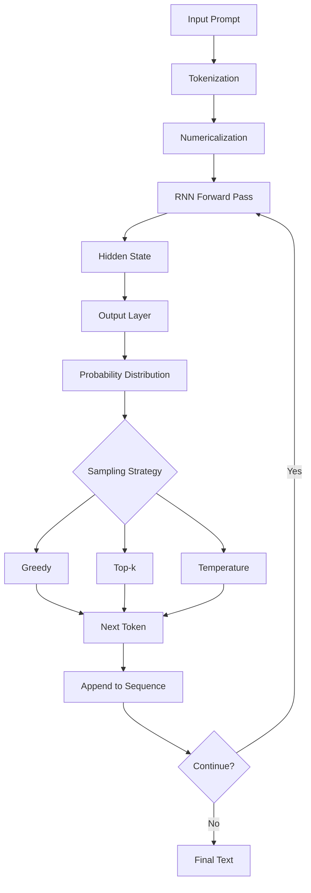

# Language Modeling with RNN  + PyTorch and WikiText Dataset

This project implements a Recurrent Neural Network (RNN) using PyTorch for language modeling based on the WikiText dataset. It includes a complete machine learning pipeline for training, evaluation, and text generation.

## Table of Contents

- [What is Recurrent Neural Networks?](#what-is-recurrent-neural-networks)
- [Machine Learning Pipeline](#machine-learning-pipeline)
- [Automatic Differentiation (Autograd)](#automatic-differentiation-autograd)
- [Setup](#setup)
- [Virtual Environment Setup](#virtual-environment-setup)
- [Dataset](#dataset)
- [Project Structure](#project-structure)
- [Usage](#usage)
- [Text Generation](#text-generation)
- [API Usage](#api-usage)
- [cURL Test Cases](#curl-test-cases)
- [Pipeline and Algorithms](#pipeline-and-algorithms)
- [References](#references)

## What is Recurrent Neural Networks?

Recurrent Neural Networks (RNNs) are a class of neural networks designed to work with sequential data. Unlike traditional feedforward networks, RNNs have memory - they can remember information from previous steps in a sequence.

### Key Features:
- **Memory**: RNNs maintain hidden states that carry information from previous time steps
- **Sequential Processing**: Process data one element at a time, maintaining context
- **Parameter Sharing**: Same parameters are used across all time steps
- **Variable Length Input**: Can handle sequences of different lengths

### Types of RNNs:
1. **Vanilla RNN**: Basic recurrent unit (suffers from vanishing gradient problem)
2. **LSTM (Long Short-Term Memory)**: Addresses vanishing gradient with gating mechanisms
3. **GRU (Gated Recurrent Unit)**: Simplified version of LSTM with fewer parameters

### Applications:
- Language Modeling
- Machine Translation
- Text Generation
- Speech Recognition
- Time Series Prediction

## Machine Learning Pipeline

A machine learning pipeline for RNN is a series of data processing steps that transform raw data into a trained model.

### 1. Data Collection
- Download WikiText dataset from HuggingFace
- Text preprocessing and cleaning

### 2. Data Preprocessing
- **Tokenization**: Convert text into tokens (words/subwords)
- **Vocabulary Building**: Create token-to-index mappings
- **Numericalization**: Convert tokens to numerical sequences
- **Sequence Preparation**: Create input-target pairs for training

### 3. Model Definition
- **Embedding Layer**: Convert token indices to dense vectors
- **RNN Layer**: Process sequences (LSTM/GRU/Vanilla RNN)
- **Output Layer**: Map hidden states to vocabulary probabilities

### 4. Training
- **Loss Function**: CrossEntropyLoss for next-token prediction
- **Optimization**: Adam/SGD optimizer with learning rate scheduling
- **Batching**: Efficient batch processing with DataLoader
- **Validation**: Monitor performance on validation set

### 5. Evaluation
- **Perplexity**: Standard metric for language models
- **Loss Tracking**: Monitor training and validation loss
- **Text Generation**: Qualitative evaluation through sample generation

### 6. Deployment
- **Model Serialization**: Save trained model weights
- **API Creation**: RESTful API for text generation
- **Inference Pipeline**: Efficient text generation service

## Automatic Differentiation (Autograd)

PyTorch's autograd package provides automatic differentiation for all operations on Tensors. This is important for training neural networks as it automates the computation of backward passes.

### How Autograd Works?

1. **Computational Graph**: During the forward pass, PyTorch builds a dynamic computational graph
2. **Nodes and Edges**: Tensors are nodes, operations are edges
3. **Gradient Computation**: Backpropagation through the graph computes gradients automatically

### Concepts

```python
import torch

# Create tensors with gradient tracking
x = torch.randn(3, requires_grad=True)
y = torch.randn(3, requires_grad=True)

# Forward pass builds computational graph
z = x + y
loss = z.sum()

# Backward pass computes gradients automatically
loss.backward()

# Access gradients
print(x.grad)  # Gradient of loss w.r.t. x
print(y.grad)  # Gradient of loss w.r.t. y
```

### Benefits:
- **Automatic**: No manual gradient computation needed
- **Dynamic**: Graphs are built on-the-fly, allowing for dynamic architectures
- **Efficient**: Optimized gradient computation with automatic memory management

For detailed examples, see: [PyTorch Autograd Tutorial](https://docs.pytorch.org/tutorials/beginner/pytorch_with_examples.html)

## Jupyter Notebook Setup

### Running Jupyter Notebook Locally (Recommended)

#### 1. Install Jupyter in Virtual Environment

```bash
# Activate virtual environment
source .venv/bin/activate

# Install Jupyter and related packages
pip install jupyter notebook jupyterlab ipykernel

# Install additional Jupyter extensions
pip install jupyter-contrib-nbextensions
pip install jupyter-nbextensions-configurator

# Enable nbextensions
jupyter contrib nbextension install --user
jupyter nbextensions_configurator enable --user

# Register virtual environment as Jupyter kernel
python -m ipykernel install --user --name=rnn_env --display-name="RNN Environment"
```

#### 2. Launch Jupyter Notebook

```bash
# Navigate to project directory
cd "/path/to/RNN/project"

# Activate virtual environment
source .venv/bin/activate

# Start Jupyter Notebook server
jupyter notebook

# Alternative: Start JupyterLab (modern interface)
jupyter lab

# Specify port and host (optional)
jupyter notebook --port=8888 --ip=0.0.0.0 --no-browser
```

#### 3. Access Notebook

- **Automatic**: Browser should open automatically at `http://localhost:8888`
- **Manual**: Copy the URL with token from terminal output
- **Example URL**: `http://localhost:8888/?token=abc123...`

### Running Jupyter Notebook with Docker

Docker provides isolated, reproducible environments that include all system dependencies.

#### 1. Install Docker (Ubuntu/Debian)

```bash
# Update package index
sudo apt update

# Install packages for HTTPS repository access
sudo apt install apt-transport-https ca-certificates curl gnupg lsb-release

# Add Docker GPG key
curl -fsSL https://download.docker.com/linux/ubuntu/gpg | sudo gpg --dearmor -o /usr/share/keyrings/docker-archive-keyring.gpg

# Add Docker repository
echo "deb [arch=amd64 signed-by=/usr/share/keyrings/docker-archive-keyring.gpg] https://download.docker.com/linux/ubuntu $(lsb_release -cs) stable" | sudo tee /etc/apt/sources.list.d/docker.list > /dev/null

# Install Docker Engine
sudo apt update
sudo apt install docker-ce docker-ce-cli containerd.io

# Add user to docker group (to avoid sudo)
sudo usermod -aG docker $USER
newgrp docker

# Verify Docker installation
docker --version
docker run hello-world
```

#### 2. Create Dockerfile for RNN Project

Create a `Dockerfile` in the project root:

```dockerfile
# Use official PyTorch image with Jupyter
FROM pytorch/pytorch:2.0.1-cuda11.7-cudnn8-devel

# Set working directory
WORKDIR /workspace

# Install system dependencies
RUN apt-get update && apt-get install -y \
    git \
    curl \
    wget \
    vim \
    build-essential \
    && rm -rf /var/lib/apt/lists/*

# Install Jupyter and extensions
RUN pip install --no-cache-dir \
    jupyter \
    jupyterlab \
    notebook \
    ipykernel \
    jupyter-contrib-nbextensions \
    jupyter-nbextensions-configurator

# Copy requirements and install Python packages
COPY requirements.txt /workspace/
RUN pip install --no-cache-dir -r requirements.txt

# Copy project files
COPY . /workspace/

# Create Jupyter config directory
RUN mkdir -p /root/.jupyter

# Configure Jupyter
RUN jupyter notebook --generate-config && \
    echo "c.NotebookApp.ip = '0.0.0.0'" >> /root/.jupyter/jupyter_notebook_config.py && \
    echo "c.NotebookApp.port = 8888" >> /root/.jupyter/jupyter_notebook_config.py && \
    echo "c.NotebookApp.open_browser = False" >> /root/.jupyter/jupyter_notebook_config.py && \
    echo "c.NotebookApp.token = ''" >> /root/.jupyter/jupyter_notebook_config.py && \
    echo "c.NotebookApp.password = ''" >> /root/.jupyter/jupyter_notebook_config.py && \
    echo "c.NotebookApp.allow_root = True" >> /root/.jupyter/jupyter_notebook_config.py

# Expose port
EXPOSE 8888

# Default command
CMD ["jupyter", "notebook", "--allow-root"]
```

#### 3. Create Docker Compose File

Create `docker-compose.yml` for easy container management:

```yaml
version: '3.8'

services:
  jupyter:
    build: .
    ports:
      - "8888:8888"
    volumes:
      - ./notebooks:/workspace/notebooks
      - ./data:/workspace/data
      - ./checkpoints:/workspace/checkpoints
      - ./src:/workspace/src
      - ./models:/workspace/models
    environment:
      - PYTHONPATH=/workspace
    restart: unless-stopped
    command: jupyter notebook --allow-root --ip=0.0.0.0 --port=8888 --no-browser --NotebookApp.token='' --NotebookApp.password=''

  # Optional: Separate container for API
  api:
    build: .
    ports:
      - "5000:5000"
    volumes:
      - ./api:/workspace/api
      - ./src:/workspace/src
      - ./models:/workspace/models
      - ./checkpoints:/workspace/checkpoints
    environment:
      - PYTHONPATH=/workspace
    command: python api/app.py --checkpoint checkpoints/best_model.pth --host 0.0.0.0
    depends_on:
      - jupyter
```

#### 4. Build and Run Docker Containers

```bash
# Navigate to project directory
cd "/path/to/RNN/project"

# Build Docker image
docker build -t rnn-jupyter .

# Run single container
docker run -p 8888:8888 -v $(pwd):/workspace rnn-jupyter

# Alternative: Use docker-compose (recommended)
docker-compose up --build

# Run in background
docker-compose up -d

# View logs
docker-compose logs -f jupyter

# Stop containers
docker-compose down
```

#### 5. Access Docker-based Jupyter

- **URL**: `http://localhost:8888`
- **No token required** (configured for development)
- **Auto-reload**: Changes to mounted files are reflected immediately

#### 6. Docker Management Commands

```bash
# List running containers
docker ps

# Access container shell
docker exec -it <container_id> /bin/bash

# Stop all containers
docker stop $(docker ps -q)

# Remove all containers
docker rm $(docker ps -aq)

# Remove Docker images
docker rmi $(docker images -q)

# View Docker system info
docker system df

# Clean up unused Docker resources
docker system prune -a
```

### Jupyter Notebook Usage Tips

#### 1. Kernel Management

```bash
# List available kernels
jupyter kernelspec list

# Remove kernel
jupyter kernelspec remove rnn_env

# Install kernel for virtual environment
python -m ipykernel install --user --name=rnn_env
```

#### 2. Useful Jupyter Magic Commands

In notebook cells:

```python
# System commands
!pip list
!ls -la

# Load external Python file
%load src/data_preprocessing.py

# Time execution
%%time
# Your code here

# Debug mode
%pdb on

# Matplotlib inline
%matplotlib inline

# Reload modules automatically
%load_ext autoreload
%autoreload 2
```

#### 3. Notebook Best Practices

- **Use descriptive cell titles** with markdown headers
- **Keep cells focused** on single concepts
- **Clear output** before committing notebooks to git
- **Use virtual environments** to ensure reproducibility
- **Document parameters** and assumptions
- **Include visualizations** for data understanding
- **Test code incrementally** cell by cell

## Virtual Environment Setup

### Why Use Virtual Environments?

Virtual environments are essential for machine learning projects because they:
- **Isolate dependencies** to prevent conflicts between different projects
- **Ensure reproducibility** by maintaining consistent package versions
- **Allow different Python/package versions** for different projects
- **Prevent system-wide package pollution** and potential conflicts
- **Enable easy project sharing** with exact dependency specifications

### Prerequisites for Linux/Debian Systems

Before setting up the virtual environment, ensure you have the required system packages.

```bash
# Update package list
sudo apt update

# Install Python 3 and development tools
sudo apt install python3 python3-venv python3-pip python3-dev

# Install build essentials (needed for some Python packages)
sudo apt install build-essential

# Optional: Install system libraries for scientific computing
sudo apt install libblas-dev liblapack-dev libatlas-base-dev gfortran

# For GUI support (matplotlib backend)
sudo apt install python3-tk

# For Jupyter Notebook support
sudo apt install nodejs npm
```

### Creating and Managing Virtual Environment

#### 1. Create Virtual Environment

```bash
# Navigate to project directory
cd "/path/to/RNN/project"

# Create virtual environment named '.venv'
python3 -m venv .venv

# Alternative: Create with specific Python version
python3.11 -m venv .venv

# Alternative: Create with specific name
python3 -m venv my_rnn_env
```

#### 2. Activate Virtual Environment

```bash
# Linux/macOS activation
source .venv/bin/activate

# Windows activation (if using Windows)
# .venv\Scripts\activate

# Verify activation - you should see (.venv) prefix in terminal
# Example: (.venv) user@hostname:~/RNN$
```

#### 3. Verify Virtual Environment

```bash
# Check Python location (should point to .venv)
which python
# Output: /path/to/project/.venv/bin/python

# Check Python version
python --version

# Check pip location
which pip
# Output: /path/to/project/.venv/bin/pip

# List installed packages (should be minimal initially)
pip list
```

#### 4. Install Project Dependencies

```bash
# Ensure you're in activated virtual environment
# Upgrade pip to latest version
pip install --upgrade pip

# Install PyTorch (choose appropriate version)
# For CPU-only installation:
pip install torch torchvision torchaudio --index-url https://download.pytorch.org/whl/cpu

# For GPU (CUDA 11.8) installation:
pip install torch torchvision torchaudio --index-url https://download.pytorch.org/whl/cu118

# For GPU (CUDA 12.1) installation:
pip install torch torchvision torchaudio --index-url https://download.pytorch.org/whl/cu121

# Install all other project requirements
pip install -r requirements.txt

# Verify PyTorch installation
python -c "import torch; print(f'PyTorch: {torch.__version__}'); print(f'CUDA: {torch.cuda.is_available()}')"
```

#### 5. Development Workflow

```bash
# Always activate environment before working
source .venv/bin/activate

# Install new packages (if needed)
pip install package_name

# Update requirements.txt after installing new packages
pip freeze > requirements.txt

# Deactivate when done (optional - closing terminal also works)
deactivate
```

#### 6. Troubleshooting Virtual Environment

```bash
# If activation fails, check permissions
ls -la .venv/bin/activate

# If packages fail to install, try upgrading pip
pip install --upgrade pip setuptools wheel

# If CUDA issues, verify NVIDIA drivers
nvidia-smi  # (if available)

# Clear pip cache if needed
pip cache purge

# Recreate virtual environment if corrupted
rm -rf .venv
python3 -m venv .venv
source .venv/bin/activate
pip install -r requirements.txt
```

### Machine Learning Pipeline with Virtual Environment

The virtual environment is crucial for each step of our ML pipeline:

#### 1. Data Preprocessing
```bash
# Activate environment
source .venv/bin/activate

# Run data preprocessing
python src/data_preprocessing.py

# The environment ensures consistent versions of:
# - datasets library for WikiText
# - torch for tensor operations
# - transformers for tokenization
```

#### 2. Model Training
```bash
# Training with virtual environment
source .venv/bin/activate

# Train model with consistent environment
python scripts/train_model.py --model lstm --epochs 10

# Environment guarantees:
# - Same PyTorch version for reproducible results
# - Consistent random number generation
# - Same optimizer implementations
```

#### 3. Model Evaluation and Generation
```bash
# Text generation in controlled environment
source .venv/bin/activate

# Generate text with exact same model implementation
python src/generate.py --checkpoint checkpoints/best_model.pth --prompt "Hello"

# API serving with consistent dependencies
python api/app.py --checkpoint checkpoints/best_model.pth
```

#### 4. Testing and Validation
```bash
# Run tests in virtual environment
source .venv/bin/activate

# Unit tests
python -m pytest tests/

# API tests
./tests/curl_tests.sh
```

### Environment Variables and Configuration

Create a `.env` file for environment-specific settings:

```bash
# Create .env file (already ignored in .gitignore)
cat > .env << EOF
# PyTorch settings
TORCH_HOME=./torch_cache
CUDA_VISIBLE_DEVICES=0

# Dataset settings
HF_DATASETS_CACHE=./data/hf_cache
TRANSFORMERS_CACHE=./data/transformers_cache

# Logging
LOG_LEVEL=INFO

# API settings
FLASK_ENV=development
API_HOST=localhost
API_PORT=5000
EOF
```

## Dataset

### WikiText Dataset

WikiText is a collection of tokens extracted from Wikipedia articles. It's commonly used for language modeling benchmarks.

### Downloading the Dataset

We use the HuggingFace datasets library for easy access:

```python
from datasets import load_dataset

# Load WikiText-2 dataset
dataset = load_dataset("wikitext", "wikitext-2-v1")

# Available splits: train, validation, test
train_data = dataset['train']
valid_data = dataset['validation']
test_data = dataset['test']
```

### Dataset Information:
- **WikiText-2**: ~2M tokens, good for development and testing
- **WikiText-103**: ~103M tokens, used for production models
- **Format**: Raw text with article boundaries marked

### Data Preprocessing Steps:

1. **Tokenization**: Split text into tokens
```python
from torchtext.data.utils import get_tokenizer
tokenizer = get_tokenizer('basic_english')
```

2. **Vocabulary Building**: Create word-to-index mapping
```python
from torchtext.vocab import build_vocab_from_iterator
vocab = build_vocab_from_iterator(tokenized_texts)
```

3. **Numericalization**: Convert tokens to indices
```python
numericalized = [vocab[token] for token in tokens]
```

4. **DataLoader Creation**: Efficient batch processing
```python
from torch.utils.data import DataLoader
dataloader = DataLoader(dataset, batch_size=32, shuffle=True)
```

### DataLoader Benefits:
- **Batching**: Process multiple sequences simultaneously
- **Shuffling**: Randomize training order for better convergence
- **Memory Efficiency**: Load data on-demand
- **Parallel Processing**: Multi-threaded data loading

See: [PyTorch Data Tutorial](https://docs.pytorch.org/tutorials/beginner/basics/data_tutorial.html)

Dataset Card: [HuggingFace WikiText](https://huggingface.co/datasets/wikitext)

## Project Structure

```
RNN/
├── README.md
├── requirements.txt
├── .gitignore
├── data/
│   └── processed/
├── models/
│   ├── __init__.py
│   ├── rnn_model.py
│   └── transformer_model.py
├── src/
│   ├── __init__.py
│   ├── data_preprocessing.py
│   ├── dataset.py
│   ├── train.py
│   ├── evaluate.py
│   ├── generate.py
│   └── utils.py
├── api/
│   ├── __init__.py
│   ├── app.py
│   └── endpoints.py
├── tests/
│   ├── __init__.py
│   ├── test_model.py
│   ├── test_data.py
│   └── curl_tests.sh
├── scripts/
│   ├── download_data.py
│   ├── train_model.py
│   └── demo.py
├── notebooks/
│   └── exploration.ipynb
└── checkpoints/
```

## Usage

### 1. Download and Prepare Data
```bash
python scripts/download_data.py
```

### 2. Train the Model
```bash
python scripts/train_model.py --model lstm --epochs 10 --lr 0.001
```

### 3. Generate Text
```bash
python scripts/demo.py --model_path checkpoints/best_model.pth --prompt "The quick brown"
```

### 4. Start API Server
```bash
python api/app.py
```

## Text Generation

### How RNN Generates Text?

Text generation with RNNs follows these steps:

1. **Initial Context**: Provide starting text (prompt)
2. **Tokenization**: Convert prompt to token sequence
3. **Model Forward**: Pass tokens through trained RNN
4. **Next Token Prediction**: Model outputs probability distribution over vocabulary
5. **Sampling**: Select next token based on probabilities
6. **Iteration**: Append selected token and repeat process
7. **Stopping**: Continue until desired length or special token

### Generation Strategies

1. **Greedy Decoding**: Always select highest probability token
```python
next_token = torch.argmax(predictions)
```

2. **Random Sampling**: Sample from probability distribution
```python
next_token = torch.multinomial(predictions, 1)
```

3. **Top-k Sampling**: Sample from k most likely tokens
```python
top_k_probs, top_k_indices = torch.topk(predictions, k)
next_token = torch.multinomial(top_k_probs, 1)
```

4. **Temperature Sampling**: Control randomness with temperature
```python
predictions = predictions / temperature
next_token = torch.multinomial(F.softmax(predictions), 1)
```

### Example Generation Process
```
Input: "The weather today"
Step 1: Predict next token -> "is" (highest probability)
Step 2: Input becomes "The weather today is"
Step 3: Predict next token -> "sunny" 
Step 4: Continue until desired length
Output: "The weather today is sunny and warm with clear skies."
```

## API Usage

### Starting the API Server

```bash
# Activate virtual environment
source venv/bin/activate

# Start Flask development server
python api/app.py

# Server runs on http://localhost:5000
```

### API Endpoints

#### 1. Health Check
```
GET /health
```

#### 2. Generate Text
```
POST /generate
Content-Type: application/json

{
    "prompt": "The quick brown fox",
    "max_length": 50,
    "temperature": 0.8,
    "top_k": 40
}
```

#### 3. Model Info
```
GET /model/info
```

### Response Format
```json
{
    "generated_text": "The quick brown fox jumps over the lazy dog and runs through the forest.",
    "prompt": "The quick brown fox",
    "generation_time": 0.234,
    "model": "lstm",
    "parameters": {
        "max_length": 50,
        "temperature": 0.8,
        "top_k": 40
    }
}
```

## API Usage and cURL Testing

### Starting the API Server

#### 1. Prerequisites for API

```bash
# Ensure virtual environment is activated
source .venv/bin/activate

# Verify required packages are installed
pip list | grep -E "(flask|torch)"

# Check if model checkpoint exists
ls -la checkpoints/best_model.pth

# If no trained model exists, train one first:
python scripts/train_model.py --epochs 5 --model lstm
```

#### 2. Start the API Server

```bash
# Basic server startup
python api/app.py --checkpoint checkpoints/best_model.pth

# Server with custom host and port
python api/app.py --checkpoint checkpoints/best_model.pth --host 0.0.0.0 --port 5000

# Server in debug mode (for development)
python api/app.py --checkpoint checkpoints/best_model.pth --debug

# Server with custom vocabulary file
python api/app.py --checkpoint checkpoints/best_model.pth --vocab data/vocab.pkl
```

The server will start and display:
```
Model initialized successfully!
Model type: lstm
Vocabulary size: 10,000
Parameters: 5,234,567

Starting server on localhost:5000
Available endpoints:
  GET  /health - Health check
  GET  /model/info - Model information
  POST /generate - Generate text
  POST /generate/multiple - Generate multiple samples
```

#### 3. Verify Server is Running

```bash
# Simple ping test
curl -X GET http://localhost:5000/health

# Expected response:
# {"status":"healthy","timestamp":"2025-08-09T10:30:00","model_loaded":true}
```

### API Endpoints Documentation

#### 1. Health Check Endpoint

**Endpoint**: `GET /health`

**Description**: Check if the API server and model are loaded properly.

```bash
curl -X GET http://localhost:5000/health
```

**Response**:
```json
{
  "status": "healthy",
  "timestamp": "2025-08-09T10:30:00.123456",
  "model_loaded": true
}
```

#### 2. Model Information Endpoint

**Endpoint**: `GET /model/info`

**Description**: Get detailed information about the loaded model.

```bash
curl -X GET http://localhost:5000/model/info
```

**Response**:
```json
{
  "model_type": "lstm",
  "vocab_size": 10000,
  "parameters": 5234567,
  "embed_size": 256,
  "hidden_size": 512,
  "num_layers": 2,
  "loaded_at": "2025-08-09T10:25:00.123456"
}
```

#### 3. Text Generation Endpoint

**Endpoint**: `POST /generate`

**Description**: Generate text based on a prompt with configurable parameters.

**Parameters**:
- `prompt` (string): Starting text for generation
- `max_length` (integer, 1-500): Maximum tokens to generate
- `temperature` (float, 0.1-2.0): Controls randomness (higher = more creative)
- `top_k` (integer, optional): Limit sampling to top-k most likely tokens

```bash
curl -X POST http://localhost:5000/generate \
  -H "Content-Type: application/json" \
  -d '{
    "prompt": "The quick brown fox",
    "max_length": 50,
    "temperature": 0.8,
    "top_k": 40
  }'
```

**Response**:
```json
{
  "generated_text": "The quick brown fox jumps over the lazy dog and runs through the forest under the moonlight.",
  "prompt": "The quick brown fox",
  "generation_time": 0.234,
  "model": "lstm",
  "parameters": {
    "max_length": 50,
    "temperature": 0.8,
    "top_k": 40
  },
  "timestamp": "2025-08-09T10:30:00.123456"
}
```

#### 4. Multiple Samples Endpoint

**Endpoint**: `POST /generate/multiple`

**Description**: Generate multiple text samples from the same prompt.

```bash
curl -X POST http://localhost:5000/generate/multiple \
  -H "Content-Type: application/json" \
  -d '{
    "prompt": "Once upon a time",
    "max_length": 30,
    "num_samples": 3,
    "temperature": 0.9
  }'
```

**Response**:
```json
{
  "samples": [
    "Once upon a time there was a brave knight who fought dragons.",
    "Once upon a time in a magical kingdom far far away lived a princess.",
    "Once upon a time the world was covered in endless forests and mysteries."
  ],
  "prompt": "Once upon a time",
  "num_samples": 3,
  "generation_time": 0.567,
  "model": "lstm",
  "parameters": {
    "max_length": 30,
    "temperature": 0.9,
    "top_k": null
  },
  "timestamp": "2025-08-09T10:30:00.123456"
}
```

### cURL Test Cases

#### 1. Automated Test Suite

Run the complete test suite:

```bash
# Make sure the script is executable
chmod +x tests/curl_tests.sh

# Run all tests
./tests/curl_tests.sh
```

#### 2. Individual Test Cases

**Test 1: Basic Text Generation**
```bash
curl -X POST http://localhost:5000/generate \
  -H "Content-Type: application/json" \
  -d '{
    "prompt": "Once upon a time",
    "max_length": 30
  }'
```

**Test 2: Creative Writing with High Temperature**
```bash
curl -X POST http://localhost:5000/generate \
  -H "Content-Type: application/json" \
  -d '{
    "prompt": "The future of artificial intelligence",
    "max_length": 50,
    "temperature": 1.2
  }'
```

**Test 3: Conservative Generation with Low Temperature**
```bash
curl -X POST http://localhost:5000/generate \
  -H "Content-Type: application/json" \
  -d '{
    "prompt": "Machine learning algorithms",
    "max_length": 40,
    "temperature": 0.5,
    "top_k": 10
  }'
```

**Test 4: Top-k Sampling**
```bash
curl -X POST http://localhost:5000/generate \
  -H "Content-Type: application/json" \
  -d '{
    "prompt": "In a world where technology",
    "max_length": 40,
    "temperature": 0.9,
    "top_k": 20
  }'
```

**Test 5: Multiple Samples Generation**
```bash
curl -X POST http://localhost:5000/generate/multiple \
  -H "Content-Type: application/json" \
  -d '{
    "prompt": "The weather today is",
    "max_length": 25,
    "num_samples": 5,
    "temperature": 0.8
  }'
```

**Test 6: Empty Prompt Handling**
```bash
curl -X POST http://localhost:5000/generate \
  -H "Content-Type: application/json" \
  -d '{
    "prompt": "",
    "max_length": 20
  }'
```

**Test 7: Long Text Generation**
```bash
curl -X POST http://localhost:5000/generate \
  -H "Content-Type: application/json" \
  -d '{
    "prompt": "Deep learning neural networks",
    "max_length": 100,
    "temperature": 0.7,
    "top_k": 50
  }'
```

**Test 8: Scientific Text Generation**
```bash
curl -X POST http://localhost:5000/generate \
  -H "Content-Type: application/json" \
  -d '{
    "prompt": "Quantum computing represents",
    "max_length": 60,
    "temperature": 0.6,
    "top_k": 30
  }'
```

**Test 9: Story Generation**
```bash
curl -X POST http://localhost:5000/generate \
  -H "Content-Type: application/json" \
  -d '{
    "prompt": "The old lighthouse keeper",
    "max_length": 80,
    "temperature": 1.0,
    "top_k": 60
  }'
```

**Test 10: Technical Documentation Style**
```bash
curl -X POST http://localhost:5000/generate \
  -H "Content-Type: application/json" \
  -d '{
    "prompt": "To install the software, first",
    "max_length": 45,
    "temperature": 0.4,
    "top_k": 15
  }'
```

#### 3. Error Testing

**Test Invalid Parameters:**
```bash
# Test invalid max_length
curl -X POST http://localhost:5000/generate \
  -H "Content-Type: application/json" \
  -d '{"prompt": "test", "max_length": -5}'

# Test invalid temperature
curl -X POST http://localhost:5000/generate \
  -H "Content-Type: application/json" \
  -d '{"prompt": "test", "temperature": 5.0}'

# Test invalid JSON
curl -X POST http://localhost:5000/generate \
  -H "Content-Type: application/json" \
  -d 'invalid json'

# Test missing content-type
curl -X POST http://localhost:5000/generate \
  -d '{"prompt": "test"}'
```

#### 4. Performance Testing

**Response Time Testing:**
```bash
# Single request timing
time curl -X POST http://localhost:5000/generate \
  -H "Content-Type: application/json" \
  -d '{"prompt": "Performance test", "max_length": 30}' \
  -w "\nTime: %{time_total}s\n"

# Multiple concurrent requests (requires GNU parallel)
echo '{"prompt": "Concurrent test", "max_length": 20}' | \
parallel -j 5 -N0 curl -X POST http://localhost:5000/generate \
  -H "Content-Type: application/json" -d @-
```

#### 5. Custom Test Scripts

Create custom test scripts for specific use cases:

**File: `test_creative_writing.sh`**
```bash
#!/bin/bash

prompts=(
  "In the year 2050"
  "The last human on Earth"
  "A robot's first day at school"
  "Time travel is finally invented"
  "The secret ingredient was"
)

for prompt in "${prompts[@]}"; do
  echo "Testing prompt: $prompt"
  curl -s -X POST http://localhost:5000/generate \
    -H "Content-Type: application/json" \
    -d "{\"prompt\": \"$prompt\", \"max_length\": 40, \"temperature\": 1.1}" \
    | jq -r '.generated_text'
  echo "---"
done
```

### Troubleshooting API Issues

#### 1. Server Won't Start

```bash
# Check if port is already in use
sudo netstat -tlnp | grep :5000

# Kill process using port 5000
sudo kill $(sudo lsof -t -i:5000)

# Check model file exists
ls -la checkpoints/best_model.pth

# Verify virtual environment
source .venv/bin/activate
python -c "import torch, flask; print('Dependencies OK')"
```

#### 2. API Returns Errors

```bash
# Check server logs for detailed error messages
python api/app.py --checkpoint checkpoints/best_model.pth --debug

# Test with minimal request
curl -X GET http://localhost:5000/health

# Verify model loading
curl -X GET http://localhost:5000/model/info
```

#### 3. Slow Response Times

```bash
# Check system resources
htop  # CPU usage
nvidia-smi  # GPU usage (if available)
free -h  # Memory usage

# Use smaller models for faster inference
python scripts/train_model.py --model lstm --hidden-size 256 --embed-size 128
```

#### 4. Memory Issues

```bash
# Reduce batch size and model size
# Use CPU instead of GPU
export CUDA_VISIBLE_DEVICES=""

# Monitor memory usage
python api/app.py --checkpoint checkpoints/best_model.pth &
watch -n 1 'ps aux | grep python'
```

### Integration Testing

Test the complete pipeline from training to API:

```bash
#!/bin/bash
# Complete integration test

echo "1. Training small model..."
python scripts/train_model.py --epochs 2 --batch-size 8 --hidden-size 128

echo "2. Starting API server..."
python api/app.py --checkpoint checkpoints/best_model.pth &
API_PID=$!

echo "3. Waiting for server to start..."
sleep 10

echo "4. Running API tests..."
./tests/curl_tests.sh

echo "5. Stopping API server..."
kill $API_PID

echo "Integration test completed!"
```

## Pipeline and Algorithms

### Text Generation Pipeline



### RNN Training Algorithm

```python
# Simplified training loop
for epoch in range(num_epochs):
    model.train()
    total_loss = 0
    
    for batch in dataloader:
        # 1. Forward pass
        optimizer.zero_grad()
        
        # 2. Initialize hidden state
        hidden = model.init_hidden(batch_size)
        
        # 3. Process sequence
        output, hidden = model(input_sequence, hidden)
        
        # 4. Compute loss
        loss = criterion(output.view(-1, vocab_size), target.view(-1))
        
        # 5. Backward pass (autograd)
        loss.backward()
        
        # 6. Gradient clipping (prevent exploding gradients)
        torch.nn.utils.clip_grad_norm_(model.parameters(), max_norm=5.0)
        
        # 7. Update parameters
        optimizer.step()
        
        total_loss += loss.item()
    
    # 8. Validation
    val_loss = evaluate_model(model, val_dataloader)
    print(f'Epoch {epoch}: Train Loss = {total_loss:.4f}, Val Loss = {val_loss:.4f}')
```

### Generation Algorithm

```python
def generate_text(model, prompt, max_length=50, temperature=1.0, top_k=None):
    model.eval()
    tokens = tokenize(prompt)
    generated = tokens.copy()
    
    with torch.no_grad():
        hidden = model.init_hidden(1)
        
        # Process prompt
        for token in tokens:
            input_tensor = torch.tensor([[token]])
            output, hidden = model(input_tensor, hidden)
        
        # Generate new tokens
        for _ in range(max_length):
            # Get next token probabilities
            logits = output[0, -1, :] / temperature
            
            # Apply top-k filtering if specified
            if top_k is not None:
                top_k_logits, top_k_indices = torch.topk(logits, top_k)
                logits = torch.full_like(logits, float('-inf'))
                logits[top_k_indices] = top_k_logits
            
            # Sample next token
            probs = F.softmax(logits, dim=-1)
            next_token = torch.multinomial(probs, 1).item()
            
            generated.append(next_token)
            
            # Prepare for next iteration
            input_tensor = torch.tensor([[next_token]])
            output, hidden = model(input_tensor, hidden)
            
            # Stop if end token generated
            if next_token == vocab['<eos>']:
                break
    
    return detokenize(generated)
```

### Recurrent Neural Networks Model

The RNN model architecture consists of:

1. **Embedding Layer**: `nn.Embedding(vocab_size, embed_size)`
2. **RNN Layer**: `nn.LSTM(embed_size, hidden_size, num_layers)`
3. **Output Layer**: `nn.Linear(hidden_size, vocab_size)`
4. **Dropout**: `nn.Dropout(dropout_rate)` for regularization

```python
class RNNLanguageModel(nn.Module):
    def __init__(self, vocab_size, embed_size, hidden_size, num_layers, dropout):
        super().__init__()
        self.embedding = nn.Embedding(vocab_size, embed_size)
        self.rnn = nn.LSTM(embed_size, hidden_size, num_layers, 
                          dropout=dropout, batch_first=True)
        self.dropout = nn.Dropout(dropout)
        self.output = nn.Linear(hidden_size, vocab_size)
        
    def forward(self, x, hidden=None):
        embedded = self.dropout(self.embedding(x))
        rnn_out, hidden = self.rnn(embedded, hidden)
        output = self.output(self.dropout(rnn_out))
        return output, hidden
```

## References

- [PyTorch Autograd and Tensors Tutorial](https://docs.pytorch.org/tutorials/beginner/pytorch_with_examples.html)
- [PyTorch RNN Examples](https://github.com/pytorch/examples/tree/main/word_language_model)
- [WikiText Dataset - HuggingFace](https://huggingface.co/datasets/wikitext)
- [WikiText Dataset - mindchain](https://huggingface.co/datasets/mindchain/wikitext2)
- [PyTorch Data Tutorial](https://docs.pytorch.org/tutorials/beginner/basics/data_tutorial.html)
- [Language Modeling from Scratch](https://colab.research.google.com/github/huggingface/notebooks/blob/main/examples/language_modeling_from_scratch-tf.ipynb)
- [PyTorch TorchTune WikiText](https://docs.pytorch.org/torchtune/0.2/generated/torchtune.datasets.wikitext_dataset.html)

---
