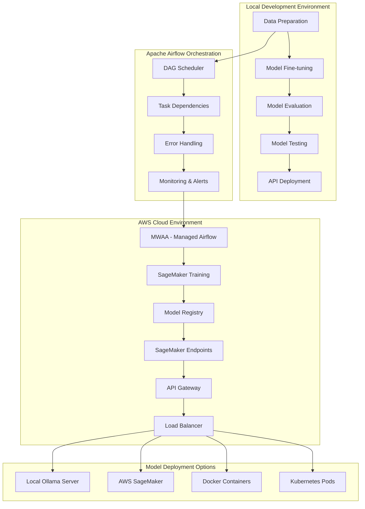

# Apache Airflow Pipeline for BERT Fine-tuning and Deployment

This project includes step-by-step tutorial how to setup Apache Airflow pipelines to fine-tune pre-trained Transformer models like BERT for text classification using PyTorch and the Hugging Face transformers library. The pipeline supports local development environments and cloud deployment on Amazon AWS with automated model training, evaluation, and deployment workflows.

## Apache Airflow ML Pipeline

### Pipeline Overview Diagram



### Benefits of Using Apache Airflow for ML Pipelines

1. **Automated workflows**: Schedule and orchestrate complex ML pipelines
2. **Monitoring & logging**: Track pipeline execution and performance
3. **Retry logic**: Automatic retries for failed tasks
4. **Scalability**: Scale from local development to cloud production
5. **Dependency management**: Handle complex task dependencies
6. **Web UI**: Visual pipeline monitoring and management
7. **Alerting**: Email/Slack notifications for pipeline status
8. **Resource management**: Optimize compute resources and costs

## How does the BERT model work for text classification?

### **Text Classification process**
1. **Input Tokenization**: Text is converted to token IDs using WordPiece tokenization
2. **Embedding**: Tokens are converted to dense vector representations
3. **Transformer Layers**: 12 layers (BERT-base) or 24 layers (BERT-large) process the embeddings
4. **[CLS] Token**: Special classification token whose final representation is used for classification
5. **Classification Head**: A simple linear layer maps BERT output to class probabilities

### 4. **Fine-tuning process**
Fine-tuning adapts the pre-trained BERT model to specific classification tasks:
- **Transfer Learning**: Start with pre-trained BERT weights
- **Task specific layer**: Add a classification head for your specific number of classes
- **End-to-end training**: Update all model parameters using labeled data from your domain
- **Lower Learning Rate**: Use smaller learning rates (2e-5) to preserve pre-trained knowledge

## How model fine-tuning works?

### Supervised learning approach
Text classification uses **supervised learning**:
1. **Labeled dataset**: Collection of texts with their corresponding category labels
2. **Training**: Algorithm learns patterns from labeled examples
3. **Validation**: Model performance is evaluated on unseen data
4. **Inference**: Trained model predicts categories for new text

### Pre-trained model
- **Training time**: Start with language understanding already learned
- **Performance**: Leverages patterns from massive text corpora
- **Less data required**: Fine-tuning needs fewer labeled examples than training from scratch
- **Hugging Face Hub**: Easy access to pre-trained models

## Dataset management andconfiguration

### Supported Datasets

This project provides dataset management with support for multiple data sources:

#### **Built-in Datasets**
- **IMDB Movie Reviews**: Sentiment analysis with 50K movie reviews
- **Amazon Product Reviews**: Multi-class sentiment (1-5 stars)
- **Yelp Business Reviews**: Restaurant and business sentiment analysis
- **AG News**: News article classification (World, Sports, Business, Sci/Tech)
- **Financial News**: Financial sentiment analysis (positive, negative, neutral)

#### **Custom Datasets**
- **CSV Files**: Load your own datasets with flexible column mapping
- **Configurable Preprocessing**: Customizable text cleaning and filtering
- **Multiple Formats**: Support for various text classification formats

### Dataset configuration

All dataset configurations are managed through `config/dataset_config.json`:

```json
{
  "datasets": {
    "custom": {
      "name": "Custom Dataset",
      "path": "data/custom_dataset.csv",
      "type": "classification",
      "text_column": "text",
      "label_column": "label",
      "max_samples": -1,
      "preprocessing": {
        "remove_html": false,
        "lowercase": true,
        "min_length": 5
      }
    },
    "imdb": {
      "name": "IMDB Movie Reviews",
      "url": "https://ai.stanford.edu/~amaas/data/sentiment/aclImdb_v1.tar.gz",
      "type": "sentiment",
      "classes": ["negative", "positive"],
      "text_column": "review",
      "label_column": "sentiment",
      "max_samples": 25000,
      "preprocessing": {
        "remove_html": true,
        "lowercase": true,
        "min_length": 50,
        "max_length": 5000
      }
    }
  }
}
```

### **🔧 Dataset fetching and management**

#### **Automatic dataset downloading**
```bash
# The system automatically downloads and caches datasets
python src/dataset_manager.py --dataset imdb --download
```

#### **Custom dataset setup**
1. **Create CSV file** with text and label columns:
```csv
text,label
"Great product, highly recommend!",1
"Poor quality, disappointed.",0
```

2. **Update configuration** in `config/dataset_config.json`:
```json
{
  "datasets": {
    "my_dataset": {
      "name": "My Custom Dataset",
      "path": "data/my_dataset.csv",
      "text_column": "review_text",
      "label_column": "rating",
      "max_samples": 10000,
      "preprocessing": {
        "lowercase": true,
        "min_length": 10,
        "remove_urls": true
      }
    }
  }
}
```

3. **Use dataset in supervised model training**:
```bash
python src/enhanced_bert_training.py --dataset my_dataset
```

### **Dataset size limitation**

#### **Memory-efficient processing**
```python
# Limit samples during loading
manager = DatasetManager()
df, config = manager.load_dataset("imdb", limit_samples=5000)
```

#### **Configuration-based limits**
```json
{
  "datasets": {
    "large_dataset": {
      "max_samples": 50000,  # Limit to 50K samples
      "preprocessing": {
        "min_length": 20,     # Filter short texts
        "max_length": 1000    # Filter very long texts
      }
    }
  }
}
```

#### **Runtime parameters**
```bash
# Limit samples via command line
python src/enhanced_bert_training.py --dataset imdb --limit_samples 1000

# Or via Airflow DAG configuration
{
  "dataset_name": "imdb",
  "limit_samples": 5000,
  "auto_balance": true
}
```

### **Data wrangling and exploration**

#### **Data analysis**
```python
from src.data_wrangling import DataExplorer

# Load and explore dataset
explorer = DataExplorer(df, 'text', 'label')
results = explorer.full_analysis()

# Key insights provided:
# - Basic statistics (samples, classes, duplicates)
# - Text quality metrics (readability, length distribution)
# - Vocabulary analysis (word frequency, diversity)
# - Label distribution and class balance
# - Data quality issues detection
```

#### **Automated data cleaning**
```python
from src.data_wrangling import DataCleaner

# Initialize cleaner
cleaner = DataCleaner(df, 'text', 'label')

# Apply cleaning operations
df = cleaner.remove_missing_data()
df = cleaner.clean_text(
    remove_html=True,
    remove_urls=True,
    remove_emails=True,
    normalize_whitespace=True
)
df = cleaner.remove_duplicates()
df = cleaner.filter_by_length(min_length=10, max_length=1000)

# Handle class imbalance
df = cleaner.balance_classes(method='undersample')  # or 'oversample'
```

#### **Data quality assessment (QA)**
The system automatically detects and reports:
- **Missing data**: Null values, empty strings
- **Duplicates**: Exact and near-duplicate texts
- **Outliers**: Unusually short/long texts
- **Inconsistencies**: Mixed case labels, formatting issues
- **Class imbalance**: Distribution of labels across categories

### **⚙️ Apache Airflow Integration**

#### **Extended DAG configuration**
```python
# Configure dataset in Airflow DAG run
dag_config = {
    "dataset_name": "custom",
    "config_file": "config/dataset_config.json",
    "limit_samples": 1000,
    "auto_balance": true,
    "min_accuracy": 0.75,
    "model_output_dir": "models/my_bert_model"
}
```

#### **Dataset pipeline tasks**
1. **Dataset Validation**: Verify configuration and data availability
2. **Data Loading**: Fetch and load dataset with exploration
3. **Data Cleaning**: Apply preprocessing and quality improvements
4. **Data Preparation**: Create train/validation/test splits
5. **Model Training**: Train BERT with processed data
6. **Model Validation**: Test and validate trained model
7. **Reporting**: Generate comprehensive pipeline report

### **Data exploration results**

The system provides comprehensive analysis including:

#### **Basic Statistics**
- Total samples and unique texts
- Missing and duplicate data counts
- Class distribution and balance metrics
- Text length and word count statistics

#### **Text Quality Metrics**
- Reading complexity scores (Flesch-Kincaid)
- Character distribution analysis
- Content pattern detection (URLs, emails, phone numbers)
- Vocabulary diversity and word frequency

#### **Recommendations**
- Suggested preprocessing steps
- Class balancing recommendations
- Text length optimization suggestions
- Dataset size recommendations for training

## Project structure and Apache Airflow integration

```
├── src/                            # Core source code
│   ├── bert_fine_tuning.py         # Original fine-tuning implementation
│   ├── minimal_bert.py             # Simplified BERT model
│   ├── test_environment.py         # Environment testing
│   ├── dataset_manager.py          # Dataset loading and management
│   ├── data_wrangling.py           # Data exploration and cleaning
│   └── enhanced_bert_training.py   # Enhanced training with dataset management
├── config/                         # Configuration files
│   └── dataset_config.json         # Dataset configuration
├── data/                           # Data storage
│   ├── raw/                        # Raw downloaded datasets
│   ├── processed/                  # Processed train/val/test splits
│   ├── cache/                      # Downloaded dataset cache
│   └── custom_dataset.csv          # Sample custom dataset
├── tests/                          # Testing suite
│   ├── test_setup.py               # Quick setup verification
│   ├── simple_test.py              # Basic functionality test
│   ├── test_model.py               # Model evaluation suite
│   └── test_api.sh                 # API endpoint tests
├── examples/                       # Documentation and examples
│   ├── examples.py                 # Usage demonstrations
│   └── project_summary.py          # Project documentation
├── dags/                           # Airflow DAG definitions
│   ├── bert_fine_tuning_dag.py     # Main ML pipeline DAG
│   ├── model_evaluation_dag.py     # Model evaluation pipeline
│   └── deployment_dag.py           # Model deployment pipeline
├── airflow/                        # Airflow configuration
│   ├── airflow.cfg                 # Airflow configuration file
│   ├── docker-compose.yaml         # Local Airflow deployment
│   └── requirements.txt            # Airflow dependencies
├── terraform/                      # AWS Infrastructure as Code
│   ├── main.tf                     # Main Terraform configuration
│   ├── mwaa.tf                     # MWAA setup
│   ├── sagemaker.tf                # SageMaker configuration
│   └── api-gateway.tf              # API Gateway setup
├── cloudformation/                 # CloudFormation templates
│   ├── mwaa-stack.yaml             # MWAA CloudFormation
│   └── sagemaker-stack.yaml        # SageMaker CloudFormation
├── scripts/                        # Deployment and utility scripts
│   └── install-ollama.sh           # Ollama installation script
├── api.py                          # FastAPI backend server
├── deploy.sh                       # Automated deployment script
├── docker-compose.yml              # Application deployment
├── docker-compose-ollama.yml       # Ollama integration
├── Dockerfile                      # Container definition
└── README.md                       # This documentation
```

## � **Environment setup requirements**

### **Why Python Virtual Environments are essential?**

 **Dependency isolation**: Apache Airflow and BERT fine-tuning have specific version requirements  
 **System stability**: Prevents conflicts with system Python packages  
 **Reproducibility**: Easy to recreate environments on different machines  
 **Version management**: Different projects can use different package versions  

### **Automated environment setup**

Use our automated setup script for easy installation:

```bash
# For Python venv (recommended for simplicity)
./setup_environment.sh venv

# For Conda (recommended for complex ML environments)
./setup_environment.sh conda
```

The script automatically:
- Detects your system (Linux/GPU support)
- Creates and activates virtual environment
- Installs all required dependencies
- Sets up Apache Airflow
- Verifies installation
- Creates activation scripts

### ** Manual setup options**

#### **Option 1: Python venv (Recommended)**

```bash
# 1. Create virtual environment
python3 -m venv bert_airflow_env

# 2. Activate environment
source bert_airflow_env/bin/activate

# 3. Upgrade pip
pip install --upgrade pip

# 4. Install core dependencies
pip install -r requirements.txt

# 5. Install PyTorch (GPU support)
pip install torch torchvision torchaudio --index-url https://download.pytorch.org/whl/cu118

# 6. Install Apache Airflow
pip install apache-airflow==2.7.2
pip install apache-airflow-providers-docker==3.7.2

# 7. Verify installation
python tests/test_setup.py
```

#### **Option 2: Conda environment**

```bash
# 1. Create conda environment
conda create -n bert_airflow python=3.9

# 2. Activate environment
conda activate bert_airflow

# 3. Install core packages via conda
conda install pandas numpy scikit-learn matplotlib seaborn

# 4. Install PyTorch with CUDA support
conda install pytorch torchvision torchaudio pytorch-cuda=11.8 -c pytorch -c nvidia

# 5. Install remaining packages via pip
pip install transformers apache-airflow==2.7.2 fastapi uvicorn

# 6. Verify installation
python tests/test_setup.py
```

### **🔧 System requirements**

#### **Minimum requirements**
- **OS**: Linux (Ubuntu 18.04+, Debian 10+, CentOS 7+)
- **Python**: 3.8+ (3.9 recommended)
- **RAM**: 8GB (16GB recommended for large datasets)
- **Storage**: 10GB free space (for models and datasets)

#### **Recommended for GPU training**
- **GPU**: NVIDIA GPU with CUDA 11.8+ support
- **VRAM**: 8GB+ (for BERT-base), 16GB+ (for BERT-large)
- **CUDA**: 11.8 or 12.0
- **cuDNN**: 8.0+

#### **Dependencies**
```bash
# Check Python version
python3 --version  # Should be 3.8+

# Check if GPU is available
nvidia-smi  # Should show GPU information

# Check CUDA version
nvcc --version  # Should show CUDA 11.8+
```

### **⚙️ Environment activation**

After setup, always activate your environment before working:

```bash
# For venv
source bert_airflow_env/bin/activate

# For conda
conda activate bert_airflow

# Or use our convenience script
source activate_env.sh
```

### **Verify installation**

Test your environment setup:

```bash
# Basic functionality test
python tests/test_setup.py

# Test dataset manager
python -c "from src.dataset_manager import DatasetManager; print('✅ Works!')"

# Test BERT loading
python -c "from transformers import BertTokenizer; print('✅ BERT works!')"

# Test Airflow
airflow version

# GPU test (if applicable)
python -c "import torch; print(f'GPU available: {torch.cuda.is_available()}')"
```

## Quick Start - Dataset and training

### **Step 1: Setup environment**
```bash
# Automated setup
./setup_environment.sh venv

# Activate environment
source activate_env.sh

# Verify installation
python tests/test_setup.py
```

### **Step 2: Explore available datasets**
```bash
# List all configured datasets
python src/dataset_manager.py

# Explore a specific dataset
python -c "
from src.dataset_manager import DatasetManager
manager = DatasetManager()
print('Available datasets:', manager.config.list_available_datasets())
"
```

### **Step 3: Run data exploration**
```bash
# Comprehensive data analysis
python src/data_wrangling.py

# Or explore specific dataset
python -c "
from src.dataset_manager import DatasetManager
from src.data_wrangling import DataExplorer
manager = DatasetManager()
df, config = manager.load_dataset('custom')
explorer = DataExplorer(df, config['text_column'], config['label_column'])
results = explorer.full_analysis()
"
```

### **Step 4: Train BERT model**
```bash
# Basic training with default dataset
python src/enhanced_bert_training.py

# Training with specific dataset and parameters
python src/enhanced_bert_training.py \
    --dataset imdb \
    --limit_samples 5000 \
    --output_dir models/my_imdb_model

# Training with custom dataset
python src/enhanced_bert_training.py \
    --dataset custom \
    --config config/dataset_config.json
```

### **Step 5: Using custom datasets**

#### **Create custom dataset**
```csv
# data/my_reviews.csv
text,sentiment
"Amazing product, love it!",positive
"Poor quality, disappointed.",negative
"Good value for money.",positive
"Terrible customer service.",negative
```

#### **Configure dataset**
```json
# config/dataset_config.json
{
  "datasets": {
    "my_reviews": {
      "name": "My Product Reviews",
      "path": "data/my_reviews.csv",
      "text_column": "text",
      "label_column": "sentiment",
      "preprocessing": {
        "lowercase": true,
        "remove_html": true,
        "min_length": 10
      }
    }
  }
}
```

#### **Train with custom dataset**
```bash
python src/enhanced_bert_training.py --dataset my_reviews
```

### **Step 6: Apache Airflow pipeline**
```bash
# Start Airflow (Docker)
docker-compose up -d

# Access Airflow UI: http://localhost:8080
# Username: airflow, Password: airflow

# Run DAG with custom configuration
{
  "dataset_name": "custom",
  "limit_samples": 1000,
  "auto_balance": true,
  "min_accuracy": 0.8
}
```

## Apache Airflow setup - Local development

### 1. Install Apache Airflow (Local environment)

#### Option A: Using Docker Compose (Recommended)

```bash
# Create airflow directory
mkdir -p ./airflow/dags ./airflow/logs ./airflow/plugins ./airflow/config

# Set Airflow user ID
echo -e "AIRFLOW_UID=$(id -u)" > .env

# Download docker-compose.yaml for Airflow
curl -LfO 'https://airflow.apache.org/docs/apache-airflow/2.7.2/docker-compose.yaml'

# Initialize Airflow database
docker-compose up airflow-init

# Start Airflow services
docker-compose up -d
```

#### Option B: Local installation (Python)

```bash
# Create virtual environment for Airflow
python3 -m venv airflow_env
source airflow_env/bin/activate

# Set Airflow home directory
export AIRFLOW_HOME=~/airflow

# Install Airflow with constraints
AIRFLOW_VERSION=2.7.2
PYTHON_VERSION="$(python --version | cut -d " " -f 2 | cut -d "." -f 1-2)"
CONSTRAINT_URL="https://raw.githubusercontent.com/apache/airflow/constraints-${AIRFLOW_VERSION}/constraints-${PYTHON_VERSION}.txt"

pip install "apache-airflow==${AIRFLOW_VERSION}" --constraint "${CONSTRAINT_URL}"

# Install additional providers
pip install apache-airflow-providers-amazon
pip install apache-airflow-providers-docker
pip install apache-airflow-providers-kubernetes

# Initialize Airflow database
airflow db init

# Create admin user
airflow users create \
    --username admin \
    --firstname Admin \
    --lastname User \
    --role Admin \
    --email admin@example.com \
    --password admin

# Start Airflow webserver and scheduler
airflow webserver --port 8080 &
airflow scheduler &
```

### 2. Configure Airflow for ML workflows

#### Airflow configuration (`airflow.cfg`)

```ini
[core]
# Directory where DAGs are stored
dags_folder = /opt/airflow/dags

# Load examples
load_examples = False

# Parallelism settings
parallelism = 32
dag_concurrency = 16
max_active_runs_per_dag = 16

[webserver]
# Web UI settings
expose_config = True
authenticate = True
auth_backend = airflow.auth.backends.session

[scheduler]
# Scheduler settings
dag_dir_list_interval = 300
catchup_by_default = False

[celery]
# For distributed task execution
worker_concurrency = 16

[kubernetes]
# Kubernetes configuration for scaling
namespace = default
worker_container_repository = apache/airflow
worker_container_tag = 2.7.2
```

### 3. Create BERT fine-tuning DAG

Create `dags/bert_fine_tuning_dag.py`:

```python
from datetime import datetime, timedelta
from airflow import DAG
from airflow.operators.python import PythonOperator
from airflow.operators.bash import BashOperator
from airflow.providers.docker.operators.docker import DockerOperator
from airflow.providers.amazon.aws.operators.sagemaker import SageMakerTrainingOperator
import os

# Default arguments
default_args = {
    'owner': 'ml-team',
    'depends_on_past': False,
    'start_date': datetime(2024, 1, 1),
    'email_on_failure': True,
    'email_on_retry': False,
    'retries': 2,
    'retry_delay': timedelta(minutes=5),
    'email': ['admin@company.com']
}

# Create DAG
dag = DAG(
    'bert_fine_tuning_pipeline',
    default_args=default_args,
    description='BERT Fine-tuning ML Pipeline',
    schedule_interval='@daily',
    catchup=False,
    max_active_runs=1,
    tags=['ml', 'bert', 'nlp', 'fine-tuning']
)

# Task 1: Data Preparation
def prepare_data(**context):
    """Prepare training data for BERT fine-tuning"""
    import pandas as pd
    import numpy as np
    from sklearn.model_selection import train_test_split
    
    # Load and preprocess data
    # This is a placeholder - replace with your data loading logic
    print("📊 Loading and preparing training data...")
    
    # Example data preparation
    data = {
        'text': ['Great product!', 'Terrible service', 'Average quality'],
        'label': [1, 0, 1]
    }
    df = pd.DataFrame(data)
    
    # Split data
    train_df, val_df = train_test_split(df, test_size=0.2, random_state=42)
    
    # Save processed data
    train_df.to_csv('/tmp/train_data.csv', index=False)
    val_df.to_csv('/tmp/val_data.csv', index=False)
    
    print(f"✅ Data prepared: {len(train_df)} training, {len(val_df)} validation samples")
    return f"train_samples:{len(train_df)},val_samples:{len(val_df)}"

data_prep_task = PythonOperator(
    task_id='prepare_data',
    python_callable=prepare_data,
    dag=dag
)

# Task 2: BERT Fine-tuning
def fine_tune_bert(**context):
    """Fine-tune BERT model"""
    import torch
    from transformers import AutoTokenizer, AutoModelForSequenceClassification
    from transformers import TrainingArguments, Trainer
    import pandas as pd
    
    print("🤖 Starting BERT fine-tuning...")
    
    # Load data
    train_df = pd.read_csv('/tmp/train_data.csv')
    val_df = pd.read_csv('/tmp/val_data.csv')
    
    # Initialize model and tokenizer
    model_name = "bert-base-uncased"
    tokenizer = AutoTokenizer.from_pretrained(model_name)
    model = AutoModelForSequenceClassification.from_pretrained(
        model_name, num_labels=2
    )
    
    # Training arguments
    training_args = TrainingArguments(
        output_dir='/tmp/fine_tuned_bert',
        num_train_epochs=3,
        per_device_train_batch_size=16,
        per_device_eval_batch_size=16,
        warmup_steps=500,
        weight_decay=0.01,
        logging_dir='/tmp/logs',
        logging_steps=10,
        evaluation_strategy="epoch",
        save_strategy="epoch",
        load_best_model_at_end=True,
    )
    
    # Training logic would go here
    print("✅ BERT fine-tuning completed")
    return "fine_tuning_completed"

fine_tuning_task = PythonOperator(
    task_id='fine_tune_bert',
    python_callable=fine_tune_bert,
    dag=dag
)

# Task 3: Model Evaluation
def evaluate_model(**context):
    """Evaluate fine-tuned model"""
    from sklearn.metrics import accuracy_score, classification_report
    import pandas as pd
    
    print("📈 Evaluating fine-tuned model...")
    
    # Load validation data
    val_df = pd.read_csv('/tmp/val_data.csv')
    
    # Model evaluation logic would go here
    # This is a placeholder
    accuracy = 0.95
    f1_score = 0.94
    
    # Log metrics
    print(f"✅ Model Evaluation Complete:")
    print(f"   Accuracy: {accuracy:.3f}")
    print(f"   F1-Score: {f1_score:.3f}")
    
    # Store metrics for monitoring
    metrics = {
        'accuracy': accuracy,
        'f1_score': f1_score,
        'timestamp': datetime.now().isoformat()
    }
    
    return metrics

evaluation_task = PythonOperator(
    task_id='evaluate_model',
    python_callable=evaluate_model,
    dag=dag
)

# Task 4: Model Testing
test_model_task = BashOperator(
    task_id='test_model',
    bash_command='cd /opt/airflow && python tests/test_model.py',
    dag=dag
)

# Task 5: Deploy to API
deploy_api_task = DockerOperator(
    task_id='deploy_api',
    image='bert-classifier:latest',
    container_name='bert-api-{{ ds }}',
    ports=[8000, 8000],
    auto_remove=True,
    dag=dag
)

# Task 6: Health Check
def health_check(**context):
    """Perform health check on deployed API"""
    import requests
    import time
    
    print("🏥 Performing API health check...")
    
    # Wait for API to start
    time.sleep(30)
    
    try:
        response = requests.get('http://localhost:8000/health')
        if response.status_code == 200:
            print("✅ API health check passed")
            return "healthy"
        else:
            raise Exception(f"Health check failed with status {response.status_code}")
    except Exception as e:
        print(f"❌ Health check failed: {str(e)}")
        raise

health_check_task = PythonOperator(
    task_id='health_check',
    python_callable=health_check,
    dag=dag
)

# Task Dependencies
data_prep_task >> fine_tuning_task >> evaluation_task >> test_model_task >> deploy_api_task >> health_check_task
```

### 4. Local Airflow Web UI access

```bash
# Access Airflow Web UI
http://localhost:8080

# Default credentials (if using local installation)
Username: admin
Password: admin

# Monitor DAG execution
# - View pipeline status
# - Check task logs
# - Monitor resource usage
# - Set up alerts
```

### 5. Local development with Nginx (Optional)

Create `nginx.conf` for local development:

```nginx
upstream airflow_webserver {
    server localhost:8080;
}

upstream bert_api {
    server localhost:8000;
}

server {
    listen 80;
    server_name localhost;

    # Airflow Web UI
    location /airflow/ {
        proxy_pass http://airflow_webserver/;
        proxy_set_header Host $host;
        proxy_set_header X-Real-IP $remote_addr;
        proxy_set_header X-Forwarded-For $proxy_add_x_forwarded_for;
        proxy_set_header X-Forwarded-Proto $scheme;
    }

    # BERT API
    location /api/ {
        proxy_pass http://bert_api/;
        proxy_set_header Host $host;
        proxy_set_header X-Real-IP $remote_addr;
        proxy_set_header X-Forwarded-For $proxy_add_x_forwarded_for;
        proxy_set_header X-Forwarded-Proto $scheme;
    }
}
```

### 6. Local firewall configuration (iptables)

```bash
# Allow Airflow webserver traffic
sudo iptables -A INPUT -p tcp --dport 8080 -j ACCEPT

# Allow BERT API traffic  
sudo iptables -A INPUT -p tcp --dport 8000 -j ACCEPT

# Allow Nginx traffic
sudo iptables -A INPUT -p tcp --dport 80 -j ACCEPT
sudo iptables -A INPUT -p tcp --dport 443 -j ACCEPT

# Allow Docker network communication
sudo iptables -A INPUT -i docker0 -j ACCEPT
sudo iptables -A FORWARD -i docker0 -o docker0 -j ACCEPT

# Save iptables rules
sudo iptables-save > /etc/iptables/rules.v4
```

## ☁️ Amazon AWS cloud deployment

### Amazon Managed Workflows for Apache Airflow (MWAA)

**Amazon MWAA** is a managed service that makes it easier to set up and operate Apache Airflow in the cloud. Key benefits include:

- **🔧 Fully Managed**: AWS handles infrastructure, scaling, and maintenance
- **🔒 Security**: Integrated with AWS IAM, VPC, and encryption
- **📈 Auto-scaling**: Automatically scales workers based on workload
- **🔍 Monitoring**: CloudWatch integration for metrics and logging
- **💰 Cost Effective**: Pay only for what you use
- **🔄 Version Management**: Easy Airflow version upgrades
- **🔗 AWS Integration**: Native integration with AWS services

### 1. Amazon AWS prerequisites and setup

#### Install AWS CLI and configure access

```bash
# Install AWS CLI
curl "https://awscli.amazonaws.com/awscli-exe-linux-x86_64.zip" -o "awscliv2.zip"
unzip awscliv2.zip
sudo ./aws/install

# Configure AWS credentials
aws configure
# Enter:
# - AWS Access Key ID
# - AWS Secret Access Key  
# - Default region (e.g., us-east-1)
# - Default output format (json)

# Install Terraform
wget https://releases.hashicorp.com/terraform/1.6.0/terraform_1.6.0_linux_amd64.zip
unzip terraform_1.6.0_linux_amd64.zip
sudo mv terraform /usr/local/bin/

# Verify installations
aws --version
terraform --version
```

### 2. AWS IAM roles and policies

#### Create IAM role for MWAA

```json
{
  "Version": "2012-10-17",
  "Statement": [
    {
      "Effect": "Allow",
      "Principal": {
        "Service": [
          "airflow-env.amazonaws.com",
          "airflow.amazonaws.com"
        ]
      },
      "Action": "sts:AssumeRole"
    }
  ]
}
```

#### IAM Policy for MWAA Service role

```json
{
  "Version": "2012-10-17",
  "Statement": [
    {
      "Effect": "Allow",
      "Action": [
        "s3:GetObject",
        "s3:GetObjectVersion",
        "s3:PutObject",
        "s3:DeleteObject",
        "s3:ListBucket"
      ],
      "Resource": [
        "arn:aws:s3:::your-mwaa-bucket",
        "arn:aws:s3:::your-mwaa-bucket/*"
      ]
    },
    {
      "Effect": "Allow",
      "Action": [
        "sagemaker:CreateTrainingJob",
        "sagemaker:DescribeTrainingJob",
        "sagemaker:CreateModel",
        "sagemaker:CreateEndpoint",
        "sagemaker:CreateEndpointConfig",
        "sagemaker:DescribeEndpoint",
        "sagemaker:InvokeEndpoint"
      ],
      "Resource": "*"
    },
    {
      "Effect": "Allow",
      "Action": [
        "logs:CreateLogGroup",
        "logs:CreateLogStream",
        "logs:PutLogEvents"
      ],
      "Resource": "arn:aws:logs:*:*:*"
    }
  ]
}
```

### 3. Terraform Infrastructure as Code (IaC)

Create `terraform/main.tf`:

```hcl
# Provider configuration
terraform {
  required_providers {
    aws = {
      source  = "hashicorp/aws"
      version = "~> 5.0"
    }
  }
  required_version = ">= 1.0"
}

provider "aws" {
  region = var.aws_region
}

# Variables
variable "aws_region" {
  description = "AWS region"
  type        = string
  default     = "us-east-1"
}

variable "project_name" {
  description = "Project name"
  type        = string
  default     = "bert-fine-tuning"
}

variable "environment" {
  description = "Environment name"
  type        = string
  default     = "production"
}

# S3 Bucket for MWAA
resource "aws_s3_bucket" "mwaa_bucket" {
  bucket = "${var.project_name}-mwaa-${random_string.suffix.result}"
}

resource "aws_s3_bucket_versioning" "mwaa_bucket_versioning" {
  bucket = aws_s3_bucket.mwaa_bucket.id
  versioning_configuration {
    status = "Enabled"
  }
}

resource "aws_s3_bucket_server_side_encryption_configuration" "mwaa_bucket_encryption" {
  bucket = aws_s3_bucket.mwaa_bucket.id

  rule {
    apply_server_side_encryption_by_default {
      sse_algorithm = "AES256"
    }
  }
}

resource "random_string" "suffix" {
  length  = 8
  special = false
  upper   = false
}

# VPC for MWAA
resource "aws_vpc" "mwaa_vpc" {
  cidr_block           = "10.0.0.0/16"
  enable_dns_hostnames = true
  enable_dns_support   = true

  tags = {
    Name = "${var.project_name}-vpc"
  }
}

# Private subnets for MWAA
resource "aws_subnet" "mwaa_private_subnet_1" {
  vpc_id            = aws_vpc.mwaa_vpc.id
  cidr_block        = "10.0.1.0/24"
  availability_zone = data.aws_availability_zones.available.names[0]

  tags = {
    Name = "${var.project_name}-private-subnet-1"
  }
}

resource "aws_subnet" "mwaa_private_subnet_2" {
  vpc_id            = aws_vpc.mwaa_vpc.id
  cidr_block        = "10.0.2.0/24"
  availability_zone = data.aws_availability_zones.available.names[1]

  tags = {
    Name = "${var.project_name}-private-subnet-2"
  }
}

data "aws_availability_zones" "available" {
  state = "available"
}

# Internet Gateway
resource "aws_internet_gateway" "mwaa_igw" {
  vpc_id = aws_vpc.mwaa_vpc.id

  tags = {
    Name = "${var.project_name}-igw"
  }
}

# NAT Gateway
resource "aws_eip" "mwaa_nat_eip" {
  domain = "vpc"
  
  tags = {
    Name = "${var.project_name}-nat-eip"
  }
}

resource "aws_nat_gateway" "mwaa_nat" {
  allocation_id = aws_eip.mwaa_nat_eip.id
  subnet_id     = aws_subnet.mwaa_public_subnet.id

  tags = {
    Name = "${var.project_name}-nat"
  }
}

# Public subnet for NAT Gateway
resource "aws_subnet" "mwaa_public_subnet" {
  vpc_id                  = aws_vpc.mwaa_vpc.id
  cidr_block              = "10.0.3.0/24"
  availability_zone       = data.aws_availability_zones.available.names[0]
  map_public_ip_on_launch = true

  tags = {
    Name = "${var.project_name}-public-subnet"
  }
}

# Route tables
resource "aws_route_table" "mwaa_private_rt" {
  vpc_id = aws_vpc.mwaa_vpc.id

  route {
    cidr_block     = "0.0.0.0/0"
    nat_gateway_id = aws_nat_gateway.mwaa_nat.id
  }

  tags = {
    Name = "${var.project_name}-private-rt"
  }
}

resource "aws_route_table" "mwaa_public_rt" {
  vpc_id = aws_vpc.mwaa_vpc.id

  route {
    cidr_block = "0.0.0.0/0"
    gateway_id = aws_internet_gateway.mwaa_igw.id
  }

  tags = {
    Name = "${var.project_name}-public-rt"
  }
}

# Route table associations
resource "aws_route_table_association" "mwaa_private_rta_1" {
  subnet_id      = aws_subnet.mwaa_private_subnet_1.id
  route_table_id = aws_route_table.mwaa_private_rt.id
}

resource "aws_route_table_association" "mwaa_private_rta_2" {
  subnet_id      = aws_subnet.mwaa_private_subnet_2.id
  route_table_id = aws_route_table.mwaa_private_rt.id
}

resource "aws_route_table_association" "mwaa_public_rta" {
  subnet_id      = aws_subnet.mwaa_public_subnet.id
  route_table_id = aws_route_table.mwaa_public_rt.id
}

# Security Group for MWAA
resource "aws_security_group" "mwaa_sg" {
  name_prefix = "${var.project_name}-mwaa-sg"
  vpc_id      = aws_vpc.mwaa_vpc.id

  ingress {
    from_port = 0
    to_port   = 65535
    protocol  = "tcp"
    self      = true
  }

  egress {
    from_port   = 0
    to_port     = 65535
    protocol    = "tcp"
    cidr_blocks = ["0.0.0.0/0"]
  }

  tags = {
    Name = "${var.project_name}-mwaa-sg"
  }
}
```

Create `terraform/mwaa.tf`:

```hcl
# IAM Role for MWAA
resource "aws_iam_role" "mwaa_execution_role" {
  name = "${var.project_name}-mwaa-execution-role"

  assume_role_policy = jsonencode({
    Version = "2012-10-17"
    Statement = [
      {
        Action = "sts:AssumeRole"
        Effect = "Allow"
        Principal = {
          Service = [
            "airflow-env.amazonaws.com",
            "airflow.amazonaws.com"
          ]
        }
      }
    ]
  })
}

# IAM Policy for MWAA
resource "aws_iam_policy" "mwaa_execution_policy" {
  name = "${var.project_name}-mwaa-execution-policy"

  policy = jsonencode({
    Version = "2012-10-17"
    Statement = [
      {
        Effect = "Allow"
        Action = [
          "s3:GetObject",
          "s3:GetObjectVersion",
          "s3:PutObject",
          "s3:DeleteObject",
          "s3:ListBucket"
        ]
        Resource = [
          aws_s3_bucket.mwaa_bucket.arn,
          "${aws_s3_bucket.mwaa_bucket.arn}/*"
        ]
      },
      {
        Effect = "Allow"
        Action = [
          "sagemaker:*",
          "ecr:*",
          "logs:*",
          "cloudwatch:*"
        ]
        Resource = "*"
      }
    ]
  })
}

resource "aws_iam_role_policy_attachment" "mwaa_execution_policy_attachment" {
  role       = aws_iam_role.mwaa_execution_role.name
  policy_arn = aws_iam_policy.mwaa_execution_policy.arn
}

# MWAA Environment
resource "aws_mwaa_environment" "bert_airflow" {
  name              = "${var.project_name}-airflow"
  airflow_version   = "2.7.2"
  environment_class = "mw1.small"
  
  dag_s3_path                = "dags/"
  requirements_s3_path       = "requirements.txt"
  plugins_s3_path           = "plugins.zip"
  
  source_bucket_arn = aws_s3_bucket.mwaa_bucket.arn
  execution_role_arn = aws_iam_role.mwaa_execution_role.arn

  network_configuration {
    security_group_ids = [aws_security_group.mwaa_sg.id]
    subnet_ids = [
      aws_subnet.mwaa_private_subnet_1.id,
      aws_subnet.mwaa_private_subnet_2.id
    ]
  }

  logging_configuration {
    dag_processing_logs {
      enabled   = true
      log_level = "INFO"
    }
    scheduler_logs {
      enabled   = true
      log_level = "INFO"
    }
    task_logs {
      enabled   = true
      log_level = "INFO"
    }
    webserver_logs {
      enabled   = true
      log_level = "INFO"
    }
    worker_logs {
      enabled   = true
      log_level = "INFO"
    }
  }

  airflow_configuration_options = {
    "core.dag_concurrency"                = "16"
    "core.parallelism"                    = "32"
    "core.max_active_runs_per_dag"        = "16"
    "scheduler.dag_dir_list_interval"     = "300"
    "webserver.expose_config"             = "True"
  }

  tags = {
    Environment = var.environment
    Project     = var.project_name
  }
}

# Upload DAGs to S3
resource "aws_s3_object" "dags" {
  for_each = fileset("${path.module}/../dags/", "*.py")
  
  bucket = aws_s3_bucket.mwaa_bucket.bucket
  key    = "dags/${each.value}"
  source = "${path.module}/../dags/${each.value}"
  etag   = filemd5("${path.module}/../dags/${each.value}")
}

# Upload requirements.txt to S3
resource "aws_s3_object" "requirements" {
  bucket = aws_s3_bucket.mwaa_bucket.bucket
  key    = "requirements.txt"
  source = "${path.module}/../requirements.txt"
  etag   = filemd5("${path.module}/../requirements.txt")
}
```

Create `terraform/sagemaker.tf`:

```hcl
# SageMaker Execution Role
resource "aws_iam_role" "sagemaker_execution_role" {
  name = "${var.project_name}-sagemaker-execution-role"

  assume_role_policy = jsonencode({
    Version = "2012-10-17"
    Statement = [
      {
        Action = "sts:AssumeRole"
        Effect = "Allow"
        Principal = {
          Service = "sagemaker.amazonaws.com"
        }
      }
    ]
  })
}

resource "aws_iam_role_policy_attachment" "sagemaker_execution_role_policy" {
  role       = aws_iam_role.sagemaker_execution_role.name
  policy_arn = "arn:aws:iam::aws:policy/AmazonSageMakerFullAccess"
}

# S3 Bucket for SageMaker
resource "aws_s3_bucket" "sagemaker_bucket" {
  bucket = "${var.project_name}-sagemaker-${random_string.suffix.result}"
}

# SageMaker Model
resource "aws_sagemaker_model" "bert_model" {
  name               = "${var.project_name}-bert-model"
  execution_role_arn = aws_iam_role.sagemaker_execution_role.arn

  primary_container {
    image = "763104351884.dkr.ecr.us-east-1.amazonaws.com/pytorch-inference:1.12.0-gpu-py38-cu113-ubuntu20.04-sagemaker"
    model_data_url = "s3://${aws_s3_bucket.sagemaker_bucket.bucket}/models/model.tar.gz"
    
    environment = {
      SAGEMAKER_PROGRAM = "inference.py"
      SAGEMAKER_SUBMIT_DIRECTORY = "/opt/ml/code"
    }
  }

  tags = {
    Environment = var.environment
    Project     = var.project_name
  }
}

# SageMaker Endpoint Configuration
resource "aws_sagemaker_endpoint_configuration" "bert_endpoint_config" {
  name = "${var.project_name}-bert-endpoint-config"

  production_variants {
    variant_name           = "AllTraffic"
    model_name            = aws_sagemaker_model.bert_model.name
    initial_instance_count = 1
    instance_type         = "ml.m5.large"
    initial_variant_weight = 1
  }

  tags = {
    Environment = var.environment
    Project     = var.project_name
  }
}

# SageMaker Endpoint
resource "aws_sagemaker_endpoint" "bert_endpoint" {
  name                 = "${var.project_name}-bert-endpoint"
  endpoint_config_name = aws_sagemaker_endpoint_configuration.bert_endpoint_config.name

  tags = {
    Environment = var.environment
    Project     = var.project_name
  }
}
```

Create `terraform/api-gateway.tf`:

```hcl
# API Gateway
resource "aws_api_gateway_rest_api" "bert_api" {
  name        = "${var.project_name}-api"
  description = "BERT Fine-tuning API Gateway"

  endpoint_configuration {
    types = ["REGIONAL"]
  }

  tags = {
    Environment = var.environment
    Project     = var.project_name
  }
}

# API Gateway Resource
resource "aws_api_gateway_resource" "classify" {
  rest_api_id = aws_api_gateway_rest_api.bert_api.id
  parent_id   = aws_api_gateway_rest_api.bert_api.root_resource_id
  path_part   = "classify"
}

# API Gateway Method
resource "aws_api_gateway_method" "classify_post" {
  rest_api_id   = aws_api_gateway_rest_api.bert_api.id
  resource_id   = aws_api_gateway_resource.classify.id
  http_method   = "POST"
  authorization = "NONE"

  request_models = {
    "application/json" = aws_api_gateway_model.classify_request.name
  }
}

# API Gateway Model
resource "aws_api_gateway_model" "classify_request" {
  rest_api_id  = aws_api_gateway_rest_api.bert_api.id
  name         = "ClassifyRequest"
  content_type = "application/json"

  schema = jsonencode({
    type = "object"
    properties = {
      text = {
        type = "string"
      }
      return_confidence = {
        type = "boolean"
      }
    }
    required = ["text"]
  })
}

# API Gateway Integration
resource "aws_api_gateway_integration" "sagemaker_integration" {
  rest_api_id = aws_api_gateway_rest_api.bert_api.id
  resource_id = aws_api_gateway_resource.classify.id
  http_method = aws_api_gateway_method.classify_post.http_method

  integration_http_method = "POST"
  type                   = "AWS"
  uri                    = "arn:aws:apigateway:${var.aws_region}:sagemaker:action/InvokeEndpoint"
  credentials            = aws_iam_role.api_gateway_role.arn

  request_parameters = {
    "integration.request.header.X-Amzn-SageMaker-Target-Model" = "'${aws_sagemaker_endpoint.bert_endpoint.name}'"
    "integration.request.header.Content-Type" = "'application/json'"
  }

  request_templates = {
    "application/json" = jsonencode({
      instances = ["$input.json('$.text')"]
    })
  }
}

# IAM Role for API Gateway
resource "aws_iam_role" "api_gateway_role" {
  name = "${var.project_name}-api-gateway-role"

  assume_role_policy = jsonencode({
    Version = "2012-10-17"
    Statement = [
      {
        Action = "sts:AssumeRole"
        Effect = "Allow"
        Principal = {
          Service = "apigateway.amazonaws.com"
        }
      }
    ]
  })
}

resource "aws_iam_role_policy" "api_gateway_policy" {
  name = "${var.project_name}-api-gateway-policy"
  role = aws_iam_role.api_gateway_role.id

  policy = jsonencode({
    Version = "2012-10-17"
    Statement = [
      {
        Effect = "Allow"
        Action = [
          "sagemaker:InvokeEndpoint"
        ]
        Resource = aws_sagemaker_endpoint.bert_endpoint.arn
      }
    ]
  })
}

# API Gateway Deployment
resource "aws_api_gateway_deployment" "bert_api_deployment" {
  depends_on = [
    aws_api_gateway_integration.sagemaker_integration,
  ]

  rest_api_id = aws_api_gateway_rest_api.bert_api.id
  stage_name  = var.environment

  lifecycle {
    create_before_destroy = true
  }
}

# Outputs
output "api_gateway_invoke_url" {
  value = aws_api_gateway_deployment.bert_api_deployment.invoke_url
}

output "mwaa_webserver_url" {
  value = aws_mwaa_environment.bert_airflow.webserver_url
}

output "sagemaker_endpoint_name" {
  value = aws_sagemaker_endpoint.bert_endpoint.name
}
```

### 4. Deploy Infrastructure with Terraform

```bash
# Initialize Terraform
cd terraform
terraform init

# Plan deployment
terraform plan -var="aws_region=us-east-1" -var="project_name=bert-fine-tuning"

# Apply configuration
terraform apply -var="aws_region=us-east-1" -var="project_name=bert-fine-tuning"

# Note the outputs:
# - API Gateway URL
# - MWAA Webserver URL
# - SageMaker Endpoint Name
```

### 5. CloudFormation (Option)

Create `cloudformation/mwaa-stack.yaml`:

```yaml
AWSTemplateFormatVersion: '2010-09-09'
Description: 'MWAA Environment for BERT Fine-tuning Pipeline'

Parameters:
  ProjectName:
    Type: String
    Default: bert-fine-tuning
    Description: Name of the project
  
  Environment:
    Type: String
    Default: production
    AllowedValues:
      - development
      - staging
      - production
    Description: Environment name

Resources:
  # S3 Bucket for MWAA
  MWAABucket:
    Type: AWS::S3::Bucket
    Properties:
      BucketName: !Sub "${ProjectName}-mwaa-${AWS::AccountId}-${AWS::Region}"
      VersioningConfiguration:
        Status: Enabled
      BucketEncryption:
        ServerSideEncryptionConfiguration:
          - ServerSideEncryptionByDefault:
              SSEAlgorithm: AES256

  # VPC for MWAA
  MWAAVPC:
    Type: AWS::EC2::VPC
    Properties:
      CidrBlock: 10.0.0.0/16
      EnableDnsHostnames: true
      EnableDnsSupport: true
      Tags:
        - Key: Name
          Value: !Sub "${ProjectName}-vpc"

  # Private Subnets
  MWAAPrivateSubnet1:
    Type: AWS::EC2::Subnet
    Properties:
      VpcId: !Ref MWAAVPC
      CidrBlock: 10.0.1.0/24
      AvailabilityZone: !Select [0, !GetAZs '']
      Tags:
        - Key: Name
          Value: !Sub "${ProjectName}-private-subnet-1"

  MWAAPrivateSubnet2:
    Type: AWS::EC2::Subnet
    Properties:
      VpcId: !Ref MWAAVPC
      CidrBlock: 10.0.2.0/24
      AvailabilityZone: !Select [1, !GetAZs '']
      Tags:
        - Key: Name
          Value: !Sub "${ProjectName}-private-subnet-2"

  # Internet Gateway
  MWAAInternetGateway:
    Type: AWS::EC2::InternetGateway
    Properties:
      Tags:
        - Key: Name
          Value: !Sub "${ProjectName}-igw"

  MWAAVPCGatewayAttachment:
    Type: AWS::EC2::VPCGatewayAttachment
    Properties:
      VpcId: !Ref MWAAVPC
      InternetGatewayId: !Ref MWAAInternetGateway

  # NAT Gateway
  MWAANATGatewayEIP:
    Type: AWS::EC2::EIP
    DependsOn: MWAAVPCGatewayAttachment
    Properties:
      Domain: vpc
      Tags:
        - Key: Name
          Value: !Sub "${ProjectName}-nat-eip"

  MWAAPublicSubnet:
    Type: AWS::EC2::Subnet
    Properties:
      VpcId: !Ref MWAAVPC
      CidrBlock: 10.0.3.0/24
      AvailabilityZone: !Select [0, !GetAZs '']
      MapPublicIpOnLaunch: true
      Tags:
        - Key: Name
          Value: !Sub "${ProjectName}-public-subnet"

  MWAANATGateway:
    Type: AWS::EC2::NatGateway
    Properties:
      AllocationId: !GetAtt MWAANATGatewayEIP.AllocationId
      SubnetId: !Ref MWAAPublicSubnet
      Tags:
        - Key: Name
          Value: !Sub "${ProjectName}-nat"

  # Route Tables
  MWAAPrivateRouteTable:
    Type: AWS::EC2::RouteTable
    Properties:
      VpcId: !Ref MWAAVPC
      Tags:
        - Key: Name
          Value: !Sub "${ProjectName}-private-rt"

  MWAAPrivateRoute:
    Type: AWS::EC2::Route
    Properties:
      RouteTableId: !Ref MWAAPrivateRouteTable
      DestinationCidrBlock: 0.0.0.0/0
      NatGatewayId: !Ref MWAANATGateway

  MWAAPrivateSubnet1RouteTableAssociation:
    Type: AWS::EC2::SubnetRouteTableAssociation
    Properties:
      SubnetId: !Ref MWAAPrivateSubnet1
      RouteTableId: !Ref MWAAPrivateRouteTable

  MWAAPrivateSubnet2RouteTableAssociation:
    Type: AWS::EC2::SubnetRouteTableAssociation
    Properties:
      SubnetId: !Ref MWAAPrivateSubnet2
      RouteTableId: !Ref MWAAPrivateRouteTable

  MWAAPublicRouteTable:
    Type: AWS::EC2::RouteTable
    Properties:
      VpcId: !Ref MWAAVPC
      Tags:
        - Key: Name
          Value: !Sub "${ProjectName}-public-rt"

  MWAAPublicRoute:
    Type: AWS::EC2::Route
    DependsOn: MWAAVPCGatewayAttachment
    Properties:
      RouteTableId: !Ref MWAAPublicRouteTable
      DestinationCidrBlock: 0.0.0.0/0
      GatewayId: !Ref MWAAInternetGateway

  MWAAPublicSubnetRouteTableAssociation:
    Type: AWS::EC2::SubnetRouteTableAssociation
    Properties:
      SubnetId: !Ref MWAAPublicSubnet
      RouteTableId: !Ref MWAAPublicRouteTable

  # Security Group
  MWAASecurityGroup:
    Type: AWS::EC2::SecurityGroup
    Properties:
      GroupName: !Sub "${ProjectName}-mwaa-sg"
      GroupDescription: Security group for MWAA environment
      VpcId: !Ref MWAAVPC
      SecurityGroupIngress:
        - IpProtocol: tcp
          FromPort: 0
          ToPort: 65535
          SourceSecurityGroupId: !Ref MWAASecurityGroup
      SecurityGroupEgress:
        - IpProtocol: tcp
          FromPort: 0
          ToPort: 65535
          CidrIp: 0.0.0.0/0
      Tags:
        - Key: Name
          Value: !Sub "${ProjectName}-mwaa-sg"

  # IAM Role for MWAA
  MWAAExecutionRole:
    Type: AWS::IAM::Role
    Properties:
      RoleName: !Sub "${ProjectName}-mwaa-execution-role"
      AssumeRolePolicyDocument:
        Version: '2012-10-17'
        Statement:
          - Effect: Allow
            Principal:
              Service:
                - airflow-env.amazonaws.com
                - airflow.amazonaws.com
            Action: sts:AssumeRole
      Policies:
        - PolicyName: MWAAExecutionPolicy
          PolicyDocument:
            Version: '2012-10-17'
            Statement:
              - Effect: Allow
                Action:
                  - s3:GetObject
                  - s3:GetObjectVersion
                  - s3:PutObject
                  - s3:DeleteObject
                  - s3:ListBucket
                Resource:
                  - !Sub "${MWAABucket}/*"
                  - !GetAtt MWAABucket.Arn
              - Effect: Allow
                Action:
                  - sagemaker:*
                  - ecr:*
                  - logs:*
                  - cloudwatch:*
                Resource: "*"

  # MWAA Environment
  MWAAEnvironment:
    Type: AWS::MWAA::Environment
    Properties:
      Name: !Sub "${ProjectName}-airflow"
      AirflowVersion: '2.7.2'
      EnvironmentClass: mw1.small
      DagS3Path: dags/
      RequirementsS3Path: requirements.txt
      SourceBucketArn: !GetAtt MWAABucket.Arn
      ExecutionRoleArn: !GetAtt MWAAExecutionRole.Arn
      NetworkConfiguration:
        SecurityGroupIds:
          - !Ref MWAASecurityGroup
        SubnetIds:
          - !Ref MWAAPrivateSubnet1
          - !Ref MWAAPrivateSubnet2
      LoggingConfiguration:
        DagProcessingLogs:
          Enabled: true
          LogLevel: INFO
        SchedulerLogs:
          Enabled: true
          LogLevel: INFO
        TaskLogs:
          Enabled: true
          LogLevel: INFO
        WebserverLogs:
          Enabled: true
          LogLevel: INFO
        WorkerLogs:
          Enabled: true
          LogLevel: INFO
      AirflowConfigurationOptions:
        core.dag_concurrency: '16'
        core.parallelism: '32'
        core.max_active_runs_per_dag: '16'
        scheduler.dag_dir_list_interval: '300'
        webserver.expose_config: 'True'
      Tags:
        Environment: !Ref Environment
        Project: !Ref ProjectName

Outputs:
  MWAAWebserverUrl:
    Description: MWAA Webserver URL
    Value: !GetAtt MWAAEnvironment.WebserverUrl
    Export:
      Name: !Sub "${AWS::StackName}-MWAAWebserverUrl"

  MWAABucketName:
    Description: S3 Bucket for MWAA
    Value: !Ref MWAABucket
    Export:
      Name: !Sub "${AWS::StackName}-MWAABucket"
```

Deploy with CloudFormation:

```bash
# Deploy CloudFormation stack
aws cloudformation create-stack \
  --stack-name bert-fine-tuning-mwaa \
  --template-body file://cloudformation/mwaa-stack.yaml \
  --parameters ParameterKey=ProjectName,ParameterValue=bert-fine-tuning \
               ParameterKey=Environment,ParameterValue=production \
  --capabilities CAPABILITY_NAMED_IAM

# Monitor stack creation
aws cloudformation describe-stacks \
  --stack-name bert-fine-tuning-mwaa \
  --query 'Stacks[0].StackStatus'

# Get outputs
aws cloudformation describe-stacks \
  --stack-name bert-fine-tuning-mwaa \
  --query 'Stacks[0].Outputs'
```

### 6. React frontend integration

Create React app configuration to use the API Gateway:

```javascript
// src/config/api.js
const API_CONFIG = {
  local: {
    baseURL: 'http://localhost:8000',
    endpoints: {
      classify: '/classify',
      health: '/health',
      info: '/model/info'
    }
  },
  aws: {
    baseURL: process.env.REACT_APP_API_GATEWAY_URL,
    endpoints: {
      classify: '/production/classify',
      health: '/production/health',
      info: '/production/model/info'
    }
  }
};

export default API_CONFIG;

// src/services/bertService.js
import axios from 'axios';
import API_CONFIG from '../config/api';

class BertService {
  constructor() {
    const environment = process.env.NODE_ENV === 'production' ? 'aws' : 'local';
    this.config = API_CONFIG[environment];
    this.api = axios.create({
      baseURL: this.config.baseURL,
      timeout: 10000,
      headers: {
        'Content-Type': 'application/json',
      }
    });
  }

  async classifyText(text, returnConfidence = true) {
    try {
      const response = await this.api.post(this.config.endpoints.classify, {
        text,
        return_confidence: returnConfidence
      });
      return response.data;
    } catch (error) {
      throw new Error(`Classification failed: ${error.message}`);
    }
  }

  async batchClassify(texts, returnConfidence = true) {
    try {
      const response = await this.api.post(`${this.config.endpoints.classify}/batch`, {
        texts,
        return_confidence: returnConfidence
      });
      return response.data;
    } catch (error) {
      throw new Error(`Batch classification failed: ${error.message}`);
    }
  }

  async checkHealth() {
    try {
      const response = await this.api.get(this.config.endpoints.health);
      return response.data;
    } catch (error) {
      throw new Error(`Health check failed: ${error.message}`);
    }
  }

  async getModelInfo() {
    try {
      const response = await this.api.get(this.config.endpoints.info);
      return response.data;
    } catch (error) {
      throw new Error(`Model info retrieval failed: ${error.message}`);
    }
  }
}

export default new BertService();
```

### 7. Monitoring and alerting

#### CloudWatch dashboard

```json
{
  "widgets": [
    {
      "type": "metric",
      "properties": {
        "metrics": [
          ["AWS/MWAA", "TaskSuccessCount", "Environment", "bert-fine-tuning-airflow"],
          [".", "TaskFailureCount", ".", "."],
          [".", "TaskRunningCount", ".", "."]
        ],
        "period": 300,
        "stat": "Sum",
        "region": "us-east-1",
        "title": "Airflow Task Metrics"
      }
    },
    {
      "type": "metric",
      "properties": {
        "metrics": [
          ["AWS/SageMaker", "ModelLatency", "EndpointName", "bert-fine-tuning-bert-endpoint"],
          [".", "Invocations", ".", "."],
          [".", "InvocationErrors", ".", "."]
        ],
        "period": 300,
        "stat": "Average",
        "region": "us-east-1",
        "title": "SageMaker Endpoint Metrics"
      }
    }
  ]
}
```

#### SNS alerts

```bash
# Create SNS topic for alerts
aws sns create-topic --name bert-fine-tuning-alerts

# Subscribe to email notifications
aws sns subscribe \
  --topic-arn arn:aws:sns:us-east-1:123456789012:bert-fine-tuning-alerts \
  --protocol email \
  --notification-endpoint admin@company.com

# Create CloudWatch alarm for failed tasks
aws cloudwatch put-metric-alarm \
  --alarm-name "MWAA-TaskFailures" \
  --alarm-description "Alert when MWAA tasks fail" \
  --metric-name TaskFailureCount \
  --namespace AWS/MWAA \
  --statistic Sum \
  --period 300 \
  --threshold 1 \
  --comparison-operator GreaterThanOrEqualToThreshold \
  --dimensions Name=Environment,Value=bert-fine-tuning-airflow \
  --alarm-actions arn:aws:sns:us-east-1:123456789012:bert-fine-tuning-alerts
```

### 8. Cost optimization

#### Resource scheduling

```python
# Cost-optimized DAG scheduling
dag = DAG(
    'bert_fine_tuning_cost_optimized',
    default_args=default_args,
    description='Cost-optimized BERT Fine-tuning',
    schedule_interval='0 2 * * 1',  # Weekly at 2 AM Monday
    catchup=False,
    max_active_runs=1
)

# Use Spot instances for training
training_job_config = {
    'TrainingJobName': 'bert-fine-tuning-{{ ds }}',
    'AlgorithmSpecification': {
        'TrainingInputMode': 'File',
        'TrainingImage': '763104351884.dkr.ecr.us-east-1.amazonaws.com/pytorch-training:1.12.0-gpu-py38-cu113-ubuntu20.04-sagemaker'
    },
    'RoleArn': 'arn:aws:iam::123456789012:role/SageMakerExecutionRole',
    'InputDataConfig': [{
        'ChannelName': 'training',
        'DataSource': {
            'S3DataSource': {
                'S3DataType': 'S3Prefix',
                'S3Uri': 's3://bert-fine-tuning-data/train/',
                'S3DataDistributionType': 'FullyReplicated'
            }
        }
    }],
    'OutputDataConfig': {
        'S3OutputPath': 's3://bert-fine-tuning-models/output/'
    },
    'ResourceConfig': {
        'InstanceType': 'ml.p3.2xlarge',
        'InstanceCount': 1,
        'VolumeSizeInGB': 100
    },
    'StoppingCondition': {
        'MaxRuntimeInSeconds': 7200
    },
    'EnableManagedSpotTraining': True,  # Use Spot instances for cost savings
    'CheckpointConfig': {
        'S3Uri': 's3://bert-fine-tuning-models/checkpoints/'
    }
}
```

#### Auto-scaling configuration

```python
# Auto-scaling endpoint configuration
endpoint_config = {
    'EndpointConfigName': 'bert-endpoint-config-autoscaling',
    'ProductionVariants': [{
        'VariantName': 'AllTraffic',
        'ModelName': 'bert-fine-tuned-model',
        'InitialInstanceCount': 1,
        'InstanceType': 'ml.m5.large',
        'InitialVariantWeight': 1
    }]
}

# Application Auto Scaling policy
autoscaling_policy = {
    'PolicyName': 'bert-endpoint-scaling-policy',
    'ServiceNamespace': 'sagemaker',
    'ResourceId': 'endpoint/bert-fine-tuning-bert-endpoint/variant/AllTraffic',
    'ScalableDimension': 'sagemaker:variant:DesiredInstanceCount',
    'PolicyType': 'TargetTrackingScaling',
    'TargetTrackingScalingPolicyConfiguration': {
        'TargetValue': 70.0,
        'PredefinedMetricSpecification': {
            'PredefinedMetricType': 'SageMakerVariantInvocationsPerInstance'
        },
        'ScaleOutCooldown': 300,
        'ScaleInCooldown': 300
    }
}
```

## 🐋 Local setup with traditional development environment

### 1. Create Python Virtual Environment
```bash
python3 -m venv bert_env
source bert_env/bin/activate  # On Linux/Mac
```

### 2. Install dependencies
```bash
pip install torch transformers scikit-learn numpy pandas
```

### 3. Install Ollama for Local LLM serving

```bash
# Install Ollama on Linux/Debian
curl -fsSL https://ollama.ai/install.sh | sh

# Start Ollama service
sudo systemctl start ollama
sudo systemctl enable ollama

# Pull BERT or similar models
ollama pull bert-base
ollama pull distilbert

# Verify Ollama installation
ollama list
```

### 4. Configure Ollama for BERT integration

Create `ollama/modelfile-bert`:

```dockerfile
FROM bert-base

# Set custom parameters for fine-tuned model
PARAMETER temperature 0.1
PARAMETER top_k 40
PARAMETER top_p 0.9

# Custom system prompt for classification
SYSTEM """
You are a text classifier using a fine-tuned BERT model. 
Classify the input text as positive (1) or negative (0) sentiment.
Return only the classification result and confidence score.
"""

# Template for classification
TEMPLATE """
Text: {{ .Prompt }}
Classification:
"""
```

Create custom BERT model for Ollama:

```bash
# Create custom model
ollama create bert-classifier -f ollama/modelfile-bert

# Test the model
ollama run bert-classifier "I love this product!"
```

### 5. Ollama Docker Integration

Create `docker-compose-ollama.yml`:

```yaml
version: '3.8'

services:
  ollama:
    image: ollama/ollama:latest
    container_name: ollama-server
    ports:
      - "11434:11434"
    volumes:
      - ollama_data:/root/.ollama
      - ./models:/models
    environment:
      - OLLAMA_HOST=0.0.0.0
    restart: unless-stopped
    networks:
      - ml-network

  bert-api:
    build: .
    container_name: bert-api
    ports:
      - "8000:8000"
    environment:
      - OLLAMA_URL=http://ollama:11434
      - MODEL_NAME=bert-classifier
    depends_on:
      - ollama
    volumes:
      - ./fine_tuned_bert:/app/fine_tuned_bert:ro
    networks:
      - ml-network
    restart: unless-stopped

  nginx:
    image: nginx:alpine
    container_name: nginx-proxy
    ports:
      - "80:80"
      - "443:443"
    volumes:
      - ./nginx.conf:/etc/nginx/nginx.conf:ro
      - ./ssl:/etc/nginx/ssl:ro
    depends_on:
      - bert-api
      - ollama
    networks:
      - ml-network
    restart: unless-stopped

volumes:
  ollama_data:

networks:
  ml-network:
    driver: bridge
```

### 6. Ollama integration in Airflow DAG

Update `dags/bert_fine_tuning_dag.py` to include Ollama deployment:

```python
# Task: Deploy to Ollama
def deploy_to_ollama(**context):
    """Deploy fine-tuned model to Ollama"""
    import requests
    import json
    import time
    
    print("🦙 Deploying model to Ollama...")
    
    # Convert fine-tuned model to Ollama format
    # This is a simplified example - actual conversion would be more complex
    
    ollama_url = "http://localhost:11434"
    
    # Create model in Ollama
    model_data = {
        "name": "bert-classifier-finetuned",
        "modelfile": """
FROM bert-base

# Custom parameters for fine-tuned model
PARAMETER temperature 0.1
PARAMETER top_k 40
PARAMETER top_p 0.9

SYSTEM "You are a text classifier using a fine-tuned BERT model. Classify text as positive (1) or negative (0)."

TEMPLATE "Text: {{ .Prompt }}\nClassification:"
        """
    }
    
    try:
        response = requests.post(f"{ollama_url}/api/create", json=model_data)
        if response.status_code == 200:
            print("✅ Model successfully deployed to Ollama")
            return "ollama_deployment_successful"
        else:
            raise Exception(f"Ollama deployment failed: {response.text}")
    except Exception as e:
        print(f"❌ Ollama deployment error: {str(e)}")
        raise

deploy_ollama_task = PythonOperator(
    task_id='deploy_to_ollama',
    python_callable=deploy_to_ollama,
    dag=dag
)

# Task: Test Ollama Inference
def test_ollama_inference(**context):
    """Test inference on Ollama deployment"""
    import requests
    import json
    
    print("🧪 Testing Ollama inference...")
    
    ollama_url = "http://localhost:11434"
    test_texts = [
        "I absolutely love this product!",
        "This is terrible quality.",
        "Average performance, nothing special."
    ]
    
    for text in test_texts:
        payload = {
            "model": "bert-classifier-finetuned",
            "prompt": text,
            "stream": False
        }
        
        try:
            response = requests.post(f"{ollama_url}/api/generate", json=payload)
            result = response.json()
            print(f"Text: {text}")
            print(f"Classification: {result.get('response', 'No response')}")
            print("---")
        except Exception as e:
            print(f"Error testing text '{text}': {str(e)}")
    
    print("✅ Ollama inference testing completed")
    return "ollama_testing_completed"

test_ollama_task = PythonOperator(
    task_id='test_ollama_inference',
    python_callable=test_ollama_inference,
    dag=dag
)

# Updated task dependencies
data_prep_task >> fine_tuning_task >> evaluation_task >> test_model_task >> [deploy_api_task, deploy_ollama_task]
deploy_api_task >> health_check_task
deploy_ollama_task >> test_ollama_task
```

### 7. Amazon AWS Ollama deployment

#### Deploy Ollama on AWS EC2

```bash
# Launch EC2 instance for Ollama
aws ec2 run-instances \
  --image-id ami-0c7217cdde317cfec \
  --instance-type g4dn.xlarge \
  --key-name your-key-pair \
  --security-group-ids sg-xxxxxxxxx \
  --subnet-id subnet-xxxxxxxxx \
  --user-data file://scripts/install-ollama.sh \
  --tag-specifications 'ResourceType=instance,Tags=[{Key=Name,Value=ollama-server},{Key=Project,Value=bert-fine-tuning}]'
```

Create `scripts/install-ollama.sh`:

```bash
#!/bin/bash

# Update system
apt-get update -y
apt-get upgrade -y

# Install Docker
curl -fsSL https://get.docker.com -o get-docker.sh
sh get-docker.sh
usermod -aG docker ubuntu

# Install Ollama
curl -fsSL https://ollama.ai/install.sh | sh

# Start Ollama service
systemctl start ollama
systemctl enable ollama

# Install NVIDIA drivers for GPU support
ubuntu-drivers autoinstall

# Pull base models
ollama pull bert-base
ollama pull distilbert

# Configure firewall
ufw allow 11434
ufw allow 22
ufw --force enable

# Create systemd service for custom setup
cat > /etc/systemd/system/ollama-setup.service << EOF
[Unit]
Description=Ollama Custom Setup
After=ollama.service

[Service]
Type=oneshot
ExecStart=/usr/local/bin/setup-models.sh
RemainAfterExit=yes

[Install]
WantedBy=multi-user.target
EOF

# Create setup script
cat > /usr/local/bin/setup-models.sh << 'EOF'
#!/bin/bash
# Wait for Ollama to be ready
sleep 30

# Pull required models
ollama pull bert-base
ollama pull distilbert

# Create custom classification model
cat > /tmp/bert-classifier-modelfile << 'MODELFILE'
FROM bert-base

PARAMETER temperature 0.1
PARAMETER top_k 40
PARAMETER top_p 0.9

SYSTEM "You are a text classifier using a fine-tuned BERT model. Classify text sentiment as positive (1) or negative (0)."

TEMPLATE "Text: {{ .Prompt }}\nClassification:"
MODELFILE

ollama create bert-classifier -f /tmp/bert-classifier-modelfile
EOF

chmod +x /usr/local/bin/setup-models.sh
systemctl enable ollama-setup.service
systemctl start ollama-setup.service

# Log completion
echo "Ollama installation completed at $(date)" >> /var/log/ollama-install.log
```

#### Application Load Balancer (ALB) for Ollama

Create `terraform/ollama-alb.tf`:

```hcl
# Application Load Balancer for Ollama
resource "aws_lb" "ollama_alb" {
  name               = "${var.project_name}-ollama-alb"
  internal           = false
  load_balancer_type = "application"
  security_groups    = [aws_security_group.ollama_alb_sg.id]
  subnets           = [aws_subnet.mwaa_public_subnet.id, aws_subnet.ollama_public_subnet.id]

  enable_deletion_protection = false

  tags = {
    Environment = var.environment
    Project     = var.project_name
  }
}

# Additional public subnet for ALB
resource "aws_subnet" "ollama_public_subnet" {
  vpc_id                  = aws_vpc.mwaa_vpc.id
  cidr_block              = "10.0.4.0/24"
  availability_zone       = data.aws_availability_zones.available.names[1]
  map_public_ip_on_launch = true

  tags = {
    Name = "${var.project_name}-ollama-public-subnet"
  }
}

# Security Group for ALB
resource "aws_security_group" "ollama_alb_sg" {
  name_prefix = "${var.project_name}-ollama-alb-sg"
  vpc_id      = aws_vpc.mwaa_vpc.id

  ingress {
    from_port   = 80
    to_port     = 80
    protocol    = "tcp"
    cidr_blocks = ["0.0.0.0/0"]
  }

  ingress {
    from_port   = 443
    to_port     = 443
    protocol    = "tcp"
    cidr_blocks = ["0.0.0.0/0"]
  }

  egress {
    from_port   = 0
    to_port     = 65535
    protocol    = "tcp"
    cidr_blocks = ["0.0.0.0/0"]
  }

  tags = {
    Name = "${var.project_name}-ollama-alb-sg"
  }
}

# Target Group for Ollama
resource "aws_lb_target_group" "ollama_tg" {
  name     = "${var.project_name}-ollama-tg"
  port     = 11434
  protocol = "HTTP"
  vpc_id   = aws_vpc.mwaa_vpc.id

  health_check {
    enabled             = true
    healthy_threshold   = 2
    interval            = 30
    matcher             = "200"
    path                = "/api/tags"
    port                = "traffic-port"
    protocol            = "HTTP"
    timeout             = 5
    unhealthy_threshold = 2
  }

  tags = {
    Name = "${var.project_name}-ollama-tg"
  }
}

# ALB Listener
resource "aws_lb_listener" "ollama_listener" {
  load_balancer_arn = aws_lb.ollama_alb.arn
  port              = "80"
  protocol          = "HTTP"

  default_action {
    type             = "forward"
    target_group_arn = aws_lb_target_group.ollama_tg.arn
  }
}

# Launch Template for Ollama EC2 instances
resource "aws_launch_template" "ollama_lt" {
  name_prefix   = "${var.project_name}-ollama-lt"
  image_id      = "ami-0c7217cdde317cfec"  # Ubuntu 22.04 LTS
  instance_type = "g4dn.xlarge"
  key_name      = var.key_pair_name

  vpc_security_group_ids = [aws_security_group.ollama_sg.id]

  user_data = base64encode(file("${path.module}/../scripts/install-ollama.sh"))

  tag_specifications {
    resource_type = "instance"
    tags = {
      Name        = "${var.project_name}-ollama-instance"
      Environment = var.environment
      Project     = var.project_name
    }
  }
}

# Auto Scaling Group for Ollama
resource "aws_autoscaling_group" "ollama_asg" {
  name                = "${var.project_name}-ollama-asg"
  vpc_zone_identifier = [aws_subnet.mwaa_private_subnet_1.id, aws_subnet.mwaa_private_subnet_2.id]
  target_group_arns   = [aws_lb_target_group.ollama_tg.arn]
  health_check_type   = "ELB"
  health_check_grace_period = 300

  min_size         = 1
  max_size         = 3
  desired_capacity = 1

  launch_template {
    id      = aws_launch_template.ollama_lt.id
    version = "$Latest"
  }

  tag {
    key                 = "Name"
    value               = "${var.project_name}-ollama-asg"
    propagate_at_launch = false
  }

  tag {
    key                 = "Environment"
    value               = var.environment
    propagate_at_launch = true
  }

  tag {
    key                 = "Project"
    value               = var.project_name
    propagate_at_launch = true
  }
}

# Security Group for Ollama EC2 instances
resource "aws_security_group" "ollama_sg" {
  name_prefix = "${var.project_name}-ollama-sg"
  vpc_id      = aws_vpc.mwaa_vpc.id

  ingress {
    from_port       = 11434
    to_port         = 11434
    protocol        = "tcp"
    security_groups = [aws_security_group.ollama_alb_sg.id]
  }

  ingress {
    from_port   = 22
    to_port     = 22
    protocol    = "tcp"
    cidr_blocks = ["10.0.0.0/16"]
  }

  egress {
    from_port   = 0
    to_port     = 65535
    protocol    = "tcp"
    cidr_blocks = ["0.0.0.0/0"]
  }

  tags = {
    Name = "${var.project_name}-ollama-sg"
  }
}

# Route table association for new public subnet
resource "aws_route_table_association" "ollama_public_rta" {
  subnet_id      = aws_subnet.ollama_public_subnet.id
  route_table_id = aws_route_table.mwaa_public_rt.id
}

# Output ALB DNS name
output "ollama_alb_dns_name" {
  value = aws_lb.ollama_alb.dns_name
}
```

### 8. Deployment script

Create `deploy.sh`:

```bash
#!/bin/bash

set -e

# Configuration
PROJECT_NAME="bert-fine-tuning"
AWS_REGION="us-east-1"
ENVIRONMENT="production"

echo "Starting BERT Fine-tuning Pipeline Deployment"
echo "Project: $PROJECT_NAME"
echo "Region: $AWS_REGION"
echo "Environment: $ENVIRONMENT"

# Check prerequisites
echo "📋 Checking prerequisites..."

# Check AWS CLI
if ! command -v aws &> /dev/null; then
    echo "❌ AWS CLI not found. Please install AWS CLI first."
    exit 1
fi

# Check Terraform
if ! command -v terraform &> /dev/null; then
    echo "❌ Terraform not found. Please install Terraform first."
    exit 1
fi

# Check Docker
if ! command -v docker &> /dev/null; then
    echo "❌ Docker not found. Please install Docker first."
    exit 1
fi

echo "Prerequisites check passed"

# Setup local environment
echo "Setting up local environment..."

# Create virtual environment
python3 -m venv bert_env
source bert_env/bin/activate

# Install Python dependencies
pip install -r requirements.txt
pip install -r requirements-api.txt

# Install Airflow dependencies
pip install apache-airflow==2.7.2
pip install apache-airflow-providers-amazon
pip install apache-airflow-providers-docker

echo "Local environment setup completed"

# Build Docker images
echo "🐳 Building Docker images..."

# Build BERT API image
docker build -t bert-classifier:latest .

# Build Airflow image with custom dependencies
docker build -f Dockerfile.airflow -t custom-airflow:latest .

echo "Docker images built successfully"

# Deploy to AWS (optional)
read -p "🌐 Deploy to AWS? (y/n): " -n 1 -r
echo
if [[ $REPLY =~ ^[Yy]$ ]]; then
    echo "☁️ Deploying to AWS..."
    
    # Initialize Terraform
    cd terraform
    terraform init
    
    # Plan deployment
    terraform plan \
        -var="aws_region=$AWS_REGION" \
        -var="project_name=$PROJECT_NAME" \
        -var="environment=$ENVIRONMENT"
    
    # Apply deployment
    read -p "Continue with Terraform apply? (y/n): " -n 1 -r
    echo
    if [[ $REPLY =~ ^[Yy]$ ]]; then
        terraform apply \
            -var="aws_region=$AWS_REGION" \
            -var="project_name=$PROJECT_NAME" \
            -var="environment=$ENVIRONMENT" \
            -auto-approve
        
        echo "AWS deployment completed"
        
        # Get outputs
        echo "Deployment outputs:"
        terraform output
    else
        echo "⏸️ AWS deployment skipped"
    fi
    
    cd ..
fi

# Start local services
echo "🔧 Starting local services..."

# Start local Airflow
if [[ ! $REPLY =~ ^[Yy]$ ]]; then
    echo "Starting local Airflow..."
    
    # Set Airflow home
    export AIRFLOW_HOME=$(pwd)/airflow
    
    # Initialize Airflow database
    airflow db init
    
    # Create admin user
    airflow users create \
        --username admin \
        --firstname Admin \
        --lastname User \
        --role Admin \
        --email admin@example.com \
        --password admin
    
    # Start Airflow services in background
    airflow webserver --port 8080 --daemon
    airflow scheduler --daemon
    
    echo "Airflow started at http://localhost:8080"
fi

# Start Ollama (if available)
if command -v ollama &> /dev/null; then
    echo "🦙 Starting Ollama..."
    
    # Start Ollama service
    sudo systemctl start ollama
    
    # Pull base models
    ollama pull bert-base
    
    echo "Ollama started"
fi

# Start Docker Compose services
echo "🐳 Starting Docker Compose services..."
docker-compose up -d

echo "Docker services started"

# Health checks
echo "Performing health checks..."

# Check API health
sleep 10
if curl -f http://localhost:8000/health &> /dev/null; then
    echo "BERT API is healthy"
else
    echo "⚠️ BERT API health check failed"
fi

# Check Airflow health
if curl -f http://localhost:8080/health &> /dev/null; then
    echo "Airflow is healthy"
else
    echo "⚠️ Airflow health check failed"
fi

# Check Ollama health (if available)
if command -v ollama &> /dev/null; then
    if curl -f http://localhost:11434/api/tags &> /dev/null; then
        echo "Ollama is healthy"
    else
        echo "⚠️ Ollama health check failed"
    fi
fi

echo "Deployment completed successfully!"
echo ""
echo "Access points:"
echo "   - BERT API: http://localhost:8000"
echo "   - API Docs: http://localhost:8000/docs"
echo "   - Airflow UI: http://localhost:8080 (admin/admin)"
if command -v ollama &> /dev/null; then
    echo "   - Ollama API: http://localhost:11434"
fi
echo ""
echo "Next steps:"
echo "   1. Open Airflow UI and enable the bert_fine_tuning_pipeline DAG"
echo "   2. Upload your training data to the appropriate directory"
echo "   3. Monitor pipeline execution in the Airflow UI"
echo "   4. Test the API endpoints using the provided examples"
echo ""
echo "For more information, see the README.md file"
```

Make the script executable:

```bash
chmod +x deploy.sh
```

## FastAPI backend server

This project includes **FastAPI** backend that provides REST API endpoints for text classification using the fine-tuned BERT model.

> **For detailed API documentation, examples, and troubleshooting, see [DOCUMENTATION.md](./DOCUMENTATION.md)**

### API
- **RESTful Endpoints**: Standard HTTP methods for text classification
- **Single & batch processing**: Classify one text or multiple texts at once
- **Confidence scores**: Optional confidence values for predictions
- **Health monitoring**: Health check and model status endpoints
- **Documentation**: Auto-generated API docs with Swagger UI
- **CORS**: Cross-Origin Resource Sharing enabled
- **Error handling**: Comprehensive error responses and logging
- **Performance metrics**: Processing time tracking

### API Endpoints

#### 1. **Root Endpoint**
```bash
GET /
# Returns basic API information
```

#### 2. **Health Check**
```bash
GET /health
# Returns API and model health status
curl http://localhost:8000/health
```

#### 3. **Model information**
```bash
GET /model/info
# Returns detailed model information
curl http://localhost:8000/model/info
```

#### 4. **Text Classification (Single)**
```bash
POST /classify
# Classify a single text
curl -X POST "http://localhost:8000/classify" \
  -H "Content-Type: application/json" \
  -d '{"text": "I absolutely love this product!", "return_confidence": true}'

# Response:
{
  "text": "I absolutely love this product!",
  "prediction": 1,
  "label": "positive",
  "confidence": 0.9876,
  "processing_time_ms": 45.23
}
```

#### 5. **Text Classification (Batch)**
```bash
POST /classify/batch
# Classify multiple texts at once
curl -X POST "http://localhost:8000/classify/batch" \
  -H "Content-Type: application/json" \
  -d '{
    "texts": ["Great product!", "Terrible service.", "It was okay."],
    "return_confidence": true
  }'

# Response:
{
  "results": [
    {
      "text": "Great product!",
      "prediction": 1,
      "label": "positive",
      "confidence": 0.9234,
      "processing_time_ms": 42.1
    },
    // ... more results
  ],
  "total_texts": 3,
  "total_processing_time_ms": 123.45
}
```

#### 6. **Classifications - Demo**
```bash
GET /classify/demo
# Returns sample classifications for testing
curl http://localhost:8000/classify/demo
```

### Starting the API server

#### Method 1: Python execution
```bash
# Activate virtual environment
source bert_env/bin/activate

# Install API dependencies
pip install -r requirements-api.txt

# Start server
python api.py
```

#### Method 2: Using Uvicorn
```bash
# Development mode with auto-reload
uvicorn api:app --host 0.0.0.0 --port 8000 --reload

# Production mode
uvicorn api:app --host 0.0.0.0 --port 8000 --workers 4
```

### Testing the API

#### Automated testing
```bash
# Run comprehensive test suite
./tests/test_api.sh
```

#### Manual testing
```bash
# Basic classification
curl -X POST "http://localhost:8000/classify" \
  -H "Content-Type: application/json" \
  -d '{"text": "This movie was fantastic!"}'

# With confidence scores
curl -X POST "http://localhost:8000/classify" \
  -H "Content-Type: application/json" \
  -d '{"text": "I hate this product.", "return_confidence": true}'

# Batch processing
curl -X POST "http://localhost:8000/classify/batch" \
  -H "Content-Type: application/json" \
  -d '{
    "texts": ["Amazing service!", "Poor quality.", "Average experience."],
    "return_confidence": true
  }'

# Health check
curl http://localhost:8000/health

# Model information
curl http://localhost:8000/model/info
```

## Docker deployment

The project includes complete **Docker** support for containerized deployment.

### Docker
- **Multi-stage Build**: Optimized container size
- **Security**: Non-root user execution
- **Health Checks**: Container health monitoring  
- **Resource Limits**: Memory and CPU constraints
- **Environment Configuration**: Flexible deployment options
- **Nginx Integration**: Optional reverse proxy setup

### Start with Docker

#### 1. **Build and run with Docker**
```bash
# Build the Docker image
docker build -t bert-classifier .

# Run the container
docker run -p 8000:8000 bert-classifier

# Run with custom configuration
docker run -p 8000:8000 \
  -e LOG_LEVEL=debug \
  -v $(pwd)/fine_tuned_bert:/app/fine_tuned_bert:ro \
  bert-classifier
```

#### 2. **Using Docker Compose (Recommended)**
```bash
# Start the service
docker-compose up -d

# View logs
docker-compose logs -f

# Stop the service
docker-compose down

# Start with nginx (production)
docker-compose --profile production up -d
```

#### 3. **Production deployment**
```bash
# Build and run with nginx reverse proxy
docker-compose --profile production up -d

# Scale the API service
docker-compose up -d --scale bert-api=3
```

### Docker configuration

#### **Dockerfile**
The Dockerfile includes:
- Python 3.11 slim base image
- System dependencies installation
- Python package installation with caching
- Non-root user for security
- Health check configuration
- Optimized layer caching

#### **Docker Compose**
The docker-compose.yml provides:
- API service configuration
- Port mapping (8000:8000)
- Volume mounting for models
- Health checks
- Resource limits
- Optional nginx reverse proxy

#### **Environment variables**
```bash
# Available environment variables
LOG_LEVEL=info          # Logging level
PYTHONPATH=/app         # Python path
MODEL_PATH=/app/fine_tuned_bert  # Custom model path
```

### Docker deployment options

#### **Development**
```bash
# Basic development setup
docker-compose up -d
# Access API at http://localhost:8000
```

#### **Production with Load Balancer**
```bash
# Production setup with nginx
docker-compose --profile production up -d
# Access API through nginx at http://localhost:80
```

#### **Kubernetes deployment**
```yaml
# kubernetes-deployment.yaml (example)
apiVersion: apps/v1
kind: Deployment
metadata:
  name: bert-classifier
spec:
  replicas: 3
  selector:
    matchLabels:
      app: bert-classifier
  template:
    metadata:
      labels:
        app: bert-classifier
    spec:
      containers:
      - name: bert-classifier
        image: bert-classifier:latest
        ports:
        - containerPort: 8000
        resources:
          requests:
            memory: "2Gi"
            cpu: "500m"
          limits:
            memory: "4Gi"
            cpu: "1000m"
---
apiVersion: v1
kind: Service
metadata:
  name: bert-classifier-service
spec:
  selector:
    app: bert-classifier
  ports:
  - port: 80
    targetPort: 8000
  type: LoadBalancer
```

### Container health monitoring

#### **Health Check Endpoint**
```bash
# Check container health
curl http://localhost:8000/health

# Docker health status
docker ps
# Look for "healthy" status
```

#### **Monitoring commands**
```bash
# View container logs
docker logs <container_id>

# Monitor resource usage
docker stats <container_id>

# Execute commands inside container
docker exec -it <container_id> /bin/bash
```

### Troubleshooting Docker

#### **Problems**
```bash
# Container not starting
docker logs <container_id>

# Port already in use
docker ps | grep 8000
sudo netstat -tulpn | grep 8000

# Model not loading
# Ensure fine_tuned_bert directory exists
ls -la fine_tuned_bert/

# Memory issues
# Increase Docker memory limits
# Or use smaller models like DistilBERT
```

#### **Performance optimization**
```bash
# Use multi-stage builds
# Enable Docker BuildKit
DOCKER_BUILDKIT=1 docker build -t bert-classifier .

# Use .dockerignore to exclude unnecessary files
# Optimize layer caching by copying requirements first
```

## Testing fine-tuning success

### 1. **Training metrics**
- **Loss Reduction**: Training loss should decrease over epochs
- **Convergence**: Loss should stabilize (not oscillate wildly)
- **No Overfitting**: Validation loss shouldn't increase while training loss decreases

### 2. **Evaluation metrics**
- **Accuracy**: Percentage of correctly classified samples
- **Precision**: True positives / (True positives + False positives)
- **Recall**: True positives / (True positives + False negatives)  
- **F1-Score**: Harmonic mean of precision and recall

### 3. **Test cases**
```python
# Example test cases
test_cases = [
    ("I love this product!", 1),      # Positive
    ("This is terrible quality", 0),   # Negative
    ("Average experience", ???),       # Neutral - check model confidence
]
```

## Model performance evaluation

### 1. **Validation split**
- Split data into training (80%), validation (10%), test (10%)
- Use validation set to tune hyperparameters
- Use test set for final performance evaluation

### 2. **Cross validation**
- K-fold cross-validation for robust performance estimates
- Helps detect overfitting and ensures generalization

### 3. **Confusion matrix**
- Visualize classification performance across all classes
- Identify which classes are being confused

### 4. **Classification report**
```python
from sklearn.metrics import classification_report
print(classification_report(y_true, y_pred))
```

## Model Prediction Testing

### 1. **Inference function**
```python
def predict_sentiment(text, model, tokenizer):
    inputs = tokenizer(text, return_tensors="pt", 
                      padding=True, truncation=True, max_length=128)
    with torch.no_grad():
        outputs = model(**inputs)
        prediction = torch.argmax(outputs.logits, dim=-1)
    return prediction.item()
```

### 2. **Batch prediction**
- Process multiple texts efficiently
- Monitor prediction confidence scores
- Handle edge cases and out-of-domain text

### 3. **Model interpretability**
- Use attention visualization to understand model decisions
- Analyze which words contribute most to predictions
- Test with adversarial examples

## Steps to start

### Option 1: Local setup
```bash
# Clone and setup
git clone <repository-url>
cd bert-fine-tuning-airflow

# Test environment setup
python tests/test_setup.py
python src/test_environment.py

# Run automated deployment
./deploy.sh

# Access services:
# - Airflow UI: http://localhost:8080 (admin/admin)
# - BERT API: http://localhost:8000
# - API Docs: http://localhost:8000/docs
```

### Option 2: Docker only
```bash
# Start all services with Docker Compose
docker-compose -f docker-compose-ollama.yml up -d

# Check service status
docker-compose ps

# View logs
docker-compose logs -f bert-api
```

### Option 3: Amazon AWS cloud deployment
```bash
# Deploy infrastructure to AWS
cd terraform
terraform init
terraform apply -var="project_name=my-bert-project"

# Upload DAGs to S3
aws s3 sync ../dags/ s3://your-mwaa-bucket/dags/

# Access MWAA Web UI from AWS Console
```

## What Is Amazon Managed Workflows for Apache Airflow?

Amazon Managed Workflows for Apache Airflow (MWAA) is a managed orchestration service for Apache Airflow that enables you to setup and operate data pipelines in the cloud at scale. With Amazon MWAA, you can use Apache Airflow and Python to create workflows without having to manage the underlying infrastructure for scalability, availability, and security.

### 🔑 Features

#### **Automatic Airflow Setup**
- Quickly setup Apache Airflow by choosing an Apache Airflow version when you create an Amazon MWAA environment
- Amazon MWAA sets up Apache Airflow using the same user interface and open-source code available publicly

#### **Automatic Scaling**
- Automatically scale Apache Airflow Workers by setting minimum and maximum number of Workers
- Amazon MWAA monitors Workers and uses autoscaling to add Workers to meet demand
- Scales up to the maximum number of Workers you define

#### **Built-in Authentication & Security**
- Role-based authentication and authorization for Apache Airflow Web server
- Define access control policies in AWS Identity and Access Management (IAM)
- Apache Airflow Workers and Schedulers run in Amazon MWAA's Amazon VPC
- Data automatically encrypted using AWS Key Management Service

#### **Network Access Modes**
- **Public Access Mode**: VPC endpoint accessible over the Internet
- **Private Access Mode**: VPC endpoint accessible only within your VPC
- Both modes controlled by IAM access control policies and AWS SSO

#### **Monitoring & Observability**
- View Apache Airflow logs and metrics in Amazon CloudWatch
- Identify task delays or workflow errors without additional third-party tools
- Automatic environment metrics and optional Apache Airflow logs to CloudWatch

#### **AWS Service Integration**
Amazon MWAA supports open-source integrations with:
- **Data Storage**: Amazon S3, Amazon DynamoDB, Amazon Redshift
- **Analytics**: Amazon Athena, Amazon EMR, AWS Glue
- **Compute**: AWS Batch, AWS Fargate, Amazon EKS, AWS Lambda
- **ML/AI**: Amazon SageMaker, Amazon Bedrock
- **Messaging**: Amazon SQS, Amazon SNS, Amazon Data Firehose
- **Monitoring**: Amazon CloudWatch

### Architecture


*Amazon Managed Workflows for Apache Airflow (MWAA) Architecture Diagram*

The following diagram illustrates the key components and architecture of Amazon MWAA:

```
┌─────────────────────────────────────────────────────────────────┐
│                    Amazon MWAA Environment                     │
│  ┌─────────────────┐    ┌──────────────────┐    ┌─────────────┐│
│  │  Apache Airflow │    │   Apache Airflow │    │   Apache    ││
│  │   Scheduler(s)  │    │    Workers       │    │   Airflow   ││
│  │  (Fargate)      │    │   (Fargate)      │    │ Web Server  ││
│  └─────────────────┘    └──────────────────┘    └─────────────┘│
│           │                       │                      │     │
│           └───────────────────────┼──────────────────────┘     │
│                                   │                            │
│  ┌─────────────────────────────────┴──────────────────────────┐ │
│  │              Apache Airflow Metadatabase                  │ │
│  │                    (AWS Managed)                          │ │
│  └────────────────────────────────────────────────────────────┘ │
└─────────────────────────────────────────────────────────────────┘
                                   │
          ┌────────────────────────┼────────────────────────┐
          │                        │                        │
    ┌─────────┐              ┌──────────┐              ┌─────────┐
    │Amazon S3│              │Amazon    │              │AWS KMS  │
    │(DAGs &  │              │CloudWatch│              │(Encrypt-│
    │ Files)  │              │(Logs &   │              │ ion)    │
    └─────────┘              │Metrics)  │              └─────────┘
                             └──────────┘
```

**Key Architecture Components:**
- **Schedulers & Workers**: Run as AWS Fargate containers in private subnets
- **Metadatabase**: AWS-managed database accessible via private VPC endpoint
- **Web Server**: Accessible via public or private network access modes
- **External Services**: Amazon S3, CloudWatch, SQS, and KMS integration

### Benefits for BERT fine-tuning pipeline

#### **Operational Benefits**
1. **Zero Infrastructure Management**: No need to manage EC2 instances, load balancers, or databases
2. **Automatic Scaling**: Workers automatically scale based on pipeline demands
3. **High Availability**: Built-in redundancy and automatic failover
4. **Security**: VPC isolation, IAM integration, and automatic encryption

#### **Cost Optimization**
1. **Pay-per-Use**: Only pay for actual usage (scheduler, workers, storage)
2. **Auto-scaling**: Workers scale down during idle periods
3. **No Overprovisioning**: Eliminate need to provision for peak capacity

#### **Integration Advantages**
1. **SageMaker Integration**: Direct integration with Amazon SageMaker for model training
2. **S3 Integration**: Seamless data and model artifact storage
3. **CloudWatch**: Built-in monitoring and alerting
4. **IAM Roles**: Fine-grained access control for different pipeline stages

### MWAA vs Self-managed Apache Airflow

| Feature | Self-Managed Airflow | Amazon MWAA |
|---------|---------------------|-------------|
| **Setup Time** | Days to weeks | Minutes |
| **Maintenance** | Manual patches, updates | Automatic |
| **Scaling** | Manual configuration | Automatic |
| **Security** | Manual hardening | Built-in AWS security |
| **Monitoring** | Third-party tools | Integrated CloudWatch |
| **High Availability** | Complex setup | Built-in |
| **Cost** | Fixed infrastructure costs | Pay-per-use |
| **Compliance** | Manual implementation | AWS compliance inheritance |

### Pricing/Billing

Amazon MWAA pricing includes:

1. **Environment Cost**: Flat rate per environment per hour
   - Small: ~$0.49/hour
   - Medium: ~$0.98/hour
   - Large: ~$1.96/hour

2. **Worker Cost**: Per additional worker per hour
   - ~$0.48 per worker per hour

3. **Storage Cost**:
   - Included: 10GB of storage
   - Additional: Standard S3 pricing

**Example Monthly Cost for BERT Pipeline:**
- Medium environment (24/7): ~$730/month
- 2 additional workers (8 hours/day): ~$230/month
- Total: ~$960/month for production workload

### Migration from Self-Managed to MWAA

#### **Migration Steps:**
1. **Assess Current Setup**: Inventory existing DAGs, plugins, and configurations
2. **Prepare DAGs**: Ensure compatibility with MWAA-supported Airflow versions
3. **Setup S3 Bucket**: Create bucket for DAGs, plugins, and requirements
4. **Create MWAA Environment**: Configure environment with appropriate settings
5. **Test Migration**: Deploy DAGs in staging environment
6. **Production Cutover**: Switch production workloads to MWAA


## 🔧 Troubleshooting

### Issues

#### Local Airflow Issues
```bash
# Airflow webserver won't start
export AIRFLOW_HOME=$(pwd)/airflow
airflow db reset
airflow db init

# Port already in use
sudo netstat -tulpn | grep :8080
sudo kill -9 <PID>

# Permission issues
sudo chown -R $USER:$USER airflow/
```

#### Docker Issues
```bash
# Container won't start
docker logs <container_name>

# Port conflicts
docker ps
docker stop <conflicting_container>

# Build cache issues
docker system prune -a
docker-compose build --no-cache
```

#### Amazon AWS issues (Deployment)
```bash
# Terraform state issues
terraform state list
terraform refresh

# MWAA environment not accessible
# Check VPC configuration and security groups
aws mwaa get-environment --name your-environment

# SageMaker endpoint not responding
aws sagemaker describe-endpoint --endpoint-name your-endpoint
```

#### Ollama Issues
```bash
# Ollama service not starting
sudo systemctl status ollama
sudo systemctl restart ollama

# Model not found
ollama list
ollama pull bert-base

# API not responding
curl http://localhost:11434/api/tags
```

### Performance optimization

#### Local development
- Use smaller models (DistilBERT) for faster training
- Reduce batch sizes if memory issues occur
- Enable GPU support for faster training

#### Amazon AWS production
- Use Spot instances for cost savings
- Enable auto-scaling for SageMaker endpoints
- Implement CloudWatch monitoring and alerts

### Security

#### Local environment
```bash
# Setup firewall rules
sudo ufw enable
sudo ufw allow 8080  # Airflow
sudo ufw allow 8000  # API
sudo ufw deny 11434  # Restrict Ollama to localhost only
```

#### Amazon AWS environment
- Use IAM roles with minimal required permissions
- Enable VPC flow logs
- Encrypt S3 buckets and EBS volumes
- Use AWS Secrets Manager for sensitive data

## Environment Variables

### Local development
```bash
export AIRFLOW_HOME=$(pwd)/airflow
export OLLAMA_URL=http://localhost:11434
export MODEL_NAME=bert-classifier
export LOG_LEVEL=INFO
```

### Amazon AWS deployment
```bash
export AWS_REGION=us-east-1
export PROJECT_NAME=bert-fine-tuning
export ENVIRONMENT=production
export MWAA_BUCKET_NAME=your-mwaa-bucket
export SAGEMAKER_ROLE_ARN=arn:aws:iam::account:role/SageMakerRole
```

## References

### Resources

#### **Getting Started:**
1. [AWS MWAA Quick Start Tutorial](https://docs.aws.amazon.com/mwaa/latest/userguide/quick-start.html)
2. [AWS MWAA User Guide](https://docs.aws.amazon.com/mwaa/latest/userguide/get-started.html)
3. [Apache Airflow Versions on MWAA](https://docs.aws.amazon.com/mwaa/latest/userguide/airflow-versions.html)

#### **Best Practices:**
1. [MWAA Best Practices](https://docs.aws.amazon.com/mwaa/latest/userguide/best-practices.html)
2. [Tuning Performance](https://docs.aws.amazon.com/mwaa/latest/userguide/mwaa-autoscaling.html)
3. [Security Guidelines](https://docs.aws.amazon.com/mwaa/latest/userguide/security.html)

#### **Sample Code:**
1. [MWAA Code Examples](https://docs.aws.amazon.com/mwaa/latest/userguide/sample-code.html)
2. [AWS Samples Repository](https://github.com/aws-samples/amazon-mwaa-examples)

### Apache Airflow Documentation
- **Installation of Airflow**: [https://airflow.apache.org/docs/apache-airflow/stable/installation/index.html](https://airflow.apache.org/docs/apache-airflow/stable/installation/index.html)
- **Quick Start**: [https://airflow.apache.org/docs/apache-airflow/stable/start.html](https://airflow.apache.org/docs/apache-airflow/stable/start.html)
- **Apache Airflow Amazon Provider**: [https://airflow.apache.org/docs/apache-airflow-providers-amazon/stable/index.html](https://airflow.apache.org/docs/apache-airflow-providers-amazon/stable/index.html)
- **Airflow Local Development**: [https://www.prefect.io/blog/airflow-local-development](https://www.prefect.io/blog/airflow-local-development)

### Amazon AWS Services
- **What Is Amazon Managed Workflows for Apache Airflow?**: [https://docs.aws.amazon.com/mwaa/latest/userguide/what-is-mwaa.html](https://docs.aws.amazon.com/mwaa/latest/userguide/what-is-mwaa.html)
- **Amazon Managed Workflows for Apache Airflow**: [https://aws.amazon.com/managed-workflows-for-apache-airflow/](https://aws.amazon.com/managed-workflows-for-apache-airflow/)
- **Amazon SageMaker**: [https://docs.aws.amazon.com/sagemaker/](https://docs.aws.amazon.com/sagemaker/)
- **AWS API Gateway**: [https://docs.aws.amazon.com/apigateway/](https://docs.aws.amazon.com/apigateway/)
- **AWS IAM**: [https://docs.aws.amazon.com/iam/](https://docs.aws.amazon.com/iam/)

### Machine Learning and BERT
- **BERT Paper**: [Attention Is All You Need](https://arxiv.org/abs/1706.03762)
- **BERT**: [BERT: Pre-training of Deep Bidirectional Transformers](https://arxiv.org/abs/1810.04805)
- **Hugging Face**: [https://huggingface.co/](https://huggingface.co/)
- **PyTorch**: [https://pytorch.org/](https://pytorch.org/)
- **Text Classification with BERT**: [https://www.sabrepc.com/blog/Deep-Learning-and-AI/text-classification-with-bert](https://www.sabrepc.com/blog/Deep-Learning-and-AI/text-classification-with-bert)

### Infrastructure and DevOps
- **Terraform AWS Provider**: [https://registry.terraform.io/providers/hashicorp/aws/latest/docs](https://registry.terraform.io/providers/hashicorp/aws/latest/docs)
- **Docker**: [https://docs.docker.com/](https://docs.docker.com/)
- **Nginx**: [https://nginx.org/en/docs/](https://nginx.org/en/docs/)
- **Ollama**: [https://ollama.ai/](https://ollama.ai/)

### API Development
- **FastAPI**: [https://fastapi.tiangolo.com/](https://fastapi.tiangolo.com/)
- **React**: [https://reactjs.org/](https://reactjs.org/)
- **Axios**: [https://axios-http.com/](https://axios-http.com/)

### Monitoring and Observability
- **CloudWatch**: [https://docs.aws.amazon.com/cloudwatch/](https://docs.aws.amazon.com/cloudwatch/)
- **Prometheus**: [https://prometheus.io/](https://prometheus.io/)
- **Grafana**: [https://grafana.com/](https://grafana.com/)

---