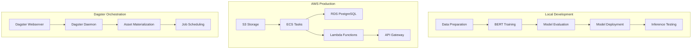

# Dagster

**How to use Dagster for ML pipeline?**

*Dagster as the orchestrator in LLM pipeline*

Dagster defines and orchestrates the entire LLM pipeline as a collection of "assets" (logical units of data or computation). This provides observability, lineage tracking, and robust error handling.

**Amazon AWS**

*Data ingestion and storage*

Amazon Simple Storage Service (Amazon S3)

Used for storing raw data, processed data, and model artifacts.

Amazon Redshift or other data warehouses

For structured data storage and analytics, potentially feeding into LLM training.

Airbyte (or similar tools)

Can be orchestrated by Dagster to ingest data from various sources into S3 or data warehouses.

*LLM training and fine-tuning*

Amazon SageMaker

Provides managed services for building, training, and deploying machine learning models, including LLMs. Dagster can trigger SageMaker training jobs and monitor their progress.

Amazon SageMaker Endpoints

For deploying trained LLMs and serving inference requests.

Amazon EMR (Elastic MapReduce)

For large-scale data processing and transformations using frameworks like Apache Spark, which can prepare data for LLM training.

*LLM inference and deployment*

AWS Lambda

Can be used to invoke LLM inference endpoints as part of a Dagster asset, such as serverless inference.

*Orchestration and infrastructure*

Amazon ECS (Elastic Container Service) Fargate or EC2

For hosting Dagster Dagit (UI) and worker processes.

Amazon Relational Database Service (Amazon RDS) PostgreSQL

For storing Dagster's metadata.

Amazon AWS Systems Manager Parameter Store

Parameter Store integrates with AWS Key Management Service (KMS) for encrypting sensitive data, ensuring secure storage and retrieval of parameters. For securely managing sensitive configurations and secrets used within the pipeline.

AWS Identity and Access Management (IAM)

For managing permissions and access control for Dagster and its interactions with AWS services.

### Dagster Pipeline

**Data Ingestion**

Dagster orchestrates an Airbyte sync to pull data from a source into S3.

**Data transformation**

Dagster defines an asset that uses EMR (via dagster-aws) to process and clean the data in S3, preparing it for LLM training.

**LLM training**

Dagster triggers a SageMaker training job, using the prepared data to train or fine-tune an LLM.

**Model evaluation**

Dagster orchestrates an asset to evaluate the trained LLM's performance and store metrics in S3 or a data warehouse.

**Model deployment**

Dagster orchestrates the deployment of the trained LLM to a SageMaker endpoint for inference.

**Inference or routing**

Dagster can then orchestrate assets for LLM inference, potentially using an LLM router (as described in the Not Diamond blog post) to dynamically select the optimal LLM based on the query.

## Example: MLOps pipeline for fine-tuning BERT models using **Dagster**

This example demonstrates MLOps pipeline for fine-tuning BERT models using **Dagster** as the orchestration platform. The pipeline integrates data preparation, model training, evaluation, deployment, and inference testing with support for both local development and Amazon AWS production deployment.

## Overview

The pipeline implements a workflow for BERT text classification:

1. **Data preparation** - Generate or load training datasets
2. **Model training** - Fine-tune BERT for text classification
3. **Model evaluation** - Assess model performance with metrics
4. **Model deployment** - Deploy model for production inference
5. **Inference testing** - Validate deployed model functionality

## Architecture



## 📁 Project

```
├── dagster_project/           # Main Dagster project
│   ├── assets/               # Dagster assets for pipeline stages
│   │   └── bert_assets.py    # BERT training pipeline assets
│   ├── resources/            # Dagster resources
│   │   └── aws_resources.py  # AWS resource configurations
│   ├── jobs/                 # Dagster job definitions
│   │   └── bert_jobs.py      # BERT pipeline jobs
│   ├── schedules/            # Automated scheduling
│   │   └── bert_schedules.py # Training schedules
│   └── __init__.py          # Main definitions
├── src/                      # Source code
│   ├── bert_fine_tuning.py   # Core BERT training logic
│   ├── minimal_bert.py       # Simplified BERT implementation
│   └── test_environment.py   # Environment testing
├── aws_config/               # AWS deployment configurations
│   ├── cloudformation-template.yaml
│   └── ecs-task-definition.json
├── data/                     # Training data
├── models/                   # Trained models
├── results/                  # Evaluation results
├── api.py                    # FastAPI server
├── dagster.yaml             # Dagster instance configuration
├── workspace.yaml           # Dagster workspace definition
├── docker-compose.yml       # Multi-service Docker setup
├── Dockerfile               # Container definition
├── setup_local.sh           # Local development setup
├── deploy_aws.sh            # AWS deployment script
└── requirements-dagster.txt # Dagster dependencies
```

## Quick Start

### Local development

1. **Clone and Setup Environment**
```bash
git clone <repository>
cd Dagster
./setup_local.sh full
```

2. **Activate Virtual Environment**
```bash
source bert_dagster_env/bin/activate
export DAGSTER_HOME=$(pwd)/dagster_home
export PYTHONPATH=$(pwd)
```

3. **Start Dagster Development Server**
```bash
dagster dev -w workspace.yaml
```

4. **Access Dagster UI**
Open http://localhost:3000 in your browser

5. **Run the Pipeline**
Navigate to the Assets tab and materialize the BERT pipeline assets in sequence:
- `training_dataset`
- `trained_bert_model` 
- `model_evaluation`
- `deployed_model`
- `inference_tests`

### Docker deployment

1. **Start All Services**
```bash
docker-compose up -d
```

2. **Access Services**
- Dagster UI: http://localhost:3000
- BERT API: http://localhost:8000
- API Documentation: http://localhost:8000/docs

## 🔧 Local development

### Prerequisites

- Python 3.8+
- Git
- Docker (optional)
- AWS CLI (for AWS deployment)

### Linux firewall configuration (iptables)

For local Dagster pipeline development on Linux, you may need to configure iptables to allow traffic to the required ports. This section provides comprehensive iptables rules for secure local development.

#### **Required Ports for Dagster Pipeline**

| Service | Port | Protocol | Purpose |
|---------|------|----------|---------|
| **Dagster UI** | 3000 | TCP | Web interface and API |
| **BERT API** | 8000 | TCP | FastAPI model inference |
| **PostgreSQL** | 5432 | TCP | Database (if using local PostgreSQL) |
| **Redis** | 6379 | TCP | Caching (optional) |
| **Nginx** | 80, 443 | TCP | Reverse proxy (production profile) |
| **Jupyter** | 8888 | TCP | Development notebooks |
| **MinIO** | 9000, 9001 | TCP | Local S3-compatible storage |

#### **Check Current iptables Status**

```bash
# Check if iptables is active
sudo systemctl status iptables

# View current rules
sudo iptables -L -n -v

# Check if UFW is active (Ubuntu)
sudo ufw status

# Check firewalld status (CentOS/RHEL)
sudo systemctl status firewalld
```

#### **Option 1: Using UFW (Ubuntu/Debian - Recommended)**

UFW (Uncomplicated Firewall) is easier to manage than raw iptables:

```bash
# Enable UFW
sudo ufw enable

# Allow SSH (important - don't lock yourself out!)
sudo ufw allow 22/tcp

# Allow Dagster services (localhost only)
sudo ufw allow from 127.0.0.1 to any port 3000
sudo ufw allow from 127.0.0.1 to any port 8000
sudo ufw allow from 127.0.0.1 to any port 5432
sudo ufw allow from 127.0.0.1 to any port 6379
sudo ufw allow from 127.0.0.1 to any port 8888
sudo ufw allow from 127.0.0.1 to any port 9000
sudo ufw allow from 127.0.0.1 to any port 9001

# Allow from local network (adjust 192.168.1.0/24 to your network)
sudo ufw allow from 192.168.1.0/24 to any port 3000
sudo ufw allow from 192.168.1.0/24 to any port 8000

# Allow HTTP/HTTPS for Nginx (if using production profile)
sudo ufw allow 80/tcp
sudo ufw allow 443/tcp

# Check UFW status
sudo ufw status numbered

# Reload UFW rules
sudo ufw reload
```

#### **Option 2: Raw iptables Configuration**

For systems using raw iptables (CentOS/RHEL/Advanced setups):

**Create iptables rules script** (`setup_iptables.sh`):
```bash
#!/bin/bash

# Backup existing rules
sudo iptables-save > /tmp/iptables-backup-$(date +%Y%m%d-%H%M%S).rules

# Flush existing rules
sudo iptables -F
sudo iptables -X
sudo iptables -t nat -F
sudo iptables -t nat -X

# Set default policies
sudo iptables -P INPUT DROP
sudo iptables -P FORWARD DROP
sudo iptables -P OUTPUT ACCEPT

# Allow loopback traffic (essential for local services)
sudo iptables -A INPUT -i lo -j ACCEPT
sudo iptables -A OUTPUT -o lo -j ACCEPT

# Allow established and related connections
sudo iptables -A INPUT -m conntrack --ctstate ESTABLISHED,RELATED -j ACCEPT

# Allow SSH (adjust port if needed)
sudo iptables -A INPUT -p tcp --dport 22 -j ACCEPT

# Allow Dagster UI (port 3000) from localhost and local network
sudo iptables -A INPUT -p tcp -s 127.0.0.1 --dport 3000 -j ACCEPT
sudo iptables -A INPUT -p tcp -s 192.168.1.0/24 --dport 3000 -j ACCEPT

# Allow BERT API (port 8000) from localhost and local network
sudo iptables -A INPUT -p tcp -s 127.0.0.1 --dport 8000 -j ACCEPT
sudo iptables -A INPUT -p tcp -s 192.168.1.0/24 --dport 8000 -j ACCEPT

# Allow PostgreSQL (port 5432) from localhost only
sudo iptables -A INPUT -p tcp -s 127.0.0.1 --dport 5432 -j ACCEPT

# Allow Redis (port 6379) from localhost only
sudo iptables -A INPUT -p tcp -s 127.0.0.1 --dport 6379 -j ACCEPT

# Allow Jupyter (port 8888) from localhost and local network
sudo iptables -A INPUT -p tcp -s 127.0.0.1 --dport 8888 -j ACCEPT
sudo iptables -A INPUT -p tcp -s 192.168.1.0/24 --dport 8888 -j ACCEPT

# Allow MinIO (ports 9000, 9001) from localhost and local network
sudo iptables -A INPUT -p tcp -s 127.0.0.1 --dport 9000 -j ACCEPT
sudo iptables -A INPUT -p tcp -s 127.0.0.1 --dport 9001 -j ACCEPT
sudo iptables -A INPUT -p tcp -s 192.168.1.0/24 --dport 9000 -j ACCEPT
sudo iptables -A INPUT -p tcp -s 192.168.1.0/24 --dport 9001 -j ACCEPT

# Allow HTTP/HTTPS for Nginx (if using production profile)
sudo iptables -A INPUT -p tcp --dport 80 -j ACCEPT
sudo iptables -A INPUT -p tcp --dport 443 -j ACCEPT

# Allow Docker bridge network (adjust if needed)
sudo iptables -A INPUT -i docker0 -j ACCEPT
sudo iptables -A FORWARD -i docker0 -j ACCEPT

# Allow ping (ICMP)
sudo iptables -A INPUT -p icmp --icmp-type echo-request -j ACCEPT

# Log dropped packets (optional - for debugging)
sudo iptables -A INPUT -m limit --limit 5/min -j LOG --log-prefix "iptables-dropped: "

# Save rules (method varies by distribution)
# Ubuntu/Debian
sudo iptables-save > /etc/iptables/rules.v4

# CentOS/RHEL 7
sudo service iptables save

# CentOS/RHEL 8+ (using firewalld is recommended)
sudo iptables-save > /etc/sysconfig/iptables

echo "iptables rules configured for Dagster pipeline"
echo "Current rules:"
sudo iptables -L -n -v
```

**Make the script executable**:
```bash
chmod +x setup_iptables.sh
sudo ./setup_iptables.sh
```

#### **Option 3: Firewalld Configuration (CentOS/RHEL)**

For systems using firewalld:

```bash
# Check firewalld status
sudo systemctl status firewalld

# Enable firewalld
sudo systemctl enable --now firewalld

# Create custom service definitions
sudo firewall-cmd --permanent --new-service=dagster-ui
sudo firewall-cmd --permanent --service=dagster-ui --set-short="Dagster UI"
sudo firewall-cmd --permanent --service=dagster-ui --set-description="Dagster Web Interface"
sudo firewall-cmd --permanent --service=dagster-ui --add-port=3000/tcp

sudo firewall-cmd --permanent --new-service=bert-api
sudo firewall-cmd --permanent --service=bert-api --set-short="BERT API"
sudo firewall-cmd --permanent --service=bert-api --set-description="BERT Model API"
sudo firewall-cmd --permanent --service=bert-api --add-port=8000/tcp

# Add services to trusted zone for local access
sudo firewall-cmd --permanent --zone=trusted --add-source=127.0.0.1/32
sudo firewall-cmd --permanent --zone=trusted --add-service=dagster-ui
sudo firewall-cmd --permanent --zone=trusted --add-service=bert-api

# Add services to internal zone for local network
sudo firewall-cmd --permanent --zone=internal --add-source=192.168.1.0/24
sudo firewall-cmd --permanent --zone=internal --add-service=dagster-ui
sudo firewall-cmd --permanent --zone=internal --add-service=bert-api

# Allow HTTP/HTTPS in public zone (for production profile)
sudo firewall-cmd --permanent --zone=public --add-service=http
sudo firewall-cmd --permanent --zone=public --add-service=https

# Reload firewalld
sudo firewall-cmd --reload

# Check active rules
sudo firewall-cmd --list-all-zones
```

#### **Docker Network considerations**

When using Docker Compose, additional iptables rules may be needed:

```bash
# Allow Docker networks
sudo iptables -A INPUT -i br-+ -j ACCEPT
sudo iptables -A FORWARD -i br-+ -j ACCEPT

# Allow specific Docker network (check with: docker network ls)
NETWORK_NAME=$(docker network ls | grep dagster | awk '{print $2}')
if [ ! -z "$NETWORK_NAME" ]; then
    NETWORK_ID=$(docker network inspect $NETWORK_NAME | jq -r '.[0].Id' | cut -c1-12)
    sudo iptables -A INPUT -i br-$NETWORK_ID -j ACCEPT
    sudo iptables -A FORWARD -i br-$NETWORK_ID -j ACCEPT
fi
```

#### **Security**

1. **Principle of least privilege**:
   ```bash
   # Only allow access from necessary sources
   # Prefer localhost (127.0.0.1) over 0.0.0.0
   # Use specific IP ranges instead of 0.0.0.0/0
   ```

2. **Security auditing**:
   ```bash
   # Check active connections
   sudo netstat -tlnp | grep -E ':(3000|8000|5432|6379|8888|9000|9001)'
   
   # Monitor logs for suspicious activity
   sudo journalctl -f | grep -E '(dagster|bert|iptables)'
   ```

3. **Temporary rules for testing**:
   ```bash
   # Add temporary rule (lost on reboot)
   sudo iptables -A INPUT -p tcp --dport 8000 -j ACCEPT
   
   # Remove specific rule
   sudo iptables -D INPUT -p tcp --dport 8000 -j ACCEPT
   ```

#### **Troubleshooting network issues**

**Test port accessibility**:
```bash
# Test from localhost
curl -I http://localhost:3000
curl -I http://localhost:8000/health

# Test from another machine in network
curl -I http://YOUR_IP:3000
curl -I http://YOUR_IP:8000/health

# Check if ports are listening
sudo ss -tlnp | grep -E ':(3000|8000|5432|6379)'

# Check iptables logs
sudo tail -f /var/log/kern.log | grep iptables
```

**Common issues and solutions**:
```bash
# Issue: Connection refused
# Solution: Check if service is running and port is correct
docker-compose ps
sudo netstat -tlnp | grep 8000

# Issue: Connection timeout
# Solution: Check iptables rules
sudo iptables -L -n -v | grep -E '(3000|8000)'

# Issue: Docker containers can't communicate
# Solution: Check Docker network rules
docker network ls
docker network inspect <network_name>
```

#### **Automated setup script**

Create a comprehensive setup script (`setup_firewall.sh`):
```bash
#!/bin/bash

# Colors for output
RED='\033[0;31m'
GREEN='\033[0;32m'
YELLOW='\033[1;33m'
NC='\033[0m' # No Color

echo -e "${GREEN}🔥 Setting up firewall for Dagster pipeline...${NC}"

# Detect firewall system
if command -v ufw &> /dev/null; then
    echo -e "${YELLOW}Detected UFW, configuring...${NC}"
    
    # Configure UFW
    sudo ufw --force enable
    sudo ufw allow 22/tcp
    sudo ufw allow from 127.0.0.1 to any port 3000,8000,5432,6379,8888,9000,9001
    sudo ufw allow from 192.168.1.0/24 to any port 3000,8000,8888,9000,9001
    sudo ufw allow 80,443/tcp
    
    echo -e "${GREEN}✅ UFW configured successfully${NC}"
    sudo ufw status
    
elif systemctl is-active --quiet firewalld; then
    echo -e "${YELLOW}Detected firewalld, configuring...${NC}"
    
    # Configure firewalld (add commands from above)
    # ... firewalld commands here ...
    
    echo -e "${GREEN}✅ Firewalld configured successfully${NC}"
    
else
    echo -e "${YELLOW}Using raw iptables, configuring...${NC}"
    
    # Configure raw iptables (add commands from above)
    # ... iptables commands here ...
    
    echo -e "${GREEN}✅ iptables configured successfully${NC}"
fi

echo -e "${GREEN}🔥 Firewall setup complete!${NC}"
echo -e "${YELLOW}Test your services:${NC}"
echo "  Dagster UI: http://localhost:3000"
echo "  BERT API: http://localhost:8000"
echo "  API Docs: http://localhost:8000/docs"
```

**Run the setup script**:
```bash
chmod +x setup_firewall.sh
sudo ./setup_firewall.sh
```

### Step-by-step

#### 1. **Environment**
```bash
# Check Python installation
./setup_local.sh check

# Full setup (recommended)
./setup_local.sh full

# Or individual steps
./setup_local.sh install  # Install dependencies only
./setup_local.sh test     # Test installation
```

#### 2. **Configure Dagster**
```bash
# Set environment variables
export DAGSTER_HOME=$(pwd)/dagster_home
export PYTHONPATH=$(pwd)

# Start Dagster
dagster dev -w workspace.yaml
```

#### 3. **Run components**
```bash
# Run BERT training directly
python src/bert_fine_tuning.py

# Start API server
python api.py

# Test API endpoints
./test_api.sh
```

### Pipeline configuration

Configure pipeline parameters in `dagster_project/assets/bert_assets.py`:

```python
class BertConfig(Config):
    model_name: str = "bert-base-uncased"
    num_labels: int = 2
    max_length: int = 128
    batch_size: int = 16
    learning_rate: float = 2e-5
    epochs: int = 3
    dataset_size: int = 1000
```

## ☁️ Amazon AWS deployment

### Prerequisites

1. **AWS CLI Setup**
```bash
# Install AWS CLI
curl "https://awscli.amazonaws.com/awscli-exe-linux-x86_64.zip" -o "awscliv2.zip"
unzip awscliv2.zip
sudo ./aws/install

# Configure AWS credentials
aws configure
```

2. **Docker setup**
```bash
# Install Docker
sudo apt update
sudo apt install docker.io docker-compose
sudo usermod -aG docker $USER
```

### Deployment steps

#### 1. **Quick deployment**
```bash
# Complete deployment
./deploy_aws.sh all

# Check deployment status
./deploy_aws.sh verify
```

#### 2. **Step-by-step deployment**
```bash
# Check AWS configuration
./deploy_aws.sh check

# Create ECR repository
./deploy_aws.sh ecr

# Build and push Docker image
./deploy_aws.sh build

# Deploy infrastructure
./deploy_aws.sh infra

# Deploy ECS services
./deploy_aws.sh ecs

# Setup environment
./deploy_aws.sh env
```

### Amazon AWS Architecture

#### **Core Infrastructure**
- **ECS Cluster** - Container orchestration
- **RDS PostgreSQL** - Dagster metadata storage
- **S3 Bucket** - Data and model storage
- **VPC & Security Groups** - Network security
- **Application Load Balancer** - Traffic routing

#### **Container Services**
- **Dagster Webserver** - Pipeline UI and API
- **Dagster Daemon** - Background scheduling
- **BERT API Server** - Model inference endpoints

#### **Storage & Networking**
- **Secrets Manager** - Secure credential storage
- **CloudWatch** - Logging and monitoring
- **ECR** - Container image registry

### Environment Variables

```bash
# AWS Configuration
export AWS_DEFAULT_REGION=us-east-1
export AWS_ACCOUNT_ID=123456789012

# Dagster Configuration
export DAGSTER_ECS_CLUSTER=dagster-bert-pipeline
export DAGSTER_S3_BUCKET=dagster-bert-pipeline-123456789012-us-east-1

# Database Configuration (from Secrets Manager)
export DAGSTER_PG_USERNAME=dagster
export DAGSTER_PG_HOST=your-rds-endpoint.amazonaws.com
export DAGSTER_PG_DB=dagster
```

## API Integration

### API Gateway setup

```bash
# Create API Gateway (using AWS CLI)
aws apigateway create-rest-api --name bert-classification-api

# Setup custom domain and SSL certificate
aws acm request-certificate --domain-name api.yourdomain.com
```

## Load Balancing & Reverse Proxy Architecture

### Overview: Local development vs production deployment

This project uses **different load balancing strategies** for local development and AWS production deployment:

#### **Local Development: Nginx Reverse Proxy**

For local Docker Compose deployments, Nginx serves as an optional reverse proxy:

**Development Profile** (Default - No Nginx):
```bash
# Direct service access (no reverse proxy)
docker-compose up -d
# OR
docker-compose --profile development up -d

# Services accessible at:
# - Dagster UI: http://localhost:3000
# - API Server: http://localhost:8000
# - API Docs: http://localhost:8000/docs
```

**Production Profile** (With Nginx):
```bash
# All traffic routed through Nginx reverse proxy
docker-compose --profile production up -d

# Services accessible through Nginx at:
# - API Server: http://localhost:80
# - Health Check: http://localhost:80/health
```

**Nginx Configuration** (`nginx.conf`):
```nginx
events {
    worker_connections 1024;
}

http {
    upstream bert_api {
        server bert-api:8000;
    }

    server {
        listen 80;
        
        # All API traffic routed to BERT API service
        location / {
            proxy_pass http://bert_api;
            proxy_set_header Host $host;
            proxy_set_header X-Real-IP $remote_addr;
            proxy_set_header X-Forwarded-For $proxy_add_x_forwarded_for;
            proxy_set_header X-Forwarded-Proto $scheme;
            
            # Timeout settings for ML inference
            proxy_connect_timeout 60s;
            proxy_send_timeout 60s;
            proxy_read_timeout 60s;
        }
        
        # Dedicated health check endpoint
        location /health {
            proxy_pass http://bert_api/health;
            access_log off;
        }
    }
}
```

#### ☁️ **Amazon AWS production: Application Load Balancer (ALB)**

For AWS production deployment, **Nginx is NOT used**. Instead, AWS ALB provides enterprise-grade load balancing:

**Why ALB instead of Nginx in Amazon AWS?**
-  **Managed Service**: No maintenance overhead
-  **Auto Scaling**: Automatic capacity adjustment
-  **SSL Termination**: Integrated certificate management
-  **Health Checks**: Advanced health monitoring
-  **High Availability**: Multi-AZ deployment
-  **Security**: Integration with AWS WAF and Security Groups
-  **Cost Effective**: Pay-per-use pricing model

**Amazon AWS Load Balancing Architecture**:
```
Internet → ALB → Target Groups → ECS Services
                                 ├── Dagster Webserver (Port 3000)
                                 └── BERT API Server (Port 8000)
```

**ALB Configuration** (CloudFormation):
```yaml
DagsterALB:
  Type: AWS::ElasticLoadBalancingV2::LoadBalancer
  Properties:
    Name: dagster-bert-alb
    Type: application
    Scheme: internet-facing
    SecurityGroups:
      - !Ref DagsterALBSecurityGroup
    Subnets:
      - !Ref PublicSubnet1
      - !Ref PublicSubnet2

# Target groups for service routing
DagsterTargetGroup:
  Type: AWS::ElasticLoadBalancingV2::TargetGroup
  Properties:
    Name: dagster-webserver-tg
    Port: 3000
    Protocol: HTTP
    TargetType: ip
    VpcId: !Ref VPC

BertAPITargetGroup:
  Type: AWS::ElasticLoadBalancingV2::TargetGroup
  Properties:
    Name: bert-api-tg
    Port: 8000
    Protocol: HTTP
    TargetType: ip
    VpcId: !Ref VPC
```

### 🔧 **When to Use which approach?**

| Scenario | Load Balancer | Reason |
|----------|---------------|---------|
| **Local Development** | None (Direct Access) | Simplicity, debugging |
| **Local Production Testing** | Nginx | Simulate production environment |
| **AWS Development** | ALB | Cloud-native testing |
| **AWS Production** | ALB | Enterprise features, managed service |

### **Usage**

**Local development (No Load Balancer)**:
```bash
# Start development stack
docker-compose up -d

# Test services directly
curl http://localhost:8000/health
curl http://localhost:3000  # Dagster UI
```

**Local with Nginx (Production Simulation)**:
```bash
# Start with Nginx reverse proxy
docker-compose --profile production up -d

# All traffic through Nginx
curl http://localhost:80/health
curl http://localhost:80/predict -X POST -H "Content-Type: application/json" -d '{"text": "test"}'
```

**Amazon AWS production (ALB)**:
```bash
# Deploy to AWS (ALB automatically configured)
./deploy_aws.sh all

# Access through ALB endpoint
curl https://your-alb-endpoint.amazonaws.com/health
curl https://your-alb-endpoint.amazonaws.com/predict
```

### **Performance**

| Feature | Nginx (Local) | AWS ALB (Production) |
|---------|---------------|---------------------|
| **Throughput** | ~10K req/s | ~100K+ req/s |
| **Latency** | <1ms overhead | <1ms overhead |
| **SSL Termination** | Manual setup | Automatic ACM integration |
| **Health Checks** | Basic | Advanced with custom metrics |
| **Auto Scaling** | Manual | Automatic based on targets |
| **High Availability** | Single point | Multi-AZ redundancy |

### IAM roles

```json
{
  "Version": "2012-10-17",
  "Statement": [
    {
      "Effect": "Allow",
      "Action": [
        "s3:GetObject",
        "s3:PutObject", 
        "s3:DeleteObject",
        "s3:ListBucket"
      ],
      "Resource": [
        "arn:aws:s3:::dagster-bert-pipeline-*",
        "arn:aws:s3:::dagster-bert-pipeline-*/*"
      ]
    },
    {
      "Effect": "Allow",
      "Action": [
        "ecs:RunTask",
        "ecs:DescribeTasks", 
        "ecs:StopTask"
      ],
      "Resource": "*"
    },
    {
      "Effect": "Allow",
      "Action": [
        "lambda:InvokeFunction"
      ],
      "Resource": "arn:aws:lambda:*:*:function:bert-*"
    }
  ]
}
```

## Pipeline monitoring

### Dagster UI
- **Asset Lineage** - Visual pipeline dependencies
- **Run History** - Track pipeline executions
- **Asset Materialization** - Monitor data freshness
- **Logs & Metrics** - Detailed execution logs

### CloudWatch integration
```yaml
# In dagster.yaml
compute_logs:
  module: dagster_aws.s3.compute_log_manager
  class: S3ComputeLogManager
  config:
    bucket: ${DAGSTER_S3_BUCKET}
    prefix: "dagster/compute-logs"
```

### Performance metrics
- Training time per epoch
- Model accuracy and F1-score
- Memory and CPU utilization
- API response times

## Testing

### Unit tests
```bash
# Run tests
python -m pytest tests/

# Test specific components
python test_setup.py
python test_model.py
```

### API testing
```bash
# Automated API testing
./test_api.sh

# Manual testing
curl -X POST "http://localhost:8000/classify" \
  -H "Content-Type: application/json" \
  -d '{"text": "I love this product!", "return_confidence": true}'
```

### Integration testing
```bash
# Test complete pipeline
dagster asset materialize --select bert_pipeline_job

# Test specific assets
dagster asset materialize --select training_dataset
```

## Scaling & optimization

### Horizontal scaling
```yaml
# ECS Service scaling
aws ecs update-service \
  --cluster dagster-bert-pipeline \
  --service dagster-bert-service \
  --desired-count 3
```

### GPU support
```dockerfile
# GPU-enabled Dockerfile
FROM nvidia/cuda:11.8-devel-ubuntu20.04
# ... rest of Dockerfile
```

### Cost optimization
- Use Spot instances for training workloads
- Implement data caching strategies
- Optimize Docker image sizes
- Use Lambda for lightweight inference

##  Dagster vs Apache Airflow comparison

### Dagster advantages

1. **Architecture**
   - Asset-centric approach
   - Better data lineage tracking
   - Type-safe configurations
   - Built-in testing framework

2. **Developer experience**
   - Intuitive UI with rich visualizations
   - Hot reloading in development
   - Excellent debugging capabilities
   - Strong Python typing support

3. **Cloud-native design**
   - First-class AWS integration
   - Container-friendly architecture
   - Scalable by design
   - Built-in observability

4. **ML/AI workflows**
   - Asset materializations for models
   - Version tracking and lineage
   - Integration with ML frameworks
   - Model deployment patterns

### ❌ Dagster disadvantages

1. **Ecosystem**
   - Smaller community compared to Airflow
   - Fewer third-party integrations
   - Limited historical precedent

2. **Learning curve**
   - Different paradigm from traditional ETL
   - Requires understanding of assets concept
   - More complex initial setup

### Dagster comparison

| Feature | Dagster | Airflow |
|---------|---------|---------|
| **Architecture** | Asset-centric | Task-centric |
| **UI/UX** | Modern, intuitive | Traditional, functional |
| **Data Lineage** | Built-in, automatic | Manual, limited |
| **Type Safety** | Strong typing | Dynamic typing |
| **Testing** | Built-in framework | Manual setup |
| **Community** | Growing | Large, established |
| **Learning Curve** | Moderate | Steep |
| **ML/AI Support** | Excellent | Good |
| **Enterprise Features** | Dagster+ | Commercial offerings |

### Recommendation

**Choose Dagster if requirements:**
- Building new ML/AI pipelines
- Need strong data lineage tracking
- Want modern development experience
- Working with containerized environments
- Require asset-centric workflows

**Choose Airflow if requirements:**
- Have existing Airflow infrastructure
- Need extensive third-party integrations
- Prefer traditional ETL patterns
- Require proven enterprise adoption
- Have large Airflow expertise in team

## Troubleshooting

### Issues

1. **Import errors**
```bash
# Fix Python path
export PYTHONPATH=$(pwd)

# Reinstall dependencies
pip install -r requirements-dagster.txt
```

2. **Docker**
```bash
# Clean Docker cache
docker system prune -f

# Rebuild images
docker-compose build --no-cache
```

3. **Amazon AWS deployment**
```bash
# Check AWS credentials
aws sts get-caller-identity

# Verify ECS service status
aws ecs describe-services --cluster dagster-bert-pipeline --services dagster-bert-service
```

4. **Memory issues**
```bash
# Reduce batch size in configuration
# Monitor memory usage
docker stats

# Use smaller model variants
# Enable gradient checkpointing
```

### Debugging

```bash
# Enable debug logging
export DAGSTER_LOG_LEVEL=DEBUG

# Check Dagster logs
tail -f dagster_home/logs/dagster.log

# API server logs
python api.py --log-level debug
```

## Resources

### Documentation
- [Dagster Documentation](https://docs.dagster.io/)
- [AWS ECS Guide](https://docs.aws.amazon.com/ecs/)
- [BERT Fine-tuning](https://huggingface.co/docs/transformers/training)
- [FastAPI Documentation](https://fastapi.tiangolo.com/)

### Commands
```bash
# Dagster CLI
dagster --help
dagster asset materialize --help
dagster job execute --help

# AWS CLI
aws ecs --help
aws ecr --help
aws cloudformation --help

# Docker
docker-compose --help
docker logs <container_id>
docker exec -it <container_id> /bin/bash
```

### Configuration Files
- `dagster.yaml` - Dagster instance configuration
- `workspace.yaml` - Code location definitions
- `docker-compose.yml` - Multi-service deployment
- `requirements-dagster.txt` - Python dependencies

## A pipeline for fine-tuning (ML pipeline excluded Dagster)

This project demonstrates how to fine-tune pre-trained Transformer models like BERT for text classification using PyTorch and the Hugging Face transformers library.

### 1. Create Python virtual environment
```bash
python3 -m venv bert_env
source bert_env/bin/activate  # On Linux/Mac
```

### 2. Install dependencies
```bash
pip install torch transformers scikit-learn numpy pandas
```

### 3. Verify setup
```bash
python test_setup.py
```

### 4. Run fine-tuning
```bash
python src/bert_fine_tuning.py
```

### 5. Start FastAPI server
```bash
# Install API dependencies
pip install -r requirements-api.txt

# Start the API server
python api.py
# or using uvicorn directly
uvicorn api:app --host 0.0.0.0 --port 8000 --reload
```

### 6. Test API Endpoints
```bash
# Run comprehensive API tests
./test_api.sh

# Or test manually with curl
curl -X POST "http://localhost:8000/classify" \
  -H "Content-Type: application/json" \
  -d '{"text": "I love this product!", "return_confidence": true}'
```

## FastAPI backend server

This project includes **FastAPI** backend that provides REST API endpoints for text classification using the fine-tuned BERT model.

### API
- **RESTful Endpoints**: Standard HTTP methods for text classification
- **Single & batch processing**: Classify one text or multiple texts at once
- **Confidence scores**: Optional confidence values for predictions
- **Health monitoring**: Health check and model status endpoints
- **Documentation**: Auto-generated API docs with Swagger UI
- **CORS**: Cross-Origin Resource Sharing enabled
- **Error handling**: Comprehensive error responses and logging
- **Performance metrics**: Processing time tracking

### API Endpoints

#### 1. **Root Endpoint**
```bash
GET /
# Returns basic API information
```

#### 2. **Health Check**
```bash
GET /health
# Returns API and model health status
curl http://localhost:8000/health
```

#### 3. **Model information**
```bash
GET /model/info
# Returns detailed model information
curl http://localhost:8000/model/info
```

#### 4. **Text Classification (Single)**
```bash
POST /classify
# Classify a single text
curl -X POST "http://localhost:8000/classify" \
  -H "Content-Type: application/json" \
  -d '{"text": "I absolutely love this product!", "return_confidence": true}'

# Response:
{
  "text": "I absolutely love this product!",
  "prediction": 1,
  "label": "positive",
  "confidence": 0.9876,
  "processing_time_ms": 45.23
}
```

#### 5. **Text Classification (Batch)**
```bash
POST /classify/batch
# Classify multiple texts at once
curl -X POST "http://localhost:8000/classify/batch" \
  -H "Content-Type: application/json" \
  -d '{
    "texts": ["Great product!", "Terrible service.", "It was okay."],
    "return_confidence": true
  }'

# Response:
{
  "results": [
    {
      "text": "Great product!",
      "prediction": 1,
      "label": "positive",
      "confidence": 0.9234,
      "processing_time_ms": 42.1
    },
    // ... more results
  ],
  "total_texts": 3,
  "total_processing_time_ms": 123.45
}
```

#### 6. **Classifications - Demo**
```bash
GET /classify/demo
# Returns sample classifications for testing
curl http://localhost:8000/classify/demo
```

### Documentation (API)

The FastAPI server automatically generates interactive documentation:

- **Swagger UI**: http://localhost:8000/docs
- **ReDoc**: http://localhost:8000/redoc

These interfaces allow you to:
- Browse all available endpoints
- Test API calls directly in the browser
- View request/response schemas
- Download OpenAPI specifications

### Starting the API server

#### Method 1: Python execution
```bash
# Activate virtual environment
source bert_env/bin/activate

# Install API dependencies
pip install -r requirements-api.txt

# Start server
python api.py
```

#### Method 2: Using Uvicorn
```bash
# Development mode with auto-reload
uvicorn api:app --host 0.0.0.0 --port 8000 --reload

# Production mode
uvicorn api:app --host 0.0.0.0 --port 8000 --workers 4
```

### Testing the API

#### Automated testing
```bash
# Run comprehensive test suite
./test_api.sh
```

#### Manual testing
```bash
# Basic classification
curl -X POST "http://localhost:8000/classify" \
  -H "Content-Type: application/json" \
  -d '{"text": "This movie was fantastic!"}'

# With confidence scores
curl -X POST "http://localhost:8000/classify" \
  -H "Content-Type: application/json" \
  -d '{"text": "I hate this product.", "return_confidence": true}'

# Batch processing
curl -X POST "http://localhost:8000/classify/batch" \
  -H "Content-Type: application/json" \
  -d '{
    "texts": ["Amazing service!", "Poor quality.", "Average experience."],
    "return_confidence": true
  }'

# Health check
curl http://localhost:8000/health

# Model information
curl http://localhost:8000/model/info
```

## Docker deployment

The project includes complete **Docker** support for containerized deployment.

### Docker
- **Multi-stage Build**: Optimized container size
- **Security**: Non-root user execution
- **Health Checks**: Container health monitoring  
- **Resource Limits**: Memory and CPU constraints
- **Environment Configuration**: Flexible deployment options
- **Nginx Integration**: Optional reverse proxy setup

### Start with Docker

#### 1. **Build and run with Docker**
```bash
# Build the Docker image
docker build -t bert-classifier .

# Run the container
docker run -p 8000:8000 bert-classifier

# Run with custom configuration
docker run -p 8000:8000 \
  -e LOG_LEVEL=debug \
  -v $(pwd)/fine_tuned_bert:/app/fine_tuned_bert:ro \
  bert-classifier
```

#### 2. **Using Docker Compose (Recommended)**
```bash
# Start the service
docker-compose up -d

# View logs
docker-compose logs -f

# Stop the service
docker-compose down

# Start with nginx (production)
docker-compose --profile production up -d
```

#### 3. **Production deployment**
```bash
# Build and run with nginx reverse proxy
docker-compose --profile production up -d

# Scale the API service
docker-compose up -d --scale bert-api=3
```

### Docker configuration

#### **Dockerfile**
The Dockerfile includes:
- Python 3.11 slim base image
- System dependencies installation
- Python package installation with caching
- Non-root user for security
- Health check configuration
- Optimized layer caching

#### **Docker Compose**
The docker-compose.yml provides:
- API service configuration
- Port mapping (8000:8000)
- Volume mounting for models
- Health checks
- Resource limits
- Optional nginx reverse proxy

#### **Environment variables**
```bash
# Available environment variables
LOG_LEVEL=info          # Logging level
PYTHONPATH=/app         # Python path
MODEL_PATH=/app/fine_tuned_bert  # Custom model path
```

### Docker deployment options

#### **Development**
```bash
# Basic development setup
docker-compose up -d
# Access API at http://localhost:8000
```

#### **Production with Load Balancer**
```bash
# Production setup with nginx
docker-compose --profile production up -d
# Access API through nginx at http://localhost:80
```

#### **Kubernetes deployment**
```yaml
# kubernetes-deployment.yaml (example)
apiVersion: apps/v1
kind: Deployment
metadata:
  name: bert-classifier
spec:
  replicas: 3
  selector:
    matchLabels:
      app: bert-classifier
  template:
    metadata:
      labels:
        app: bert-classifier
    spec:
      containers:
      - name: bert-classifier
        image: bert-classifier:latest
        ports:
        - containerPort: 8000
        resources:
          requests:
            memory: "2Gi"
            cpu: "500m"
          limits:
            memory: "4Gi"
            cpu: "1000m"
---
apiVersion: v1
kind: Service
metadata:
  name: bert-classifier-service
spec:
  selector:
    app: bert-classifier
  ports:
  - port: 80
    targetPort: 8000
  type: LoadBalancer
```

### Container health monitoring

#### **Health Check Endpoint**
```bash
# Check container health
curl http://localhost:8000/health

# Docker health status
docker ps
# Look for "healthy" status
```

#### **Monitoring commands**
```bash
# View container logs
docker logs <container_id>

# Monitor resource usage
docker stats <container_id>

# Execute commands inside container
docker exec -it <container_id> /bin/bash
```

### Troubleshooting Docker

#### **Problems**
```bash
# Container not starting
docker logs <container_id>

# Port already in use
docker ps | grep 8000
sudo netstat -tulpn | grep 8000

# Model not loading
# Ensure fine_tuned_bert directory exists
ls -la fine_tuned_bert/

# Memory issues
# Increase Docker memory limits
# Or use smaller models like DistilBERT
```

#### **Performance optimization**
```bash
# Use multi-stage builds
# Enable Docker BuildKit
DOCKER_BUILDKIT=1 docker build -t bert-classifier .

# Use .dockerignore to exclude unnecessary files
# Optimize layer caching by copying requirements first
```

## Testing fine-tuning success

### 1. **Training metrics**
- **Loss Reduction**: Training loss should decrease over epochs
- **Convergence**: Loss should stabilize (not oscillate wildly)
- **No Overfitting**: Validation loss shouldn't increase while training loss decreases

### 2. **Evaluation metrics**
- **Accuracy**: Percentage of correctly classified samples
- **Precision**: True positives / (True positives + False positives)
- **Recall**: True positives / (True positives + False negatives)  
- **F1-Score**: Harmonic mean of precision and recall

### 3. **Test cases**
```python
# Example test cases
test_cases = [
    ("I love this product!", 1),      # Positive
    ("This is terrible quality", 0),   # Negative
    ("Average experience", ???),       # Neutral - check model confidence
]
```

## Model performance evaluation

### 1. **Validation split**
- Split data into training (80%), validation (10%), test (10%)
- Use validation set to tune hyperparameters
- Use test set for final performance evaluation

### 2. **Cross validation**
- K-fold cross-validation for robust performance estimates
- Helps detect overfitting and ensures generalization

### 3. **Confusion matrix**
- Visualize classification performance across all classes
- Identify which classes are being confused

### 4. **Classification report**
```python
from sklearn.metrics import classification_report
print(classification_report(y_true, y_pred))
```

## Model Prediction Testing

### 1. **Inference function**
```python
def predict_sentiment(text, model, tokenizer):
    inputs = tokenizer(text, return_tensors="pt", 
                      padding=True, truncation=True, max_length=128)
    with torch.no_grad():
        outputs = model(**inputs)
        prediction = torch.argmax(outputs.logits, dim=-1)
    return prediction.item()
```

### 2. **Batch prediction**
- Process multiple texts efficiently
- Monitor prediction confidence scores
- Handle edge cases and out-of-domain text

### 3. **Model interpretability**
- Use attention visualization to understand model decisions
- Analyze which words contribute most to predictions
- Test with adversarial examples

## 📄 License

This project is licensed under the MIT License - see the LICENSE file for details.

---

### References

[Build pipelines with AWS](https://docs.dagster.io/guides/build/external-pipelines/aws)

[Deploying Dagster to Amazon Web Services](https://docs.dagster.io/deployment/oss/deployment-options/aws)

[Using AWS ECR with Dagster](https://dagster.io/integrations/dagster-aws-ecr)

[Build pipelines with AWS Lambda](https://docs.dagster.io/guides/build/external-pipelines/aws/aws-lambda-pipeline)

[LLM training pipelines with Langchain, Airbyte, and Dagster](https://dagster.io/blog/training-llms)

[Running Dagster locally](https://docs.dagster.io/deployment/oss/deployment-options/running-dagster-locally)

[Using Airbyte with Dagster](https://dagster.io/integrations/dagster-airbyte)
