# Agents

## Table of Contents

1. [Project Structure](#project-structure)
2. [What are AI Agents?](#what-are-ai-agents)
   - [AI Agents Capabilities](#ai-agents-capabilities)
   - [Use Cases in AI Agent Projects](#use-cases-in-ai-agent-projects)
   - [AI Agent Components](#ai-agent-components)
3. [When NOT to Use an Agent](#when-not-to-use-an-agent)
4. [Single-Agent Systems](#single-agent-systems)
   - [Single-Agent Architecture](#single-agent-architecture)
   - [Single-Agent Use Cases](#single-agent-use-cases)
   - [Single-Agent Workflow](#single-agent-workflow)
5. [Multi-Agent Systems](#multi-agent-systems)
   - [Multi-Agent Architecture](#multi-agent-architecture)
   - [Multi-Agent Use Cases](#multi-agent-use-cases)
   - [Multi-Agent Workflow](#multi-agent-workflow)
6. [Sub-Agent Architecture](#sub-agent-architecture)
   - [Sub-Agent Use Cases](#sub-agent-use-cases)
   - [Sub-Agent Workflow](#sub-agent-workflow)
7. [Agent Capabilities](#agent-capabilities)
   - [Tools and MCP](#tools-and-mcp)
   - [Memory Systems](#memory-systems)
   - [Planning and Reasoning](#planning-and-reasoning)
   - [Multi-Agent Orchestration Patterns](#multi-agent-orchestration-patterns)
   - [Human-in-the-Loop](#human-in-the-loop)
8. [Multi-Agent Collaboration](#multi-agent-collaboration)
9. [VS Code and Agents](#vs-code-and-agents)
   - [How AI Agents Function in VS Code](#how-ai-agents-function-in-vs-code)
   - [Key Features and Capabilities](#key-features-and-capabilities)
   - [Tools and Extensions for AI Agent Development](#tools-and-extensions-for-ai-agent-development)
   - [How to Set Up AI Agent-Driven Software Development](#how-to-set-up-ai-agent-driven-software-development)
   - [Best Practices for Working with Agents](#best-practices-for-working-with-agents)
   - [Agent Customization and Configuration](#agent-customization-and-configuration)
10. [Steps to Create an AI Agent](#steps-to-create-an-ai-agent)
    - [Prerequisites](#prerequisites)
    - [Step 1: Task Definition and Scope Analysis](#step-1-task-definition-and-scope-analysis)
    - [Step 2: Tool Repository Development](#step-2-tool-repository-development)
    - [Step 3: Framework Selection and Architecture Design](#step-3-framework-selection-and-architecture-design)
    - [Step 4: Implementation and Integration](#step-4-implementation-and-integration)
11. [Open-Source Tools and Frameworks for AI Agents](#open-source-tools-and-frameworks-for-ai-agents-2026)
    - [Enterprise-Grade Frameworks](#enterprise-grade-frameworks)
    - [Specialized Agent Frameworks](#specialized-agent-frameworks)
    - [No-Framework Approach](#no-framework-approach)
    - [Framework Comparison Matrix](#framework-comparison-matrix)
    - [Selection Criteria of Framework for AI Agents](#selection-criteria-of-framework-for-ai-agents)
12. [Local Deployment with Ollama](#local-deployment-with-ollama)
    - [Setup Local Inference](#setup-local-inference)
    - [Open WebUI](#open-webui)
    - [Single-Agent Local Deployment](#single-agent-local-deployment)
    - [Multi-Agent Local Deployment](#multi-agent-local-deployment)
    - [Sub-Agent Local Deployment](#sub-agent-local-deployment)
13. [Cloud Deployment on Amazon AWS](#cloud-deployment-on-amazon-aws)
    - [Amazon Bedrock Agents](#amazon-bedrock-agents)
    - [Single Agent on AWS](#single-agent-on-aws)
    - [Multi-Agent on AWS](#multi-agent-on-aws)
    - [Sub-Agents on AWS](#sub-agents-on-aws)
    - [AWS Deployment Methods](#aws-deployment-methods)
14. [Configuring Prompts for Agents](#configuring-prompts-for-agents)
    - [System Prompt Design](#system-prompt-design)
    - [Prompt Templates per Agent Type](#prompt-templates-per-agent-type)
15. [Development Environment Setup](#development-environment-setup)
    - [Prerequisites and Tools](#prerequisites-and-tools)
    - [Python Environment with uv](#python-environment-with-uv)
    - [VS Code Configuration](#vs-code-configuration)
    - [Framework-Specific Setup](#framework-specific-setup)
16. [Examples](#examples)
    - [LangChain](#langchain)
    - [Single-Agent with Ollama and LangChain](#single-agent-with-ollama-and-langchain)
    - [Multi-Agent with CrewAI and Ollama](#multi-agent-with-crewai-and-ollama)
    - [Sub-Agent with LangGraph](#sub-agent-with-langgraph)
    - [Local RAG Agent](#local-rag-agent)
    - [AWS Bedrock Agent (Python)](#aws-bedrock-agent-python)
    - [Strands Agents on AWS](#strands-agents-on-aws)
17. [References](#references)
    - [Academic and Research](#academic-and-research)
    - [Documentation and Tutorials](#documentation-and-tutorials)
    - [Open Source Repositories](#open-source-repositories)
    - [Reports and Whitepapers](#reports-and-whitepapers)
    - [Online Learning](#online-learning)
    - [Communities](#communities)

## Project Structure *Last Updated: May 2026*

```
AGENTS/
├── README.md                        ◈ Main documentation (this file)
├── LangChain/                       ◈ LangChain + LangGraph agent with Ollama/OpenAI
│   ├── agent.py                     ▸ ReAct agent (local Ollama or OpenAI)
│   ├── server.py                    ▸ FastAPI server wrapping the agent
│   ├── docker-compose.yml           ▸ Ollama + agent service stack
│   ├── Dockerfile
│   ├── requirements.txt
│   └── README.md
├── No Framework/                    ◈ Raw API approach — no framework dependency
│   ├── src/
│   │   ├── agents.py                ▸ Agent class (Ollama, tool loop)
│   │   ├── tools.py                 ▸ Tool manager
│   │   ├── index.py                 ▸ Python entry-point
│   │   ├── agents.js                ▸ Node.js agent variant
│   │   └── index.js
│   ├── docker-compose.yml
│   ├── Makefile
│   └── README.md
├── Spring AI/                       ◈ Java / Spring Boot agent with Bedrock/OpenAI
│   ├── src/main/java/…              ▸ ChatController, DocumentIngestionService, ToolConfiguration
│   ├── docker-compose.yml
│   ├── build.gradle
│   └── README.md
└── Strands Agents/                  ◈ AWS Strands SDK — single + multi-agent on Bedrock
    ├── examples/
    │   ├── weather_forecaster.py    ▸ Single-agent with HTTP tool
    │   └── naming_agent.py          ▸ Single-agent with MCP + GitHub tools
    ├── deployment/
    │   ├── fargate/                 ▸ ECS/Fargate containerised agent
    │   └── lambda/                  ▸ Serverless Lambda agent
    ├── scripts/
    └── README.md
```

**Previously documented frameworks** (Agent Development Kit, Haystack, LangGraph, LlamaIndex, Semantic Kernel) are referenced in the frameworks section below with links to their official repositories. All Python examples in this file are self-contained and only require the packages listed under each example.

## What are AI Agents?

**An AI agent is three things combined:**

▪ A **large language model** — the brain that reasons and makes decisions  
▪ **Tools** — things it can do (search the web, run code, read files, call APIs)  
▪ A **loop** — it keeps reasoning and acting until the task is done  

**At their core, an AI agent is a combination of a model, tools, and a prompt** that work together to accomplish tasks autonomously.

Artificial Intelligence agents represent autonomous computational entities designed to perceive their environment, make decisions, and execute actions to achieve specific objectives. These sophisticated systems operate independently, utilizing advanced reasoning capabilities to accomplish complex tasks on behalf of users or other systems. As of 2026, AI agents have evolved from simple chatbots into sophisticated problem-solving entities capable of autonomous decision-making and multi-step execution.

**How AI Agents Work:**

AI agents function through a continuous **perception-action cycle**:

1. **Perception**: The agent receives input (user queries, environmental data, or system events)
2. **Processing**: It analyzes this information using its knowledge base and reasoning mechanisms
3. **Planning**: The agent selects appropriate tools, strategies, and action sequences
4. **Execution**: It carries out the chosen actions autonomously
5. **Feedback**: The agent provides results and learns from outcomes to improve future performance

**When to Use AI Agents:**

AI agents excel in scenarios characterized by:
- **Uncertainty and Dynamic Environments**: Adapting to changing conditions in real-time
- **Multi-Step Problem-Solving**: Breaking down complex objectives into manageable subtasks
- **Autonomous Decision-Making**: Operating independently without constant human intervention
- **Tool Orchestration**: Selecting and combining multiple tools to accomplish goals

They are particularly valuable in applications where predetermined workflows are insufficient, such as conversational AI systems, autonomous decision-making platforms, and complex workflow orchestration systems.

**Open Source AI Agents:**

Open source AI agents are artificial intelligence tools whose underlying code and algorithms are publicly available. This transparency enables developers to understand, modify, and extend agent capabilities while benefiting from community contributions and collaborative improvements. Open source frameworks democratize access to advanced AI agent technologies, making it possible for organizations of all sizes to build sophisticated autonomous systems.

### AI Agents Capabilities
- **Autonomous Task Decomposition**: Breaking down complex objectives into manageable sub-tasks
- **Dynamic Tool Selection**: Choosing appropriate tools from available resources based on context
- **Multi-modal Reasoning**: Processing and combining information from text, code, images, and structured data
- **Iterative Problem Solving**: Learning from intermediate results to refine approaches
- **Error Recovery**: Detecting failures and implementing alternative strategies

### Use Cases in AI Agent Projects

1. **Code Generation and Software Engineering**
   - Automated code review and refactoring
   - Multi-file project generation with proper architecture
   - Bug detection and automated fixing

2. **Research and Knowledge Synthesis**
   - Automated literature reviews and citation analysis
   - Cross-domain knowledge integration
   - Hypothesis generation and testing

3. **Business Process Automation**
   - Intelligent document processing and analysis
   - Customer service automation with context awareness
   - Supply chain optimization and decision making

4. **Scientific Computing and Data Analysis**
   - Automated experimental design
   - Pattern recognition in complex datasets
   - Model selection and hyperparameter optimization

### AI Agent Components

**Perception Layer**: Environmental sensing and input processing mechanisms  
**Reasoning Engine**: Decision-making logic powered by LLMs and specialized algorithms  
**Action Interface**: Tool execution and external system integration capabilities  
**Memory Systems**: Short-term working memory and long-term knowledge retention  
**Communication Protocol**: Inter-agent and human-agent interaction frameworks

---

## When NOT to Use an Agent

Not every task requires the complexity of an agent. Understanding when to avoid agent patterns saves development time, reduces latency, and lowers operational costs.

▸ **Use a simple prompt → response if:**

▪ Your task has a predictable, fixed set of steps  
▪ You do not need the LLM to make decisions about what to do next  
▪ A single prompt generates the required output  
▪ The workflow is fully deterministic and the control flow can be written explicitly in code  

▸ **Examples of tasks that do NOT need an agent:**

▪ Summarizing a document (single prompt, single response)  
▪ Classifying text into fixed categories  
▪ Translating text from one language to another  
▪ Generating a structured report from a template  
▪ Running a fixed, pre-defined sequence of API calls  

> "Don't add agent complexity where a chain works." — A prompt → response handles many cases effectively.

**Decision Matrix:**

| Scenario | Agent Needed? | Recommendation |
|----------|:---:|----------------|
| Fixed steps, no decisions needed | No | Use a prompt chain (LCEL) |
| LLM must choose which tool to use | Yes | Single agent |
| Multiple domains, parallelisable sub-tasks | Yes | Multi-agent |
| Deep sub-task with isolated context | Yes | Sub-agent |
| Simple Q&A or summarisation | No | Direct prompt |
| Sequential, predictable workflow | No | Pipeline / chain |
| Long-horizon task, exceeds context window | Yes | Multi-agent or sub-agents |
| Task value justifies token spend | Yes | Multi-agent |

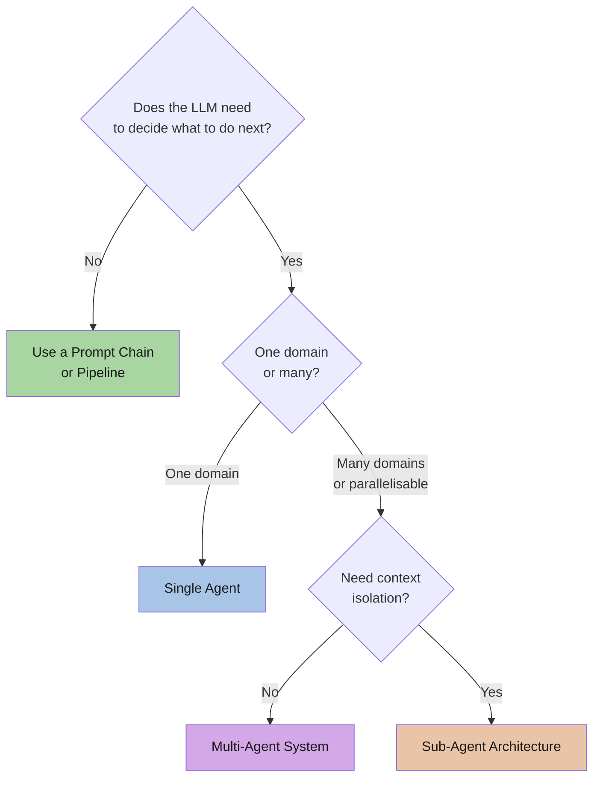

---

## Single-Agent Systems

A single agent is **one LLM running one loop** with a specific set of tools and a persona. It handles a task end to end — like a solo employee managing a project from start to finish.

### Single-Agent Architecture

▸ **Structure**: One LLM + one system prompt + a defined set of tools  
▸ **Best For**: Well-defined, sequential workflows where a single reasoning loop is sufficient  
▸ **Key Benefit**: Low operational complexity, easy to debug, cost-effective  

Single-agent systems are ideal for simple, sequential tasks like personal assistants, local RAG pipelines, coding assistants, and system-administration monitors.

### Single-Agent Use Cases

| Use Case | Description | Example Tool |
|----------|-------------|--------------|
| Personal Assistant | Manages tasks, calendar, reminders | Google Calendar API |
| Document Summariser | Reads and condenses PDFs or web pages | Local file reader |
| Coding Assistant | Analyses code, suggests fixes | Shell executor, code linter |
| Local RAG System | Expert over private documents | Vector DB (Chroma, FAISS) |
| System Monitor | Watches logs, alerts on threshold | Shell / syslog tools |
| Chatbot | Conversational Q&A without internet | Ollama local LLM |

**Best for:** Well-defined, sequential workflows where a single "brain" is sufficient and you want to minimise operational complexity.

### Single-Agent Workflow

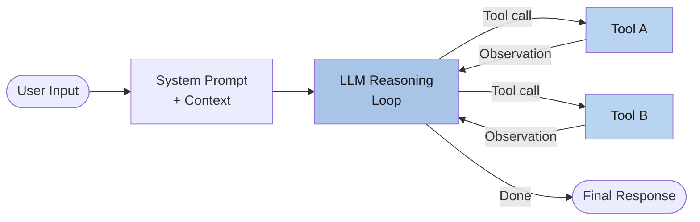

---

## Multi-Agent Systems

A multi-agent system is **multiple LLMs, each with their own tools and instructions, coordinating on a bigger task**. Like a team where the researcher hands off to the writer, who hands off to the editor.

### Multi-Agent Architecture

▸ **Structure**: Multiple specialised agents, each with a role, tools, and instructions  
▸ **Best For**: Projects that require parallel processing, specialised domain expertise, or tasks exceeding a single context window  
▸ **Key Benefit**: Scalability, fault tolerance, and parallel execution in process-driven environments  

Multi-agent systems distribute work across specialised agents, improving scalability and enabling complex, cross-functional workflows that would overwhelm a single agent's context window.

**Framework choices for multi-agent:**
- **CrewAI** — role-based team orchestration; define a "Crew" with agents assigned to tasks
- **AutoGen** — conversational group-chat where agents discuss and hand off autonomously
- **LangGraph** — state-machine based orchestration with deterministic flow control

### Multi-Agent Use Cases

| Use Case | Agents Involved | Why Multi-Agent? |
|----------|-----------------|-----------------|
| Software engineering pipeline | Coder, Reviewer, Tester | Parallel specialisation |
| Research report | Researcher, Analyst, Writer, Editor | Sequential + diverse expertise |
| Content strategy | Strategist, Writer, SEO Reviewer | Role specialisation |
| Fraud detection | Transaction Monitor, Anomaly Detector, Alert Agent | Real-time parallel processing |
| Agricultural AI (Syngenta Cropwise) | Data Aggregation, Recommendation, Conversational | Each agent handles a bounded context |

**Best for:** Complex research, large-scale software engineering, content strategy, or any task requiring diverse perspectives, parallelism, or context-window overflow.

### Multi-Agent Workflow

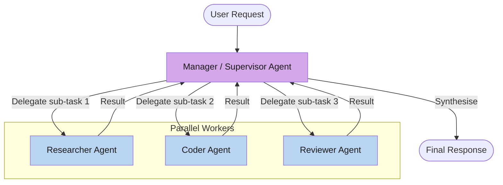

**Key insight from Anthropic (Claude Research system):** Multi-agent systems excel especially for breadth-first queries that involve pursuing multiple independent directions simultaneously. They work mainly because they allow spending enough tokens to solve problems that exceed the limits of single agents. For economic viability, the value of the task must be high enough to pay for the increased token cost.

---

## Sub-Agent Architecture

Sub-agents are **context-isolated agents spawned by a main agent** to handle specific sub-tasks and return only a summary of results. This keeps the primary agent's context "clean" and allows for parallel execution.

A sub-agent is not a persistent entity — it is **short-lived** and task-focused: spawned for one purpose, completes it, then returns results to the calling agent. This prevents memory leaks, manages token usage, and enables parallelism within a single, complex phase.

▸ **Structure**: A coordinator agent spawns child agents for granular work  
▸ **Best For**: Deep research into specific sub-topics, tool-calling sub-tasks, or specialised parsing/execution roles within a larger workflow  
▸ **Key Benefit**: Prevents context contamination, enables parallel execution, reduces token overhead  

### Sub-Agent Use Cases

| Orchestrator | Sub-Agent | Sub-Task |
|---|---|---|
| Report Agent | Web Search Sub-Agent | Find recent facts and citations |
| Report Agent | PDF Reader Sub-Agent | Review local documentation |
| TDD Coordinator | Red Agent | Write failing tests |
| TDD Coordinator | Green Agent | Write code to pass tests |
| TDD Coordinator | Refactor Agent | Improve code quality |
| Feature Builder | Planner Agent | Break down feature into tasks |
| Feature Builder | Implementer Agent | Write code |
| Feature Builder | Reviewer Agent | Check implementation |

**Use Sub-Agents when you need to:**
▪ Prevent memory leaks and context contamination  
▪ Manage token usage by clearing context between phases  
▪ Parallelise a single, complex phase (e.g., parallel code review from multiple perspectives)  
▪ Delegate to a specialised model without bloating the main agent's context  

### Sub-Agent Workflow

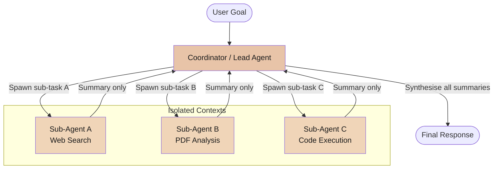

**Nested sub-agents** are supported by frameworks and platforms (e.g., VS Code Copilot `chat.subagents.allowInvocationsFromSubagents`, LangGraph nested graphs). Sub-agents can spawn further sub-agents up to a configurable depth limit, enabling divide-and-conquer patterns for very large tasks.

---

## Agent Capabilities

The following capabilities differentiate basic LLM pipelines from true agentic systems. Each adds power but also complexity — add only what your use case requires.

### Tools and MCP

**Tool use** is the foundational capability that turns an LLM into an agent. Without tools, the LLM can only generate text; with tools, it can act on the world.

▪ **Function calling / tool use**: The LLM calls external Python functions, APIs, shell commands, or databases  
▪ **MCP (Model Context Protocol)**: De facto standard for connecting agents to tool servers. A single MCP server can expose multiple tools to any compatible agent framework  
▪ **MCP clients** are built into Open WebUI, Cursor, and VS Code Copilot  
▪ **MCP servers** exist for file system, GitHub, databases, web search, shell, and more  

```
Agent  ──tool_call──▶  MCP Server  ──▶  Tool (web search, file, API…)
       ◀──result──────              ◀──
```

**Example MCP servers for local use:**

| MCP Server | Function |
|---|---|
| `fastdomaincheck-mcp-server` | Check domain availability |
| `@modelcontextprotocol/server-filesystem` | Read/write local files |
| `@modelcontextprotocol/server-github` | GitHub repositories and issues |
| `mcp-server-sqlite` | Local SQLite database queries |
| `tavily-mcp` | Web search via Tavily API |

### Memory Systems

| Type | Scope | Implementation |
|---|---|---|
| Short-term (working) | Single run | In-context conversation history |
| Long-term | Across runs | Vector DB (Chroma, FAISS), DynamoDB, Redis |
| Shared | Multiple agents | Shared vector store or external memory bus |
| Episodic | Summarised past sessions | LLM-compressed summaries stored externally |

▸ **Short-term memory**: What the agent knows during a single run — the messages and observations in its context window
▸ **Long-term memory**: Persistent storage across runs — retrieved via semantic search from a vector database
▸ **Shared memory**: Multiple agents in a multi-agent system read from and write to a shared store, enabling coordination without direct communication

### Planning and Reasoning

Planning separates reactive agents (respond to each input independently) from deliberative agents (reason about a multi-step strategy):

▪ **Chain-of-thought reasoning** — thinking step by step before acting
▪ **Task decomposition** — breaking a large task into manageable sub-tasks
▪ **Self-reflection** — checking its own work and adjusting
▪ **Backtracking** — recognising it went down the wrong path and trying a different approach
▪ **ReAct (Reason + Act)** — the most common pattern: Thought → Action → Observation → repeat

### Multi-Agent Orchestration Patterns

| Pattern | Description | Example |
|---|---|---|
| Sequential | Agent A finishes → output to Agent B → output to Agent C | Research → Write → Edit |
| Parallel | Agents A, B, C run simultaneously on different sub-tasks | Parallel code review perspectives |
| Hierarchical | Manager agent delegates to worker agents and assembles results | Supervisor + sub-agents (Bedrock) |
| Routing | Simple queries go directly to a specialist; complex queries go to supervisor | Bedrock "Supervisor with Routing" mode |
| Recursive | An agent spawns instances of itself (divide and conquer) | RecursiveProcessor in VS Code |

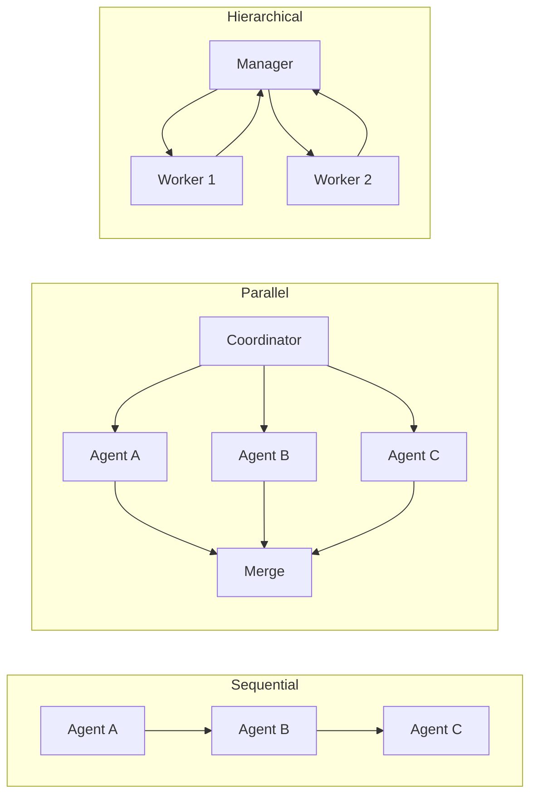

### Human-in-the-Loop

In production, you rarely want agents running completely unsupervised. The ability to pause, inspect state, approve high-risk actions, and resume is what separates demos from real systems.

▪ **Approval gates**: Pause before irreversible actions (file deletion, API calls, deployments)  
▪ **State inspection**: Review agent memory, tool call history, and intermediate reasoning  
▪ **Feedback injection**: Correct the agent's plan mid-execution  
▪ **Annotation queues**: Human reviewers score agent outputs to build evaluation datasets  

Framework support: LangGraph checkpointing + `interrupt()`, AutoGen human proxy agent, Bedrock Guardrails + manual approval workflow.

---

## Multi-Agent Collaboration

> "Generative AI is no longer just about models generating responses — it's about automation. The next wave of innovation is driven by agents that can reason, plan, and act autonomously across company systems." — Amazon Web Services

Multi-agent collaboration refers to networks of specialised agents that communicate and coordinate under the guidance of a supervisor agent. Each agent contributes its expertise to the larger workflow by focusing on a specific bounded task.

**Why multi-agent collaboration?**

▪ Tasks that require specialised domain expertise (one agent writes code, another tests it)  
▪ Workflows that exceed a single context window  
▪ Tasks that are inherently parallelisable (research across multiple sources simultaneously)  
▪ Complex processes that benefit from separation of concerns and fault isolation  

**Single-agent vs. multi-agent:**

| Dimension | Single-Agent | Multi-Agent |
|---|---|---|
| Complexity | Simple to govern | Requires orchestration layer |
| Cost | Lower token spend | Higher token spend — justified by task value |
| Use case fit | Sequential, well-defined tasks | Cross-functional, parallelisable workflows |
| Context | One shared context window | Each agent has its own context |
| Fault tolerance | Single point of failure | Isolated failures per agent |
| Scalability | Limited by context window | Scales with number of agents |

**Context engineering** — carefully controlling what information each sub-agent receives — is the most critical skill when building multi-agent systems. Without precise task descriptions, agents duplicate work, leave gaps, or fail to find necessary information.

For long-horizon tasks, agents can summarise completed work phases and store essential information in external memory before proceeding to new tasks. When context limits approach, agents spawn fresh sub-agents with clean contexts while maintaining continuity through careful handoffs.

**Multi-agent collaboration across industries (AWS Bedrock examples):**
▪ Investment advisory — market trend, risk, and opportunity agents deliver personalised recommendations  
▪ Retail operations — demand forecasting, inventory, pricing, and fulfilment agents work in parallel  
▪ Fraud detection — transaction monitor, anomaly detector, and alert agents operate in real time  
▪ Healthcare diagnosis — patient records, symptom recognition, imaging review, and treatment plan agents assist clinicians  

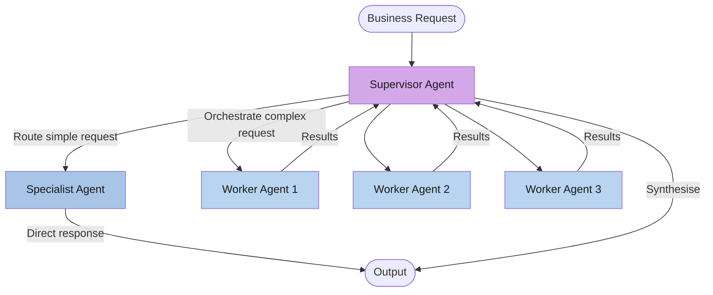

---

## Autonomous Agents & Tools

Auto-GPT: A popular autonomous agent that uses LLMs to perform tasks autonomously, including web browsing and file handling.
Open Interpreter: An agent that runs code (Python, JS, Shell) locally to control the computer and interact with files.
SuperAGI: A full-stack agent infrastructure that includes a GUI and toolkits.
BabyAGI: Focused on task planning, prioritization, and execution loops.

## VS Code and Agents

Visual Studio Code has emerged as a leading platform for AI agent-driven software development, providing an integrated environment where developers can leverage autonomous AI assistants to enhance productivity, code quality, and development workflows. This section explores how to effectively utilize VS Code with AI agents for modern software development.

### How AI Agents Function in VS Code

AI agents in VS Code operate through a sophisticated multi-step process that mirrors human problem-solving approaches:

**Task Decomposition and Planning:**
- Agents analyze complex requests and break them down into manageable, sequential subtasks
- Create execution plans that account for dependencies, file structures, and existing code patterns
- Adapt plans dynamically based on intermediate results and encountered obstacles

**Codebase Interaction and Understanding:**
- Read and analyze entire codebases to understand architecture, patterns, and conventions
- Use semantic search capabilities to locate relevant code sections across multiple files
- Build context from imports, types, documentation, and existing implementations

**Autonomous Execution:**
- Execute tools and commands to modify code, run tests, and validate changes
- Self-correct when errors are detected, attempting alternative approaches
- Provide explanations and reasoning for decisions made during execution

**Iterative Refinement:**
- Monitor test results and compilation errors to identify issues
- Automatically adjust implementations based on feedback
- Request human intervention only when truly necessary or ambiguous

### Key Features and Capabilities

**Automated Feature Implementation:**
- **Issue-to-Code Workflow**: Assign GitHub issues or feature requests directly to agents, which autonomously implement the feature and create draft pull requests
- **Multi-File Coordination**: Agents can create, modify, and refactor code across multiple files while maintaining consistency
- **Architecture Awareness**: Respect existing design patterns, naming conventions, and architectural decisions

**Integrated Testing and Validation:**
- **Unit Test Generation**: Automatically generate unit tests for new or modified code
- **Test Execution**: Run test suites and analyze failures to identify and fix issues
- **Frontend Testing**: Use integrated browser tools to interact with running applications, inspect UI elements, and validate user interactions
- **Visual Regression Testing**: Detect unintended UI changes through automated screenshot comparison

**Context-Aware Coding:**
- **Semantic Understanding**: Agents comprehend the purpose and context of code beyond syntax
- **Cross-File Refactoring**: Safely refactor code with automatic updates to all dependent files
- **Documentation Awareness**: Utilize existing documentation, README files, and code comments to inform decisions
- **Type System Integration**: Leverage TypeScript, Python type hints, and other type systems for safer refactoring

**Intelligent Code Review:**
- **Automated Code Analysis**: Identify potential bugs, performance issues, and security vulnerabilities
- **Style Guide Enforcement**: Ensure code adheres to team conventions and industry best practices
- **Optimization Suggestions**: Recommend performance improvements and code simplification opportunities

### Tools and Extensions for AI Agent Development

Several powerful tools and extensions enable AI agent-driven development in VS Code:

**GitHub Copilot:**
- **Agent Mode**: Enables autonomous operation with the ability to understand and implement changes across entire repositories
- **Chat Interface**: Natural language interaction for code generation, explanation, and debugging
- **Inline Suggestions**: Real-time code completion based on context and patterns
- **Command Execution**: Run terminal commands, tests, and build processes through agent directives

**Azure AI Foundry Agent Service:**
- **Cloud-Connected Agents**: Build and test agents connected to Azure services directly within VS Code
- **Custom Tool Integration**: Connect agents to internal APIs, databases, and cloud resources
- **Enterprise Security**: Leverage Azure's security and compliance features for agent operations
- **Scalability**: Deploy agents that can handle enterprise-scale codebases and workflows

**Sourcery:**
- **AI Code Review**: Continuous real-time code review with optimization suggestions
- **Refactoring Automation**: Automated code improvements while maintaining functionality
- **Quality Metrics**: Track code quality trends and identify areas for improvement

**Continue:**
- **Open-Source Alternative**: Free and extensible AI coding assistant
- **Custom Model Support**: Use any LLM backend (OpenAI, Anthropic, local models)
- **Codebase Indexing**: Create embeddings of your entire codebase for enhanced context

**Cursor (VS Code Fork):**
- **Native Agent Integration**: VS Code fork with deeply integrated AI agent capabilities
- **Codebase Chat**: Ask questions about your entire codebase with semantic search
- **Composer Mode**: Multi-file editing with agent assistance

### How to Set Up AI Agent-Driven Software Development

**Step 1: Install and Configure Required Extensions**

1. **Install GitHub Copilot (Recommended)**
   ```bash
   code --install-extension GitHub.copilot
   code --install-extension GitHub.copilot-chat
   ```

2. **Configure Copilot Settings**
   - Open VS Code Settings (Ctrl+, or Cmd+,)
   - Search for "Copilot"
   - Enable "Enable Auto Completions"
   - Configure language-specific settings as needed

3. **Install Additional Agent Tools** (Optional)
   ```bash
   code --install-extension Continue.continue
   code --install-extension sourcery.sourcery
   ```

**Step 2: Activate and Configure Agent Features**

1. **Enable Agent Mode in GitHub Copilot**
   - Open Copilot Chat panel (Ctrl+Shift+I or Cmd+Shift+I)
   - Look for agent selection dropdown
   - Choose from available agents: `@workspace`, `@terminal`, `@vscode`

2. **Configure Agent Behavior**
   - Create `.github/copilot-instructions.md` in your repository root
   - Define project-specific guidelines, patterns, and constraints
   - Example configuration:
     ```markdown
     # Project Guidelines for Copilot
     
     ## Code Style
     - Use functional components in React
     - Prefer async/await over .then() chains
     - Always include error handling
     
     ## Testing
     - Write unit tests for all business logic
     - Use Jest for JavaScript/TypeScript
     - Aim for 80% code coverage
     
     ## Architecture
     - Follow Clean Architecture principles
     - Keep components under 200 lines
     - Use dependency injection
     ```

3. **Set Up Custom Agents** (Advanced)
   - Define agent-specific instructions in `.vscode/agents.json`
   - Configure tool access permissions and capabilities
   - Establish guardrails and validation rules

**Step 3: Connect and Configure Tools**

1. **Integrated Browser for UI Testing**
   - Install browser automation tools (Playwright, Selenium)
   - Configure agents to access the integrated browser
   - Set up visual testing frameworks

2. **MCP Server Integration** (Model Context Protocol)
   - Install and configure MCP server for custom tool access
   - Connect agents to internal APIs, databases, and services
   - Define security boundaries and access controls

3. **Version Control Integration**
   - Configure Git settings for agent commits
   - Set up branch protection rules
   - Enable automated PR creation workflows

**Step 4: Define or Select Appropriate Agents**

VS Code supports various specialized agents for different tasks:

- **@workspace**: For codebase-wide questions and operations
- **@terminal**: For command execution and build operations
- **@vscode**: For VS Code settings and configuration
- **Custom Agents**: Define specialized agents for your domain

**Step 5: Interaction and Task Assignment**

1. **Natural Language Prompts**
   - Use clear, specific instructions: "Implement user authentication with JWT"
   - Provide context: "Following the existing pattern in `auth.service.ts`"
   - Specify constraints: "Ensure all endpoints have rate limiting"

2. **Iterative Refinement**
   - Review agent-generated code
   - Provide feedback: "Make this function more testable"
   - Request explanations: "Explain why you chose this approach"

3. **Multi-Step Workflows**
   - Chain multiple tasks: "Implement feature X, then write tests, then update docs"
   - Monitor progress through agent status indicators
   - Intervene when necessary to guide direction

### Best Practices for Working with Agents

**Effective Prompting:**
- Be specific and provide context about your codebase and requirements
- Break complex tasks into smaller, manageable subtasks
- Reference specific files, functions, or patterns when relevant
- Include acceptance criteria and expected outcomes

**Code Review and Validation:**
- Always review agent-generated code before merging
- Run test suites on agent changes
- Use static analysis tools to catch potential issues
- Verify that changes align with architectural decisions

**Security Considerations:**
- Never expose sensitive credentials or API keys to agents
- Review agent access to external services and APIs
- Use environment variables for configuration
- Implement rate limiting to prevent excessive API calls

**Continuous Learning:**
- Provide feedback on agent suggestions to improve accuracy
- Update project guidelines as patterns emerge
- Share successful prompts and workflows with your team
- Document edge cases and limitations encountered

**Team Collaboration:**
- Establish team conventions for agent usage
- Create shared agent configurations and instruction files
- Conduct code reviews even for agent-generated code
- Share insights and best practices across the team

### Agent Customization and Configuration

**Creating Custom Agents:**

1. **Define Agent Purpose and Scope**
   ```json
   {
     "agents": [
       {
         "name": "database-expert",
         "description": "Specialized in database schema design and query optimization",
         "tools": ["sql", "database-profiler", "migration-generator"],
         "model": "gpt-4",
         "systemPrompt": "You are a database expert specializing in PostgreSQL..."
       }
     ]
   }
   ```

2. **Configure Tool Access**
   - Specify which tools and APIs the agent can access
   - Set rate limits and usage quotas
   - Define error handling and fallback strategies

3. **Establish Guardrails**
   - Define code quality thresholds
   - Set up automated validation rules
   - Implement human-in-the-loop checkpoints for critical operations

**Example Agent Configuration Files:**

**.github/copilot-instructions.md**: Repository-level instructions
**.vscode/agents.json**: Custom agent definitions
**.vscode/settings.json**: VS Code and Copilot settings
**agent.config.yaml**: Advanced agent behavior configuration

**Integration with CI/CD:**
- Automate agent-driven code reviews in pull requests
- Run agent-generated tests in CI pipelines
- Use agents to generate release notes and documentation
- Implement automated security scanning of agent changes

By effectively leveraging AI agents in VS Code, development teams can significantly accelerate feature development, improve code quality, and reduce cognitive load on developers, allowing them to focus on high-level architectural decisions and creative problem-solving.

## Steps to Create an AI Agent

### Prerequisites

Before developing an AI agent, ensure you have the following foundational knowledge and resources:

**Technical Prerequisites:**
- Proficiency in Python or JavaScript programming
- Understanding of REST APIs and HTTP protocols
- Familiarity with Large Language Models (LLMs) and their APIs
- Knowledge of software design patterns and architecture principles
- Experience with version control systems (Git) and containerization (Docker)

**Infrastructure Requirements:**
- Access to LLM APIs (OpenAI GPT, Anthropic Claude, Google Gemini, or open-source alternatives)
- Development environment with package management (pip, npm, conda)
- Database systems for persistent storage (PostgreSQL, MongoDB, or vector databases)
- API rate limiting and error handling capabilities

### Step 1: Task Definition and Scope Analysis

**Objective**: Clearly articulate the agent's purpose, constraints, and success criteria.

**Activities:**
- Define the problem domain and target user base
- Establish measurable performance metrics and evaluation criteria
- Identify required input/output formats and data types
- Document edge cases and failure scenarios
- Create user stories and acceptance criteria

**Deliverables:**
- Task specification document
- Success metrics definition
- Risk assessment and mitigation strategies

### Step 2: Tool Repository Development

**Objective**: Create a toolkit of functions and external integrations.

**Tool Categories:**
- **Information Retrieval**: Web scraping, database queries, API integrations
- **Data Processing**: Text analysis, image processing, mathematical computations
- **Communication**: Email sending, messaging platforms, notification systems
- **File Operations**: Document creation, data export, file management
- **External Services**: Cloud services, third-party APIs, specialized platforms

**Implementation Guidelines:**
- Implement standardized tool interfaces with consistent error handling
- Create tool documentation and usage examples
- Establish rate limiting and authentication mechanisms
- Implement tool validation and testing procedures
- Design modular architecture for easy tool addition and removal

### Step 3: Framework Selection and Architecture Design

**Objective**: Choose appropriate frameworks and design system architecture.

**Architecture Decisions:**
- Select agent framework based on requirements (see frameworks section below)
- Design conversation flow and state management systems
- Implement memory systems for context retention
- Create error handling and recovery mechanisms
- Establish logging and monitoring infrastructure

**Key Components:**
- **Agent Core**: Main reasoning and decision-making engine
- **Tool Manager**: Interface for tool discovery and execution
- **Memory System**: Context storage and retrieval mechanisms
- **Communication Layer**: Input/output handling and user interaction
- **Monitoring System**: Performance tracking and debugging capabilities

### Step 4: Implementation and Integration

**Objective**: Deploy the complete agent system with testing.

**Development Phase:**
- Implement agent logic using chosen framework
- Integrate all tools with proper error handling
- Create test suites (unit, integration, end-to-end)
- Implement continuous integration and deployment pipelines
- Establish monitoring and alerting systems

**Testing Strategies:**
- **Unit Testing**: Individual tool and component validation
- **Integration Testing**: Inter-component communication verification
- **Performance Testing**: Load testing and response time analysis
- **User Acceptance Testing**: Real-world scenario validation
- **Security Testing**: Authentication, authorization, and data protection validation

**Deployment Considerations:**
- Containerization for consistent environments
- Horizontal scaling capabilities
- Database migration and backup strategies
- API versioning and backward compatibility
- Documentation and user training materials

## Open-Source Tools and Frameworks for AI Agents (2026)

### Enterprise-Grade Frameworks

#### **LangChain**
*Location: `./LangChain/`*
- **Description**: Industry-leading framework for building production-grade LLM applications with extensive ecosystem
- **Key Features**: LangGraph Studio integration, enhanced tool orchestration, advanced memory systems, streaming support, LangSmith observability
- **New in 2026**: Native support for multi-agent collaboration, improved error recovery, real-time agent monitoring, enhanced security features
- **Best For**: Enterprise-grade multi-step workflows, complex RAG applications, production deployments with observability
- **Language Support**: Python, JavaScript/TypeScript
- **Notable Integrations**: OpenAI, Anthropic Claude, Google Gemini, Groq, Pinecone, Weaviate, Qdrant, 200+ integrations

#### **LangGraph**
*Location: `./LangGraph/`*
- **Description**: Advanced graph-based framework for building stateful, multi-actor applications with cyclic workflows
- **Key Features**: Persistent checkpointing, time-travel debugging, parallel execution nodes, dynamic graph modification, human-in-the-loop workflows
- **New in 2026**: LangGraph Cloud deployment platform, visual workflow designer, automatic parallelization, enhanced state management
- **Best For**: Complex agent orchestration, multi-agent systems, conversational AI with memory, autonomous task execution
- **Language Support**: Python, JavaScript
- **Notable Features**: Built-in persistence layer, streaming token support, conditional branching, multi-tenant deployments

#### **LlamaIndex**
*Location: `./LlamaIndex/`*
- **Description**: Advanced data framework specialized in connecting LLMs with structured and unstructured data sources
- **Key Features**: Agentic RAG workflows, query planning, sub-question decomposition, hybrid search, knowledge graph reasoning
- **New in 2026**: Enhanced multi-modal support (vision, audio), query optimization engine, automatic index selection, graph RAG capabilities
- **Best For**: Advanced document analysis, enterprise knowledge bases, semantic search, multi-modal data processing
- **Language Support**: Python, TypeScript
- **Data Connectors**: 250+ connectors including databases, cloud storage, APIs, web scrapers, enterprise systems

#### **CrewAI**
- **Description**: Role-based multi-agent collaboration framework designed for orchestrating teams of AI agents
- **Key Features**: Role assignment, task delegation, sequential and hierarchical processes, agent memory sharing, collaborative decision-making
- **New in 2026**: Enhanced agent communication protocols, built-in workflow templates, visual agent designer, enterprise deployment tools
- **Best For**: Multi-agent collaboration, complex task decomposition, autonomous team coordination, business process automation
- **Language Support**: Python
- **Notable Features**: Natural language task definition, automatic role optimization, cross-agent context sharing

### Specialized Agent Frameworks

#### **AutoGen**
- **Description**: Microsoft's framework for building next-generation LLM applications with conversable agents
- **Key Features**: Multi-agent conversations, code execution, human feedback integration, flexible agent design patterns
- **New in 2026**: AutoGen Studio 2.0 with no-code interface, enhanced security sandboxing, multi-modal agent support
- **Best For**: Conversational AI systems, code generation workflows, research and experimentation, teaching AI agents
- **Language Support**: Python
- **Enterprise Features**: Azure integration, enterprise security, scalability features

#### **Haystack**
*Location: `./Haystack/`*
- **Description**: Production-ready NLP framework with advanced search, RAG, and agent capabilities
- **Key Features**: Pipeline components, neural search, document preprocessing, answer generation, agent loops
- **New in 2026**: Native LLM agent support, enhanced multi-modal processing, improved pipeline optimization
- **Best For**: Production search applications, question-answering systems, document intelligence
- **Language Support**: Python
- **Production Features**: REST API, Kubernetes deployment,  evaluation tools, monitoring dashboards

#### **Semantic Kernel**
*Location: `./Semantic Kernel/`*
- **Description**: Microsoft's enterprise-grade SDK for integrating AI into applications with strong governance
- **Key Features**: Function calling, prompt management, planner components, plugin architecture, memory connectors
- **New in 2026**: Native Azure AI integration, enhanced orchestration patterns, improved plugin marketplace
- **Best For**: Enterprise applications, .NET ecosystems, regulated industries, Microsoft cloud deployments
- **Language Support**: C#, Python, Java
- **Enterprise Features**: Azure OpenAI integration, compliance frameworks, audit logging, role-based access control

#### **Agent Development Kit (ADK)**
*Location: `./Agent Development Kit/`*
- **Description**: Google's toolkit for building scalable AI agents on Google Cloud
- **Key Features**: Multi-modal capabilities, Vertex AI integration, tool integration, deployment automation, model garden access
- **New in 2026**: Gemini 2.0 native support, enhanced reasoning capabilities, vision-language agent workflows
- **Best For**: Google Cloud native deployments, scalable agent infrastructure, multi-modal applications
- **Language Support**: Python, Go
- **Cloud Integration**: Vertex AI, Google Cloud Run, Google Kubernetes Engine

#### **Pydantic AI**
- **Description**: Modern Python framework leveraging Pydantic for type-safe agent development
- **Key Features**: Strong typing with Pydantic V2, dependency injection, structured outputs, validation-first design
- **New in 2026**: Enhanced streaming support, multi-agent orchestration, production deployment patterns
- **Best For**: Type-safe Python applications, structured data extraction, enterprise Python projects
- **Language Support**: Python
- **Notable Features**: Runtime validation, automatic schema generation, excellent IDE support

#### **OpenDevin**
- **Description**: Autonomous AI software engineer capable of complex development tasks
- **Key Features**: Code generation, debugging, testing, file system operations, browser automation
- **New in 2026**: Enhanced code understanding, multi-repository workflows, CI/CD integration
- **Best For**: Autonomous software development, code review automation, development assistance
- **Language Support**: Python
- **Notable Features**: Sandboxed execution environment, GitHub integration, interactive debugging

### No-Framework Approach
*Location: `./No Framework/`*
- **Description**: Direct implementation using LLM APIs, Function Calling, and structured outputs without framework dependencies
- **Key Features**: Maximum flexibility, minimal overhead, custom architecture, direct control over all components
- **New in 2026**: Enhanced with native function calling in GPT-4, Claude 3.5, Gemini 2.0; structured outputs API
- **Best For**: Educational purposes, specific performance requirements, minimal dependencies, custom optimization needs
- **Advantages**: Full architectural control, reduced dependency complexity, optimal performance tuning, lower latency
- **Considerations**: Higher initial development effort, manual implementation of common patterns, requires deep LLM API knowledge

### Framework Comparison Matrix

| Framework | Complexity | Learning Curve | Production Ready | Community | Active Development | Use Case Focus |
|-----------|------------|----------------|------------------|-----------|-------------------|----------------|
| LangChain | High | Moderate | ✅ | Very Large | ⭐⭐⭐⭐⭐ | General Purpose |
| LangGraph | High | Steep | ✅ | Large | ⭐⭐⭐⭐⭐ | Complex Workflows |
| LlamaIndex | Moderate | Moderate | ✅ | Very Large | ⭐⭐⭐⭐⭐ | Data-Centric RAG |
| CrewAI | Moderate | Low | ✅ | Large | ⭐⭐⭐⭐⭐ | Multi-Agent Teams |
| AutoGen | Moderate | Moderate | ✅ | Large | ⭐⭐⭐⭐ | Conversational Agents |
| Haystack | Moderate | Moderate | ✅ | Medium | ⭐⭐⭐⭐ | Search/QA Systems |
| Semantic Kernel | Low | Easy | ✅ | Medium | ⭐⭐⭐⭐ | Enterprise/.NET |
| ADK | High | Steep | ✅ | Small | ⭐⭐⭐ | Google Cloud |
| Pydantic AI | Low | Easy | ✅ | Growing | ⭐⭐⭐⭐ | Type-Safe Python |
| OpenDevin | Moderate | Moderate | 🔄 Beta | Medium | ⭐⭐⭐⭐ | Code Generation |
| No Framework | Variable | Easy | Depends | N/A | N/A | Custom Solutions |

### Selection Criteria of Framework for AI Agents

**Choose LangChain if:** You need the ecosystem, extensive integrations, enterprise observability, and rapid prototyping for general-purpose agent applications

**Choose LangGraph if:** You're building complex stateful agents with cyclic workflows, need time-travel debugging, or require sophisticated orchestration of multi-step processes

**Choose LlamaIndex if:** Your primary focus is advanced RAG applications, multi-modal data processing, enterprise knowledge management, or query optimization over complex data sources

**Choose CrewAI if:** You need role-based multi-agent collaboration, task delegation between specialized agents, or autonomous team coordination for complex business workflows

**Choose AutoGen if:** You're building conversational multi-agent systems, need extensive human-in-the-loop capabilities, or want to experiment with agent communication patterns

**Choose Haystack if:** You're building production search applications, need strong document processing pipelines, or require battle-tested NLP components

**Choose Semantic Kernel if:** You're working in enterprise environments with Microsoft technologies, need strong governance, or deploying on Azure cloud infrastructure

**Choose Pydantic AI if:** You want type-safe Python development, strong validation, excellent IDE support, or are already using Pydantic in your stack

**Choose OpenDevin if:** You need an autonomous software engineering agent for code generation, debugging, or automated development tasks

**Choose No Framework if:** You have specific performance requirements, want minimal dependencies, need maximum control, or are building educational/learning projects

### Emerging Trends in AI Agent Development (2026)

**Multi-Agent Collaboration**: Frameworks increasingly support collaborative multi-agent systems where specialized agents work together to solve complex problems

**Enhanced Observability**: Production-grade monitoring, debugging, and tracing tools are now standard features in major frameworks

**Multi-Modal Agents**: Native support for vision, audio, and document processing is becoming ubiquitous across frameworks

**Security & Compliance**: Enterprise-focused frameworks now include built-in security features, audit logging, and compliance tools

**Autonomous Code Generation**: AI agents capable of writing, testing, and deploying code with minimal human intervention

**Real-Time Streaming**: Enhanced streaming capabilities for token-by-token responses and progressive task execution

**Cloud-Native Deployment**: Improved containerization, orchestration, and serverless deployment options for agent applications

---

## Local Deployment with Ollama

For a local Linux deployment, the recommended stack is:

| Component | Open-Source Tool | Role |
|---|---|---|
| Inference server | **Ollama** | Serves local LLMs via OpenAI-compatible API |
| Web client | **Open WebUI** | Chat interface with MCP, RAG, and tool support |
| Agent framework | **CrewAI / LangGraph / AutoGen** | Orchestrates single or multi-agent workflows |
| Vector store | **Chroma / FAISS** | Local embedding storage for RAG |
| Package manager | **uv** | Fast Python environment and dependency management |

### Setup Local Inference

```bash
# Install Ollama on Linux
curl -fsSL https://ollama.com/install.sh | sh

# Pull a model capable of reasoning and tool-calling
ollama pull llama3
ollama pull qwen2.5          # alternative — strong tool-calling support
ollama pull phi4             # smaller model, good for single-agent use

# Verify Ollama is running (OpenAI-compatible endpoint)
curl http://localhost:11434/v1/models
```

### Open WebUI

Open WebUI provides a ChatGPT-like interface connected to your local Ollama instance, with support for knowledge bases (RAG), MCP tool servers, and custom system prompts.

```bash
# Run Open WebUI via Docker (connects to host Ollama automatically)
docker run -d \
  -p 3000:8080 \
  --add-host=host.docker.internal:host-gateway \
  -v open-webui:/app/backend/data \
  --name open-webui \
  --restart always \
  ghcr.io/open-webui/open-webui:main

# Open in browser
xdg-open http://localhost:3000
```

Once Open WebUI is running, configure a system prompt for each model via **Admin Panel → Models → Edit** or per-conversation via the **System Prompt** field.

### Single-Agent Local Deployment

A single-agent setup uses one LLM loop with a specific persona and tools. For a local RAG system (the most common single-agent use case on Linux), the agent acts as an expert on your private documents — no data leaves your machine.

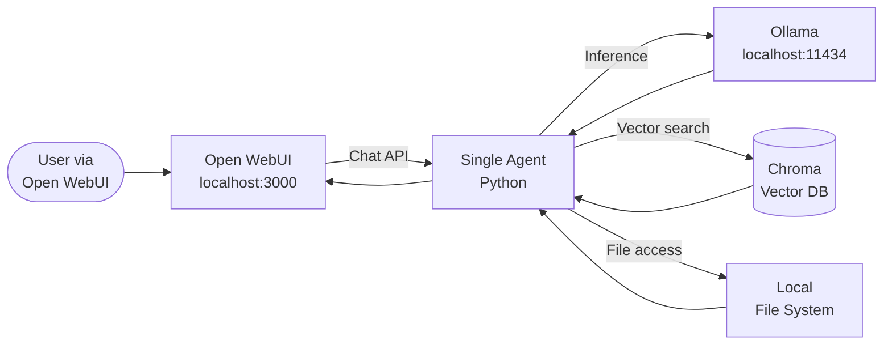

### Multi-Agent Local Deployment

CrewAI and AutoGen both integrate natively with Ollama using its OpenAI-compatible API.

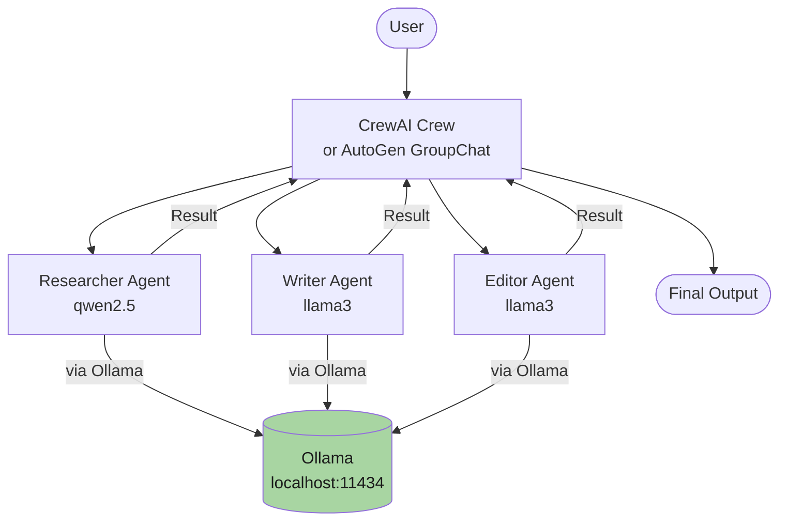

**Framework comparison for local deployment:**

| Framework | Local Ollama Integration | Best For |
|---|---|---|
| CrewAI | `ChatOllama` or `base_url="http://localhost:11434/v1"` | Human-like team roles and hierarchical workflows |
| AutoGen | Native `OllamaChatCompletionClient` | Conversational, autonomous collaboration |
| LangGraph | Direct via `langchain-ollama` | Deterministic, state-machine-based logic |

### Sub-Agent Local Deployment

For sub-agent patterns on Linux, LangGraph is the most effective framework. It supports nested graphs where a parent graph spawns child graphs (sub-agents) with their own isolated state.

```bash
# Install dependencies
pip install langgraph langchain-ollama

# Sub-agent invocation pattern in LangGraph
from langgraph.graph import StateGraph, START, END
# define parent graph that calls a compiled sub-graph as a node
```

---

## Cloud Deployment on Amazon AWS

### Amazon Bedrock Agents

Amazon Bedrock Agents provides managed, serverless infrastructure for building, deploying, and scaling AI agents using foundation models (Anthropic Claude, Amazon Nova, Meta Llama, and others). The core pattern involves **Supervisor Agents** managing **Sub-Agents** (specialised collaborators) for complex tasks.

**AWS Agentic Component Map:**

| Component | AWS Service | Purpose |
|---|---|---|
| Agent Core | Amazon Bedrock Agents | Create, manage, and deploy AI agents |
| Orchestration | Bedrock Multi-Agent Collaboration | Coordinate supervisor/sub-agent workflows |
| Action / Tools | AWS Lambda | Execute serverless API calls for agents |
| Memory | Bedrock Session State / DynamoDB | Manage conversation memory and context |
| RAG | Amazon Bedrock Knowledge Bases | Connect agents to document stores (S3, OpenSearch) |
| Security | Amazon Bedrock Guardrails | Filter unsafe input/output |
| Monitoring | Amazon CloudWatch | Trace agent interactions and latency |
| Frameworks | LangGraph / CrewAI on ECS/Fargate | Advanced custom agent orchestration |

### Single Agent on AWS

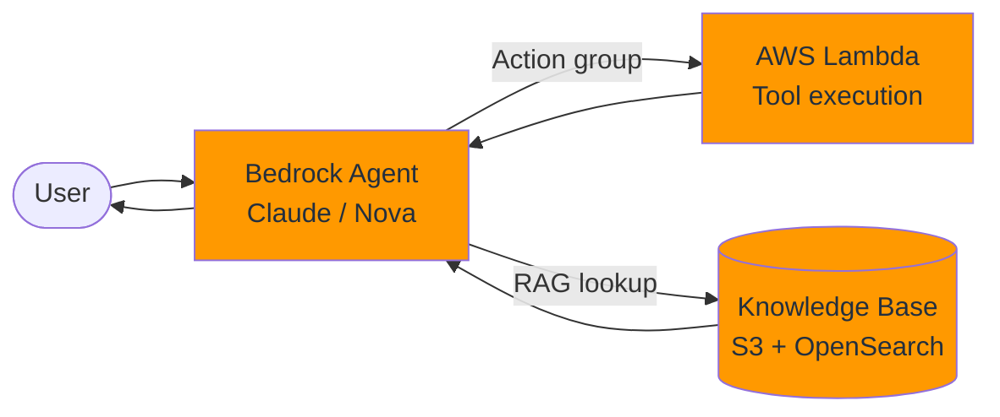

**Implementation steps for a single Bedrock agent:**
1. Create an agent in the Bedrock console; assign an IAM role and choose a foundation model  
2. Write precise, step-by-step instructions (system prompt) defining the agent's persona and constraints  
3. Associate an AWS Lambda function as an Action Group (the agent's toolbox)  
4. Create a Knowledge Base (RAG) to give the agent access to company documents  
5. Deploy an Agent Alias for staging/production version management  
6. Enable Amazon Bedrock Guardrails for content filtering and PII protection  

### Multi-Agent on AWS

Amazon Bedrock **Multi-Agent Collaboration** enables a supervisor agent to coordinate specialised sub-agents. Two collaboration modes are available:

▪ **Supervisor Mode** — supervisor breaks down complex requests, assigns tasks, consolidates results  
▪ **Supervisor with Routing Mode** — simple queries route directly to a relevant sub-agent; complex queries trigger full orchestration  

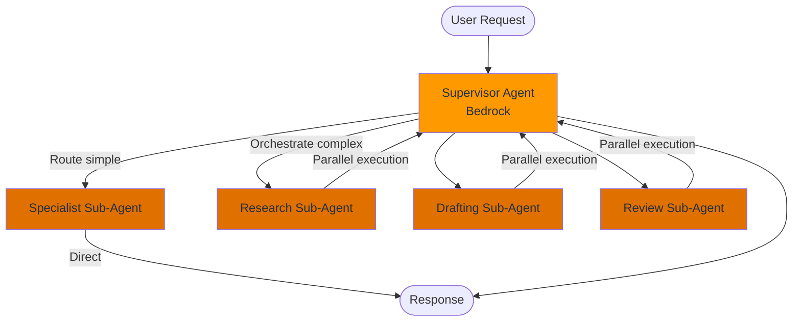

**Implementation steps:**
1. Define individual sub-agents, each with a limited set of tools and a bounded context  
2. In the Bedrock console under "Multi-Agent Collaboration", create a Supervisor Agent  
3. Add the sub-agents as collaborators; provide instructions on when and how to delegate  
4. Choose collaboration mode (Supervisor or Supervisor with Routing)  
5. Enable shared conversation history for context-aware collaboration across agents  

### Sub-Agents on AWS

Sub-agents in Bedrock are specialised agents with a **bounded context** — limited tools and a narrow scope to improve performance and reduce cost.

▪ Each sub-agent has access only to the data required for its role (principle of least privilege)  
▪ An agent can invoke another agent as a tool ("Agents as Tools" pattern)  
▪ Sub-agent settings are configured in the Bedrock console under each agent's instructions  

### AWS Deployment Methods

| Method | Best For | Implementation |
|---|---|---|
| **Serverless (Lambda)** | Event-driven, short-lived agents | Package agent as container image, deploy to Lambda; use DynamoDB for state |
| **Containerised (ECS/Fargate)** | Long-running, stateful, complex multi-agent workflows | Dockerfile → ECR → ECS cluster behind ALB |
| **Managed (Bedrock AgentCore)** | Secure, serverless runtime for custom open-source agents | Bedrock Agent Core Starter Toolkit + FastAPI Python agent |

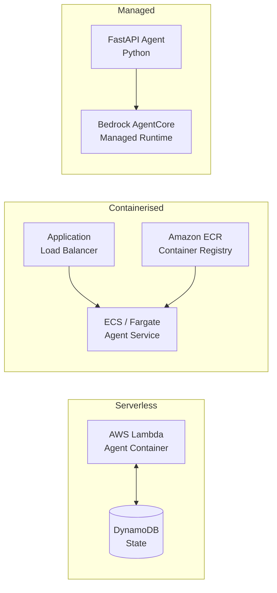

**Open-source frameworks on AWS:**

| Framework | Best Use Case | Key AWS Integration |
|---|---|---|
| LangGraph | Complex branching workflows and state management | Amazon Bedrock AgentCore, ECS/Fargate |
| CrewAI | Role-based "teams" (researcher + writer + reviewer) | Strands SDK on AWS, ECS/Fargate |
| AutoGen | Dynamic, conversational agent-to-agent interactions | Amazon ECS or Lambda |
| Strands Agents | AWS-native agent SDK | Bedrock models, Lambda, Fargate (built-in) |

---

## Configuring Prompts for Agents

The system prompt is the most critical configuration for any agent. It defines the agent's persona, constraints, available tools, output format, and decision logic. Poor prompt design is the leading cause of agent failure in production.

### System Prompt Design

A well-structured system prompt has five parts:

```
1. ROLE       — who the agent is and what it specialises in
2. GOAL        — what it is trying to achieve
3. CONSTRAINTS — what it must NOT do
4. TOOLS       — which tools are available and when to use each
5. OUTPUT      — format and structure of the final response
```

**Design principles:**
▪ Be specific and unambiguous — the LLM will interpret ambiguity in unexpected ways
▪ Include explicit stop conditions — when should the agent stop and return?
▪ Define escalation rules — when should the agent ask for human input?
▪ Specify tool usage order when it matters
▪ Use numbered, step-by-step instructions rather than prose paragraphs

### Prompt Templates per Agent Type

**Single-Agent System Prompt template:**

```
You are a [ROLE] specialising in [DOMAIN].

Your goal is to [SPECIFIC OBJECTIVE].

You have access to the following tools:
- [TOOL_NAME]: [when and how to use it]
- [TOOL_NAME]: [when and how to use it]

Instructions:
1. Always [first step]
2. Use [TOOL_NAME] when [condition]
3. If [edge case], then [action]
4. Stop and return your result when [completion condition]

Output format: [structured / markdown / JSON / plain text]

Constraints:
- Never [prohibited action]
- Always cite sources when using retrieved information
```

**Multi-Agent — Manager/Supervisor Prompt template:**

```
You are the Supervisor coordinating a team of specialist agents.

Your team:
- Researcher: handles information gathering and web search
- Writer: drafts content based on research findings
- Reviewer: fact-checks and improves quality

Workflow:
1. Decompose the user's request into sub-tasks
2. Assign each sub-task to the appropriate specialist
3. Review returned results for completeness
4. Synthesise a final response

Always delegate; do not perform specialist tasks yourself.
Return a final, consolidated answer to the user.
```

**Sub-Agent Prompt template (bounded context):**

```
You are a [SPECIALIST_ROLE] sub-agent.

Your ONLY job is to: [SINGLE SPECIFIC TASK]

You have access to: [LIMITED TOOL SET]

Return ONLY: [SUMMARY FORMAT — do not include raw data]

Stop immediately after completing your single task.
Do not ask follow-up questions.
```

**Configuring prompts in Open WebUI (local):**
1. Go to **Admin Panel → Models → [Select model] → System Prompt**
2. Paste the system prompt and save
3. Optionally, create a dedicated "Model" preset per agent role

**Configuring prompts in Amazon Bedrock:**
1. In the Bedrock console, select your agent and click **Edit**
2. Under "Instructions", enter the agent's system prompt
3. Use Agent Aliases to snapshot a prompt version for staging/production
4. Use **Prompt Management** (`bedrock:CreatePrompt` API) for programmatic prompt versioning

**Configuring prompts in CrewAI (Python):**

```python
from crewai import Agent

researcher = Agent(
    role="Senior Research Analyst",
    goal="Discover and synthesise the latest developments in AI agents",
    backstory=(
        "You are an expert at finding, evaluating, and summarising "
        "technical information. You prioritise primary sources and "
        "always cite your findings."
    ),
    verbose=True,
    allow_delegation=False,
)
```

**Configuring prompts in LangGraph (Python):**

```python
from langchain_core.messages import SystemMessage

system_prompt = SystemMessage(content="""
You are a technical documentation assistant.
Your goal is to answer questions about the codebase accurately.
Use the search_code tool to find relevant source files before answering.
Always include the file path and line number in your response.
""")
```

---

## Development Environment Setup

### Prerequisites and Tools

| Tool | Purpose | Install |
|---|---|---|
| Python 3.11+ | Agent runtime | `sudo apt install python3.11` |
| uv | Fast package manager and venv | `curl -LsSf https://astral.sh/uv/install.sh \| sh` |
| Docker + Compose | Container runtime | `sudo apt install docker.io docker-compose-plugin` |
| Ollama | Local inference server | `curl -fsSL https://ollama.com/install.sh \| sh` |
| VS Code | Primary IDE | https://code.visualstudio.com/ |
| Git | Version control | `sudo apt install git` |

### Python Environment with uv

`uv` is the recommended package manager for AI agent projects — it is significantly faster than pip and creates reproducible environments.

```bash
# Install uv
curl -LsSf https://astral.sh/uv/install.sh | sh
source $HOME/.cargo/env   # add uv to PATH

# Create a new project with a virtual environment
uv init my-agent-project
cd my-agent-project

# Create and activate the virtual environment
uv venv
source .venv/bin/activate       # Linux / macOS
# .venv\Scripts\activate        # Windows

# Install packages (replaces pip install)
uv add langchain-ollama langgraph crewai python-dotenv chromadb

# Or install from requirements.txt
uv pip install -r requirements.txt

# Freeze dependencies
uv pip freeze > requirements.txt
```

**If uv is not available**, use the standard approach:

```bash
# Create virtual environment
python3 -m venv .venv

# Activate
source .venv/bin/activate       # Linux / macOS

# Install packages
pip install langchain-ollama langgraph crewai python-dotenv chromadb
```

### VS Code Configuration

**Step 1 — Install extensions:**

```bash
code --install-extension ms-python.python
code --install-extension ms-python.vscode-pylance
code --install-extension GitHub.copilot
code --install-extension GitHub.copilot-chat
```

**Step 2 — Select the Python interpreter:**

Press `Ctrl+Shift+P` → type `Python: Select Interpreter` → choose `.venv/bin/python` from the project directory.

**Step 3 — Configure `.vscode/settings.json`:**

```json
{
  "python.defaultInterpreterPath": "${workspaceFolder}/.venv/bin/python",
  "python.terminal.activateEnvironment": true,
  "editor.formatOnSave": true,
  "[python]": {
    "editor.defaultFormatter": "ms-python.black-formatter"
  }
}
```

**Step 4 — Configure `.env` for secrets (never commit this file):**

```bash
# .env
OPENAI_API_KEY=your_key_here
OLLAMA_BASE_URL=http://localhost:11434
OLLAMA_MODEL=llama3
AWS_REGION=us-east-1
AWS_BEDROCK_MODEL_ID=anthropic.claude-3-5-sonnet-20241022-v2:0
```

Add `.env` to `.gitignore` immediately:

```bash
echo ".env" >> .gitignore
echo ".venv/" >> .gitignore
```

### Framework-Specific Setup

**◈ CrewAI (multi-agent teams)**

```bash
# Create and activate environment
uv venv && source .venv/bin/activate

# Install CrewAI with Ollama integration
uv add crewai langchain-ollama python-dotenv

# Scaffold a new CrewAI project
pip install crewai[tools]
crewai create crew my_crew
cd my_crew

# Configure Ollama as the LLM in crew.py or agent definition:
# from langchain_ollama import ChatOllama
# llm = ChatOllama(model="llama3", base_url="http://localhost:11434")
```

**◈ LangGraph (state-machine orchestration)**

```bash
uv venv && source .venv/bin/activate
uv add langgraph langchain-ollama langchain-community python-dotenv

# Install LangGraph CLI for local development server
uv add "langgraph-cli[inmem]"
langgraph dev   # starts local LangGraph Studio at http://localhost:8123
```

**◈ AutoGen (conversational multi-agent)**

```bash
uv venv && source .venv/bin/activate
uv add pyautogen python-dotenv

# For Ollama integration, use OllamaChatCompletionClient:
# from autogen import AssistantAgent, UserProxyAgent
# config = {"model": "llama3", "base_url": "http://localhost:11434/v1", "api_key": "ollama"}
```

**◈ Strands Agents (AWS-native)**

```bash
uv venv && source .venv/bin/activate
uv add strands-agents strands-agents-tools python-dotenv boto3

# Configure AWS credentials
aws configure
# or set environment variables:
# export AWS_ACCESS_KEY_ID=...
# export AWS_SECRET_ACCESS_KEY=...
# export AWS_DEFAULT_REGION=us-east-1

# Enable Bedrock model access in the AWS console for your region
```

**◈ Open WebUI + Ollama (local web client)**

```bash
# Full stack: Ollama + Open WebUI via Docker Compose
cat > docker-compose.yml << 'EOF'
services:
  ollama:
    image: ollama/ollama
    ports:
      - "11434:11434"
    volumes:
      - ollama_data:/root/.ollama
    restart: unless-stopped

  open-webui:
    image: ghcr.io/open-webui/open-webui:main
    ports:
      - "3000:8080"
    environment:
      - OLLAMA_BASE_URL=http://ollama:11434
    volumes:
      - webui_data:/app/backend/data
    depends_on:
      - ollama
    restart: unless-stopped

volumes:
  ollama_data:
  webui_data:
EOF

docker compose up -d

# Pull a model into Ollama
docker exec -it $(docker ps -qf "name=ollama") ollama pull llama3
```

---

## Examples

### LangChain

To use the LangChain library in VS Code for an AI agent, you will set up a Python development environment, install necessary packages, configure API keys, and write the agent code using LangChain's components like models, tools, and prompts.

Step 1: Set Up Your VS Code Environment

Install Python: Ensure you have Python 3.9 or later installed on your system.
Open VS Code: Launch Visual Studio Code.
Create a Project Folder: Create a new directory for your agent project and open it in VS Code.
Create a Virtual Environment: Open the integrated terminal in VS Code and create a virtual environment to isolate project dependencies.
Activate the Environment: Activate the virtual environment.

Step 2: Install Required Packages

Install LangChain and other necessary libraries using pip within your activated virtual environment:

$ pip install langchain langchain-openai python-dotenv

You may also need additional tools like duckduckgo-search or wikipedia depending on your agent's needs.

Step 3: Configure Environment Variables

Manage your API keys securely using a .env file:

Create a file named .env in your project's root directory.
Add your API key (e.g., for OpenAI) to this file:
OPENAI_API_KEY="your-api-key-here"

Add .env to your .gitignore file to avoid committing sensitive information to version control.

Step 4: Build the AI Agent

Create a Python file (e.g., agent.py) and use LangChain components to define your agent's behavior. An agent in LangChain is an AI entity that can observe the world, reason, and act using tools to achieve a goal.

Import Libraries and Load Environment Variables:

import os
from dotenv import load_dotenv
from langchain.agents import initialize_agent, AgentType
from langchain_core.tools import Tool
from langchain_openai import ChatOpenAI

load_dotenv()
# LangChain automatically looks for the API key in environment variables

Define Tools: Tools are functions the agent can use. You can wrap custom functions or use pre-built ones.

def get_weather(city: str) -> str:
    """A tool to get the weather for a given city."""
    # In a real application, this would call a weather API
    return f"It's always sunny in {city}!"

tools = [
    Tool(
        name="GetWeather",
        func=get_weather,
        description="Use this tool to get the weather for a specific location."
    )
]

Initialize the Language Model (LLM):

Choose and configure your language model.

llm = ChatOpenAI(model_name="gpt-4o", temperature=0) # Temperature 0 makes the output more consistent

Create and Run the Agent: Assemble the agent using the LLM and tools, then run it with an AgentExecutor.

agent_executor = initialize_agent(
    tools,
    llm,
    agent=AgentType.ZERO_SHOT_REACT_DESCRIPTION, # A common agent type for basic tool use
    verbose=True # Set to True to see the agent's reasoning process
)

# Invoke the agent
response = agent_executor.invoke({"input": "What is the weather in San Francisco?"})
print(response['output'])

**Understanding ZERO_SHOT_REACT_DESCRIPTION:**

This agent type is the most common choice for basic tool use. Here's what it means:

- **ZERO_SHOT**: The agent doesn't need examples - it figures out how to use tools from their descriptions alone
- **REACT**: Stands for "Reasoning and Acting" - the agent alternates between thinking and using tools
  - Thought: Reasons about what to do
  - Action: Uses a tool
  - Observation: Sees the result
  - Repeats until task is complete
- **DESCRIPTION**: Uses tool descriptions to decide when and how to use each tool

When `verbose=True`, you'll see the agent's complete reasoning process, which is helpful for debugging and understanding how it makes decisions.

Step 5: Test and Debug

Run your script from the VS Code terminal using python agent.py. The verbose=True setting will display the agent's "thought" process, helping you debug how it decides which tools to use and what actions to take.

Step 6: Deploy (Optional)

Once your agent is working in VS Code, you can wrap it in a web framework like FastAPI to expose it as an API and deploy it to a cloud platform.

---

### Single-Agent with Ollama and LangChain

This example creates a single agent connected to a local Ollama instance. It uses a custom tool and the ReAct reasoning pattern.

**Setup:**

```bash
# Create and activate virtual environment
python3 -m venv .venv
source .venv/bin/activate

# Install dependencies
pip install langchain-ollama langchain python-dotenv

# Ensure Ollama is running with a model
ollama pull llama3
```

**`single_agent_ollama.py`:**

```python
"""
Single-Agent with Ollama — local inference, no API key required.

Architecture:
  User → Agent Loop → Tool(s) → Observation → Agent Loop → Response

Run: python single_agent_ollama.py
"""

from langchain_ollama import ChatOllama
from langchain.agents import initialize_agent, Tool
from langchain.agents import AgentType

# 1. Initialise the local model via Ollama
llm = ChatOllama(model="llama3", base_url="http://localhost:11434")

# 2. Define custom tools — functions the agent can call
def get_system_status(query: str) -> str:
    """Check the status of local systems."""
    return "All local systems are operational. CPU: 42%, Memory: 6.1 GB free."

def get_current_date(query: str) -> str:
    """Return the current date."""
    from datetime import date
    return f"Today is {date.today().isoformat()}"

tools = [
    Tool(
        name="SystemStatus",
        func=get_system_status,
        description="Useful for checking the status of local systems. Input: any query string.",
    ),
    Tool(
        name="CurrentDate",
        func=get_current_date,
        description="Returns the current date. Input: any query string.",
    ),
]

# 3. Initialise the single agent with ZERO_SHOT_REACT pattern
#    ZERO_SHOT: no examples needed — tool descriptions guide decisions
#    REACT:     Thought → Action → Observation → repeat until done
agent = initialize_agent(
    tools,
    llm,
    agent=AgentType.ZERO_SHOT_REACT_DESCRIPTION,
    verbose=True,  # shows the agent's reasoning process
    max_iterations=5,
)

# 4. Run the agent
if __name__ == "__main__":
    response = agent.invoke({
        "input": "What is the current date and the status of my local system?"
    })
    print("\n--- Agent Response ---")
    print(response["output"])
```

**Run:**

```bash
python single_agent_ollama.py
```

---

### Multi-Agent with CrewAI and Ollama

This example builds a two-agent research-and-writing crew that runs entirely on a local Ollama model. No API keys required.

**Setup:**

```bash
python3 -m venv .venv
source .venv/bin/activate
pip install crewai langchain-ollama python-dotenv
```

**`multi_agent_crewai_ollama.py`:**

```python
"""
Multi-Agent with CrewAI + Ollama — local inference.

Architecture:
  Researcher Agent (gathers info)
        ↓
  Writer Agent (drafts article)
        ↓
  Final output

Run: python multi_agent_crewai_ollama.py
"""

import os
from crewai import Agent, Task, Crew, Process
from langchain_ollama import ChatOllama

# Configure the local LLM (shared by all agents — or assign different models)
local_llm = ChatOllama(model="llama3", base_url="http://localhost:11434")

# --- Define Agents ---

researcher = Agent(
    role="Senior Research Analyst",
    goal="Discover and summarise key facts about {topic}",
    backstory=(
        "You are an expert at finding, evaluating, and summarising "
        "technical information. You cite your sources clearly and focus "
        "on accuracy over breadth."
    ),
    llm=local_llm,
    verbose=True,
    allow_delegation=False,
)

writer = Agent(
    role="Technical Writer",
    goal="Transform research findings into a clear, engaging article about {topic}",
    backstory=(
        "You excel at translating complex technical concepts into "
        "accessible prose. You structure your writing with clear headings "
        "and use concrete examples."
    ),
    llm=local_llm,
    verbose=True,
    allow_delegation=False,
)

# --- Define Tasks ---

research_task = Task(
    description=(
        "Research the topic: {topic}. "
        "Identify the top 5 key facts, current state, and practical applications. "
        "Produce a structured bullet-point summary."
    ),
    expected_output="A structured bullet-point summary with 5 key facts.",
    agent=researcher,
)

writing_task = Task(
    description=(
        "Using the researcher's summary, write a 300-word article about {topic}. "
        "Include an introduction, 3 main points, and a conclusion."
    ),
    expected_output="A 300-word article with introduction, 3 sections, and conclusion.",
    agent=writer,
    context=[research_task],  # writer receives researcher output as context
)

# --- Assemble and Run the Crew ---

crew = Crew(
    agents=[researcher, writer],
    tasks=[research_task, writing_task],
    process=Process.sequential,  # researcher finishes before writer starts
    verbose=True,
)

if __name__ == "__main__":
    result = crew.kickoff(inputs={"topic": "AI agents in 2026"})
    print("\n--- Crew Result ---")
    print(result)
```

**Run:**

```bash
python multi_agent_crewai_ollama.py
```

For **hierarchical mode** (manager coordinates workers automatically):

```python
crew = Crew(
    agents=[researcher, writer],
    tasks=[research_task, writing_task],
    process=Process.hierarchical,
    manager_llm=local_llm,   # manager agent uses this LLM to coordinate
    verbose=True,
)
```

---

### Sub-Agent with LangGraph

This example demonstrates a parent graph (coordinator) that spawns a child graph (sub-agent) with an isolated context. The sub-agent performs a focused task and returns only a summary.

**Setup:**

```bash
python3 -m venv .venv
source .venv/bin/activate
pip install langgraph langchain-ollama langchain-core
```

**`sub_agent_langgraph.py`:**

```python
"""
Sub-Agent with LangGraph + Ollama.

Architecture:
  Coordinator Graph
      → spawns Sub-Agent Graph (isolated context)
      ← receives summary result
      → incorporates into final response

Run: python sub_agent_langgraph.py
"""

from typing import TypedDict, Annotated
from langgraph.graph import StateGraph, START, END
from langchain_ollama import ChatOllama
from langchain_core.messages import HumanMessage, SystemMessage

# Shared LLM
llm = ChatOllama(model="llama3", base_url="http://localhost:11434")


# ── Sub-Agent Graph (isolated context) ──────────────────────────────────────

class SubState(TypedDict):
    topic: str
    summary: str

def sub_agent_research(state: SubState) -> SubState:
    """Sub-agent: perform focused research on a specific topic."""
    messages = [
        SystemMessage(content=(
            "You are a specialist researcher. Your ONLY job is to produce "
            "a 2-sentence factual summary of the given topic. "
            "Do not ask questions. Return the summary immediately."
        )),
        HumanMessage(content=f"Summarise: {state['topic']}"),
    ]
    response = llm.invoke(messages)
    return {"topic": state["topic"], "summary": response.content}

sub_graph_builder = StateGraph(SubState)
sub_graph_builder.add_node("research", sub_agent_research)
sub_graph_builder.add_edge(START, "research")
sub_graph_builder.add_edge("research", END)
sub_agent_graph = sub_graph_builder.compile()


# ── Coordinator Graph ────────────────────────────────────────────────────────

class CoordState(TypedDict):
    user_input: str
    sub_summary: str
    final_answer: str

def coordinator_plan(state: CoordState) -> CoordState:
    """Coordinator: invoke sub-agent for isolated research."""
    sub_result = sub_agent_graph.invoke({"topic": state["user_input"], "summary": ""})
    return {"user_input": state["user_input"], "sub_summary": sub_result["summary"], "final_answer": ""}

def coordinator_synthesise(state: CoordState) -> CoordState:
    """Coordinator: build final answer from sub-agent summary."""
    messages = [
        SystemMessage(content="You are a helpful assistant. Use the provided research summary to answer the user's question."),
        HumanMessage(content=(
            f"User question: {state['user_input']}\n\n"
            f"Research summary: {state['sub_summary']}\n\n"
            "Provide a concise, helpful answer."
        )),
    ]
    response = llm.invoke(messages)
    return {**state, "final_answer": response.content}

coord_builder = StateGraph(CoordState)
coord_builder.add_node("plan", coordinator_plan)
coord_builder.add_node("synthesise", coordinator_synthesise)
coord_builder.add_edge(START, "plan")
coord_builder.add_edge("plan", "synthesise")
coord_builder.add_edge("synthesise", END)
coordinator_graph = coord_builder.compile()


if __name__ == "__main__":
    result = coordinator_graph.invoke({
        "user_input": "What are the main benefits of multi-agent AI systems?",
        "sub_summary": "",
        "final_answer": "",
    })
    print("\n--- Sub-Agent Summary ---")
    print(result["sub_summary"])
    print("\n--- Coordinator Final Answer ---")
    print(result["final_answer"])
```

**Run:**

```bash
python sub_agent_langgraph.py
```

---

### Local RAG Agent

A Retrieval-Augmented Generation (RAG) single agent that answers questions about your local documents without any data leaving your machine.

**Setup:**

```bash
python3 -m venv .venv
source .venv/bin/activate
pip install langchain-ollama langchain-community langchain chromadb pypdf sentence-transformers
```

**`local_rag_agent.py`:**

```python
"""
Local RAG Agent — answers questions from private documents using Ollama + Chroma.

Workflow:
  PDF / text files → embed → Chroma (local vector DB)
  User query → retrieve relevant chunks → Ollama LLM → answer

Run: python local_rag_agent.py
"""

import os
from pathlib import Path
from langchain_community.document_loaders import PyPDFLoader, TextLoader
from langchain.text_splitter import RecursiveCharacterTextSplitter
from langchain_community.embeddings import OllamaEmbeddings
from langchain_community.vectorstores import Chroma
from langchain_ollama import ChatOllama
from langchain.chains import RetrievalQA
from langchain.prompts import PromptTemplate

# ── Configuration ─────────────────────────────────────────────────────────────
DOCS_DIR = "./documents"          # place PDFs and .txt files here
CHROMA_DIR = "./chroma_db"        # persisted vector store
EMBED_MODEL = "llama3"            # Ollama model used for embeddings
CHAT_MODEL = "llama3"             # Ollama model used for answers
OLLAMA_URL = "http://localhost:11434"

# ── Load and split documents ──────────────────────────────────────────────────
def load_documents(docs_dir: str):
    docs = []
    for path in Path(docs_dir).glob("**/*"):
        if path.suffix == ".pdf":
            docs.extend(PyPDFLoader(str(path)).load())
        elif path.suffix in (".txt", ".md"):
            docs.extend(TextLoader(str(path)).load())
    splitter = RecursiveCharacterTextSplitter(chunk_size=1000, chunk_overlap=100)
    return splitter.split_documents(docs)

# ── Build or load vector store ────────────────────────────────────────────────
embeddings = OllamaEmbeddings(model=EMBED_MODEL, base_url=OLLAMA_URL)

if Path(CHROMA_DIR).exists():
    vectorstore = Chroma(persist_directory=CHROMA_DIR, embedding_function=embeddings)
    print(f"Loaded existing vector store from {CHROMA_DIR}")
else:
    os.makedirs(DOCS_DIR, exist_ok=True)
    chunks = load_documents(DOCS_DIR)
    if not chunks:
        print(f"No documents found in {DOCS_DIR}. Add PDF or TXT files and restart.")
        exit(1)
    vectorstore = Chroma.from_documents(chunks, embeddings, persist_directory=CHROMA_DIR)
    vectorstore.persist()
    print(f"Embedded {len(chunks)} chunks into {CHROMA_DIR}")

# ── Build RAG chain ───────────────────────────────────────────────────────────
llm = ChatOllama(model=CHAT_MODEL, base_url=OLLAMA_URL, temperature=0)

SYSTEM_PROMPT = PromptTemplate.from_template("""
You are a Technical Document Assistant specialising in the provided documents.
Answer questions using ONLY the context below. If the answer is not in the context, say so.
Always cite the source document name.

Context:
{context}

Question: {question}

Answer:""")

qa_chain = RetrievalQA.from_chain_type(
    llm=llm,
    retriever=vectorstore.as_retriever(search_kwargs={"k": 4}),
    chain_type_kwargs={"prompt": SYSTEM_PROMPT},
    return_source_documents=True,
)

# ── Interactive loop ──────────────────────────────────────────────────────────
if __name__ == "__main__":
    print("Local RAG Agent — ask questions about your documents (type 'exit' to quit)")
    while True:
        query = input("\nYour question: ").strip()
        if query.lower() in ("exit", "quit", "q"):
            break
        if not query:
            continue
        result = qa_chain.invoke({"query": query})
        print(f"\nAnswer: {result['result']}")
        if result.get("source_documents"):
            sources = {doc.metadata.get("source", "unknown") for doc in result["source_documents"]}
            print(f"Sources: {', '.join(sources)}")
```

**Run:**

```bash
mkdir -p documents
# copy your PDFs or .txt files into documents/
python local_rag_agent.py
```

---

### AWS Bedrock Agent (Python)

This example invokes an Amazon Bedrock Agent via the Python AWS SDK (boto3). The agent must already be created and deployed in the Bedrock console.

**Setup:**

```bash
python3 -m venv .venv
source .venv/bin/activate
pip install boto3 python-dotenv
```

**`.env`:**

```
AWS_REGION=us-east-1
BEDROCK_AGENT_ID=XXXXXXXXXX        # from Bedrock console
BEDROCK_AGENT_ALIAS_ID=TSTALIASID  # use TSTALIASID for testing
```

**`bedrock_agent_invoke.py`:**

```python
"""
Invoke an Amazon Bedrock Agent via boto3.

Prerequisites:
  - Agent created and deployed in AWS Bedrock console
  - IAM role with bedrock:InvokeAgent permission
  - AWS credentials configured (aws configure or env vars)

Run: python bedrock_agent_invoke.py
"""

import os
import uuid
import boto3
from dotenv import load_dotenv

load_dotenv()

REGION = os.getenv("AWS_REGION", "us-east-1")
AGENT_ID = os.getenv("BEDROCK_AGENT_ID")
AGENT_ALIAS_ID = os.getenv("BEDROCK_AGENT_ALIAS_ID", "TSTALIASID")

if not AGENT_ID:
    raise ValueError("Set BEDROCK_AGENT_ID in your .env file")

client = boto3.client("bedrock-agent-runtime", region_name=REGION)


def invoke_agent(user_message: str, session_id: str | None = None) -> str:
    """Invoke a Bedrock agent and return the complete response text."""
    session_id = session_id or str(uuid.uuid4())

    response = client.invoke_agent(
        agentId=AGENT_ID,
        agentAliasId=AGENT_ALIAS_ID,
        sessionId=session_id,
        inputText=user_message,
    )

    # Bedrock streams the response — collect all chunks
    full_response = ""
    for event in response["completion"]:
        if "chunk" in event:
            chunk = event["chunk"]
            full_response += chunk["bytes"].decode("utf-8")

    return full_response


if __name__ == "__main__":
    session = str(uuid.uuid4())
    print(f"Session ID: {session}")
    print("Bedrock Agent Chat (type 'exit' to quit)")

    while True:
        user_input = input("\nYou: ").strip()
        if user_input.lower() in ("exit", "quit"):
            break
        if not user_input:
            continue

        answer = invoke_agent(user_input, session_id=session)
        print(f"\nAgent: {answer}")
```

**Run:**

```bash
python bedrock_agent_invoke.py
```

---

### Strands Agents on AWS

The Strands Agents SDK is an AWS-native framework for building agents that run on Amazon Bedrock. The following example builds a single agent with HTTP tool capabilities.

**Setup:**

```bash
python3 -m venv .venv
source .venv/bin/activate
pip install strands-agents strands-agents-tools boto3 python-dotenv

# Configure AWS credentials (must have Bedrock model access enabled)
aws configure
```

**`strands_single_agent.py`:**

```python
"""
Single Agent with Strands Agents SDK + Amazon Bedrock.

This agent can make HTTP requests (e.g., query public APIs).

Run: python strands_single_agent.py
"""

from strands import Agent
from strands_tools import http_request

SYSTEM_PROMPT = """
You are a helpful research assistant with HTTP capabilities.

When a user asks for information:
1. Identify if an HTTP request to a public API would help answer the question.
2. Make the request using your http_request tool.
3. Parse the response and present the information clearly.
4. If the information is not available via HTTP, answer from your training knowledge.

Always explain where your information comes from.
"""

agent = Agent(
    system_prompt=SYSTEM_PROMPT,
    tools=[http_request],
)

if __name__ == "__main__":
    print("Strands Agent (Bedrock) — type 'exit' to quit")
    while True:
        user_input = input("\nYou: ").strip()
        if user_input.lower() in ("exit", "quit"):
            break
        if not user_input:
            continue
        response = agent(user_input)
        print(f"\nAgent: {response}")
```

**Run:**

```bash
python strands_single_agent.py
```

**For a multi-agent Strands pattern**, refer to the `Strands Agents/examples/` directory in this repository, which includes a naming agent with MCP tool support (`naming_agent.py`) and a weather forecaster agent (`weather_forecaster.py`).

**Container deployment of a Strands agent to AWS Fargate:**

```bash
# Build and push container image
docker build -t my-strands-agent .
aws ecr create-repository --repository-name my-strands-agent
docker tag my-strands-agent:latest <account>.dkr.ecr.<region>.amazonaws.com/my-strands-agent:latest
docker push <account>.dkr.ecr.<region>.amazonaws.com/my-strands-agent:latest

# Deploy using the provided CloudFormation template
aws cloudformation deploy \
  --template-file Strands\ Agents/deployment/fargate/cloudformation.yaml \
  --stack-name my-strands-agent \
  --capabilities CAPABILITY_IAM
```

---

## References

### Academic and Research

**Foundation Papers:**
- Russell, S., & Norvig, P. (2021). *Artificial Intelligence: A Modern Approach* (4th ed.). Pearson Education.
- Wooldridge, M. (2020). *An Introduction to MultiAgent Systems* (2nd ed.). John Wiley & Sons.
- Yao, S., et al. (2024). "ReAct: Synergizing Reasoning and Acting in Language Models." *International Conference on Learning Representations*.

**Recent Advances (2024-2026):**
- Wei, J., et al. (2024). "Chain-of-Thought Prompting Elicits Reasoning in Large Language Models." *Nature Machine Intelligence*.
- Park, J. S., et al. (2024). "Generative Agents: Interactive Simulacra of Human Behavior." *ACM Transactions on Computer-Human Interaction*.
- Xi, Z., et al. (2024). "The Rise and Potential of Large Language Model Based Agents: A Survey." *arXiv preprint arXiv:2309.07864*.
- Anthropic Engineering. (2025). "How we built our multi-agent research system": https://www.anthropic.com/engineering/built-multi-agent-research-system

### Documentation and Tutorials

**Framework Documentation:**
- **LangChain**: https://python.langchain.com/docs/
- **LangGraph**: https://langchain-ai.github.io/langgraph/
- **LlamaIndex**: https://docs.llamaindex.ai/
- **CrewAI**: https://docs.crewai.com/
- **AutoGen**: https://microsoft.github.io/autogen/
- **Haystack**: https://docs.haystack.deepset.ai/
- **Semantic Kernel**: https://learn.microsoft.com/en-us/semantic-kernel/
- **Google ADK**: https://google.github.io/adk-docs/
- **Strands Agents**: https://strandsagents.com/docs/

**Local Inference and Open WebUI:**
- **Ollama**: https://ollama.com/
- **Open WebUI**: https://docs.openwebui.com/
- **Ollama Models Library**: https://ollama.com/library
- **Model Context Protocol (MCP)**: https://modelcontextprotocol.io/

**Industry Resources:**
- **OpenAI API Documentation**: https://platform.openai.com/docs/
- **Anthropic Claude Documentation**: https://docs.anthropic.com/
- **Google AI Documentation**: https://ai.google.dev/
- **Hugging Face Transformers**: https://huggingface.co/docs/transformers/

**Agent Architecture:**
- "How and when to build multi-agent systems" — LangChain Blog: https://www.langchain.com/blog/how-and-when-to-build-multi-agent-systems
- "Build your First CrewAI Agents" — CrewAI Blog: https://blog.crewai.com/getting-started-with-crewai-build-your-first-crew/

**AWS / Amazon Bedrock:**
- "Automate tasks in your application using AI agents" — Amazon Bedrock: https://docs.aws.amazon.com/bedrock/latest/userguide/agents.html
- "Use multi-agent collaboration with Amazon Bedrock Agents": https://docs.aws.amazon.com/bedrock/latest/userguide/agents-multi-agent-collaboration.html
- "Amazon Bedrock announces general availability of multi-agent collaboration": https://aws.amazon.com/blogs/machine-learning/amazon-bedrock-announces-general-availability-of-multi-agent-collaboration/
- "Build multi-agent systems with LangGraph and Amazon Bedrock": https://aws.amazon.com/blogs/machine-learning/build-multi-agent-systems-with-langgraph-and-amazon-bedrock/
- "Create Our Own AI Agent with Amazon Bedrock": https://levelup.gitconnected.com/create-our-own-ai-agent-with-amazon-bedrock-96060e4eca43
- "Guidance for Multi-Agent Orchestration on AWS" (LangGraph): https://github.com/aws-solutions-library-samples/guidance-for-multi-agent-orchestration-langgraph-on-aws
- "Amazon Bedrock AgentCore": https://aws.amazon.com/bedrock/agentcore/
- "Run Prompt management code samples": https://docs.aws.amazon.com/bedrock/latest/userguide/prompt-management-code-ex.html
- "Amazon Bedrock Agents": https://aws.amazon.com/bedrock/agents/

**VS Code and Sub-Agents:**
- "Using agents in Visual Studio Code": https://code.visualstudio.com/docs/copilot/agents/overview
- "Work with agents in VS Code": https://code.visualstudio.com/docs/copilot/agents/agents-tutorial
- "Subagents in Visual Studio Code": https://code.visualstudio.com/docs/copilot/agents/subagents

### Open Source Repositories

**Framework Repositories:**
- **LangChain**: https://github.com/langchain-ai/langchain
- **LangGraph**: https://github.com/langchain-ai/langgraph
- **LlamaIndex**: https://github.com/run-llama/llama_index
- **Haystack**: https://github.com/deepset-ai/haystack
- **Semantic Kernel**: https://github.com/microsoft/semantic-kernel
- **Open WebUI**: https://github.com/open-webui/open-webui
- **Ollama**: https://github.com/ollama/ollama

**Community Projects:**
- **AutoGen**: https://github.com/microsoft/autogen
- **CrewAI**: https://github.com/joaomdmoura/crewAI
- **OpenDevin**: https://github.com/OpenDevin/OpenDevin
- **SWE-agent**: https://github.com/princeton-nlp/SWE-agent
- **Strands Agents**: https://github.com/strands-ai/strands-agents
- **Amazon Bedrock Agent Samples**: https://github.com/awslabs/amazon-bedrock-agent-samples

### Reports and Whitepapers

**Market Analysis:**
- McKinsey Global Institute. (2024). "The Age of AI: Artificial Intelligence and the Future of Work."
- Gartner. (2024). "Hype Cycle for Artificial Intelligence, 2024."
- Stanford HAI. (2024). "Artificial Intelligence Index Report 2024."

**Technical Whitepapers:**
- Google Research. (2024). "PaLM 2 Technical Report."
- OpenAI. (2024). "GPT-4 Technical Report."
- Anthropic. (2024). "Constitutional AI: Harmlessness from AI Feedback."

### Online Learning

**Courses and Tutorials:**
- **CS50's Introduction to AI with Python** (Harvard): https://cs50.harvard.edu/ai/
- **Deep Learning Specialization** (Coursera): https://www.coursera.org/specializations/deep-learning
- **LangChain & Vector Databases in Production** (ActiveLoop): https://learn.activeloop.ai/
- **AI Agents Course** (Hugging Face): https://huggingface.co/learn/agents-course/unit0/introduction
- **LangChain Academy**: https://academy.langchain.com/

**Video Resources:**
- **Andrej Karpathy's Neural Networks Course**: https://karpathy.ai/
- **DeepLearning.AI Short Courses**: https://www.deeplearning.ai/short-courses/
- **Weights & Biases ML Course**: https://www.wandb.courses/

### Communities

**Research Communities:**
- **Association for Computing Machinery (ACM)**: https://www.acm.org/
- **International Joint Conference on AI (IJCAI)**: https://www.ijcai.org/
- **Neural Information Processing Systems (NeurIPS)**: https://neurips.cc/

**Developer Communities:**
- **AI/ML Reddit**: https://www.reddit.com/r/MachineLearning/
- **Hugging Face Community**: https://huggingface.co/
- **Papers with Code**: https://paperswithcode.com/
- **LangChain Community**: https://www.langchain.com/join-community

**What is an AI Agent?**
- Google Cloud. (2025). "What are AI Agents?" https://cloud.google.com/discover/what-are-ai-agents?hl=en
- Amazon Web Services. (2025). "What are AI Agents?" https://aws.amazon.com/what-is/ai-agents/

