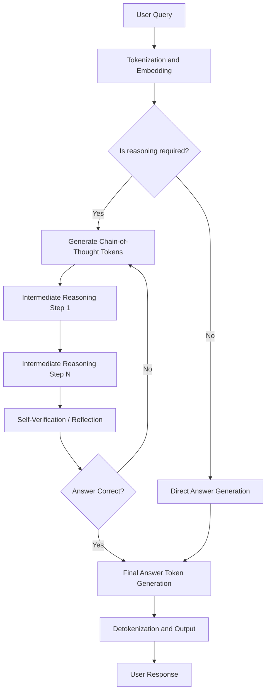
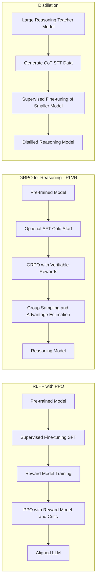

# Reasoning with Large Language Models

This document presents reasoning in the context of large language models (LLMs). The content outlines the theoretical foundations, algorithmic concepts, practical training methodologies, and an exercise using Group Relative Policy Optimization (GRPO) with the Unsloth library. The document also provides instructions for setting up a local inference server using Ollama and Open WebUI via Docker.

---

## Table of Contents

1. [Introduction and Motivation](#1-introduction-and-motivation)
2. [Defining Reasoning in Large Language Models](#2-defining-reasoning-in-large-language-models)
3. [The Flow of Reasoning in LLMs](#3-the-flow-of-reasoning-in-llms)
4. [Core Concepts in Reinforcement Learning for LLM Reasoning](#4-core-concepts-in-reinforcement-learning-for-llm-reasoning)
   - 4.1 [What is Reinforcement Learning (RL)?](#41-what-is-reinforcement-learning-rl)
   - 4.2 [What is Reinforcement Learning from Human Feedback (RLHF)?](#42-what-is-reinforcement-learning-from-human-feedback-rlhf)
   - 4.3 [What is Proximal Policy Optimization (PPO)?](#43-what-is-proximal-policy-optimization-ppo)
   - 4.4 [What is Group Relative Policy Optimization (GRPO)?](#44-what-is-group-relative-policy-optimization-grpo)
   - 4.5 [What is Reinforcement Learning with Verifiable Rewards (RLVR)?](#45-what-is-reinforcement-learning-with-verifiable-rewards-rlvr)
   - 4.6 [What is Reinforcement Fine-Tuning (RFT)?](#46-what-is-reinforcement-fine-tuning-rft)
5. [Four Principal Methods for Building Reasoning Models](#5-four-principal-methods-for-building-reasoning-models)
   - 5.1 [Inference-Time Scaling](#51-inference-time-scaling)
   - 5.2 [Pure Reinforcement Learning](#52-pure-reinforcement-learning)
   - 5.3 [Supervised Fine-Tuning and Reinforcement Learning (SFT + RL)](#53-supervised-fine-tuning-and-reinforcement-learning-sft--rl)
   - 5.4 [Pure Supervised Fine-Tuning and Distillation](#54-pure-supervised-fine-tuning-and-distillation)
6. [The GSM8K Dataset](#6-the-gsm8k-dataset)
7. [Virtual Environment Setup](#7-virtual-environment-setup)
   - 7.1 [Creating the Virtual Environment](#71-creating-the-virtual-environment)
   - 7.2 [Activating the Virtual Environment in Terminal](#72-activating-the-virtual-environment-in-terminal)
   - 7.3 [Activating the Virtual Environment in VS Code](#73-activating-the-virtual-environment-in-vs-code)
   - 7.4 [Installing Dependencies](#74-installing-dependencies)
8. [Practical Exercise: GRPO Training with Unsloth](#8-practical-exercise-grpo-training-with-unsloth)
   - 8.1 [Script Overview and Architecture](#81-script-overview-and-architecture)
   - 8.2 [Running the Training Script](#82-running-the-training-script)
9. [Inference Server Setup: Ollama and Open WebUI via Docker](#9-inference-server-setup-ollama-and-open-webui-via-docker)
   - 9.1 [Prerequisites and Docker Installation](#91-prerequisites-and-docker-installation)
   - 9.2 [Deploying Ollama](#92-deploying-ollama)
   - 9.3 [Deploying Open WebUI](#93-deploying-open-webui)
   - 9.4 [Configuring Reasoning Prompts](#94-configuring-reasoning-prompts)
10. [Further Research and Emerging Directions](#10-further-research-and-emerging-directions)
11. [References](#11-references)

---

## 1. Introduction and Motivation

The development of large language models has undergone a remarkable transformation in recent years. The prevailing paradigm of scaling model parameters and training data, while effective, appears to be approaching its limits as a sole strategy for capability improvement. A striking indicator of this trend is the comparatively muted reception accorded to large, non-reasoning models such as GPT-4.5 and Llama 4, in contrast to the considerable attention generated by models that incorporate explicit reasoning capabilities, such as OpenAI's o-series and DeepSeek's R1 family.

This shift reflects a broader recognition that reasoning capabilities represent a qualitatively distinct axis of improvement. Rather than simply knowing more facts, a reasoning model learns how to think through complex problems by generating structured intermediate steps. This paradigm, broadly referred to as chain-of-thought (CoT) reasoning, has proven to be a reliable mechanism for improving accuracy on challenging tasks including mathematical proof, symbolic logic, and competitive programming.

The purpose of this document is to provide both a rigorous theoretical account of the mechanisms underlying reasoning in LLMs and a practical guide for training and deploying such models on consumer hardware.

---

## 2. Defining Reasoning in Large Language Models

The term "reasoning" in the context of LLMs is subject to ongoing definitional debate. For the purposes of this document, reasoning is defined as follows:

> Reasoning, in the context of large language models, refers to the model's capacity to produce a structured sequence of intermediate computational or inferential steps before arriving at a final answer. This process, commonly described as chain-of-thought (CoT) reasoning, involves the explicit generation of statements, sub-computations, and partial conclusions that collectively constitute a transparent pathway from problem to solution.

A fundamental distinction exists between tasks that require reasoning and those that do not. A factual retrieval query such as "What is the capital of France?" does not require reasoning; the answer is recalled directly. By contrast, a question such as "If a train travels at 60 miles per hour for 3 hours and 15 minutes, how far does it travel?" requires the model to recognize the relationship between speed, time, and distance, perform a unit conversion, and execute an arithmetic operation before producing a result. Reasoning models are specifically optimized for problems of the latter class, particularly those involving multi-step deduction, mathematical proof, code generation, and logical inference.

Intermediate steps in reasoning models can manifest in two distinct ways:

1. **Explicit chain-of-thought**: The model produces intermediate reasoning steps as part of its visible output, typically demarcated by structured tags such as `<think>` and `</think>` or `<reasoning>` and `</reasoning>`.
2. **Internal iteration**: Some architectures, such as OpenAI's o1 and o3 models, execute multiple iterations of reasoning internally, returning only the final answer to the user, with the intermediate traces not exposed in the response.

It is worth noting that reasoning models are not universally superior. They are typically more verbose, more computationally expensive at inference time, and may be prone to "overthinking" on simple tasks where direct recall is adequate. The selection of an appropriate model type for a given task remains an important engineering consideration.

---

## 3. The Flow of Reasoning in LLMs

The following diagram illustrates the high-level flow of how a reasoning-capable LLM processes a complex query, from input reception through chain-of-thought generation to final answer production.



**Diagram description:** This flowchart depicts the inference-time behaviour of a reasoning-enabled LLM. Upon receiving a query, the model first performs tokenization and embedding. If the query is identified as requiring multi-step reasoning, the model enters a chain-of-thought generation loop, producing a sequence of intermediate reasoning steps. A self-verification pass may then check the intermediate conclusion; if the answer is deemed incorrect, the model may iterate again. Once a satisfactory conclusion is reached, the final answer tokens are generated and returned to the user. For simple queries that do not require reasoning, the model bypasses the intermediate steps and generates a direct response.

The training process that enables this behaviour is depicted in the following diagram, which contrasts the three principal training paradigms for reasoning models:



**Diagram description:** This diagram contrasts three training paradigms. In standard RLHF with PPO, a pre-trained model undergoes supervised fine-tuning, followed by reward model training using human preference rankings, followed by policy optimization using the PPO algorithm with both a reward model and a critic (value model). In the GRPO-based reasoning paradigm as employed by DeepSeek-R1, the critic and reward model are eliminated; advantage estimates are computed by sampling the policy multiple times and comparing scores within the resulting group. In distillation, a large trained reasoning model is used as a teacher to generate chain-of-thought data, which is then used to fine-tune a smaller student model via standard supervised learning.

---

## 4. Core Concepts in Reinforcement Learning for LLM Reasoning

### 4.1 What is Reinforcement Learning (RL)?

Reinforcement learning is a branch of machine learning in which an agent learns to make sequential decisions by interacting with an environment and receiving scalar feedback signals, termed rewards or penalties, based on the quality of its actions. The formal components of a reinforcement learning system are:

- **Agent**: The entity that makes decisions; in the context of LLMs, this is the language model itself.
- **Environment**: The context in which the agent operates; in LLM training, the environment is typically defined by the task distribution, such as a set of mathematical problems.
- **State** ($s$): The current observable configuration of the environment; in text-based tasks, this corresponds to the input prompt or conversation history.
- **Action** ($a$): A decision taken by the agent; for LLMs, this is the generation of one or more tokens.
- **Reward** ($r$): A scalar signal indicating the quality of the action taken in a given state.
- **Policy** ($\pi$): A mapping from states to probability distributions over actions; the LLM's parameters define this policy.

The fundamental objective of reinforcement learning is to find a policy $\pi^*$ that maximizes the expected cumulative reward:

$$J(\pi) = \mathbb{E}_{\tau \sim \pi}\left[\sum_{t=0}^{T} \gamma^t r_t\right]$$

where $\tau$ denotes a trajectory of state-action pairs, $T$ is the horizon, and $\gamma \in [0, 1]$ is a discount factor governing the relative importance of immediate versus future rewards.

A key insight from the Unsloth RL research is that the effectiveness of RL depends on the probability of the correct answer being non-zero under the initial policy. If the model can never generate the correct answer spontaneously, RL cannot improve it. This motivates the common practice of beginning RL from an instruction-tuned model that already partially follows the task format, which significantly increases the probability of encountering correct trajectories during rollout.

### 4.2 What is Reinforcement Learning from Human Feedback (RLHF)?

Reinforcement Learning from Human Feedback (RLHF) is a methodology for aligning language model outputs with human preferences. It was popularized by OpenAI's InstructGPT paper and constitutes the foundational alignment technique for contemporary conversational LLMs. RLHF proceeds in three stages:

**Stage 1 - Supervised Fine-Tuning (SFT):** A pre-trained language model is fine-tuned on a curated dataset of high-quality prompt-response pairs authored by human annotators. This step is not technically an RL procedure but serves as a prerequisite, providing a well-behaved starting policy.

**Stage 2 - Reward Model Training:** The SFT model is used to generate multiple candidate responses for a given prompt. Human annotators rank these responses by preference. A reward model, typically derived from the SFT model with its language modelling head replaced by a regression head producing a scalar reward score, is then trained on these ranked pairs. The reward model automates the preference labelling process, making large-scale RL training feasible.

**Stage 3 - Policy Optimization via PPO:** The SFT model is further fine-tuned using the Proximal Policy Optimization (PPO) algorithm, with the reward model providing feedback signals.

The primary goal of RLHF is alignment with human preferences, including helpfulness, harmlessness, and honesty, rather than the cultivation of reasoning capabilities per se. Nevertheless, RLHF established the methodological template upon which reasoning-oriented RL pipelines, such as those used in DeepSeek-R1, are based.

### 4.3 What is Proximal Policy Optimization (PPO)?

Proximal Policy Optimization (PPO) is the reinforcement learning algorithm originally employed in the RLHF pipeline. It was developed to improve training stability by preventing excessively large policy updates, which can destabilize training in standard policy gradient methods.

The core innovation of PPO is the use of a clipped surrogate objective. Let $r_t(\theta)$ denote the probability ratio of the current policy to the old policy:

$$r_t(\theta) = \frac{\pi_\theta(a_t \mid s_t)}{\pi_{\theta_\text{old}}(a_t \mid s_t)}$$

The clipped PPO objective is:

$$L^\text{CLIP}(\theta) = \mathbb{E}_t\left[\min\left(r_t(\theta)\hat{A}_t,\; \text{clip}(r_t(\theta), 1-\varepsilon, 1+\varepsilon)\hat{A}_t\right)\right]$$

where $\hat{A}_t$ is the estimated advantage at step $t$, and $\varepsilon$ is a hyperparameter (typically 0.1 or 0.2) that controls the clipping range. The clipping mechanism prevents the policy from moving too far from the reference policy in a single update step, which is the origin of the "proximal" qualifier.

In addition to the clipped objective, PPO includes a Kullback-Leibler (KL) divergence penalty to discourage excessive deviation from the reference policy:

$$L(\theta) = L^\text{CLIP}(\theta) - \beta \cdot D_\text{KL}\!\left(\pi_\theta \,\|\, \pi_\text{ref}\right)$$

where $\beta$ is a hyperparameter controlling the strength of the KL penalty.

PPO requires four distinct models during training:
1. The **policy model** ($\pi_\theta$): the LLM being trained.
2. The **reference model** ($\pi_\text{ref}$): a frozen copy of the original SFT model.
3. The **reward model**: a frozen model that scores complete responses.
4. The **critic (value model)**: a trainable model that estimates the expected future reward, used in advantage computation via Generalized Advantage Estimation (GAE).

The memory and computational requirements of maintaining four models simultaneously constitute a significant practical limitation of PPO.

### 4.4 What is Group Relative Policy Optimization (GRPO)?

Group Relative Policy Optimization (GRPO) was introduced by the DeepSeek team in their DeepSeekMath paper as a computationally efficient variant of PPO. The central innovation of GRPO is the elimination of the critic (value model), which represents a substantial memory saving.

Rather than relying on a trained critic to estimate the advantage $\hat{A}_t$, GRPO estimates advantages by sampling $G$ candidate responses $\{o_1, o_2, \ldots, o_G\}$ from the current policy for each input prompt $q$, evaluating each with the reward function, and computing the advantage via Z-score normalization:

$$\hat{A}_i = \frac{r_i - \mu_r}{\sigma_r}, \quad \text{where} \quad \mu_r = \frac{1}{G}\sum_{i=1}^{G} r_i, \quad \sigma_r = \sqrt{\frac{1}{G}\sum_{i=1}^{G}(r_i - \mu_r)^2}$$

The GRPO training objective is:

$$L_\text{GRPO}(\theta) = \frac{1}{n}\sum_{i=1}^{n} \left[\beta \cdot D_\text{KL}\!\left(q_\theta \,\|\, p_\text{ref}\right) - \hat{A}_i \right]$$

where $q_\theta$ is the distribution of the new policy and $p_\text{ref}$ is the reference policy, and $n$ is the number of training examples. The KL divergence term uses the reverse KL formulation:

$$D_\text{KL}(q \| p)_i = \frac{p_i}{q_i} - \log\frac{p_i}{q_i} - 1$$

By sampling the policy itself to estimate the advantage, GRPO eliminates the need for a separate value model. This reduces the number of models required during training from four (in PPO) to two: the policy model and the reference model. The practical consequence is a reduction of VRAM requirements by approximately 50% relative to PPO, making GRPO particularly attractive for training on hardware with limited memory.

The term "group relative" refers to the fact that each response's advantage is computed relative to the group of responses generated for the same prompt, rather than relative to an absolute value baseline.

### 4.5 What is Reinforcement Learning with Verifiable Rewards (RLVR)?

Reinforcement Learning with Verifiable Rewards (RLVR) extends the GRPO framework by replacing the learned reward model entirely with deterministic, rule-based verifiers. This is the approach used to train DeepSeek-R1-Zero and the reasoning components of DeepSeek-R1.

In standard RLHF, the reward model must be separately trained on human preference data and is subject to the phenomenon of reward hacking, wherein the policy learns to exploit weaknesses in the reward model to obtain high scores without genuinely improving at the task. RLVR circumvents this problem by using tools that can verify answers with certainty:

- For mathematics, a symbolic verifier checks whether the final numerical answer matches the ground truth.
- For code, a compiler or test suite verifies functional correctness.
- For logical puzzles, a rule-based checker validates the solution.

The reward signal is therefore binary or near-binary: the model receives a positive reward for a correct answer and zero or negative reward otherwise. This eliminates the need for a reward model entirely, further reducing computational costs and eliminating reward hacking.

DeepSeek-R1 employed two specific reward types:
1. **Accuracy rewards**: Rule-based verification of final answers (e.g., checking that the value in a box matches the expected result).
2. **Format rewards**: Enforcement of response structure, requiring the model to place reasoning steps within `<think>` and `</think>` tags.

The combination of GRPO (eliminating the value model) with RLVR (eliminating the reward model) yields a training pipeline that requires only the policy model and its frozen reference copy, making large-scale reasoning model training significantly more tractable.

### 4.6 What is Reinforcement Fine-Tuning (RFT)?

Reinforcement Fine-Tuning (RFT) is a term coined by OpenAI to describe the application of RL-based fine-tuning to customize pre-trained models for domain-specific tasks with verifiable objectives. RFT is conceptually related to RLVR but is framed as a user-facing API service that allows practitioners to train models using their own reward functions and domain-specific datasets, without requiring access to the underlying model architecture or full training infrastructure.

In the RFT paradigm, a practitioner provides:
1. A dataset of questions with verifiable answers.
2. A grading function (reward function) that evaluates model outputs.

The OpenAI platform then fine-tunes the model using RL, optimizing it toward the practitioner's specified reward. Use cases include legal document analysis, medical question answering, structured data extraction, and any domain where answers can be evaluated programmatically.

The key distinction between RFT and conventional supervised fine-tuning (SFT) is that RFT optimizes directly for a reward signal, rather than for next-token prediction on a fixed training set. This allows the model to generalize beyond the patterns present in the training data by exploring the space of possible responses and learning from the reward signal.

---

## 5. Four Principal Methods for Building Reasoning Models

The literature on reasoning model development has converged on four principal training and deployment strategies, each with distinct trade-offs in terms of performance, computational cost, and accessibility.

### 5.1 Inference-Time Scaling

Inference-time scaling refers to the allocation of additional computational resources at prediction time to improve output quality, without modifying the underlying model weights. This approach encompasses a range of techniques:

- **Chain-of-thought prompting**: Including instructions such as "think step by step" in the system prompt encourages the model to produce intermediate reasoning steps, which empirically improves accuracy on multi-step tasks.
- **Majority voting (self-consistency)**: The model generates $k$ independent responses to the same prompt, and the final answer is selected by majority vote. For $k$ samples, the probability that the majority vote is correct is higher than the probability that any single sample is correct, provided the individual accuracy exceeds 50%.
- **Beam search and best-of-N sampling**: Structured search algorithms generate multiple candidate continuations and select the highest-scoring one according to a process reward model (PRM) or outcome reward model (ORM).
- **Monte Carlo Tree Search (MCTS)**: A tree-based search algorithm that samples multiple reasoning paths and uses reward signals to guide the search toward high-quality completions.

The principal advantage of inference-time scaling is that it requires no training, making it immediately applicable to any model. The principal disadvantage is that it increases inference costs proportionally to the number of samples generated, which becomes prohibitive at large scale.

### 5.2 Pure Reinforcement Learning

A landmark result from the DeepSeek-R1 paper is the demonstration that reasoning capabilities can emerge as a learned behaviour from pure reinforcement learning applied directly to a pre-trained base model, without any supervised fine-tuning stage. DeepSeek-R1-Zero was trained by applying GRPO with verifiable rewards directly to the DeepSeek-V3 base model.

The emergent behaviour observed during training—referred to as the "Aha moment" by the DeepSeek team—consists of the model spontaneously learning to allocate more thinking time to difficult problems by generating longer intermediate reasoning traces, even though this behaviour was never explicitly rewarded. This provides evidence that reasoning, at least in the chain-of-thought sense, can be induced through the RL training signal alone.

Subsequent research has qualified this finding. Several studies have noted that some base models, particularly those pre-trained on data that includes chain-of-thought examples, already exhibit incipient reasoning abilities prior to RL fine-tuning. This suggests that RL amplifies and stabilizes reasoning behaviours that are already latent in the model, rather than creating them from nothing.

For smaller models (below approximately 1.5B parameters), pure RL tends to be less effective than distillation, possibly because the base model's prior distribution is too diffuse for RL to reliably find and reinforce correct reasoning paths.

### 5.3 Supervised Fine-Tuning and Reinforcement Learning (SFT + RL)

The strongest performing reasoning models reported in the literature combine supervised fine-tuning with reinforcement learning. This is the approach used to train DeepSeek-R1, the flagship model, and is widely believed to underlie OpenAI's o1 and o3 models.

The procedure, as described in the DeepSeek-R1 technical report, consists of the following stages:

1. **Cold-start SFT**: Reasoning traces generated by DeepSeek-R1-Zero (the pure RL model) are used to construct a supervised fine-tuning dataset. The model is then instruction-tuned on this dataset to produce a more coherent and language-consistent foundation.
2. **RL with verifiable rewards (RLVR)**: The SFT model is further trained with GRPO using accuracy and format rewards.
3. **Extended SFT data generation**: The most recent checkpoint generates 600,000 chain-of-thought examples and 200,000 knowledge-based examples, totalling 800,000 training instances.
4. **Final RL stage**: A further round of RL is applied, using verifiable rewards for mathematics and coding, and human preference signals for general conversational tasks.

The combination of SFT and RL consistently outperforms either method alone, as SFT provides a stable, well-formatted foundation upon which RL can effectively optimize.

### 5.4 Pure Supervised Fine-Tuning and Distillation

Distillation, in the context of LLM reasoning, refers to the practice of fine-tuning a smaller student model on chain-of-thought data generated by a larger, more capable teacher model. This approach is distinct from classical knowledge distillation, which trains the student on teacher logits; here, distillation is implemented as standard supervised fine-tuning on teacher-generated text.

The principal advantage of distillation is efficiency: it does not require the expensive RL infrastructure and can be applied with a relatively modest compute budget. Projects such as Sky-T1 have demonstrated that fine-tuning a 32B model on as few as 17,000 high-quality chain-of-thought examples can yield performance competitive with models trained using substantially more resources, at a total training cost of approximately 450 USD.

The fundamental limitation of distillation is that it is inherently derivative: the student can never exceed the teacher in capability, and the approach depends on access to an existing, high-quality reasoning model to generate training data. It does not, therefore, constitute a mechanism for developing the next generation of reasoning capabilities.

---

## 6. The GSM8K Dataset

The GSM8K (Grade School Math 8K) dataset, introduced by OpenAI, is a benchmark consisting of 8,500 linguistically diverse grade school mathematics problems. Each problem requires between two and eight arithmetic steps to solve and is accompanied by a natural language solution that explicitly shows the reasoning chain. The dataset is divided into a training split of 7,473 examples and a test split of 1,319 examples.

GSM8K has become the de facto standard dataset for initial experiments in training and evaluating reasoning models, for several reasons:

1. **Verifiable answers**: All answers are integers, making programmatic verification trivial.
2. **Accessible difficulty**: Problems are challenging enough to require multi-step reasoning but tractable enough to be solved by models in the 1B-8B parameter range after fine-tuning.
3. **Community adoption**: The majority of published GRPO and RLVR experiments report results on GSM8K, enabling direct comparison.

The dataset is available via the Hugging Face datasets library as `openai/gsm8k`. Each example contains a `question` field and an `answer` field, where the answer includes a natural language derivation followed by the final numerical result delimited by `####`.

To enable the process of tokenization, datasets need to be in a format that can be read by a tokenizer. The GSM8K dataset is formatted as plain text, and the standard approach is to extract the final numerical answer (the value following `####`) and use it as the target label for reward computation, while using the full question as the input prompt.

---

## 7. Virtual Environment Setup

This section describes the procedure for establishing an isolated Python environment on a Linux system, which is essential for reproducible dependency management. Instructions are provided for both terminal-based workflows and VS Code integration.

### 7.1 Creating the Virtual Environment

Navigate to the project directory and create a virtual environment named `venv`:

```bash
# Navigate to the project directory
cd /home/laptop/EXERCISES/IOT/InternetOfThings/Computing/LARGE-LANGUAGE-MODELS/REASONING

# Create a virtual environment using Python 3
python3 -m venv venv
```

This command creates a `venv` directory containing an isolated Python interpreter and a copy of pip. The `venv` directory is excluded from Git tracking via the `.gitignore` file.

### 7.2 Activating the Virtual Environment in Terminal

To activate the virtual environment in a Linux terminal session:

```bash
# Activate the virtual environment
source venv/bin/activate

# Verify activation: the prompt should display (venv)
which python
# Expected output: .../venv/bin/python
```

To deactivate the virtual environment when no longer needed:

```bash
deactivate
```

### 7.3 Activating the Virtual Environment in VS Code

VS Code provides integrated support for Python virtual environments. To configure VS Code to use the project's virtual environment:

**Method 1: Using the Command Palette**

1. Open the Command Palette with `Ctrl+Shift+P`.
2. Type `Python: Select Interpreter` and press Enter.
3. Select the entry labelled `Python 3.x.x ('venv': venv)` pointing to `./venv/bin/python`.

**Method 2: Using the Status Bar**

1. Open any `.py` file in the project.
2. Click the Python version indicator in the lower-left status bar.
3. Select the interpreter located at `./venv/bin/python`.

**Method 3: Using `.vscode/settings.json`**

Create or append the following to `.vscode/settings.json` in the project root:

```json
{
    "python.defaultInterpreterPath": "${workspaceFolder}/venv/bin/python",
    "python.terminal.activateEnvironment": true
}
```

With this configuration, VS Code will automatically activate the virtual environment when opening integrated terminal sessions within the project.

**Verifying activation in VS Code terminal:**

Open a new integrated terminal (`Ctrl+\`` or Terminal > New Terminal). The terminal prompt should display `(venv)` as a prefix, confirming that the virtual environment is active.

### 7.4 Installing Dependencies

With the virtual environment activated, install all required dependencies for the GRPO training script:

```bash
# Upgrade pip to the latest version
pip install --upgrade pip

# Install Unsloth with CUDA 12.1 support (adjust for your CUDA version)
pip install "unsloth[colab-new] @ git+https://github.com/unslothai/unsloth.git"

# Install vLLM for fast inference
pip install vllm

# Install TRL for GRPO trainer support
pip install trl>=0.12.0

# Install Hugging Face datasets and transformers
pip install datasets transformers accelerate

# Install additional dependencies
pip install torch torchvision torchaudio --index-url https://download.pytorch.org/whl/cu121
pip install diffusers pillow

# Verify installation
python -c "from unsloth import FastLanguageModel; print('Unsloth installed successfully')"
```

Alternatively, install from the provided `requirements.txt`:

```bash
pip install -r requirements.txt
```

---

## 8. Practical Exercise: GRPO Training with Unsloth

This practical exercise trains a language model to exhibit reasoning capabilities on grade school mathematics problems using the GRPO algorithm. The exercise uses the GSM8K dataset and the Unsloth library for memory-efficient training. It is based on the methodology described in the Hugging Face LLM Course (Chapter 12) and the Unsloth blog post on R1-style reasoning.

This exercise can also be run in a free Google Colab environment using the notebook linked in the references section. With 15 GB of VRAM, Unsloth allows you to transform any model up to 15B parameters (such as Llama 3.1 8B, Phi-4 14B, Mistral 7B, or Qwen2.5 7B) into a reasoning model. The minimum requirement for local training is approximately 5-7 GB of VRAM for models with 1.5B parameters.

### 8.1 Script Overview and Architecture

The training script `grpo_train.py` implements the following pipeline:

1. **Model loading with 4-bit quantization**: The model is loaded using Unsloth's `FastLanguageModel` with 4-bit quantization via QLoRA, significantly reducing VRAM usage while preserving model quality.
2. **LoRA adapter configuration**: Low-Rank Adaptation (LoRA) is applied to the attention projection layers and feed-forward layers, enabling efficient fine-tuning by training only a small fraction of the total parameters.
3. **Dataset preparation**: The GSM8K training split is loaded and formatted with a system prompt that instructs the model to produce responses in a structured XML-like format with `<reasoning>` and `<answer>` tags.
4. **Reward function definition**: Five reward functions are defined to guide the model's learning:
   - `correctness_reward_func`: Assigns a reward of 2.0 for a correct answer, 0.0 otherwise.
   - `int_reward_func`: Assigns a reward of 0.5 if the answer is a valid integer.
   - `strict_format_reward_func`: Rewards strict adherence to the response format with exact newline placement.
   - `soft_format_reward_func`: Rewards approximate adherence to the response format.
   - `xmlcount_reward_func`: Rewards proper XML tag usage and penalizes extraneous content after closing tags.
5. **GRPO training**: The `GRPOTrainer` from the TRL library orchestrates the RL training loop, generating multiple completions per prompt, evaluating them with the reward functions, computing group-relative advantages, and updating the policy.

The script is located at `grpo_train.py` in the project root.

### 8.2 Running the Training Script

Ensure the virtual environment is activated before running the script:

```bash
# Activate the virtual environment
source venv/bin/activate

# Run the GRPO training script
python grpo_train.py
```

Expected training behaviour:
- The reward signal will remain near zero or very low for the first 150-200 training steps, as the model is still learning the response format.
- After approximately 300 steps, rewards should begin to increase measurably as the model starts to produce correctly formatted and arithmetically accurate responses.
- For production-quality results, training for at least 12 hours or several thousand steps is recommended; however, the script can be stopped at any time and training can be resumed from a saved checkpoint.
- Training loss and per-reward-function metrics are logged automatically by Unsloth without requiring external tools such as Weights and Biases.

Upon completion, the trained LoRA adapter is saved to the `outputs/grpo_saved_lora` directory. The full merged model can be saved in 16-bit precision for downstream use.

---

## 9. Inference Server Setup: Ollama and Open WebUI via Docker

This section describes the procedure for deploying a local inference server using Ollama and Open WebUI. Ollama provides a lightweight runtime for executing open-source LLMs locally, while Open WebUI provides a browser-based chat interface compatible with the OpenAI API specification. Together, they enable local, private testing of reasoning models without cloud infrastructure.

### 9.1 Prerequisites and Docker Installation

Docker is required for containerised deployment. On Ubuntu/Debian Linux:

```bash
# Update package index
sudo apt-get update

# Install Docker prerequisites
sudo apt-get install -y ca-certificates curl gnupg lsb-release

# Add Docker's official GPG key
sudo mkdir -p /etc/apt/keyrings
curl -fsSL https://download.docker.com/linux/ubuntu/gpg | \
    sudo gpg --dearmor -o /etc/apt/keyrings/docker.gpg

# Add Docker repository
echo "deb [arch=$(dpkg --print-architecture) signed-by=/etc/apt/keyrings/docker.gpg] \
    https://download.docker.com/linux/ubuntu $(lsb_release -cs) stable" | \
    sudo tee /etc/apt/sources.list.d/docker.list > /dev/null

# Install Docker Engine and Docker Compose
sudo apt-get update
sudo apt-get install -y docker-ce docker-ce-cli containerd.io docker-compose-plugin

# Add current user to docker group to run without sudo
sudo usermod -aG docker $USER

# Apply group changes (or log out and back in)
newgrp docker

# Verify installation
docker --version
docker compose version
```

For GPU support with Nvidia hardware, install the NVIDIA Container Toolkit:

```bash
# Add NVIDIA Container Toolkit repository
distribution=$(. /etc/os-release; echo $ID$VERSION_ID)
curl -s -L https://nvidia.github.io/nvidia-docker/gpgkey | sudo apt-key add -
curl -s -L https://nvidia.github.io/nvidia-docker/$distribution/nvidia-docker.list | \
    sudo tee /etc/apt/sources.list.d/nvidia-docker.list

# Install NVIDIA Container Toolkit
sudo apt-get update
sudo apt-get install -y nvidia-container-toolkit

# Configure Docker to use NVIDIA runtime
sudo nvidia-ctk runtime configure --runtime=docker
sudo systemctl restart docker

# Verify GPU access in Docker
docker run --rm --gpus all nvidia/cuda:12.1.0-base-ubuntu22.04 nvidia-smi
```

### 9.2 Deploying Ollama

Ollama is an open-source tool that manages the download, quantisation, and serving of open-source LLMs. It exposes an HTTP API compatible with the OpenAI client specification.

**Option A: Running Ollama with Docker (CPU only)**

```bash
# Pull and run the Ollama Docker image
docker run -d \
    --name ollama \
    -p 11434:11434 \
    -v ollama_data:/root/.ollama \
    ollama/ollama:latest

# Verify Ollama is running
curl http://localhost:11434/api/version
```

**Option B: Running Ollama with Docker (NVIDIA GPU)**

```bash
# Pull and run with GPU support
docker run -d \
    --name ollama \
    --gpus all \
    -p 11434:11434 \
    -v ollama_data:/root/.ollama \
    ollama/ollama:latest
```

**Pulling a reasoning-capable model:**

```bash
# Pull Llama 3.1 8B (a capable reasoning model for local use)
docker exec -it ollama ollama pull llama3.1:8b

# Pull DeepSeek-R1 (7B distilled, specifically designed for reasoning)
docker exec -it ollama ollama pull deepseek-r1:7b

# Pull Qwen2.5 7B (strong mathematical reasoning capabilities)
docker exec -it ollama ollama pull qwen2.5:7b

# List available models
docker exec -it ollama ollama list
```

**Testing Ollama from the command line:**

```bash
# Run a reasoning query directly
docker exec -it ollama ollama run deepseek-r1:7b \
    "If a train travels at 75 miles per hour for 2 hours and 40 minutes, 
     what total distance does it cover? Think step by step."
```

### 9.3 Deploying Open WebUI

Open WebUI provides a feature-rich browser-based interface for interacting with models served via Ollama or any OpenAI-compatible API. It supports system prompt configuration, conversation history, model parameter tuning, and multiple user sessions.

```bash
# Run Open WebUI connected to the local Ollama instance
docker run -d \
    --name open-webui \
    -p 3000:8080 \
    --add-host=host.docker.internal:host-gateway \
    -v open_webui_data:/app/backend/data \
    -e OLLAMA_BASE_URL=http://host.docker.internal:11434 \
    --restart unless-stopped \
    ghcr.io/open-webui/open-webui:main
```

After the container starts, open a web browser and navigate to `http://localhost:3000`. Create an administrator account on first login. The interface will automatically discover models available through the configured Ollama instance.

**Docker Compose configuration:**

For convenience, the following `docker-compose.yml` can be used to manage both containers together. Save this file in the project root and run `docker compose up -d`:

```yaml
version: "3.8"

services:
  ollama:
    image: ollama/ollama:latest
    container_name: ollama
    ports:
      - "11434:11434"
    volumes:
      - ollama_data:/root/.ollama
    # Uncomment the following lines for GPU support:
    # deploy:
    #   resources:
    #     reservations:
    #       devices:
    #         - driver: nvidia
    #           count: all
    #           capabilities: [gpu]
    restart: unless-stopped

  open-webui:
    image: ghcr.io/open-webui/open-webui:main
    container_name: open-webui
    ports:
      - "3000:8080"
    volumes:
      - open_webui_data:/app/backend/data
    environment:
      - OLLAMA_BASE_URL=http://ollama:11434
    depends_on:
      - ollama
    restart: unless-stopped

volumes:
  ollama_data:
  open_webui_data:
```

### 9.4 Configuring Reasoning Prompts

Effective prompting is critical for eliciting chain-of-thought reasoning from deployed models. The following prompt templates are recommended for reasoning tasks:

**System Prompt for Structured Reasoning:**

```
You are a precise reasoning assistant. When presented with a problem, 
you must always think through it carefully before providing your answer.

Respond using the following format:
<reasoning>
[Write your step-by-step reasoning process here. Show all calculations 
and logical deductions explicitly.]
</reasoning>
<answer>
[Write only the final answer here, as a single value or concise statement.]
</answer>
```

**Example Mathematical Reasoning Prompt:**

```
A store sells apples for $0.75 each and oranges for $1.20 each. 
Maria bought 8 apples and some oranges and paid a total of $13.80. 
How many oranges did she buy?
```

**Example Multi-Step Logical Reasoning Prompt:**

```
Three friends - Alice, Bob, and Carol - each have a different pet: 
a dog, a cat, and a fish. Alice does not have a dog. 
Bob does not have a cat or a fish. 
Who has which pet?
```

**Prompting Guidelines for Reasoning Models:**

Based on findings from DeepSeek-R1 evaluation studies, the following guidelines are recommended:

1. **Use zero-shot prompting**: Reasoning models consistently perform better with direct problem statements than with few-shot examples. Few-shot prompting has been observed to degrade performance on reasoning models.
2. **State the problem directly**: Simply describe the problem and specify the desired output format. Avoid complex meta-instructions or elaborate prompt engineering patterns.
3. **Maintain language consistency**: Use a single language throughout the prompt. Mixed-language prompts can cause the model to produce mixed-language reasoning chains.
4. **Specify the output format**: When structured output is required, specify it clearly in the system prompt, such as the XML-tagged format shown above.

In Open WebUI, system prompts can be configured globally under Settings > System Prompt, or per-conversation by clicking the settings icon at the top of a chat window.

---

## 10. Further Research and Emerging Directions

Several active research directions are expanding the capabilities and scope of reasoning models:

**Long-context reasoning**: Scaling the context window used during RL training (to 128K tokens or more) has been shown to improve the model's capacity for self-reflection and self-correction, as demonstrated by the Kimi k1.5 system. Unsloth's efficient GRPO algorithm enables 10x longer context lengths at 90% less VRAM compared to standard implementations.

**Search-augmented reasoning**: Integrating external retrieval systems into the reasoning loop, as demonstrated by R1-Searcher and ReSearch, allows models to access up-to-date knowledge and apply self-correction when initial searches are uninformative.

**Generalisation beyond mathematics and code**: While most RLVR work has focused on verifiable domains, recent research has demonstrated that generalised reward functions using soft scoring methods can extend reasoning training to medicine, law, chemistry, and economics.

**Concise reasoning**: Several papers have identified a length bias in PPO and GRPO, wherein models learn to generate excessively long incorrect responses because longer responses dilute the per-token loss. Methods for controlling response length, including explicit length penalties and modified loss formulations such as LCPO and Dr. GRPO, are active areas of development.

**Reasoning from pre-training**: A thought-provoking finding in the recent literature is that self-reflection and self-correction behaviours appear to emerge progressively during pre-training itself, even before any RL fine-tuning is applied. This challenges the assumption that RL is the sole source of reasoning capabilities, and suggests that pre-training on chain-of-thought data may be a significant contributing factor.

---

## 11. References

The following references are cited throughout this document and serve as the primary sources for the technical content presented.

**Articles and Blog Posts**

- Raschka, S. (2025, February). *Understanding Reasoning LLMs: Methods and Strategies for Building and Refining Reasoning Models*. Ahead of AI Newsletter.
  https://magazine.sebastianraschka.com/p/understanding-reasoning-llms

- Raschka, S. (2025, April). *The State of Reinforcement Learning for LLM Reasoning: Understanding GRPO and New Insights from Reasoning Model Papers*. Ahead of AI Newsletter.
  https://magazine.sebastianraschka.com/p/the-state-of-llm-reasoning-model-training

- Han, D. & Han, M. (2025, February). *Train your own R1 reasoning model with Unsloth (GRPO)*. Unsloth Blog.
  https://unsloth.ai/blog/r1-reasoning

- Han, D. & Han, M. (2025, February). *Long-context GRPO*. Unsloth Blog.
  https://unsloth.ai/blog/grpo

- Unsloth AI. (2025). *Reinforcement Learning (RL) Guide*. Unsloth Documentation.
  https://unsloth.ai/docs/get-started/reinforcement-learning-rl-guide

- Hugging Face. (2025). *Practical Exercise: GRPO with Unsloth*. Hugging Face LLM Course, Chapter 12.
  https://huggingface.co/learn/llm-course/en/chapter12/6

- Unsloth AI. (2025). *What is a Dataset? Fine-tuning LLMs Guide*. Unsloth Documentation.
  https://unsloth.ai/docs/get-started/fine-tuning-llms-guide/datasets-guide

**Notebooks**

- Unsloth AI. (2025). *Llama 3.1 (8B) GRPO Notebook* [Google Colab].
  https://colab.research.google.com/github/unslothai/notebooks/blob/main/nb/Llama3.1_(8B)-GRPO.ipynb

**Research Papers**

- Ouyang, L., et al. (2022). *Training language models to follow instructions with human feedback (InstructGPT)*. arXiv:2203.02155.

- Schulman, J., Wolski, F., Dhariwal, P., Radford, A., & Klimov, O. (2017). *Proximal Policy Optimization Algorithms*. arXiv:1707.06347.

- DeepSeek AI. (2025). *DeepSeek-R1: Incentivizing Reasoning Capability in LLMs via Reinforcement Learning*. arXiv:2501.12948.

- Shao, Z., et al. (2024). *DeepSeekMath: Pushing the Limits of Mathematical Reasoning in Open Language Models*. arXiv:2402.03300.

- Kimi Team. (2025). *Kimi k1.5: Scaling Reinforcement Learning with LLMs*. arXiv:2501.12599.

- Yu, Q., et al. (2025). *DAPO: An Open-Source LLM Reinforcement Learning System at Scale*. arXiv:2503.14476.

- Cobbe, K., et al. (2021). *Training Verifiers to Solve Math Word Problems (GSM8K)*. arXiv:2110.14168.
