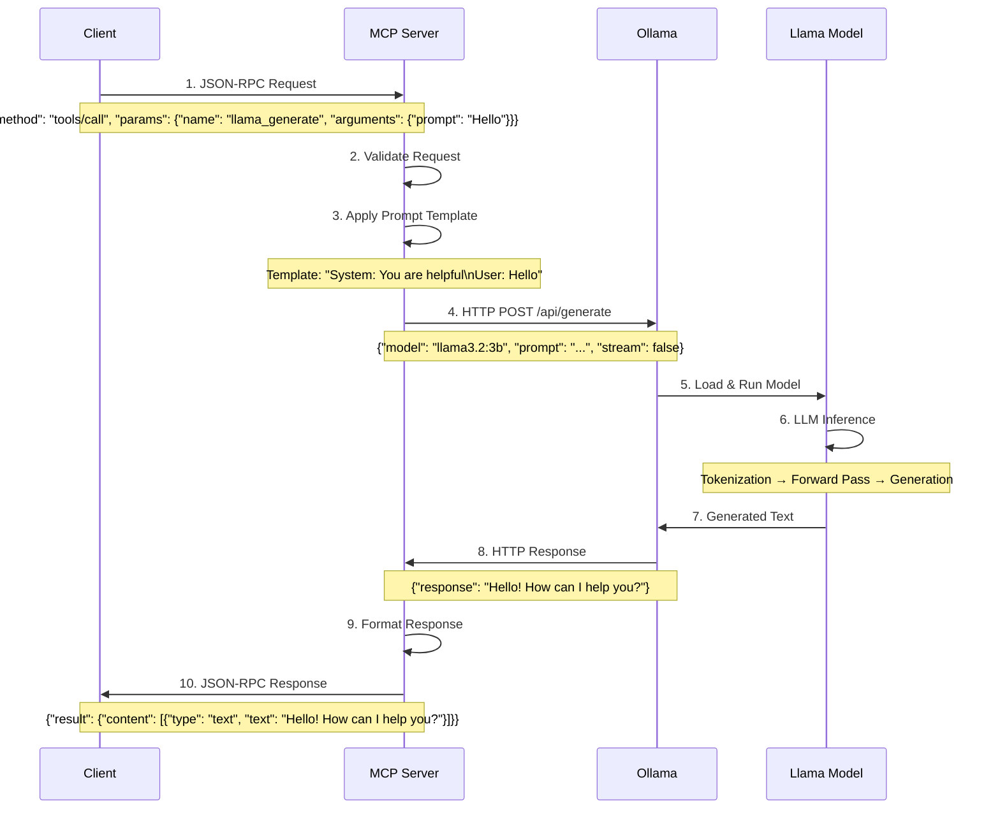

# MCP (Model Context Protocol) with Node.js, TypeScript, and Llama-3.x

This project demonstrates the Model Context Protocol (MCP) using Node.js with TypeScript, integrated with Llama-3.x via Ollama, and provides a foundation for building AI applications with context and tool capabilities.

## Overview

The Model Context Protocol (MCP) is an open standard for connecting AI assistants to various data sources and tools. This implementation provides:

- **MCP Server**: Exposes tools, resources, and prompts to AI models
- **MCP Client**: Connects to MCP servers and provides interactive interfaces
- **Llama-3.x Integration**: Leverages Ollama for local AI model execution
- **Open WebUI Support**: Compatible with Open WebUI for web-based interactions

## Architecture & Data Flow

### High-Level Architecture

```
┌─────────────────┐    ┌─────────────────┐    ┌─────────────────┐
│   Open WebUI    │    │   MCP Client    │    │   Your App      │
│   (Web UI)      │    │   (Node.js)     │    │   (Custom)      │
└─────────┬───────┘    └─────────┬───────┘    └─────────┬───────┘
          │                      │                      │
          └──────────────────────┼──────────────────────┘
                                 │ JSON-RPC over HTTP/STDIO
                         ┌───────▼───────┐
                         │   MCP Server  │
                         │   (Node.js)   │
                         │   - Tools     │
                         │   - Resources │
                         │   - Prompts   │
                         └───────┬───────┘
                                 │ REST API calls
                         ┌───────▼───────┐
                         │     Ollama    │
                         │   (Llama-3.x) │
                         │   - Inference │
                         │   - Embeddings│
                         └───────────────┘
```

### Data Flow Example: Client Request to Llama via MCP Server



## Concepts

### Model Context Protocol (MCP)

**What is MCP?**
The Model Context Protocol is an open standard that enables AI applications to securely connect to external data sources and tools. Instead of each AI application implementing its own integrations, MCP provides a standardized way to:

- **Expose Tools**: Functions that AI models can call (e.g., web search, file operations, API calls)
- **Share Resources**: Data sources like files, databases, or API endpoints
- **Provide Prompts**: Pre-configured prompt templates for specific use cases

**MCP Benefits:**
- **Standardization**: One protocol for all AI integrations
- **Security**: Controlled access to external systems
- **Modularity**: Mix and match different data sources and tools
- **Scalability**: Easy to add new capabilities without modifying AI applications

### Large Language Model (LLM) Inference

**What is LLM Inference?**
LLM inference is the process of generating text responses from a trained language model.

1. **Tokenization**: Input text is converted into numerical tokens
   ```
   "Hello, world!" → [15496, 11, 1917, 0]
   ```

2. **Embedding**: Tokens are converted to high-dimensional vectors
   ```
   [15496] → [0.1, -0.3, 0.7, ..., 0.2]  (e.g., 4096 dimensions)
   ```

3. **Forward Pass**: Neural network processes embeddings through layers
   ```
   Input → Attention Layers → Feed Forward → Output Probabilities
   ```

4. **Token Selection**: Next token is chosen based on probabilities
   ```
   Probabilities: {"the": 0.3, "a": 0.2, "hello": 0.15, ...}
   Selected: "the" (using sampling strategies)
   ```

5. **Iteration**: Process repeats until completion or max tokens reached

**Inference Parameters:**
- **Temperature** (0.0-1.0): Controls randomness (0.0 = deterministic, 1.0 = very random)
- **Top-p** (0.0-1.0): Nucleus sampling threshold
- **Max Tokens**: Maximum response length
- **Stop Sequences**: Tokens that end generation

### Prompt Templates

**What are Prompt Templates?**
Prompt templates are structured formats that help AI models understand context and generate better responses. They typically include:

1. **System Message**: Defines the AI's role and behavior
2. **Context**: Relevant background information
3. **User Input**: The actual user request
4. **Format Instructions**: How to structure the response

**Example Template:**
```typescript
const chatTemplate = `System: You are a helpful AI assistant specialized in programming.

Context: The user is working on a Node.js project with TypeScript.

User: {{user_input}}

Please provide a helpful and accurate response. Include code examples if relevant.`;
```

**Template Processing in MCP:**
```typescript
// Template with variables
const template = "System: {{system_role}}\nUser: {{user_input}}";

// Variable substitution
const processedPrompt = template
  .replace('{{system_role}}', 'You are a coding assistant')
  .replace('{{user_input}}', 'How do I create a REST API?');

// Result: "System: You are a coding assistant\nUser: How do I create a REST API?"
```

## Quick Start

### Prerequisites

- **Node.js** >= 18.0.0
- **npm** >= 8.0.0  
- **Ollama** installed and running
- **Docker** (for Open WebUI)
- **Linux/Debian** environment

### 1. Install Dependencies

```bash
# Clone and navigate to the project
cd NodeJS/MCP

# Install Node.js dependencies
npm install

# Install additional development tools
npm install -g tsx

# Build the project
npm run build
```

### 2. Setup Ollama and Llama-3.x

```bash
# Install Ollama (if not already installed)
curl -fsSL https://ollama.ai/install.sh | sh

# Start Ollama service
sudo systemctl start ollama
sudo systemctl enable ollama

# Pull Llama-3.2 model (or other Llama-3.x variants)
ollama pull llama3.2:latest

# Alternative models you can try:
ollama pull llama3.2:1b     # Smaller, faster
ollama pull llama3.2:3b     # Balanced
ollama pull llama3.2:8b     # Larger, more capable

# Verify Ollama is running
ollama list
curl http://localhost:11434/api/version
```

### 3. Environment Configuration

Create a `.env` file in the project root:

```bash
# Copy example environment file
cp .env.example .env
```

Edit `.env`:

```env
# Ollama Configuration
OLLAMA_URL=http://localhost:11434
LLAMA_MODEL=llama3.2:latest

# Server Configuration
MCP_SERVER_PORT=3000
MCP_TRANSPORT=streamable-http
LOG_LEVEL=info

# Optional: Authentication tokens
ANTHROPIC_API_KEY=your_anthropic_key_here
```

## 🔧 Usage

### Starting the MCP Server

```bash
# Development mode with hot reload
npm run server:dev

# Production mode
npm run server -- --port 3000 --transport streamable-http

# STDIO mode (for direct MCP client connections)
npm run server -- --transport stdio
```

### Starting the MCP Client

```bash
# Interactive mode
npm run client:dev

# Connect to specific server
npm run client -- --server http://localhost:3000/mcp

# Non-interactive demo mode
npm run client -- --server http://localhost:3000/mcp --interactive false
```

### Running Complete Demo

```bash
# Start both server and client with demo
npm run dev

# Or use the demo command
node dist/index.js demo --port 3000
```

## � MCP Server's Role in Data Flow

### How the MCP Server Facilitates Requests

The MCP Server acts as an intelligent middleware layer between clients and Ollama, providing several key functions:

#### 1. **Request Orchestration**
```typescript
// Client sends MCP request
const mcpRequest = {
  jsonrpc: "2.0",
  id: 1,
  method: "tools/call",
  params: {
    name: "llama_generate",
    arguments: {
      prompt: "Explain quantum computing",
      temperature: 0.7,
      max_tokens: 500
    }
  }
};

// MCP Server processes and validates
class McpLlamaServer {
  async handleToolCall(request) {
    // 1. Validate request structure
    const validation = this.validateRequest(request);
    
    // 2. Apply security checks
    const authorized = await this.authorize(request);
    
    // 3. Transform to Ollama format
    const ollamaRequest = this.transformToOllama(request);
    
    // 4. Execute request
    const response = await this.ollamaClient.generate(ollamaRequest);
    
    // 5. Transform response back to MCP format
    return this.transformToMcp(response);
  }
}
```

#### 2. **Prompt Engineering & Templates**
The server applies sophisticated prompt templates based on the tool being used:

```typescript
// Different templates for different use cases
const promptTemplates = {
  coding_assistant: `System: You are an expert software engineer.
Context: User is working with {{language}} and {{framework}}.
Task: {{task}}
User: {{user_input}}

Provide clean, well-documented code with explanations.`,

  general_chat: `System: You are a helpful AI assistant.
User: {{user_input}}

Respond naturally and helpfully.`,

  data_analysis: `System: You are a data analyst.
Data Context: {{data_context}}
Question: {{user_input}}

Provide insights with reasoning and evidence.`
};

// Template application
const processedPrompt = this.applyTemplate('coding_assistant', {
  language: 'TypeScript',
  framework: 'Node.js',
  task: 'Create REST API',
  user_input: userPrompt
});
```

#### 3. **Response Processing Pipeline**

```typescript
async processResponse(ollamaResponse: string, context: RequestContext) {
  // 1. Raw response from Ollama
  const rawText = ollamaResponse.response;
  
  // 2. Post-processing
  const processed = await this.postProcess(rawText, context);
  
  // 3. Format validation
  const validated = this.validateOutput(processed);
  
  // 4. Convert to MCP format
  return {
    content: [{
      type: 'text',
      text: validated
    }],
    isError: false,
    _meta: {
      model: context.model,
      tokens_used: ollamaResponse.tokens,
      processing_time: Date.now() - context.startTime
    }
  };
}
```

#### 4. **State Management & Context**

```typescript
class ConversationManager {
  private conversations = new Map<string, ChatHistory>();
  
  async handleChatRequest(request: ChatRequest) {
    const sessionId = request.session_id || this.generateSession();
    
    // Retrieve conversation history
    const history = this.conversations.get(sessionId) || [];
    
    // Build context-aware prompt
    const contextualPrompt = this.buildContextualPrompt(
      request.message,
      history,
      request.system_prompt
    );
    
    // Send to Ollama with full context
    const response = await this.ollamaClient.chat({
      model: request.model,
      messages: [
        { role: 'system', content: request.system_prompt },
        ...history,
        { role: 'user', content: request.message }
      ]
    });
    
    // Update conversation history
    history.push(
      { role: 'user', content: request.message },
      { role: 'assistant', content: response.message.content }
    );
    this.conversations.set(sessionId, history);
    
    return response;
  }
}
```

#### 5. **Error Handling & Fallbacks**

```typescript
async executeWithFallback(request: ToolRequest): Promise<ToolResponse> {
  const strategies = [
    () => this.executePrimary(request),
    () => this.executeFallbackModel(request),
    () => this.executeLocalFallback(request)
  ];
  
  for (const strategy of strategies) {
    try {
      const result = await strategy();
      if (this.isValidResponse(result)) {
        return result;
      }
    } catch (error) {
      this.logger.warn(`Strategy failed: ${error.message}`);
      continue;
    }
  }
  
  return this.generateErrorResponse('All execution strategies failed');
}
```

### Integration Benefits

**Why Use MCP Server Instead of Direct Ollama Calls?**

1. **Standardized Interface**: Consistent API regardless of underlying LLM
2. **Enhanced Security**: Authentication, rate limiting, input validation
3. **Advanced Prompting**: Context-aware templates and prompt engineering
4. **Multi-Model Support**: Easy switching between different LLMs
5. **Conversation Management**: Persistent chat sessions and context
6. **Monitoring & Logging**: Detailed analytics and debugging
7. **Extensibility**: Easy to add new tools and capabilities

## 🛠️ Tools

The MCP server exposes several tools that can be used by AI models:

### 1. Llama Generation Tools

```typescript
// Generate text with Llama-3.x
{
  "name": "llama_generate",
  "arguments": {
    "prompt": "Explain quantum computing",
    "temperature": 0.7,
    "max_tokens": 1000
  }
}

// Chat with conversation context
{
  "name": "llama_chat",
  "arguments": {
    "messages": [
      {"role": "user", "content": "Hello!"},
      {"role": "assistant", "content": "Hi! How can I help?"},
      {"role": "user", "content": "Tell me about MCP"}
    ]
  }
}
```

### 2. System Information Tools

```typescript
// Get system info
{
  "name": "get_system_info",
  "arguments": {}
}

// List available Ollama models
{
  "name": "list_ollama_models",
  "arguments": {}
}
```

### 3. Utility Tools

```typescript
// Weather forecast (simulated)
{
  "name": "weather_forecast",
  "arguments": {
    "location": "Helsinki, Finland",
    "days": 3
  }
}

// File operations
{
  "name": "file_operations",
  "arguments": {
    "operation": "list",
    "path": "/home/user/documents"
  }
}
```

## Resources

The server provides access to various resources:

- `system://info` - Current system information
- `llama://models` - Available Llama models
- `config://server` - Server configuration

## 💬 Prompts

Pre-configured prompts for different use cases:

- `llama_system_prompt` - General system prompt for Llama-3.x
- `code_assistant` - Programming and debugging assistance  
- `data_analyst` - Data analysis and insights

## Open WebUI Integration

### Docker Setup

```bash
# Create docker-compose.yml
cat > docker-compose.yml << EOF
version: '3.8'

services:
  ollama:
    image: ollama/ollama:latest
    container_name: ollama
    ports:
      - "11434:11434"
    volumes:
      - ollama:/root/.ollama
    restart: unless-stopped
    
  open-webui:
    image: ghcr.io/open-webui/open-webui:main
    container_name: open-webui
    depends_on:
      - ollama
    ports:
      - "3001:8080"
    environment:
      - OLLAMA_BASE_URL=http://ollama:11434
      - WEBUI_SECRET_KEY=your-secret-key-here
    volumes:
      - open-webui:/app/backend/data
    restart: unless-stopped

volumes:
  ollama:
  open-webui:
EOF

# Start services
docker-compose up -d

# Check status
docker-compose ps
```

### Connecting MCP to Open WebUI

1. **Configure Open WebUI Pipeline**:

```python
# Create MCP pipeline for Open WebUI
# File: mcp_pipeline.py

from typing import List, Optional
import requests
import json

class MCPPipeline:
    class Valves:
        MCP_SERVER_URL: str = "http://localhost:3000/mcp"
        
    def __init__(self):
        self.valves = self.Valves()
        
    async def on_startup(self):
        print("MCP Pipeline initialized")
        
    async def on_shutdown(self):
        print("MCP Pipeline shutdown")
        
    def pipe(
        self,
        prompt: str,
        model_id: str,
        messages: List[dict],
        body: dict
    ) -> str:
        # Forward request to MCP server
        try:
            response = requests.post(
                f"{self.valves.MCP_SERVER_URL}/chat",
                json={
                    "messages": messages,
                    "model": model_id,
                    "temperature": body.get("temperature", 0.7)
                }
            )
            return response.json().get("response", prompt)
        except Exception as e:
            print(f"MCP Pipeline error: {e}")
            return prompt
```

2. **Upload Pipeline to Open WebUI**:
   - Go to Admin Panel → Settings → Pipelines
   - Upload the `mcp_pipeline.py` file
   - Configure MCP server URL in pipeline settings

## 🐳 Docker Setup

### Dockerfile for MCP Server

```dockerfile
FROM node:18-alpine

WORKDIR /app

# Copy package files
COPY package*.json ./
COPY tsconfig.json ./

# Install dependencies
RUN npm ci --only=production

# Copy source code
COPY src/ ./src/

# Build application
RUN npm run build

# Expose port
EXPOSE 3000

# Health check
HEALTHCHECK --interval=30s --timeout=3s --start-period=5s --retries=3 \
  CMD curl -f http://localhost:3000/health || exit 1

# Start application
CMD ["npm", "start"]
```

### Docker Compose for Full Stack

```yaml
version: '3.8'

services:
  # Ollama service
  ollama:
    image: ollama/ollama:latest
    container_name: mcp-ollama
    ports:
      - "11434:11434"
    volumes:
      - ollama_data:/root/.ollama
    restart: unless-stopped
    healthcheck:
      test: ["CMD", "curl", "-f", "http://localhost:11434/api/version"]
      interval: 30s
      timeout: 10s
      retries: 3

  # MCP Server
  mcp-server:
    build: .
    container_name: mcp-server
    ports:
      - "3000:3000"
    environment:
      - OLLAMA_URL=http://ollama:11434
      - LLAMA_MODEL=llama3.2:latest
      - LOG_LEVEL=info
    depends_on:
      - ollama
    restart: unless-stopped
    healthcheck:
      test: ["CMD", "curl", "-f", "http://localhost:3000/health"]
      interval: 30s
      timeout: 10s
      retries: 3

  # Open WebUI
  open-webui:
    image: ghcr.io/open-webui/open-webui:main
    container_name: mcp-open-webui
    ports:
      - "8080:8080"
    environment:
      - OLLAMA_BASE_URL=http://ollama:11434
      - WEBUI_SECRET_KEY=${WEBUI_SECRET_KEY:-your-secret-key}
      - ENABLE_COMMUNITY_SHARING=false
      - ENABLE_MESSAGE_RATING=true
    volumes:
      - open_webui_data:/app/backend/data
    depends_on:
      - ollama
      - mcp-server
    restart: unless-stopped

volumes:
  ollama_data:
  open_webui_data:
```

## 🔧 Development

### Project Structure

```
NodeJS/MCP/
├── src/
│   ├── server/          # MCP server implementation
│   │   └── index.ts     # Main server logic
│   ├── client/          # MCP client implementation
│   │   └── index.ts     # Interactive client
│   ├── shared/          # Shared utilities
│   │   ├── types.ts     # TypeScript interfaces
│   │   ├── logger.ts    # Logging utility
│   │   └── ollama.ts    # Ollama client integration
│   └── index.ts         # Main entry point
├── dist/                # Compiled JavaScript
├── logs/                # Application logs
├── package.json         # Node.js dependencies
├── tsconfig.json        # TypeScript configuration
├── .env                 # Environment variables
├── .gitignore          # Git ignore patterns
└── README.md           # This file
```

### Scripts

```bash
# Development
npm run dev              # Start with hot reload
npm run build:watch      # Build with watch mode
npm run server:dev       # Start server in dev mode
npm run client:dev       # Start client in dev mode

# Building
npm run build           # Build for production
npm run clean           # Clean build directory

# Running  
npm start               # Start built application
npm run server          # Start server
npm run client          # Start client
npm run demo            # Run demonstration

# Code Quality
npm run lint            # Lint TypeScript code
npm run lint:fix        # Fix linting issues
npm run format          # Format code with Prettier

# Testing
npm test               # Run tests
npm run test:watch     # Run tests in watch mode
```

### Configuration Files

#### TypeScript Configuration (`tsconfig.json`)

```json
{
  "compilerOptions": {
    "target": "ES2022",
    "lib": ["ES2022", "DOM"],
    "module": "ESNext",
    "moduleResolution": "Node",
    "esModuleInterop": true,
    "allowSyntheticDefaultImports": true,
    "outDir": "./dist",
    "rootDir": "./src",
    "strict": true,
    "skipLibCheck": true,
    "forceConsistentCasingInFileNames": true
  }
}
```

## Troubleshooting

### Issues

1. **Ollama Connection Failed**
   ```bash
   # Check if Ollama is running
   curl http://localhost:11434/api/version
   
   # Restart Ollama service
   sudo systemctl restart ollama
   
   # Check logs
   sudo journalctl -u ollama -f
   ```

2. **Model Not Found**
   ```bash
   # List available models
   ollama list
   
   # Pull required model
   ollama pull llama3.2:latest
   
   # Verify model is loaded
   curl -X POST http://localhost:11434/api/show -d '{"name": "llama3.2:latest"}'
   ```

3. **Port Already in Use**
   ```bash
   # Find process using port 3000
   sudo netstat -tulpn | grep :3000
   
   # Kill process if needed
   sudo kill -9 <PID>
   
   # Or use different port
   npm run server -- --port 3001
   ```

4. **TypeScript Compilation Errors**
   ```bash
   # Install missing type definitions
   npm install --save-dev @types/node @types/express
   
   # Clear build cache
   npm run clean
   npm run build
   ```

5. **Docker Issues**
   ```bash
   # Check container logs
   docker-compose logs ollama
   docker-compose logs mcp-server
   
   # Restart services
   docker-compose down
   docker-compose up -d
   
   # Check health
   docker-compose ps
   ```

### Debugging

Enable debug logging:

```bash
# Set environment variable
export LOG_LEVEL=debug

# Or in .env file
echo "LOG_LEVEL=debug" >> .env

# Run with debug output
npm run server:dev
```

Check log files:
```bash
# Application logs
tail -f logs/combined.log

# Error logs only
tail -f logs/error.log

# System logs
sudo journalctl -f
```

## API

### MCP Server Endpoints

#### Health Check
```http
GET /health
```

Response:
```json
{
  "status": "healthy",
  "timestamp": "2024-01-01T12:00:00Z",
  "version": "1.0.0"
}
```

#### MCP Protocol Endpoint
```http
POST /mcp
Content-Type: application/json

{
  "jsonrpc": "2.0",
  "method": "tools/list",
  "id": "1"
}
```

### Ollama Integration

The server communicates with Ollama using these endpoints:

- `GET /api/version` - Check Ollama version
- `GET /api/tags` - List available models
- `POST /api/generate` - Generate text
- `POST /api/chat` - Chat completion
- `POST /api/pull` - Pull model
- `POST /api/show` - Model information

### Environment Variables

| Variable | Default | Description |
|----------|---------|-------------|
| `OLLAMA_URL` | `http://localhost:11434` | Ollama server URL |
| `LLAMA_MODEL` | `llama3.2:latest` | Default Llama model |
| `MCP_SERVER_PORT` | `3000` | Server port |
| `MCP_TRANSPORT` | `streamable-http` | Transport protocol |
| `LOG_LEVEL` | `info` | Logging level |
| `NODE_ENV` | `development` | Environment mode |

## 📄 License

This project is licensed under the MIT License - see the [LICENSE](LICENSE) file for details.

## Resources

- [Model Context Protocol Documentation](https://modelcontextprotocol.io/)
- [MCP TypeScript SDK](https://github.com/modelcontextprotocol/typescript-sdk)
- [Ollama Documentation](https://ollama.ai/docs)
- [Open WebUI Documentation](https://docs.openwebui.com/)
- [Llama-3.x Model Documentation](https://llama.meta.com/docs/)

---
